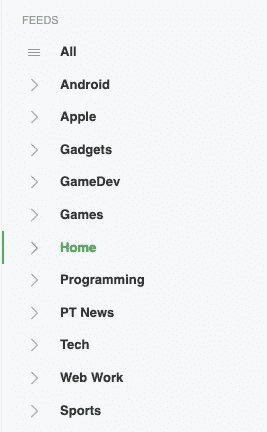
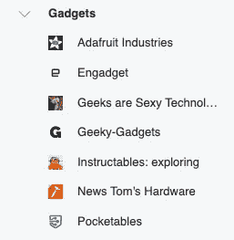
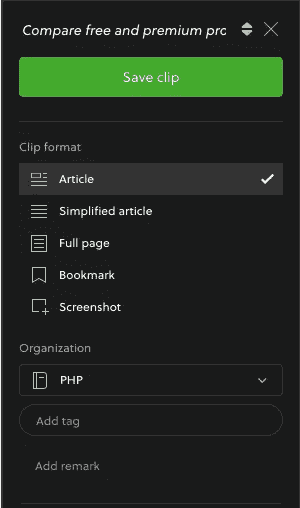
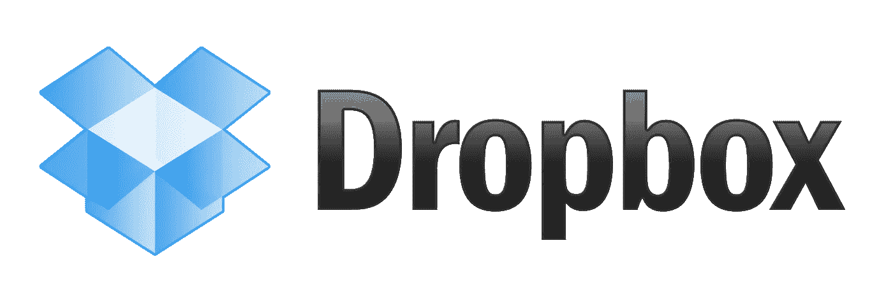
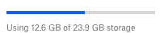
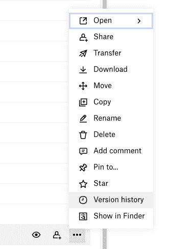

# 开发人员实用工具带的 5 个必备工具

> 原文：<https://medium.com/nerd-for-tech/developer-utility-belt-7158b321559?source=collection_archive---------9----------------------->

为了更好地克服软件开发生活中的激烈变化，准备好这 5 个附加组件吧。

我在编程班当老师的时候，每年都有一堆学生出的题。因此，在本文中，我将重点关注最具影响力和最常见的一个问题:

> "在我的职业生涯中，我使用什么工具，它们有什么帮助？"

当然，这是我的观点，我选择的工具和工作流程是基于我多年来制作网站、桌面/移动应用程序和定制信息系统的经验。
这可能适合你，也可能不适合你……但我保证这至少会很有趣。(与其他开发人员分享这些知识总是一个好话题，会引起好奇心)

这些附加服务的主要目标很简单:提高我们工作的**生产率**和**质量**，或许还能把一些组织层面的东西带到我们的个人生活中。请记住，时间是我们生命中最宝贵的财富之一，赢得一些额外的时间总是宝贵的。

> 不在本文讨论范围之内的是开发人员的主要超能力之一，即专注于开发的能力，这可能是未来文章的主题

免责声明:这里提到的一些软件不是 100%免费的，但你可以/应该使用免费版本，我向你保证，这将涵盖你的基本需求，而不需要花钱。我会试着在每一个软件中解释免费版本的局限性，以及为什么这些会被你忽略，我也不会因为提到它们中的任何一个而被赞助或获得任何特权。

# 那么更进一步，让我们开始这次**之旅**。

为了更好地阅读文章，我将这些分为 5 个部分:

1.  改善你在网上阅读的方式。
2.  创建您自己的分类个人图书馆，内容丰富，具有搜索功能，并且可以在任何地方访问。
3.  **工作相关文件的云存储功能**
4.  **全栈手挑软件**
5.  **有用的浏览器扩展**

# **1 |改善你在互联网上阅读的方式**

作为一名开发人员或技术人员，我们总是希望并需要阅读关于技术、框架、技术文章、倾向、爱好等的最新消息

如今，我们在几种不同的设备(PC、手机、电子书阅读器等)上阅读，也在不同的地方阅读(工作、公园、公交/地铁、床上、厕所等)，因此我们需要一些组织来实现更好的工作流程。

我对我以前的学生说，我每天花大约一个小时在网上阅读获取新信息，因为知识就是力量，我们需要不断更新，为不断的变化和发展做好准备。

我仍然看到人们用浏览器书签和大约 20 到 30 个浏览器标签打开和固定，通过从一个网站跳到另一个网站来手动消费信息。

我的解决方案很简单:有一个工具，可以将你最喜欢的网站按主题分类，创建一个包含你所有相关内容的定制杂志，可以在任何设备上打开，在我需要的任何地方阅读。减少花在无关“噪音”上的时间，专注于内容。

要实现这一点:

feedly—[https://feedly.com](https://feedly.com/)

*   我使用免费版本，曾经我尝试了 3 个月的专业计划，但我意识到我需要的是免费计划。
*   使用 RSS 提要聚合，你可以从你喜欢的来源跟踪每天的新闻/文章。
*   自定义频道来划分话题，这是我的例子:

订阅源频道示例

你可以很容易地按类别划分你的频道。

我尽量把这个部门当成我要看的专业杂志。
如果我想要一本关于电子产品的杂志，我只会阅读与电子产品相关的新闻/文章，仅此而已。

*   在频道中，你可以添加你自己的来源或者使用他们的列表(Feedly 有一个非常完整的每个类别的所有趋势网站的列表)。

扩展特定频道

实际上，可以添加 3 种主要的源类型:
— *网站 URL*
— *谷歌/关键词提醒*
— *Twitter 订阅源*

文章预览示例

它可以在不离开 Feedly 网站或应用程序的情况下预览文章，预览只关注内容，所有与文章无关的广告、网站图片或章节都被删除，这就像是在阅读一本书或 pdf。(这些结果可能因网站而异，这取决于源源 RSS 功能)

*   具有共享功能(电子邮件、社交网络等)
*   稍后阅读功能在我没有时间阅读但又不想忘记文章的时候很有用。
*   几个过滤器是可用的:流行的，最新的，最早的，等等…和文章阅读控制。
*   移动支持— Android / iOS 应用程序保持同步

## 限制

> 免费版本允许多达 100 个来源，对我来说这就足够了，这不是一个交易破坏者。如果你需要更多的资源，你可以使用付费计划，比如 1000 多个资源，突出显示功能，保存到 Evernote，Pocket 和 Onenote，更好的共享功能等等…

# 2 |创建您自己的分类个人图书馆，内容丰富，具有搜索功能，并可在任何地方访问。

在“技术海洋”中工作，我们经常需要收藏一些工作参考、文章或技术解决方案。通过意识到这种需要，我仍然看到人们使用基本的浏览器书签作为组织和存储这些相关信息的方法。

不管不幸与否，互联网总是在不断变化，网站崩溃，域名变更/丢失，博客/项目结束，使用浏览器书签不是一个有效的策略，因为它很容易随着时间的推移而消失。

开发人员的生活并不容易，我们经常改变我们的语言/工具堆栈，我们需要每天适应。我们的大脑无法处理太多的信息(至少我的不会)，所以我们需要扩展内存来仔细存放与我们使用的每项技术相关的信息。

这样做…随着时间的推移，我们将创建一个自定义的图书馆，在任何地方都可以访问它，并通过互联网保护它不受时间的影响。

为了创建我的自定义库，我使用:

evernote—[https://evernote.com/](https://evernote.com/)

*   我使用免费版(基本计划)已经有几年了，但在过去，因为我以前的教师职位，我支付了高级计划。我需要一种快捷的方式来与我以前在不同学院/课程的学生分享(笔记/文章/课程内容/文件)，以实现类似于“*[*【Moodle*](https://en.wikipedia.org/wiki/Moodle)”在线系统的工作流程。*
*   *当然，市面上有大量的笔记应用。因为浏览器集成插件: **Web Clipper** ，我还是用 Evernote 工作。
    有了这个插件，我们可以直接从一个网站创建一个笔记到我们 Evernote 账户上的一个特定笔记本上(*就像在纸质期刊上剪下一篇文章，然后存储到一个定制的笔记本上*)。*

**

*Web Clipper 浏览器扩展*

*   *当您访问您想要捕捉的网页时，单击插件会出现一个小窗口，其中有五个选项可供选择:*

**

*Web 裁剪器捕获窗口*

***文章**
(仅捕获网站的文章内容，这允许添加或删除部分，忽略所有您没有选择的其余部分
— **这是我最喜欢的选项，用于存储我的网站信息**)*

***简化的文章**
(从网站上删除所有多余的内容，创建一个只有相关文章和图片的图书体验——就像电子书阅读器体验一样)*

***全页**
(抓取所有页面，转储到笔记本)*

***书签***

***截图**
(顾名思义，创建一个快照图像，在捕获后，您可以在将其存储到便笺之前写在图像的顶部)*

> *“这些功能非常棒，因为随着时间的推移，你可以创建按编程语言或工具分类的迷你书，这些迷你书具有有价值的信息和搜索功能。此外，您还可以指定笔记本来添加信息并创建标签，以便于识别内容。”*

*例如，我有一个名为“Drupal”的笔记本，自 2009 年以来有近 300 篇笔记，上面写满了技术文章，突出了解决方案(比如 StackOverflow，Drupal.org..)按标签分类，如 Drupal 6 到 Drupal 9、模块、修复等…*

*   *通用性:Evernote 自带桌面应用(Windows/macOS) +移动应用(Android/iOS) + WebApp(浏览器和 Linux)*

## *限制*

***Evernote 定期改变他们软件计划的一些限制，所以请记住这个限制列表将来可能会改变:***

> *免费版只允许 **2 台设备同步**，所以如果你有电脑+手机+平板，你可以把电脑+手机和平板同步起来，如果你想同步，你必须手动移除一台设备(例如:手机)来添加平板。对我来说，这很好，我可以忍受这种限制，但请记住，如果你想同步其他设备，你必须手动交换它们，交换的次数没有限制，这只是改变设备的额外工作。*
> 
> *另一个不困扰我的限制是 **25 MB 的最大笔记大小**，我的笔记是 90%的文本/HTML 和 10%的图像，从来没有达到一个笔记的大小限制，即使当需要语音备忘录附加到笔记时，语音压缩非常好，1 分钟可能需要 200kb。*
> 
> *最后， **60MB 每月上传限制**(过去是每周限制)——也从未达到这个限制…出于与上一点相同的原因:我的大多数笔记都是非常小的基本文本/HTML，我从未与这个限制作斗争。*

***注:**2022 年，我从 Evernote 换成了 concept😍！所以以后，我会描述这种变化。剧透:我喜欢❤️*

# *3 | **工作相关文件云存储功能***

*在你考虑 git 相关的系统之前，比如 GitHub 或 GitBucket，这并不能取代重要的需求。我认为这是存储工作文件和了解隐藏潜力的补充层。*

*工作文件云:*

**

*Dropbox—[https://www.dropbox.com](https://www.dropbox.com)*

*有十几个云存储系统，Google Drive，OneDrive，pCloud 等等，都有不同的功能和免费限制。
我会试着解释为什么 Dropbox 服务是我*工作存储*的首选，请注意，我指的是“*工作存储*”……稍后我会解释这一点。*

*   *从来不需要付费计划，一直用基本计划=免费。*
*   *Dropbox 只用于与工作相关的存储，我使用其他服务用于个人存储。*
*   *适用于所有环境和设备(Windows/Mac/Linux/Android/iOS)*
*   *免费版本开始只有 2GB 的存储空间，但可以很容易地提高到 16GB 或更多，使用朋友邀请，完成 dropbox 启动清单，贡献给 Dropbox 社区论坛和一些特殊活动。我的基本帐户实际上有 23.9 GB 的存储限制，从 2GB 开始。*

**

*我的个人存储状态*

*   *版本历史，**我记不清这在我的生活中每一次对我有帮助**。在基本计划中，每个文件有 **30 天的历史记录**。您可以通过在 Dropbox 页面上的三点 UI 中选择文件的版本历史来访问它，或者在您的操作系统文件资源管理器的上下文菜单中选择它。*

**

***想象一下这个场景:***

*一个。docx 文件(可能是任何文件:。php，。cs，。psd，。jpg 等…)同步到 dropbox 每天，将有 30 天的文件版本历史，我可以看到变化或回滚。*

*因此，对于最终用户来说，2GB 的存储限制可以转化为 **2 x 30GB = 60GB** (如果我们计划让 dropbox 每天同步变化)，因为这适用于 Dropbox 中关于扩展名的每个文件。*

*   *当然，使用 git 是一种更专业/更安全的项目版本化方式…但是**并非所有的工作文件都是项目或应用**，它们可能是相关的文档、excel 文件、演示文稿、图像、档案等…这也解释了为什么我把它称为上面的*工作存储*。*
*   *多年来，这项服务的优势之一是符号链接支持，这使我们在文件系统中有很大的灵活性，可以轻松地同步不同目录下的文件。但自 2019 年年中以来，他们**移除了**这一功能，我仍然为缺乏这一功能而感到痛苦😢。*

# *4 | FullStack 手动挑选软件*

*在这个主题中，我想分享一些我目前使用的软件，也许你会发现一些隐藏的宝石(这么多留下来……)*

## ***IDE***

*视觉密码内幕(永远新鲜的功能)【https://code.visualstudio.com/insiders/ *

*PHPStorm EAP(永远新鲜的特性)
[https://www.jetbrains.com/phpstorm/nextversion/](https://www.jetbrains.com/phpstorm/nextversion/)*

## *浏览器*

*铬金丝雀(总是新鲜的功能)[https://www.google.com/chrome/canary/](https://www.google.com/chrome/canary/)*

## *数据库管理系统*

*河狸社区版【https://dbeaver.io/download/ T3*

## *实体模型/原型/响应*

*Balsamiq 样机
[https://balsamiq.com/wireframes/](https://balsamiq.com/wireframes/)*

*图玛
https://www.figma.com/*

*responsible . app
https://responsively.app/download*

## *API 测试*

*父亲电视观众
[https://dadroit.com/](https://dadroit.com/)*

*索普伊
[https://www.soapui.org/](https://www.soapui.org/)*

*邮递员
【https://www.postman.com/】T21*

*失眠:
[https://insomnia.rest/](https://insomnia.rest/)*

# *5 | **有用的浏览器扩展***

*因为浏览器是我们的**瑞士刀，**我推荐这些扩展，兼容所有基于 Chromium 的引擎浏览器。扩展的名字很好地阐明了它们的目标😃：*

*   *清除缓存
    [https://chrome . Google . com/web store/detail/clear-Cache/cppjkneekbjaeellbfkmgnhonkjfpdn](https://chrome.google.com/webstore/detail/clear-cache/cppjkneekbjaeellbfkmgnhonkkjfpdn)*
*   *发条
    [https://chrome . Google . com/web store/detail/clock time/dmggabnehkmmmfmdffgajcflpdjlnoemp](https://chrome.google.com/webstore/detail/clockwork/dmggabnehkmmfmdffgajcflpdjlnoemp)*
*   *ColorZilla
    [https://chrome . Google . com/web store/detail/ColorZilla/bhlhnicpbhignbdheddgjhgdocnmhomnp](https://chrome.google.com/webstore/detail/colorzilla/bhlhnicpbhignbdhedgjhgdocnmhomnp)*
*   *假填充
    [https://chrome . Google . com/web store/detail/fake-Filler/bnjjngeaknajbdgpfkgnonkmifihfo](https://chrome.google.com/webstore/detail/fake-filler/bnjjngeaknajbdcgpfkgnonkmififhfo)*
*   *Floating for Youtube/Floating Video—画中画
    [https://chrome . Google . com/web store/detail/Floating-Video-Picture-in/egncdnniomonjgpjbapalkckojhkfdk](https://chrome.google.com/webstore/detail/floating-video-picture-in/egncdnniomonjgpjbapalkckojhkfddk)*
*   *go full page
    [https://chrome . Google . com/web store/detail/go full page-full-page-scre/fdpohaocaechifimbbbknoaalclacl](https://chrome.google.com/webstore/detail/gofullpage-full-page-scre/fdpohaocaechififmbbbbbknoalclacl)*
*   *HTTPS Everywhere
    [HTTPS://chrome . Google . com/web store/detail/HTTPS-Everywhere/gcbommkclmclpchllfjekcdonpmejbdp](https://chrome.google.com/webstore/detail/https-everywhere/gcbommkclmclpchllfjekcdonpmejbdp)*
*   *JSON 查看器
    [https://chrome . Google . com/web store/detail/JSON-Viewer/gbmdgpbipfallnflgajpaliibnhdgobh](https://chrome.google.com/webstore/detail/json-viewer/gbmdgpbipfallnflgajpaliibnhdgobh)*
*   *momentum
    [https://chrome . Google . com/web store/detail/momentum/laookfknpbbblblfpcifpapaejjkodgca](https://chrome.google.com/webstore/detail/momentum/laookkfknpbbblfpciffpaejjkokdgca)*
*   *web Developer
    [https://chrome . Google . com/web store/detail/we b-Developer/bfbameneiokkkgbdmiekhjnmfkcnldhhm](https://chrome.google.com/webstore/detail/web-developer/bfbameneiokkgbdmiekhjnmfkcnldhhm)*
*   *what font
    [https://chrome . Google . com/web store/detail/what font/japobobgcpjmedljpbcaablpmlmfcogm](https://chrome.google.com/webstore/detail/whatfont/jabopobgcpjmedljpbcaablpmlmfcogm)*
*   *又一个 Lorem Ipsum 生成器
    https://chrome . Google . com/web store/detail/又一个-Lorem-Ipsum-g/fafioicgpgnicbbkfgimcofbhpcledk*
*   *Evernote Web Clipper
    自带 Evernote 桌面应用或[https://chrome . Google . com/Web store/detail/Evernote-we B- Clipper/pioclpoplcdbaefihamjohnefbigjilc](https://chrome.google.com/webstore/detail/evernote-web-clipper/pioclpoplcdbaefihamjohnefbikjilc)*

> *这又是一次漫长的旅程🚗但是我希望阅读这篇文章能帮助人们获得更好的工作状态...*
> 
> *再见👍。*