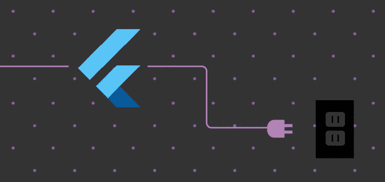

# 使用 Flutter 开发自定义插件

> 原文：<https://medium.com/nerd-for-tech/developing-a-custom-plugin-using-flutter-ec37cc4bbe45?source=collection_archive---------10----------------------->



[Flutter](https://flutter.dev/) 是 Google 免费开源的 UI 应用开发工具包。它用于使用单一代码库在 Android 和 iOS 上构建高质量的原生界面。关于 Flutter 的一个有趣的事情是，它可以与现有的代码一起工作，并且被全世界的开发者和组织所使用。在这篇文章中，我们将学习如何使用 Flutter 开发一个自定义插件。

作为我们在 [RudderStack](https://rudderstack.com/) 的 SDK 路线图的一部分，我们想要开发一个 Flutter SDK。我们现有的 SDK 包括诸如在数据库中存储事件细节和持久化用户细节等功能。然而，这些功能已经在我们的 Android 和 iOS SDKs 中实现了。

我们打算开发的 Flutter SDK 也可以在你的 Android 或 iOS 设备上运行。因此，我们希望开发一个解决方案，可以使用我们现有的 Android 和 iOS SDK，并开发 Flutter SDK。

所有的头脑风暴最终让我们想到在 Flutter 中开发一个自定义插件。定制插件遵循基于 Flutter 灵活系统的基本机制，允许调用 Android 上 Kotlin 或 Java 中可用的特定平台 API，或 iOS 上的 Swift 或 Objective-C 代码。

# Flutter SDK 在不同通道上的工作

Flutter 内置的特定于平台的 API 支持不依赖于代码生成，而是依赖于使用平台通道的灵活的消息传递风格。为了创建一个自定义插件，让我们详细了解一下 Flutter 架构:

*   该应用程序的 Flutter 部分通过平台通道向其*主机*发送消息——该应用程序的 iOS 或 Android 部分。
*   *主机*监听平台信道并接收消息。然后，它调用任意数量的特定于平台的 API——使用本机编程语言——并将响应发送回应用程序的 Flutter 部分*客户端*,如下所示:


**平台通道如何在不同平台间工作的架构概述**

# 使用 Flutter 构建自定义插件

# 入门指南

下面的示例演示了如何调用特定于平台的 API 来检索和显示当前的电池电量。它使用 Android `BatteryManager` API 和 iOS `device.batteryLevel` API，通过单一平台消息`getBatteryLevel()`。

# 步骤 1:创建包

要创建插件包，

*   用`create`命令使用`--template=plugin`旗。
*   使用`--platforms=`选项后跟一个逗号分隔的列表来指定插件支持的平台。可用的平台有 Android、iOS、web、Linux、macOS 和 Windows。
*   使用`--org`选项指定您的组织，使用反向域名表示法。该值用于生成的插件代码中的各种包和包标识符。
*   使用`-a`选项为 Android 指定语言，或使用 **-i** 选项为 iOS 指定语言。
*   下面是使用 java for Android 和 Objective-C for iOS 为 Android、iOS 平台创建插件包的示例命令。

```
flutter create --org com.rudderstack --template=plugin --platforms=android,ios -a java -i objc batteryLevel
```

*   该命令在`batteryLevel`文件夹中创建一个插件项目，具体内容如下:

`lib/batteryLevel.dart -`插件的 Dart API。

`android/src/main/java/com/rudderstack/batteryLevel/BatteryLevelPlugin.java`-Java 中插件 API 的 Android 平台特定实现。

`ios/Classes/BatteryLevelPlugin.m`-Objective-c 中插件 API 的 iOS 平台特定实现。

`example/` -一个依赖于插件的 Flutter 应用，演示了如何使用它。

在 Flutter 网站上查看不同的 dart 值在平台端是如何接收的，反之亦然。

# 步骤 2:创建 Flutter 平台客户端

应用程序的`State`类保存当前的应用程序状态。扩展以保持当前的电池状态。

*   首先，用返回电池电量的单平台方法使用`MethodChannel`构建通道。
*   通道的客户端和主机端通过通道构造函数中传递的通道名称连接。

注意:单个应用程序中使用的所有频道名称必须是唯一的。

*   用唯一的*域前缀*作为频道名称的前缀。比如`org.rudderstack.dev/battery`。
*   打开位于`lib`文件夹中的`batteryLevel.dart`文件。
*   创建如下所示的`method`通道对象，通道名称为`org.rudderstack.dev/battery`。
*   请确保您在 Android 和 iOS 平台上使用与 Flutter 中相同的名称初始化 channel 对象。

```
import 'dart:async';import 'package:flutter/services.dart';class BatteryLevel {
  static const MethodChannel _channel =
      MethodChannel('org.rudderstack.dev/battery'); // Get battery level.
}
```

*   接下来，调用方法通道上的方法，使用字符串标识符`getBatteryLevel`指定要调用的具体方法。例如，如果平台不支持平台 API(比如在模拟器中运行)，调用可能会失败。因此，用一个`try-catch`语句来包装这个`invokeMethod`调用。
*   获得电池电量后，使用以下代码返回它:

```
// Get battery level.
  static Future<String> getBatteryLevel() async {
    String batteryLevel;
    try {
      final int result = await _channel.invokeMethod('getBatteryLevel');
      batteryLevel = 'Battery level: $result%.';
    } on PlatformException {
      batteryLevel = 'Failed to get battery level.';
    }
    return batteryLevel;
  }
}
```

*   现在，替换`example/lib/main.dart`文件以包含一个小的用户界面，该界面以字符串形式显示电池状态，并包含一个用于刷新值的按钮:

```
import 'package:flutter/material.dart';
import 'dart:async';import 'package:flutter/services.dart';
import 'package:batteryLevel/batteryLevel.dart';void main() {
  runApp(MaterialApp(home: MyApp()));
}class MyApp extends StatefulWidget {
  @override
  _MyAppState createState() => _MyAppState();
}class _MyAppState extends State<MyApp> {
  String _batteryLevel = 'Unknown'; @override
  void initState() {
    super.initState();
  } // Platform messages are asynchronous, so we initialize in an async method.
  Future<void> _getBatteryLevel() async {
    String batteryLevel;
    // Platform messages may fail, so we use a try/catch PlatformException.
    try {
      batteryLevel = await BatteryLevel.getBatteryLevel();
    } on PlatformException {
      batteryLevel = 'Failed to get platform version.';
    } // If the widget was removed from the tree while the asynchronous platform
    // message was in flight, and we want to discard the reply rather than calling
    // setState to update our non-existent appearance.
    if (!mounted) return; setState(() {
      _batteryLevel = batteryLevel;
    });
  } @override
  Widget build(BuildContext context) {
    return Material(
      child: Center(
        child: Column(
          mainAxisAlignment: MainAxisAlignment.spaceEvenly,
          children: [
            ElevatedButton(
              child: Text('Get Battery Level'),
              onPressed: _getBatteryLevel,
            ),
            Text(_batteryLevel),
          ],
        ),
      ),
    );
  }
}
```

# 步骤 3:添加特定于 Android 平台的实现

在`android/src/main/java/com/rudderstack/batteryLevel/`内打开`BatteryLevelPlugin.java`，进行如下更改:

*   首先，将`MethodChannel`对象初始化中的通道名改为`org.rudderstack.dev/battery`，如下所示:

```
@Override
  public void onAttachedToEngine(
    @NonNull FlutterPluginBinding flutterPluginBinding
  ) {
    channel =
      new MethodChannel(
        flutterPluginBinding.getBinaryMessenger(),
        "org.rudderstack.dev/battery"
      );
    channel.setMethodCallHandler(this);
  }
```

*   现在，用下面显示的定义替换`onMethodCall`来处理`getBatteryLevel`调用，并用`batteryLevel`响应如下:

```
@Override
  public void onMethodCall(@NonNull MethodCall call, @NonNull Result result) {
    if (call.method.equals("getBatteryLevel")) {
      result.success(99);
    } else {
      result.notImplemented();
    }
  }
```

# 步骤 4:添加特定于 iOS 平台的实现

打开`ios/Classes/`下的`BatteryLevelPlugin.m`,进行以下更改:

*   首先，将`FlutterMethodChannel`对象初始化中的通道名称改为`org.rudderstack.dev/battery`，如下所示:

```
+ (void)registerWithRegistrar:(NSObject<FlutterPluginRegistrar>*)registrar {
  FlutterMethodChannel* channel = [FlutterMethodChannel
      methodChannelWithName:@"org.rudderstack.dev/battery"
            binaryMessenger:[registrar messenger]];
  BatteryLevelPlugin* instance = [[BatteryLevelPlugin alloc] init];
  [registrar addMethodCallDelegate:instance channel:channel];
}
```

*   接下来，用下面的定义替换`handleMethodCall`方法来处理`getBatteryLevel`调用，并用`batteryLevel`响应，如下所示:

```
- (void)handleMethodCall:(FlutterMethodCall*)call result:(FlutterResult)result {
  if ([@"getBatteryLevel" isEqualToString:call.method]) {
    result(@(99));
  } else {
    result(FlutterMethodNotImplemented);
  }
}
```

这样，我们成功地开发了一个自定义插件。现在你可以在任何两个平台(Android 和 iOS)上运行这个插件，并了解它是如何工作的。

# 发布自定义插件

让我们快速看一下开发定制插件后需要记住的一些说明:

*   开发完自定义插件后，可以在 [pub.dev](https://pub.dev/) 发布自定义插件，方便其他开发者使用。但是，在发布之前，请检查`pubspec.yaml`、`README.md`、`CHANGELOG.md`和`LICENSE`文件，以确保内容完整和正确。
*   接下来，在`dry-run`模式下运行发布命令，看看是否一切都通过了分析:

**$ flutter 出版社出版—预演**

*   下一步是发布到 pub.dev，但是请确保您已经准备好了，因为发布是不可恢复的最后一步:

**$扑扑出版社发布**

有关发布的更多细节，请查看 dart.dev 上的[发布文档](https://dart.dev/tools/pub/publishing)

参考资料:

*   [https://flutter . dev/docs/development/packages-and-plugins/developing-packages](https://flutter.dev/docs/development/packages-and-plugins/developing-packages)
*   [https://flutter . dev/docs/development/platform-integration/platform-channels？tab = Android-channel-Java-tab](https://flutter.dev/docs/development/platform-integration/platform-channels?tab=android-channel-java-tab)

您还可以查看以下 Github 资源库:

*   [本文中创建的示例应用程序。](https://github.com/desusai7/flutter-custom-plugin)
*   [舵栈的颤振 SDK](https://github.com/rudderlabs/rudder-sdk-flutter)

你可以从 [pub.dev](http://pub.dev/) 下载 Rudderstack 的 Flutter SDK 作为你的 Flutter 应用的依赖。

如果你对应用程序开发感兴趣，请查看 G2i 在 React Native 上的这篇文章，了解 React Native 开发者最重要的技能和属性。

# 免费注册并开始发送数据

测试我们的事件流、ELT 和反向 ETL 管道。使用我们的 HTTP 源在不到 5 分钟的时间内发送数据，或者在您的网站或应用程序中安装我们 12 个 SDK 中的一个。[入门](https://app.rudderlabs.com/signup?type=freetrial)。

**本博客原载于**[**https://rudder stack . com/blog/developing-a-custom-plugin-using-flutter**](https://rudderstack.com/blog/developing-a-custom-plugin-using-flutter)