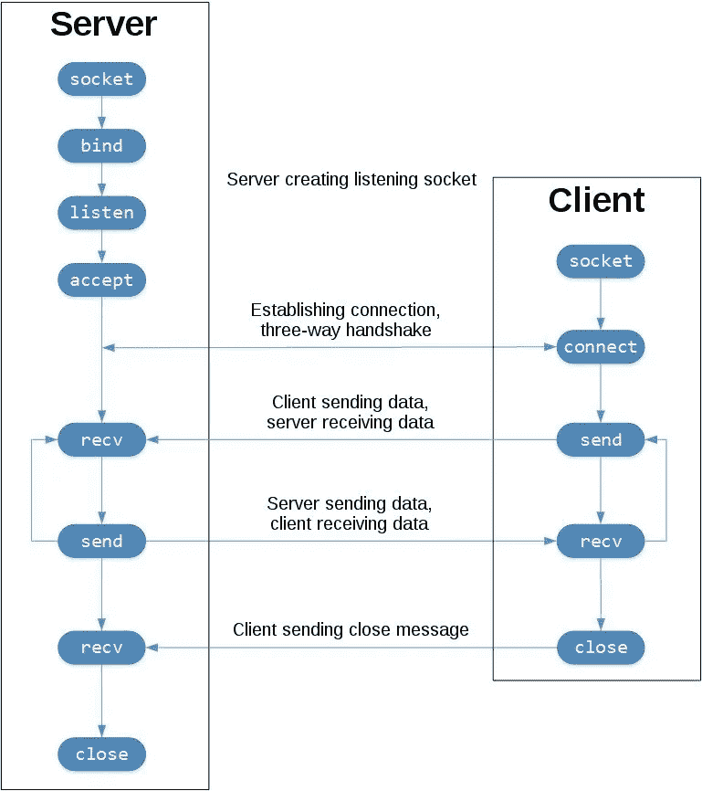
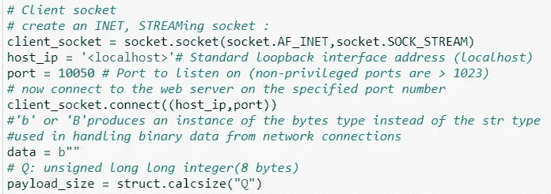
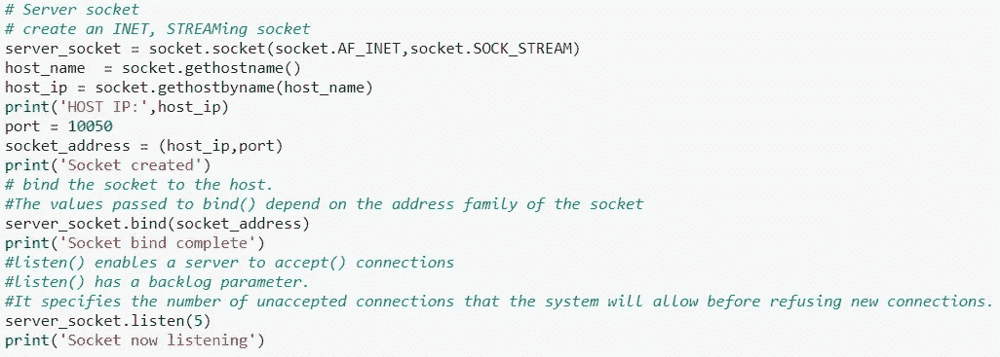
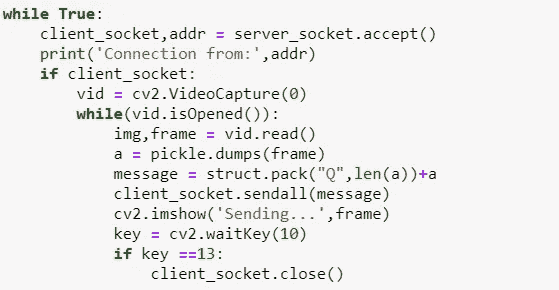
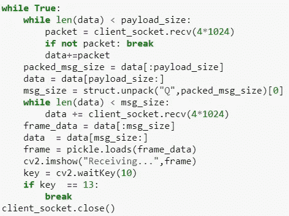
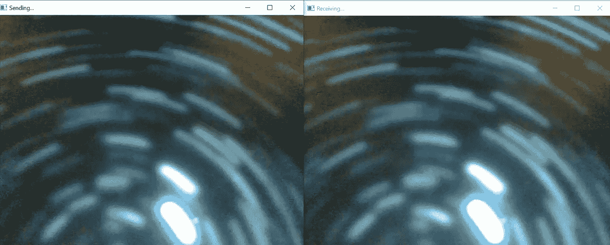

# 使用 Python 套接字编程开发实时视频流应用程序

> 原文：<https://medium.com/nerd-for-tech/developing-a-live-video-streaming-application-using-socket-programming-with-python-6bc24e522f19?source=collection_archive---------0----------------------->

upklyak 创建的业务向量

## 简介:

今天，只要有足够快的互联网连接，任何人都可以通过互联网观看高清电影或打视频电话。这之所以成为可能，是因为一种叫做 ***流*** 的技术。

流式传输是从服务器到客户端的音频或视频文件的连续传输。简单来说，流媒体就是消费者在联网设备上看电视或听播客的过程。通过流式传输，在客户端设备上播放的媒体文件被远程存储，并通过互联网一次传输几秒钟。

在当前场景中，由于疫情，视频流变得更加流行，以便社交、俯瞰、连接、学习等等。

## 目标:

使用 python 的套接字编程构建一个没有音频的实时视频流应用程序。

## 什么是套接字编程？

套接字和套接字 API 用于通过网络发送消息。它们提供了一种[形式的进程间通信(IPC)](https://en.wikipedia.org/wiki/Inter-process_communication) 。该网络可以是计算机的逻辑本地网络，也可以是物理连接到外部网络的网络，它自己连接到其他网络。最常见的例子是互联网。

最常见的套接字应用程序类型是客户端-服务器应用程序，其中一方充当服务器并等待来自客户端的连接，这就是我们将要构建的直播视频流应用程序的类型。

## 什么类型的插座适合我们的目标？

最合适的套接字类型是作为传输控制协议(TCP)的 **TCP 套接字**:

*   **可靠:**网络中丢弃的数据包被发送方检测并重新发送。
*   **具有有序的数据传递:**应用程序按照发送方写入的顺序读取数据。

TCP 套接字流

> 让我们开始构建实时视频流应用程序

## 必需品

*   IDE : Jupyter 笔记本
*   语言:Python

按照 TCP 流，我们需要两个不同的文件，一个用于客户端，另一个用于服务器。所以这两者都需要一些基本的设置，除非特别说明，否则没有什么不同。

## **步骤 1:在两个文件中安装并导入以下库**

您可能需要专门安装 opencv-python 和 imutils，以便导入它们。

*   socket:从 python
    cv2 获取 socket 模块:从 python
    pickle 导入计算机视觉模块:用于序列化和反序列化 python 对象结构。
    struct:将原生 Python 数据类型(如字符串和数字)转换为字节字符串，反之亦然
    imutils:图像处理操作

## **第二步:创建套接字**

创建客户端套接字

创建服务器端套接字

## **第三步:流式视频**

在**服务器**端，我们使用`accept()`，因为它[阻塞](https://realpython.com/python-sockets/#blocking-calls)并等待传入的连接。当客户端连接时，它返回一个表示连接的新套接字对象和一个保存客户端地址的元组。元组将包含用于 IPv4 连接的`(host, port)`或用于 IPv6 的`(host, port, flowinfo, scopeid)`。然后，我们必须将帧序列化为字节，打包序列化的数据并发送这些数据，打印错误消息以防出错，最后显示视频帧。

服务器接受客户端的请求

**客户端**创建一个 socket 对象，连接到服务器并调用`s.recv()`读取服务器的回复。在客户端，我们接收视频流的数据帧，但以数据包的形式，我们必须对其进行解包和解串，然后显示实际的视频帧。

客户端

## 结果:

视频流截图

## 结论:

因此，通过这种方式，我们可以创建一个没有音频的实时视频流应用程序，该应用程序可以用于监控等目的，或者可以用于无干扰的群体学习等。

## 供参考:

> **GitHub 资源库链接:**[https://GitHub . com/AmimaShifa/Live-Video-Streaming-Application](https://github.com/AmimaShifa/Live-Video-Streaming-Application)