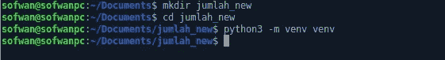
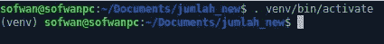
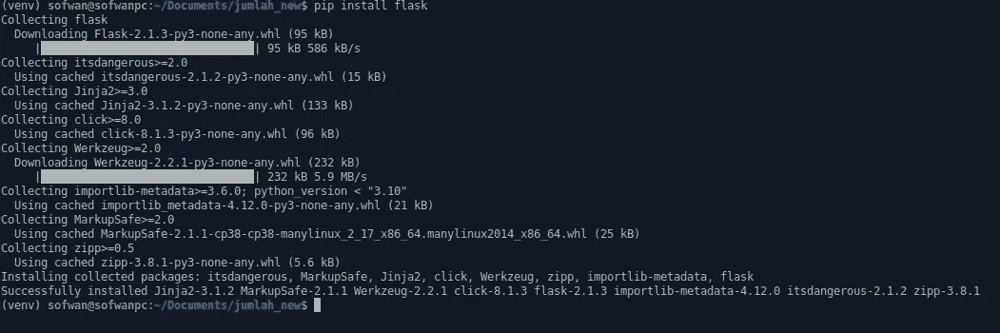
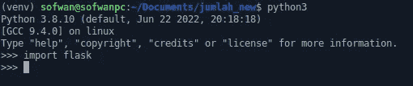
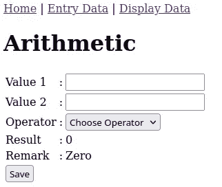
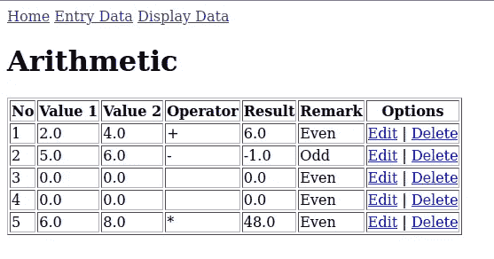
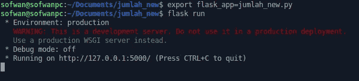
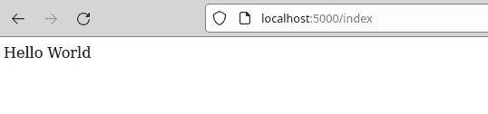
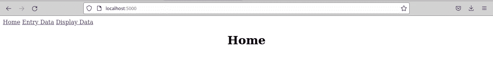
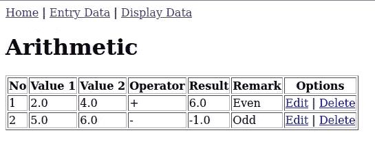

# 使用 Flask 和 MariaDB 开发一个简单的创建、读取、更新和删除(CRUD)应用程序

> 原文：<https://medium.com/nerd-for-tech/developing-a-simple-create-read-update-and-delete-crud-application-using-flask-and-mariadb-f037a5798ee2?source=collection_archive---------1----------------------->


flask([https://flask.palletsprojects.com/en/2.0.x/](https://flask.palletsprojects.com/en/2.0.x/))是著名的 Python web 框架之一。它以微观框架而闻名。微框架并不意味着它只有一个文件来存储代码或者它有一些功能。微意味着它有一个简单的核心，但可扩展，所以我们可以释放我们想要使用的扩展[1]。Flask 有许多我们可以使用的扩展，一些流行的 Flask 扩展，如 Flask-SQLAlchemy，它使用 SQLAlchemy 扩展和 Python SQL 工具包和对象关系映射器(ORM)来帮助应用程序开发人员灵活使用 SQL [2]。

学 Flask 要先懂 Python，中级更好。虽然没有像某些 web 框架那样明确说明使用模型-视图-控制器(MVC)来分隔模型、数据结构和数据库模块、模板模块和控制器作为逻辑模块，但我们可以在 Flask 中分隔类似于 MVC 的模块。在模板上，Flask 使用 Jinja(【https://jinja.palletsprojects.com/en/3.0.x/】的)。在模型中，我们可以创建自己的模型文件来处理数据结构，创建控制器来处理逻辑，但这里的模型和控制器是一个文件，即 routes.py。

本文将讨论使用 Flask 创建一个简单的创建-读取-更新-删除或 CRUD 应用程序，因此我们将在使用它创建 CRUD 的同时学习 Flask。

**一、需求** 要使用 Flask 构建一个 CRUD 应用，我们需要如下一些工具:

*   Python (www.python.org)。您的计算机上必须安装了 Python。最好安装 Python 3。撰写本文时的最新版本是 Python 3.10.0。
*   flask(https://flask . pallets projects . com)。您的计算机上必须安装有 Flask。我们后面会详细讲。
*   IDE(集成开发环境)或文本编辑器。spyder(www.spyder-ide.org)是一个很好的 IDE，除了 Jupyter-Notebook 之外，我最近还将它用作 Python 代码编辑器([https://wansofwan . medium . com/spyder-a-good-IDE-for-Python-to-choose-4 f 03 CDE 74 FBC](https://wansofwan.medium.com/spyder-a-good-ide-for-python-to-choose-4f03cde74fbc))

**二。工具**

我假设你的电脑上已经有 Python 了，如果你还没有，你可以在 Python 网站(www.python.org)下载 Python 并安装在你的电脑上，否则你可以通过在 Anaconda 网站([https://www.anaconda.com/products/individual](https://www.anaconda.com/products/individual))获得它并安装在你的电脑上来使用 Anaconda。

Anaconda 是一个数据科学工具包，您可以从 Anaconda 文件安装程序中获得一些其他软件，包括 Python。软件是 Python、Spyder、jupyter-notebook 和 Python 库。使用 Anaconda 的优点是简单，缺点是安装程序文件很大，比如 Anaconda for Windows 64 位图形安装程序是 477 mb。

在这里，我使用 Linux，所以我将在这里显示 Linux 屏幕。除了终端或 C 提示符上的一些指令，Flask 源代码在 Linux 或其他主要操作系统，Windows 或 Mac OS 上都是一样的，所以无论你是 Linux 用户，Windows 用户还是 Mac OS 用户，都可以跟着源代码走。

**三世。烧瓶安装** 我们将在“jumlah_new”目录下开发我们的项目，但是你当然可以用不同的名字命名它。在“jumlah_new”目录中，我们创建“venv”目录作为虚拟环境。在安装 Flask [3]之前，我们首先创建虚拟环境。

在 Linux 上:
$ mkdir jum lah _ new
$ CD jum lah _ new
$ python 3-m venv venv 或者$ python -m venv venv



图 Linux 中的 Flask 安装

Windows 上:>mkdir jum lah _ new
>CD jum lah _ new
>py3-m venv venv

虚拟环境有助于将我们的环境限制为我们操作系统上的整个环境，因此安装不会影响操作系统。

**激活虚拟环境** 接下来是激活我们的虚拟环境。
在 Linux 上:
$。venv/bin/激活



图 2:激活虚拟环境

在 Windows 上:
venv\Scripts\activate

**在 Linux 上安装烧瓶** :
$ pip 安装烧瓶



图 3:安装烧瓶

在 Windows 上:
> pip 安装烧瓶

接下来，Windows 和 Linux 将有相同的指令。通过键入:
import flask，我们可以使用 Python 控制台测试我们的 Flask 安装。
如果没有错误信息出现，烧瓶安装好。



图 4:测试烧瓶

**四。关于 CRUD 应用程序** 现在，我们有了使用 Flask 构建应用程序的工具。在我们开始写代码之前，我想解释一下我们将构建什么样的程序。这是一个简单的 CRUD 应用程序，即算术运算。应用程序有 3 个数据要输入，它们是值 1、值 2 和操作符。运算符有 4 个元素可供选择其中之一，它们是加法(+)、减法(-)、乘法(*)和除法(/)。然后根据所选运算符处理输入的两个值，并产生一个备注，无论是奇数还是偶数。例如，我们为值 1 输入 4，为值 2 输入 5，为运算符输入*或乘法，结果是 20，备注为偶数。所有的输入和输出，包括备注，都存储在 MariaDB 的一个表中，我用的是 Xampp (www.apachefriends.org)，一个 Apache 发行版包含 PHP，Perl 和 MariaDB。表名是 penjumlahan。Penjumlahan 是印度尼西亚语，意思是加法。

参赛表格如下:



图 5:条目和结果表单

还有一个页面显示输入和输出，它们都可以编辑或删除。



图 6:显示数据

位于工作台上的菜单有主页、输入数据和显示数据。主页用于显示“主页”字、打开页面、用于显示条目数据表单的条目数据以及用于显示表格中的数据的显示数据。

**V.Hello World，for the Beginning** 现在是时候通过在我们的 flask 应用程序中开始编写 Hello World 来编写代码了。我从 Miguel Grinberg 写的“Flask Mega tutorial”中学习创建 Hello World 应用程序[4]。我建议你也学习这样的烧瓶教程，因为它详细地从开始一步一步地教我们。

首先进入你的根目录(jumlah)并在其中创建一个目录“app”。创建 __init__。app 目录中的 py 文件(app/__init__)。py)并在其中编写代码，如下所示:

```
from flask import flask
app=flask(__name__)
from app import routes
```

然后在应用程序目录(app/routes.py)中创建 routes.py，并在其中编写代码，如下所示:

```
from app import app
@app.route("/")
@app.route("/index")
def index():
   return "Hello World"
```

之后，在我们的根目录中创建 jumlah_new.py，并在其中编写代码，如下所示:

```
from app import app
```

然后运行应用程序，设置 flask_app 环境变量如下:
$ export flask _ app = jum lah _ new . py
然后我们用下面的指令运行 flask:
$ flask run



图 7:运行烧瓶应用程序

现在，我们可以通过在浏览器上键入 URL 来运行应用程序: [http://localhost:5000/](http://localhost:5000/) 或 [http://127.0.0.1:5000/](http://127.0.0.1:5000/)



图 8:输出“Hello World”

目录现在的结构是:
jum lah _ new
>app
>>_ _ init _ _。py
>>routes . py
>jumlah _ new . py
>venv

**六。创建 CRUD 应用程序** “Hello World”视图是一个开始视图或主视图，我们将它放在/index 或/中，因此在 web 浏览器中 URL 是 [http://127.0.0.1:5000](http://127.0.0.1:5000) 或[http://127 . 0 . 0 . 1:5000/index。](http://127.0.0.1:5000/index.)我们可以将“Hello World”更改为“Home ”,并将其放在屏幕中间，这样主屏幕将会是:



图 9:主页视图

别忘了我们使用的根目录是 jumlah_new。

**VI.a .创建输入表单**
首先，我们创建输入表单和结果，如上图 5 所示，但我在此再次插入，如下所示:


图 10:条目和结果表单

为了制作这样的表单，我们使用 Flask 中的 render_template 方法。我们还使用 Flask-wtf 扩展来帮助我们创建表单组件，如标签、按钮和文本字段。Flask-wtf 安装在终端或命令提示符下，使用语句:pip install flask-wtf。

我们还创建了一个包含类 jumlah_new/app/frm_entry.py 的文件，其中包含表单组件，这些组件由路由使用并使用视图文件显示，它是 jum lah _ new/app/templates/frm _ entry . html。

对于视图文件，我们将它们保存在 jumlah_new/app/templates 目录中。视图文件使用 jinja，这是 Flask 默认的模板引擎。

文件创建如下:

jumlah _ new
/app
>/templates
>>frm _ entry . html
>routes . py
>_ _ init _ _。py
>frm _ entry . py
/venv
config . py
jumlah _ new . py

***a . jum lah _ new/app/_ _ init _ _。py***

```
from flask import Flask
from config import Config
app=Flask(__name__)
app.config.from_object(Config)
from app import routes
```

__init__。py 是一个初始文件，它存在于每个运行的应用程序中，这个文件总是在开始时被执行。
备注部分代码如下:
**从 flask 导入 Flask** 备注:导入 Flask 框架中存在的方法或类 Flask

**从配置导入配置** 备注:导入 jumlah_new/config.py 文件中存在的类配置

**app = Flask(__name__)** 备注:加载 Flask(_ _ name _ _)并使用 app 变量保存

**app . Config . from _ object(Config)** 备注:使用 jumlah_new/config.py 文件中存在的类 config (object)

**从 app 导入路线** 备注:加载路线文件中存在的路线

***b . jumlah _ new/config . py***

```
import os
class Config(object):
    SECRET_KEY=os.environ.get("SECRET_KEY") or "you-will-never-               guess"
```

需要 config.py 来保证表单的安全。缩进是不正确的，尤其是单词“guess”，因为编辑器不允许我在“guess”单词前添加缩进，请理解:-)。这也可能发生在下一个其他源代码中。

***c . jumlah _ new/jumlah _ new . py***

```
from app import app
```

在运行应用程序之前，调用该文件来启动 flask server。

***d . jumlah _ new/app/routes . py***

```
from flask import render_template
from app import app
from app.frm_entry import EntryForm
[@app](http://twitter.com/app).route("/")
[@app](http://twitter.com/app).route("/index")
def index():
    form=EntryForm()
    return render_template("frm_entry.html",title="Entry and Result            Form",formnya=form)
```

routes.py 是一个控制应用程序的文件。我们使用 flask 中的 render_template 方法、jumlah_new/app/frm_entry.py 中的 EntryForm 类和 __ini__.py. render_template 中的 load app 变量来加载模板文件。html 扩展名，并存在于 jumlah_new/app/templates 目录中。
部分代码备注如下:
从 app.frm_entry 导入 EntryForm备注:加载 jumlah_new/app/frm_entry.py 中存在的 EntryForm 类

[@app](http://twitter.com/app) 。路线("/"
[@ app](http://twitter.com/app)。route("/index")备注:指令将在最后一个 URL 的/或/index 中执行

form=EntryForm()备注:EntryForm 是一个调用的类，位于 jumlah_new/app/frm_entry.py 文件中。

return render _ template(" frm_entry.html "，title="Entry and Result Form "，formnya=form)
备注:加载 jumlah_new/app/templates 目录下的 frm _ Entry . html。它还将“title”变量和“formnya”变量发送到 frm_entry.html

***e . jum lah _ new/app/frm _ entry . py***

```
from flask_wtf import FlaskForm
from wtforms import StringField, SubmitField, SelectField
from wtforms.validators import DataRequiredclass EntryForm(FlaskForm):
    nilai_1=StringField("Value 1", validators=[DataRequired()])
    nilai_2=StringField("Value 2", validators=[DataRequired()])
    operatornya=SelectField("Operator", choices=[("","Choose     Operator"),("*","X"),("+","+"),("-","-"),                                    ("/","/")])
    submit=SubmitField("Save")
    batal=SubmitField("Cancel")
```

因为我们已经安装了 flask_wtf 扩展，所以我们可以用它来创建表单。在表单中，我们使用 TextField、Select 和 Submit 按钮，为了使它们可用，我们从 wtforms 中导入 StringField、SubmitField 和 SelectField。在 TextField 中，我们需要验证 TextField 必须被填充，所以我们在每个 StringField 中使用 validators=[DataRequired()]语法。

这里，我们还创建了一个通过 routes 导入的类 EntryForm(FlaskForm)。

**f . jum lah _ new/app/templates/frm _ entry . html**

```
<DOCTYPE html>
<html>
  <head>
   <title>Entry Form</title>
  </head>
  <body>
    <a href="#">Home</a> <a href="#">Entry Data</a> <a href="#">Display Data</a>
    <h1>Arithmetics</h1>
    <table>
    <form action="" method="post" novalidate>
    <tr>
      <td>{{ formnya.nilai_1.label }}</td><td>:</td>
      <td>{{ formnya.nilai_1(size=20) }}</td>
    </tr>    
    <tr>
      <td>{{ formnya.nilai_2.label }}</td><td>:</td>
      <td>{{ formnya.nilai_2(size=20) }}</td>
    </tr>    
    <tr>
       <td>{{ formnya.operatornya.label }}</td><td>:</td>
       <td>{{ formnya.operatornya }}</td>
    </tr>    
    <tr>
       <td>{{ formnya.submit() }} {{ formnya.batal }}</td>
    </tr>
    </body>   
    </table>
</html>
```

我们使用 html 来显示 web 表单，也用于这个表单。如前所述，我们使用 Jinja 进行查看。Jinja 有语法“{{”和“}}”来打印出类似上面源代码的变量。

在我们写完所有的源代码后，我们可以运行应用程序，如果没有错误，我们可以看到表单，但表单还不能保存数据和打印结果。我们需要添加一些其他的源代码来使它工作。

**VI.b 制作参赛表格作品
VI.b.1 继承**
在制作参赛表格作品之前，首先我们进行模板继承。它是一个模板文件，嵌入在另一个文件中，以简化工作。文件头通常可以嵌入到另一个文件中，如果头文件发生变化，例如加载一个 Javascript 代码，只有一个头文件发生变化，它会影响嵌入头文件的文件。所以我们把**jum lah _ new/app/templates/frm_entry.html**分成两个文件，变成 header_footer.html 和 frm _ entry . html 本身:

**jum lah _ new/app/templates/header _ footer . html**

```
<DOCTYPE html>
<html>
   <head>
      <title>Entry Form</title>
   </head>
   <body>
   <a href="/">Home</a> | <a href="/frm_entry">Entry Data</a> | <a href="/tampil_data">Display Data</a>
    
   </body>
</html>
```

上述文件包含菜单，每个菜单都有如下 url:

```
 <a href=”/”>Home</a> | <a href=”/frm_entry”>Entry Data</a> | <a href=”/tampil_data”>Display Data</a>
```

参赛表格模板保存在**jum lah _ new/app/templates/frm _ entry . html**中，如下所示:

```


    <a href="#">Home</a>
    <a href="#">Entry Data</a> <a href="#">Display Data</a>
    <h1>Arithmetics</h1>
    <table>
    <form action="" method="post" novalidate>
    <tr>
      <td>{{ formnya.nilai_1.label }}</td><td>:</td>
      <td>{{ formnya.nilai_1(size=20) }}</td>
    </tr>    
    <tr>
      <td>{{ formnya.nilai_2.label }}</td><td>:</td>
      <td>{{ formnya.nilai_2(size=20) }}</td>
    </tr>    
    <tr>
       <td>{{ formnya.operatornya.label }}</td><td>:</td>
       <td>{{ formnya.operatornya }}</td>
    </tr>    
    <tr>
       <td>{{ formnya.submit() }} {{ formnya.batal }}</td>
    </tr>

```

参赛表格是一个使用标签的 HTML 表格。它正在使用金贾。使用{{和}}字符打印的变量。

**VI.b.2 保存条目表单中的数据** 条目表单中输入的数据保存在使用 MariaDB 数据库创建的表 Penjumlahan 中，如下:
表名:penjumlahan
字段:id (int)主键、value_1 (double)、value_2 (double)、运算符(varchar)、结果(double)、备注(varchar)

然后，我们需要 Flask-MySQL 扩展，所以我们使用 PIP 安装 Flask-MySQL 1 . 5 . 2 版。目前当我写这篇文章的时候，我使用的最新的 Flask-MySQL 还没有工作，但是也许当你读这篇文章的时候，最新的版本比现在更新了，可以使用了。
安装 Flask-MySQL 1 . 5 . 2 版本的命令在这里(不含$的类型):
$ pip 安装 Flask-MySQL==1.5.2
安装最新 Flask-MySQL 版本的命令在这里:
$ pip 安装 Flask-MySQL。

我们将输入的数据、结果和备注保存在表格中。结果取决于所选的运算符，如果我们选择“+”，结果是 value_1 + value_2，如果我们选择“*”，结果是 value_1 x value_2，依此类推。
我们还决定结果是偶数、奇数还是零。
我们在 routes.py 上添加函数 frm _ entry
jum lah _ new/app/routes . py 将变成:

```
from flask import render_template, request, url_for, redirect
from flaskext.mysql import MySQL
from app import app
from app.frm_entry import EntryForm# Connecting database
app.config["MYSQL_DATABASE_HOST"]="localhost"
app.config["MYSQL_DATABASE_USER"]="root"
app.config["MYSQL_DATABASE_PASSWORD"]="opansan63"
app.config["MYSQL_DATABASE_DB"]="test"
app.config["MYSQL_PORT"]="3306"# Preparing variable on mysqlnya
mysqlnya=MySQL(app)
mysqlnya.init_app(app)[@app](http://twitter.com/app).route("/")
def home():
    return render_template("home.html", title="Home")[@app](http://twitter.com/app).route("/frm_entry", methods=["GET","POST"])
def frm_entry():
    resultnya=0
    rem=""
    xvalue_1=0
    xvalue_2=0
    xoperator=""    

    formnya=EntryForm()

    # Save inputted data to variables
    if request.method=="POST":
        details=request.form
        xvalue_1=details["value_1"]
        xvalue_2=details["value_2"]
        xoperator=details["operatornya"]

    # Processing result
    if xoperator=="+":
       resultnya=int(xvalue_1)+int(xvalue_2)
    elif xoperator=="-":
       resultnya=int(xvalue_1)-int(xvalue_2)
    elif xoperator=="/":
       resultnya=int(xvalue_1)/int(xvalue_2)
    elif xoperator=="*":
       resultnya=int(xvalue_1)*int(xvalue_2)    

    # Processing remarks, Even, Odd or Zero
    if resultnya==0:
        rem="Zero"
    elif resultnya % 2 ==0:    
        rem="Even"
    elif resultnya % 2==1:
         rem="Odd"    
    else:
        rem=""# Save data        
    cur=mysqlnya.connect().cursor()
    cur.execute("insert into penjumlahan (value_1,value_2,operator,result, remark) values (%s,%s,%s,%s,%s)",((xvalue_1,xvalue_2,xoperator,resultnya,rem)))
    cur.connection.commit()
    cur.close()

    return render_template("frm_entry.html", title="Nilai", formnya=formnya, xresultnya=resultnya, remnya=rem)
```

上述源代码的一些重要注释如下:

```
from flask import render_template, request, url_for, redirect
from flaskext.mysql import MySQL
from app import app
from app.frm_entry import EntryForm
```

**备注:**我们在 flask 中导入 render_template，url_for，request，redirect。url_for 和 redirect 我们还没有用到，以后我们会用到它们。我们还从 app/frm_entry.py 导入 EntryForm 类。我们还从 flaskext.mysql 导入 MySQL

```
# Connecting database
app.config["MYSQL_DATABASE_HOST"]="localhost"
app.config["MYSQL_DATABASE_USER"]="root"
app.config["MYSQL_DATABASE_PASSWORD"]="opansan63"
app.config["MYSQL_DATABASE_DB"]="test"
app.config["MYSQL_PORT"]="3306"
```

**备注:**我们通过配置一些参数来连接数据库，它们是主机、用户、密码、数据库名称和端口。3306 是 MariaDB 的标准端口。在运行应用程序之前，不要忘记先运行数据库。对于 Xampp 用户，请先运行 Xampp。

```
# Preparing variable on mysqlnya
mysqlnya=MySQL(app)
mysqlnya.init_app(app)
```

**备注:**我们准备 mysqlnya 变量，用于保存、编辑、显示和删除数据。

```
# Save data        
    cur=mysqlnya.connect().cursor()
    cur.execute("insert into penjumlahan (value_1,value_2,operator,result, remark) values (%s,%s,%s,%s,%s)",((xvalue_1,xvalue_2,xoperator,resultnya,rem)))
    cur.connection.commit()
    cur.close()
```

**备注:**为了保存数据，我们使用 cur 变量连接数据库，然后执行查询 insert into。

我们将结果和备注变量从 routers.py (xresultnya 和 remnya)发送到条目表单，因此 jumlah _ new/app/templates/frm _ Entry . html 现在如下所示:

```


    <a href="#">Home</a> <a href="#">Entry Data</a>
    <a href="#">Display Data</a>
    <h1>Arithmetics</h1>
    <table>
    <form action="frm_entry" method="post" novalidate>
    {{ formnya.hidden_tag()}}
    <tr>
      <td>{{ formnya.value_1.label }}</td><td>:</td>
      <td>{{ formnya.value_1(size=20) }}</td>
    </tr>    
    <tr>
      <td>{{ formnya.value_2.label }}</td><td>:</td>
      <td>{{ formnya.value_2(size=20) }}</td>
    </tr>    
    <tr>
       <td>{{ formnya.operatornya.label }}</td><td>:</td>
       <td>{{ formnya.operatornya }}</td>
    </tr>
    <tr>
       <td>Result</td><td>:</td><td>{{ xresultnya }}</td>
    </tr>     
    <tr>
       <td>Remark</td><td>:</td><td>{{ remnya }}</td>
    </tr>
    <tr>
       <td>{{ formnya.submit() }} {{ formnya.batal }}</td>
    </tr>

```

在运行应用程序之前，不要忘记运行数据库。

**VI.c 显示数据**

我们将创建如下显示数据外观:



图 11:显示数据

我们保存在表格中的数据需要显示，所以我们创建一个数据显示模块作为表格。我们通过显示数据菜单访问数据显示。

在 jumlah_new/app/routes.py 中，我们创建了 tampil_data()函数，该函数具有显示来自 penjumlahan 表的所有记录的查询。结果被排列并发送到视图或模板文件。我们还为视图创建了一个新文件，即位于 jumlah_new/app/templates 中的 tampil_data.html。

routes.py 中的 tampil_data 函数如下:

```
# ...
# above is other codes [
@app](http://twitter.com/app).route("/tampil_data")    
def tampil_data():
    formnya=EntryForm()     

    cur=mysqlnya.connect().cursor()
    cur.execute("select * from penjumlahan")
    hasilnya=cur.fetchall()    
    return render_template("tampil_data.html", title="Tampil Data",hasilnya=hasilnya,no=1)
```

上面的源代码有 SQL 来显示 penjumlahan 表中的所有记录。

完整的 routes.py 现在如下所示:

```
from flask import render_template, request, url_for, redirect
from flaskext.mysql import MySQL
from app import app
from app.frm_entry import EntryForm# Connecting database
app.config["MYSQL_DATABASE_HOST"]="localhost"
app.config["MYSQL_DATABASE_USER"]="root"
app.config["MYSQL_DATABASE_PASSWORD"]="opansan63"
app.config["MYSQL_DATABASE_DB"]="test"
app.config["MYSQL_PORT"]="3306"# Preparing variable on mysqlnya
mysqlnya=MySQL(app)
mysqlnya.init_app(app)[@app](http://twitter.com/app).route("/")
def home():
    return render_template("home.html", title="Home")[@app](http://twitter.com/app).route("/frm_entry", methods=["GET","POST"])
def frm_entry():
    resultnya=0
    rem=""
    xvalue_1=0
    xvalue_2=0
    xoperator=""

    formnya=EntryForm()

    # Save inputted data to variables
    if request.method=="POST":
        details=request.form
        xvalue_1=details["value_1"]
        xvalue_2=details["value_2"]
        xoperator=details["operatornya"]

    # Processing result
    if xoperator=="+":
       resultnya=int(xvalue_1)+int(xvalue_2)
    elif xoperator=="-":
       resultnya=int(xvalue_1)-int(xvalue_2)
    elif xoperator=="/":
       resultnya=int(xvalue_1)/int(xvalue_2)
    elif xoperator=="*":
       resultnya=int(xvalue_1)*int(xvalue_2)
    else:
       resultnya=0 

    # Processing remarks, Even, Odd or Zero
    if resultnya % 2 ==0:    
        rem="Even"
    elif resultnya % 2==1:
        rem="Odd"
    else:
        rem="Zero"# Save data        
    cur=mysqlnya.connect().cursor()
    cur.execute("insert into penjumlahan (value_1,value_2,operator,result, remark) values (%s,%s,%s,%s,%s)",((xvalue_1,xvalue_2,xoperator,resultnya,rem)))
    cur.connection.commit()
    cur.close()

    return render_template("frm_entry.html", title="Nilai", formnya=formnya, xresultnya=resultnya, remnya=rem)[@app](http://twitter.com/app).route("/tampil_data")    
def tampil_data():
    formnya=EntryForm()     

    cur=mysqlnya.connect().cursor()
    cur.execute("select * from penjumlahan")
    hasilnya=cur.fetchall()    
    return render_template("tampil_data.html", title="Tampil Data",hasilnya=hasilnya,no=1)
```

显示视图为 jum lah _ new/app/templates/tam pil _ data . html，如下所示:

```

    
  <h1>Arithmetic</h1>
  <table border=1>
  <th>No</th><th>Value 1</th><th>Value 2</th><th>Operator</th>   <th>Result</th><th>Remark</th><th>Options</th>
 
    <tr>
      <td>{{ loop.index }}</td><td>{{ rows[1] }}</td><td>{{ rows[2]   }}</td>
      <td>{{ rows[3] }}</td><td>{{ rows[4] }}</td>
      <td>{{ rows[5] }}</td><td><a href="{{   url_for('frm_edit_data',id=rows[0])}}">Edit</a> | 
                                <a href="{{ url_for('delete_data',id=rows[0])}}" onClick="return asking()">Delete</a>
  </td>
 </tr>  

</table>

```

我们使用迭代来打印数据，并将它们放在一个表中。我们使用索引号打印每个数据，第[1]行用于值 1，第[2]行用于值 2，第[3]行用于运算符，第[4]行用于结果，第[5]行用于备注。我们提供删除数据的链接。这样的链接是 router.py 中的一个功能。在删除数据或删除记录之前，我们使用 Javascript 确认用户是否确实想要删除它或取消它，并将其保存在 header_footer.html 中，所以现在 header_footer.html 变成了:

```
<DOCTYPE html>
<html>
   <head>
      <title>Entry Form</title>
      <script>
      function asking()
       {
         askingnya=confirm("Are you sure to delete this record ?");         
         if (askingnya==true)
           {
             return True;             
           }
        else
           {
             return False;             
           }              
       }
      </script>
   </head>
   <body>
     <a href="/">Home</a> | <a href="/frm_entry">Entry Data</a> | <a href="/display_data">Display Data</a>
     
   </body>
</html>
```

在上面的源代码中，我们在标签之间插入了 JavaScript。它使用功能询问。如果确认是确定的，它将返回 True，这意味着它是删除记录，如果确认是取消的，它将返回 false，这意味着它被取消或没有删除。但是在我的电脑上最后一次运行，这样的功能还没有工作，我不知道确切的，也许有像浏览器设置的外部影响。

**VI.d 编辑数据**

在显示数据表中，我们有两个选项，“编辑”和“删除”。"编辑"是显示选中的数据或记录，对其进行编辑，然后保存。

首先，我们必须在 routes.py 中创建 frm_edit_data 函数。该函数除了显示选定的数据之外，还保存编辑过的数据。我们还需要在模板目录中创建编辑表单 html。

routes.py 中的 frm_edit_data 函数如下:

```
[@app](http://twitter.com/app).route("/frm_edit_data/<id>",methods=["GET","POST"])
def frm_edit_data(id):
    cur=mysqlnya.connect().cursor()
    form=EntryForm()
    cur.execute("select * from penjumlahan where id='"+id+"'")
    hasilnya=cur.fetchall()    
    for rows in hasilnya:
        xvalue_1=rows[1]
        xvalue_2=rows[2]
        xoperator=rows[3]
        xresult=rows[4]
        xremark=rows[5]

    if request.method=="POST":             
       details=request.form
       xvalue_1=details["value_1"]
       xvalue_2=details["value_2"]
       xoperator=details["operatornya"]

       # Processing input to make a result
       if xoperator=="+":
          xresult=float(xvalue_1)+float(xvalue_2)
       elif xoperator=="-":
          xresult=float(xvalue_1)-float(xvalue_2)
       elif xoperator=="/":
          xresult=float(xvalue_1)/float(xvalue_2)
       elif xoperator=="*":
           xresult=float(xvalue_1)*float(xvalue_2)
       else:
           xresult=0

       # Menentukan Ganjil atau Genap
       if xresult % 2 ==0:
          xremark="Genap"
       elif xresult % 2==1:
          xremark="Ganjil"
       else:
          xremark="Nol"   

       cur=mysqlnya.connect().cursor()
       #cur.execute("update penjumlahan set value_1='"+xnilai_1+"'"+
       #            ",value_2='"+xnilai_2+"'"+",operator='"+xoperator+"'"+
       #            ",result='"+hasil+"'"+",remark='"+xremark+"'"+"where id='"+id+"'")

       cur.execute ("update penjumlahan set value_1=%s,value_2=%s,operator=%s,result=%s,remark=%s where id= %s",
                    ((xvalue_1,xvalue_2,xoperator,xresult,xremark,id)))
       cur.connection.commit()
       cur.close()
    else:   
       form.value_1.data=xvalue_1    
       form.value_2.data=xvalue_2
       form.operatornya.data=xoperator          

    return render_template("frm_edit.html", title="Edit   Data",znilai_1=xvalue_1,form=form,
    ketnya=xremark,hasilnya=xresult)
```

一些重要的备注如下:

```
[@app](http://twitter.com/app).route(“/frm_edit_data/<id>”,methods=[“GET”,”POST”])
```

上面的代码是使用 get 或 post 方法的 id 为的 url。id 是从视图显示数据中获得的，它是 penjumlahan 表中的主键。

```
cur.execute("select * from penjumlahan where id='"+id+"'")
    hasilnya=cur.fetchall()    
    for rows in hasilnya:
        xvalue_1=rows[1]
        xvalue_2=rows[2]
        xoperator=rows[3]
        xresult=rows[4]
        xremark=rows[5] 
```

查询上面代码以检索 id 为 selected id 的数据。结果只有一条记录，我们用一些变量保存数据，xvalue_1 保存 value_1，xvalue_2 保存 value_2，xoperator 保存 operator，xresult 保存 result，xremark 保存 remark。

```
if request.method=="POST":       

       details=request.form
       xvalue_1=details["value_1"]
       xvalue_2=details["value_2"]
       xoperator=details["operatornya"]

       # Processing input data to make a result
       if xoperator=="+":
          xresult=float(xvalue_1)+float(xvalue_2)
       elif xoperator=="-":
          xresult=float(xvalue_1)-float(xvalue_2)
       elif xoperator=="/":
          xresult=float(xvalue_1)/float(xvalue_2)
       elif xoperator=="*":
           xresult=float(xvalue_1)*float(xvalue_2)
       else:
           xresult=0

       # Menentukan Ganjil atau Genap
       if xresult % 2 ==0:
          xremark="Even"
       elif xresult % 2==1:
          xremark="Odd"
       else:
          xremark="Zero"   

       cur=mysqlnya.connect().cursor()
       #cur.execute("update penjumlahan set value_1='"+xnilai_1+"'"+
       #            ",value_2='"+xnilai_2+"'"+",operator='"+xoperator+"'"+
       #            ",result='"+hasil+"'"+",remark='"+xremark+"'"+"where id='"+id+"'")

       cur.execute ("update penjumlahan set value_1=%s,value_2=%s,operator=%s,result=%s,remark=%s where id= %s",
                    ((xvalue_1,xvalue_2,xoperator,xresult,xremark,id)))
       cur.connection.commit()
       cur.close()
    else:   
       form.value_1.data=xvalue_1    
       form.value_2.data=xvalue_2
       form.operatornya.data=xoperator
```

当用户在编辑表单中按提交或保存按钮时，上面的代码被执行。然后，再次处理计算的结果数，并再次处理备注。之后，用当前值、结果和备注更新 penjumlahan 表。如果没有按下“提交”按钮，则号码仍然相同，没有变化。

对于编辑模板，我们使用/jum lah _ new/app/templates/frm _ edit . html 源代码如下:

```


<h1>Aritmetika</h1>
<a href="[http://localhost:5000/frm_tampil](http://localhost:5000/frm_tampil)">Tampil Data</a>
<table>
<form action="" method="post" novalidate>
{{ form.hidden_tag() }}
<tr>
  <td>{{ form.value_1.label}}</td><td>:</td>
  <td>{{ form.value_1(size=20) }}</td>
</tr>
<tr>
  <td>{{ form.value_2.label}}</td><td>:</td>
  <td>{{ form.value_2(size=20) }}</td>
</tr>
<tr>
  <td>{{ form.operatornya.label }}</td><td>:</td>
  <td>{{ form.operatornya }}</td>
</tr>
<tr>
  <td>{{ form.submit() }}</td>
</tr>
</table>
<table>
<tr>
<td>Result</td><td>:</td><td>{{ hasilnya }}</td>
</tr>
<tr>
<td>Remarks</td><td>:</td><td>{{ ketnya }}</td>
</tr>
</table>

```

编辑表单与条目表单相同，但编辑表单是用我们从显示数据表中选择的数据填充的。

一些评论如下:

```
<tr>
<td>Result</td><td>:</td><td>{{ hasilnya }}</td>
</tr>
<tr>
<td>Remarks</td><td>:</td><td>{{ ketnya }}</td>
</tr>
```

上面的代码是为了查看 hasilnya 和 ketnya 来自 routes.py 的结果和备注。

**VI.e 删除数据**

我们可以通过点击显示数据表中的“删除”链接来删除一条记录。在我们删除数据之前有一个确认。我们在 routes.py 中创建 delete_data，如下所示:

```
[@app](http://twitter.com/app).route("/delete_data/<id>", methods=["GET","POST"])
def delete_data(id):
    cur=mysqlnya.connect().cursor()
    cur.execute("delete from penjumlahan where id='"+id+"'")
    cur.connection.commit()
    cur.close()    
    return redirect(url_for("display_data"))
```

上面的代码已经查询删除一个选中的记录。在我们使用 cur.connection.commit()删除记录后，程序使用我们在 routes.py 的第一行导入的 url_for 方法显示数据表。

现在，完整的 routes.py 如下:

```
from flask import render_template, request, url_for, redirect
from flaskext.mysql import MySQL
from app import app
from app.frm_entry import EntryForm# Connecting database
app.config["MYSQL_DATABASE_HOST"]="localhost"
app.config["MYSQL_DATABASE_USER"]="root"
app.config["MYSQL_DATABASE_PASSWORD"]="opansan63"
app.config["MYSQL_DATABASE_DB"]="test"
app.config["MYSQL_PORT"]="3306"# Preparing variable on mysqlnya
mysqlnya=MySQL(app)
mysqlnya.init_app(app)[@app](http://twitter.com/app).route("/")
def home():
    return render_template("home.html", title="Home")[@app](http://twitter.com/app).route("/frm_entry", methods=["GET","POST"])
def frm_entry():
    resultnya=0
    rem=""
    xvalue_1=0
    xvalue_2=0
    xoperator=""    

    formnya=EntryForm()

    # Save inputted data to variables
    if request.method=="POST":
        details=request.form
        xvalue_1=details["value_1"]
        xvalue_2=details["value_2"]
        xoperator=details["operatornya"]

    # Processing result
    if xoperator=="+":
       resultnya=int(xvalue_1)+int(xvalue_2)
    elif xoperator=="-":
       resultnya=int(xvalue_1)-int(xvalue_2)
    elif xoperator=="/":
       resultnya=int(xvalue_1)/int(xvalue_2)
    elif xoperator=="*":
       resultnya=int(xvalue_1)*int(xvalue_2)    

    # Processing remarks, Even, Odd or Zero
    if resultnya==0:
        rem="Zero"
    elif resultnya % 2 ==0:    
        rem="Even"
    elif resultnya % 2==1:
         rem="Odd"    
    else:
        rem=""# Save data        
    cur=mysqlnya.connect().cursor()
    cur.execute("insert into penjumlahan (value_1,value_2,operator,result, remark) values (%s,%s,%s,%s,%s)",((xvalue_1,xvalue_2,xoperator,resultnya,rem)))
    cur.connection.commit()
    cur.close()

    return render_template("frm_entry.html", title="Nilai", formnya=formnya, xresultnya=resultnya, remnya=rem)[@app](http://twitter.com/app).route("/display_data")    
def display_data():
    formnya=EntryForm()     

    cur=mysqlnya.connect().cursor()
    cur.execute("select * from penjumlahan")
    hasilnya=cur.fetchall()    
    return render_template("tampil_data.html", title="Tampil Data",hasilnya=hasilnya,no=1)[@app](http://twitter.com/app).route("/frm_edit_data/<id>",methods=["GET","POST"])
def frm_edit_data(id):
    cur=mysqlnya.connect().cursor()
    form=EntryForm()
    cur.execute("select * from penjumlahan where id='"+id+"'")
    hasilnya=cur.fetchall()    
    for rows in hasilnya:
        xvalue_1=rows[1]
        xvalue_2=rows[2]
        xoperator=rows[3]
        xresult=rows[4]
        xremark=rows[5]    

    if request.method=="POST":       

       details=request.form
       xvalue_1=details["value_1"]
       xvalue_2=details["value_2"]
       xoperator=details["operatornya"]

       # Memproses hasil    
       if xoperator=="+":
          xresult=float(xvalue_1)+float(xvalue_2)
       elif xoperator=="-":
          xresult=float(xvalue_1)-float(xvalue_2)
       elif xoperator=="/":
          xresult=float(xvalue_1)/float(xvalue_2)
       elif xoperator=="*":
           xresult=float(xvalue_1)*float(xvalue_2)
       else:
           xresult=0

       # Menentukan Ganjil atau Genap
       if xresult % 2 ==0:
          xremark="Even"
       elif xresult % 2==1:
          xremark="Odd"
       else:
          xremark="Zero"   

       cur=mysqlnya.connect().cursor()
       #cur.execute("update penjumlahan set value_1='"+xnilai_1+"'"+
       #            ",value_2='"+xnilai_2+"'"+",operator='"+xoperator+"'"+
       #            ",result='"+hasil+"'"+",remark='"+xremark+"'"+"where id='"+id+"'")

       cur.execute ("update penjumlahan set value_1=%s,value_2=%s,operator=%s,result=%s,remark=%s where id= %s",
                    ((xvalue_1,xvalue_2,xoperator,xresult,xremark,id)))
       cur.connection.commit()
       cur.close()
    else:   
       form.value_1.data=xvalue_1    
       form.value_2.data=xvalue_2
       form.operatornya.data=xoperator          

    return render_template("frm_edit.html", title="Edit Data",znilai_1=xvalue_1,form=form,
                           ketnya=xremark,hasilnya=xresult)[@app](http://twitter.com/app).route("/delete_data/<id>", methods=["GET","POST"])
def delete_data(id):
    cur=mysqlnya.connect().cursor()
    cur.execute("delete from penjumlahan where id='"+id+"'")
    cur.connection.commit()
    cur.close()    
    return redirect(url_for("display_data"))
```

源代码可在[https://github.com/sofwanbl/flask_mariadb_crud](https://github.com/sofwanbl/flask_mariadb_crud)获得

**七世。结论**

我们已经使用 Flask 和 MariaDB 创建了读取更新和删除(CRUD)应用程序。CRUD 在许多应用程序中使用非常频繁，通常使用文件或数据库来管理数据。我们在这里使用了一些使用 SQL 的查询，它们是:使用 Insert into 创建或保存数据，使用 select 读取，使用 Update 更新和使用 Delete 删除。

在制作了这个应用程序之后，我们可以通过使用和修改我们制作的源代码，使用 Flask 开发其他应用程序。

**八世。参考**

[1]前言，Flask 文档，[https://Flask . pallets projects . com/en/2.0 . x/Foreword/# what-do-micro-mean](https://flask.palletsprojects.com/en/2.0.x/foreword/#what-does-micro-mean)，2021 年 8 月 29 日
【2】迈克尔拜尔。迈克(& )zzzcomputing.com，SQL Alchemy 文档，[https://www.sqlalchemy.org/](https://www.sqlalchemy.org/)，2021 年 8 月 29 日
【3】烧瓶安装，[https://flask.palletsprojects.com/en/2.0.x/installation/](https://flask.palletsprojects.com/en/2.0.x/installation/)，2021 年 10 月 07 日