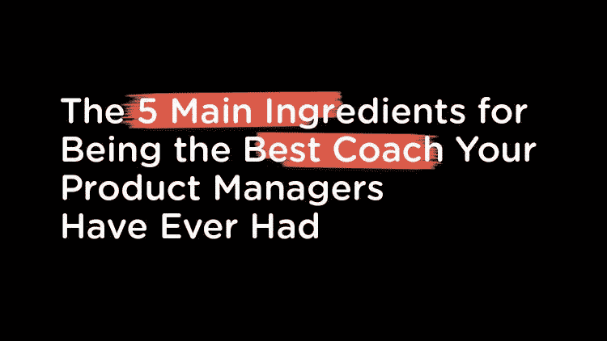
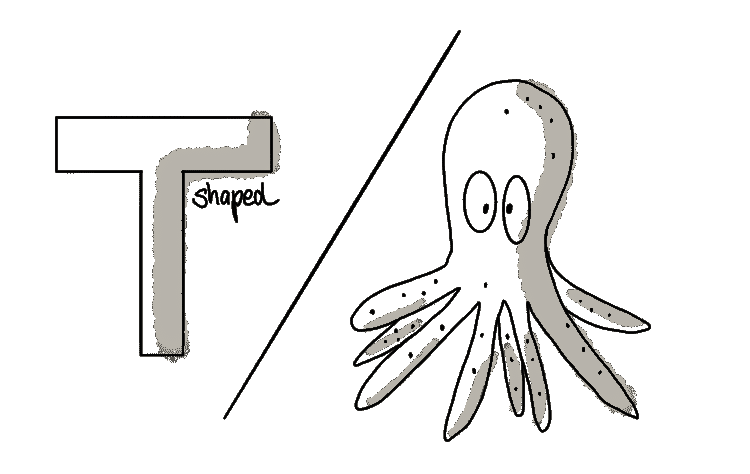
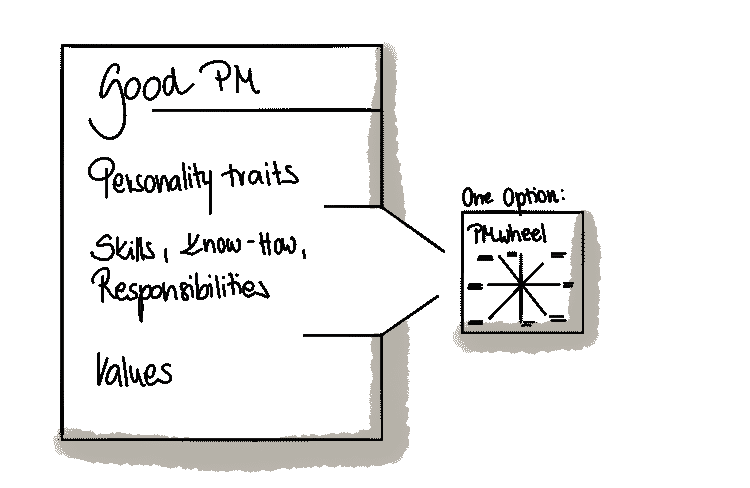
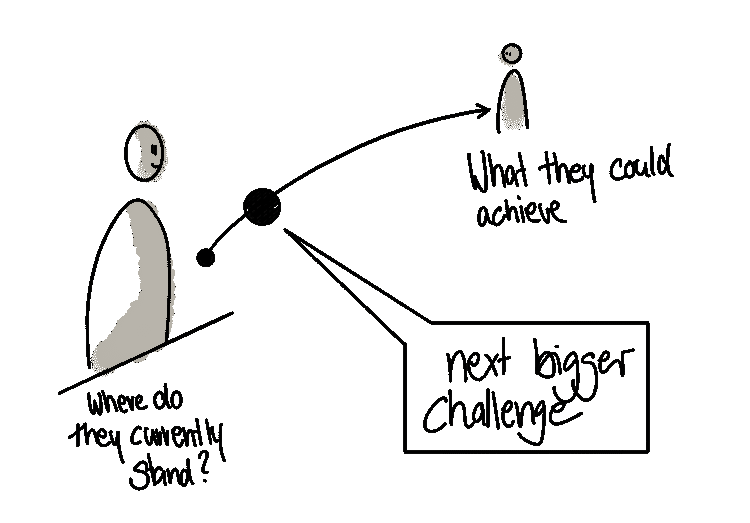
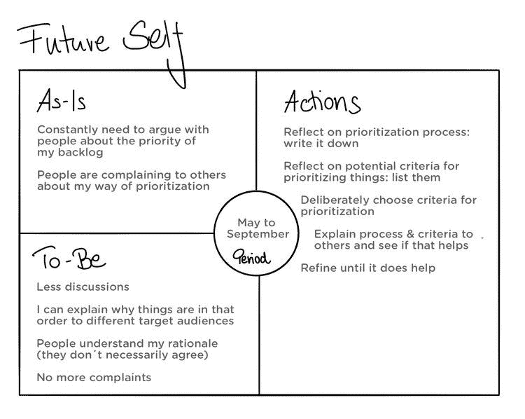

# 培养强大的产品人员——成为你的产品经理所拥有的最好的蔻驰的 5 个主要因素

> 原文：<https://medium.com/nerd-for-tech/developing-strong-product-people-the-5-main-ingredients-for-being-the-best-coach-your-product-6ba2f3749c16?source=collection_archive---------3----------------------->

这最初发表于 2021 年 1 月 24 日我的博客上

如果你还没有听说这个大新闻，我的书，*强*现在出版了。在这篇文章中，我将分享书中的一些概念。如果你发现自己想要更详细地探索这些话题，一定要看看这本书。你可以在这里订购你的副本[。](https://strongpp.link/buy-the-book)

让我们来谈谈培养产品经理的问题，不仅仅是任何产品经理，而是强有力的产品经理。我们都知道产品管理是一个非常艰难的行业，我们对我们的产品人员有很高的期望。我们希望他们善于理解并找到解决挑战性客户和业务问题的方案。我们希望他们能够制定计划，推出真正的产品。我们希望他们与跨职能团队一起开发产品，并希望他们根据他们(希望)听到的客户反馈来优化这些产品。在大多数公司中，我们希望他们以敏捷的方式完成所有这些甚至更多。

> *“虽然许多职业只要求 T 形的员工轮廓，但在产品中，我们更喜欢 8 条腿的生物。我称之为‘章鱼型’产品经理。”* [*推文本*](https://ctt.ac/Ked4f)

虽然许多职业只需要 T 形的员工档案(字母 T 上的竖线代表单一领域的专业知识，横线代表与其他领域的专家进行跨学科合作的能力)，但我们更多地是在寻找一种八条腿的生物，我称之为“章鱼形产品经理”

t 型员工档案与章鱼

根据我多年对各种产品组织的观察，产品负责人通常不会在指导团队中的产品人员方面扮演积极的角色。说到职业和个人发展，他们只是希望自己的产品经理神奇地变成这种章鱼。

七年多来，我一直在指导产品团队，帮助项目经理在他们所做的事情上变得更好，帮助他们成为这种八条腿的生物。这些年来，我发现了一些可以帮助经前综合症患者自我发展的模式。这里有五个主要因素可以帮助你提升你的人才发展游戏。

# 成分#1:你认为成为一个合格的项目经理需要什么的明确定义

这是一项艰苦的工作，但是一旦你完成了，你就可以用它很多年，只要稍加调整。

要想出你对优秀项目经理的定义，思考一下你认为一个优秀的项目经理应该具备的性格特征。列出他们应该拥有或发展的技能、知识和能力。考虑一下项目经理的一般职责。最后，列出他们应该与公司和/或团队的其他人分享的价值观。如果你很难做到这一点，你可能想看看我的 [PMwheel](https://www.strongproductpeople.com/s/2020_PM_Wheel_v04.pdf) 框架。这是一个很好的起点，但很容易根据您的具体需求进行调整。

“善的定义”

# 要素 2:清楚地知道每个 PM 今天在哪里，以及他们的下一步应该做什么

一旦你定义了一个好的项目管理，使用你的框架来评估你的团队中的每一个项目管理，看看他们处于什么位置。

接下来，你可以转换话题，关注他们的未来。您希望对团队中的每个项目经理都有一个清晰的愿景。在最好的情况下，他们能在职业生涯中取得什么成就？不要只关注他们目前的角色和公司…这需要有长远的眼光。

在您为项目经理创建了这个愿景之后，下一个问题是:您可以分配给他们的下一个更大的挑战是什么，以使他们更接近那个长期目标？

例如，可以接管一个更大的团队。你可能有一个初级的项目经理在管理一个两人的小团队，你认为他们已经准备好采取下一步行动，开始领导一个更大的团队。

一旦你决定了下一个更大的挑战，问问自己:我怎样才能帮助他们做好准备？您的答案必须根据各个项目经理的能力和差距进行调整。对于一个下午，可能是参加在线培训或阅读产品开发书籍。对于另一个项目经理来说，这可能包括将他们与有相似发展目标的学习伙伴联系起来。

接下来更大的挑战

# 成分 3:对他们将如何采取下一步行动的共同愿景

一旦你对你的项目经理有了一个愿景，你需要确保你们在同一页上，他们同意你对他们下一步的想法。有时这只需要一个简短的对话就能达成一致。

但是有时候，特别是当你认为总理离他们需要的地方很远的时候，这是一个非常困难的对话。它需要向您的项目经理提供有关其当前角色的公开和诚实的反馈。

但是作为一个产品领导者，你有责任帮助你的产品经理做得更好。如果你不给他们提供必要的反馈，这不会神奇地发生。有人称之为“严厉的爱”虽然你可能很难进行这些对话，但这是正确的做法。

> 作为一名产品领导者，你有责任帮助你的产品经理做得更好。如果你不给他们提供必要的反馈，这不会神奇地发生。” [*鸣叫本*](https://ctt.ac/NflzW)

如果你不喜欢与你的人进行艰难的对话，一定要看看我的书[强产品人](https://strongpp.link/buy-the-book) 。有整整一章是关于如何给你的同事提供反馈的。

无论讨论他们的技能差距有多难，确保你在帮助他们了解如果他们准备学习新东西，这段旅程可能会在哪里结束。与他们分享你的愿景。激励他们。帮助他们描绘一个光明的未来。

让我补充一点。为每位项目经理提出愿景时，欢迎他们的反馈。他们可能会拒绝你告诉他们的事情。很有可能你为他们设想的愿景与他们自己的愿景并不一致。所以在这些对话中要灵活。

# 成分 4:发展计划

现在是时候创建一个发展计划了，它包含了迈向我称之为“未来自我”的小而可行的步骤。你的目标是找到你的项目经理想要改进的一个主题，并帮助他们想出一些简单可行的步骤来改进。你的“好的定义”框架将帮助你们两个找到这样一个话题，所以用它来指导这些发展对话，并确保没有主题被遗忘。

一旦你确定了一个主题，比如更好地确定优先顺序，你就可以帮助你的项目经理填写未来自我模板。要了解更多关于使用未来自我模板的信息，请查看这篇博文，[一种为 PMs 创建发展计划的简便方法——未来自我](https://www.petra-wille.com/blog/a-lightweight-way-to-create-a-development-plan-for-pms-the-future-self)。

当我与项目经理一起进行未来自我练习时，我会要求他们描述他们目前的情况——他们认为自己现在有能力做什么。这些东西属于“原样”类别。

然后，我让他们描述自己的“未来”——这个人在接下来的四个月左右会如何看待自己。从“现状”到“未来”状态需要改变什么，他们可以在哪些小事情上改进？例如，如果他们的目标是提高他们的优先级技能，也许他们会尝试一种新的工具或方法来记录他们的决策。

在下面的例子中，你可以看到这个画布是多么简单而有效。它帮助一个有着“我必须在优先化方面做得更好”模糊想法的项目经理弄清楚他们想要看到的结果(“更少的讨论，更少的人抱怨”)，他们如何知道他们在这一特殊技能上有所提高(“没有更多的人抱怨”)，以及他们可以采取什么步骤来实现这一点。这就是我们所说的发展计划。

# 成分 5:承诺跟进

创建发展计划后，您需要确保该计划成为现实。因此，作为产品负责人，你需要投入时间进行定期审查，与你的项目经理一起跟踪进度。你想时不时地检查一下，看看他们是否采取了你们一起决定的行动步骤。

我强烈建议在一对一的谈话中这样做，每周一次或至少每两周一次。你会想看看你的经前综合症是否在发展。如果不能，帮助他们理解为什么不能，然后重新关注他们的优先事项。

你的经验和外部视角给他们带来了巨大的帮助和益处。即使你没有扎实的产品管理背景，你仍然可以投入一些时间来思考，“好吧，如果我是这个人的教练，我该如何帮助他们提高和表现得更好？”当你的项目经理意识到你确实关心让他们成为一名优秀的产品经理时，这将鼓励他们花时间关注自己的发展。

# 将人的发展作为优先事项的积极影响

如果你做到了所有这些，你至少可以期待四件积极的事情发生:

*   你的产品经理会觉得自己在你的团队和公司中受到真正的重视和欢迎。
*   **他们会学习，因此会倾向于留在公司，因为他们会感觉到掌控、自主和目标。每个人都喜欢新的挑战，只要它符合他们的技能水平和他们的人生或下一步职业发展的总体目标。通过提高他们的技能，随着时间的推移，他们将成为更好的产品经理。**
*   **产品将会发展**很多，因为如果产品经理变得更好，产品也会变得更好。
*   招聘变得容易多了，因为人们被吸引到那些他们知道有机会以深思熟虑的方式学习产品管理艺术的公司。

我打赌现在你们中的一些人会问，“我该怎么做？我有很多直接下属，如果我遵循这个建议，我会一整天都在做一对一的工作。”让我坦率地说。如果你不能在常规的基础上为人员开发腾出时间，你就把开发的负担完全留给了产品经理，他们将需要更长的时间来改进。而你的产品组织也将保持平庸。

> “如果你不能定期为员工开发留出时间，你就把开发的重担完全交给了产品经理，他们需要更长的时间来改进。” [*鸣叫本*](https://ctt.ac/asTmf)

因此，留出一些时间来关注人员发展主题。以下是如何做到这一点的回顾:

*   定义你认为一个好的项目经理应该具备的能力
*   **思考你团队中的每个人**并回答这些问题:
*   —与我对优秀项目经理的定义相比，他们现在处于什么位置？
*   —他们将来会变成什么样(你对他们的愿景)？
*   —为了让他们更接近这一愿景，我能给他们安排的下一个更大的挑战是什么？
*   **与你的员工分享你的愿景**并就这一愿景的共同版本达成一致
*   **帮助他们制定发展计划**，其中包含要执行的可行任务
*   **定期跟进，支持他们的自我发展之旅**

最后，考虑一下赛斯·戈丁的这句话，我稍微做了些修改:“描绘他们的未来。去那里，人们就会跟来。”

我知道我们已经谈了很多。如果你想更详细地探究这些话题中的任何一个(或者只是想要一本方便的指南供你将来参考)，一定要看看我的书《T21》。它包含了很多可行的建议和模板，可以帮助你培养你的产品人员。