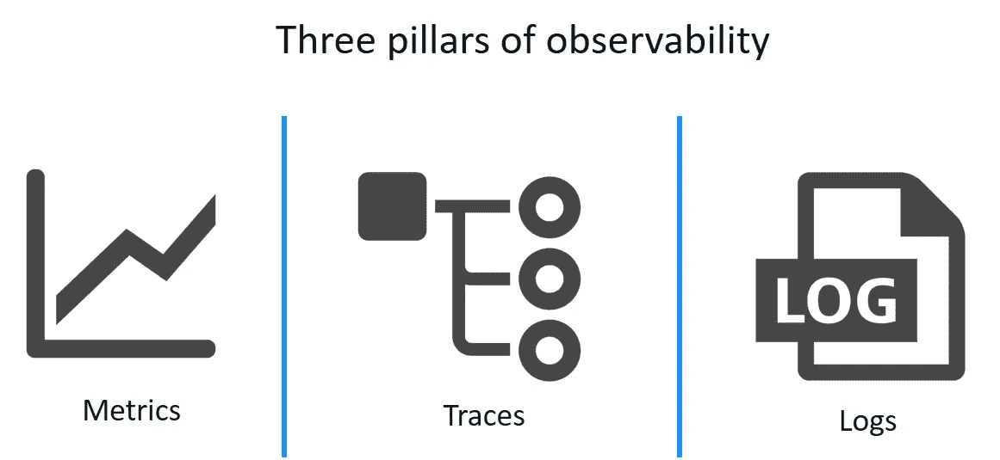
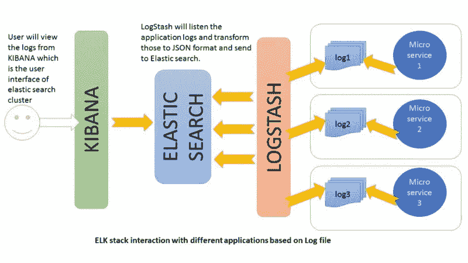
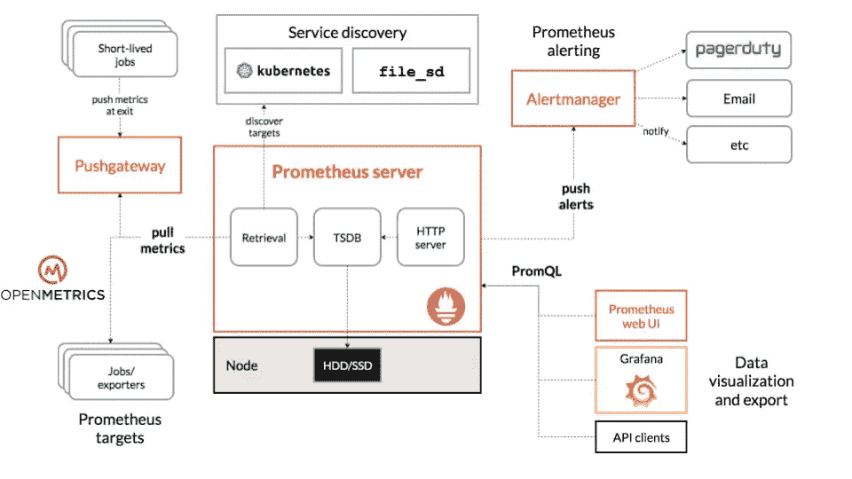
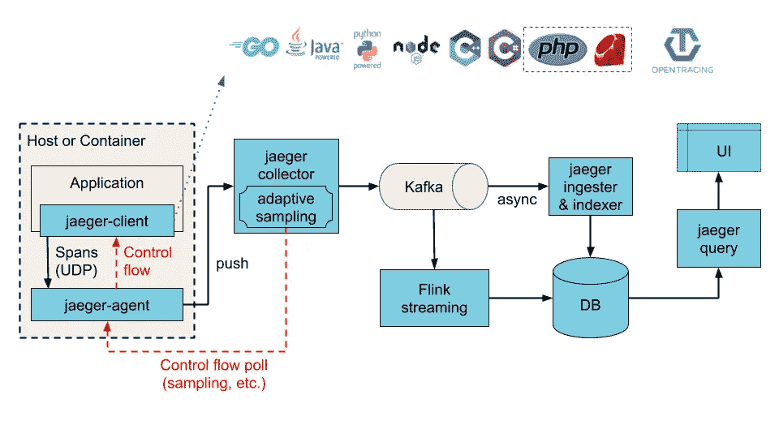

# 发展根据系统的外部输出推断系统内部状态的能力

> 原文：<https://medium.com/nerd-for-tech/developing-the-ability-to-infer-internal-states-of-a-system-based-on-the-systems-external-outputs-16c0a389fb37?source=collection_archive---------21----------------------->

> 即使您编写了完美的代码，一个节点可能会失败，一个连接可能会超时，或者参与的服务器可能会任意操作。能够在问题影响到客户或您组织的声誉之前尽快识别并解决问题是一种竞争优势。可观察性是将这一挑战的影响最小化的解决方案。在本文中，我们将讨论可观察性的三个支柱，展示开源解决方案来开始您的知识之旅。


行动中的可观察性-从[导联 Dev](https://leaddev.com/monitoring-observability/observability-scale) 提取

# 可观察性

创建、开发和部署软件产品的最大挑战之一是异构环境。当您的系统是分布式的时，有些事情可能会出错。即使您编写了完美的代码，一个节点可能会失败，一个连接可能会超时，或者参与的服务器可能会任意操作。能够在问题降低整个系统的性能之前尽可能快地识别和修复问题可以成为一种竞争优势。可观察性是将这一挑战的影响最小化的解决方案。

Honeycomb 在它的[实现可观察性指南](https://www.honeycomb.io/wp-content/uploads/2018/07/Honeycomb-Guide-Achieving-Observability-v1.pdf)中，将可观察性描述为在不事先知道你想问什么的情况下，请求关于你的生产环境的随机问题的能力。我们将可观察性理解为从外部可视化系统功能的能力。一个可观察的系统提供所有你需要的实时信息，以解决你对一个系统可能有的任何日常困境。

需要强调的是，监控和可观察性是不同的概念。 [New Relic](https://newrelic.com/resources/ebooks/what-is-observability) 定义了监控为软件团队提供工具，收集关于他们系统的数据，并允许他们在出现错误和问题时快速响应。实践可观测性是跨越概念、工具和最佳实践的更广泛的实现领域。可观察性的三个支柱是日志、指标和跟踪。在本文中，我们将分别讨论这三个方面，展示开源解决方案，开始您的知识之旅。



从[动态跟踪](https://www.dynatrace.com/news/blog/how-to-get-the-answers-you-deserve-using-the-three-pillars-of-observability/)中检索

# 日志

日志文件是记录操作系统或正在运行的软件中发生的事件的文档。记录是保存日志的行为。这使得开发人员能够理解代码在做什么以及工作流程是怎样的。 [ELK stack](https://www.elastic.co/pt/what-is/elk-stack) (Elasticsearch，Logstash e Kibana)是三个开源软件的集合，有助于提供实时见解。



从[免费代码营](https://www.freecodecamp.org/news/how-to-use-elasticsearch-logstash-and-kibana-to-visualise-logs-in-python-in-realtime-acaab281c9de/)取回

我们将使用 ELK 栈为 python 代码介绍一个简单的实现。在实际系统中，有必要预先分析将要产生的大量数据，以定义一个用于大规模测井的[有效结构](https://packetrevolt.com/2017/08/large-scale-logging-with-elk-lessons-learned-part-1/)。

```
import logging
import random

logging.basicConfig(filename="logFile.txt",
                    filemode='a',
                    format='%(asctime)s %(levelname)s-%(message)s',
                    datefmt='%Y-%m-%d %H:%M:%S')
for i in xrange(0,15):
    x=random.randint(0,2)
    if(x==0):
        logging.warning('Log Message')
    elif(x==1):
        logging.critical('Log Message')
    else:
        logging.error('Log Message')
```

在 Python 中，可以在 5 个不同的级别进行日志记录，每个级别分别指示事件的类型。它们是:信息、调试、警告、错误和关键。为了设置 [Elasticsearch](https://www.elastic.co/downloads/elasticsearch) 、 [Logstash](https://www.elastic.co/downloads/logstash) 和 [Kibana](https://www.elastic.co/downloads/logstash) 我们应该首先从它们各自的链接下载这三个开源软件。解压文件，并把它们都放在项目文件夹中。在单独的终端中运行以下命令:

```
$ bin\kibana
   (...)$ bin\elasticsearch
   (...)
```

检查服务是否正在运行打开 **localhost:5621** 和 **localhost:9600** *。*在启动 Logstash 之前，创建一个配置文件，其中指定了输入文件、输出位置和过滤方法的详细信息。看看**滤镜{grok{…}}** 行。这是一个 [Grok](https://logz.io/blog/logstash-grok/) 滤镜插件。Grok 是将非结构化日志数据解析成结构化和可查询数据的好方法。

```
input{
 file{
 path => "full/path/to/log_file/location/logFile.txt"
 start_position => "beginning"
 }
}
filter
{
 grok{
 match => {"message" => "%{TIMESTAMP_ISO8601:timestamp} %{LOGLEVEL:log-level}-%{GREEDYDATA:message}"}
 }
    date {
    match => ["timestamp", "ISO8601"]
  }
}
output{
 elasticsearch{
 hosts => ["localhost:9200"]
 index => "index_name"}
stdout{codec => rubydebug}
}
```

现在将文件保存在 Logstash 文件夹中，并启动 Logstash 服务。

```
$ bin\logstash –f logstash-simple.conf
```

# 韵律学

指标是数据的数字表示，可用于确定一段时间内服务或组件的整体行为。度量由一组属性组成，这些属性携带关于[SLA、SLO 和 sli 的信息。](https://cloud.google.com/blog/products/gcp/sre-fundamentals-slis-slas-and-slos)与记录特定事件的事件日志不同，指标是从系统性能得出的测量值。 [Prometheus](https://github.com/prometheus/prometheus) 是一个用于服务和应用程序的监控系统和基于时间的数据库。它以一定的时间间隔收集您的目标指标，评估规则，还可以触发警报。Prometheus 支持结合使用[仪器](https://prometheus.io/docs/instrumenting/clientlibs/)和[导出器](https://prometheus.io/docs/instrumenting/exporters/)。在几个导出器中，我们可以突出[节点导出器](https://github.com/prometheus/node_exporter)。这用于监控主机硬件和内核指标。



*普罗米修斯建筑图——摘自* [*格拉法纳*](https://grafana.com/blog/2019/07/09/whats-new-and-whats-next-in-prometheus/)

你可以发射一个普罗米修斯容器进行试验。对于真实的系统，一个更健壮和[可扩展的解决方案](https://github.com/cortexproject/cortex)会更合适。运行后，它将在 **localhost:9090** 处可达

```
$ docker run --name prometheus -d -p 127.0.0.1:9090:9090 prom/prometheus
```

Prometheus Node Exporter 是一个单一的静态二进制文件，下载并解压缩后，就可以在您的主机上运行:

```
$ wget https://github.com/prometheus/node_exporter/releases/download/v*/node_exporter-*.*-amd64.tar.gz
$ tar xvfz node_exporter-*.*-amd64.tar.gz
$ cd node_exporter-*.*-amd64
$ ./node_exporter
```

启动后，您应该会看到如下输出，显示端口 9100 上的指标:

```
# HELP go_gc_duration_seconds A summary of the GC invocation durations.
# TYPE go_gc_duration_seconds summary
go_gc_duration_seconds{quantile="0"} 3.8996e-05
go_gc_duration_seconds{quantile="0.25"} 4.5926e-05
go_gc_duration_seconds{quantile="0.5"} 5.846e-05
# etc.
```

Prometheus 实例需要正确配置才能访问节点导出器指标。下面的 prometheus.yml 示例[配置文件](https://prometheus.io/docs/prometheus/latest/configuration/configuration/)将告诉 prometheus 实例从节点导出器中进行抓取，以及抓取的频率。

```
global:
  scrape_interval: 15sscrape_configs:
- job_name: node
  static_configs:
  - targets: ['localhost:9100']
```

您可以启动它，使用`--config.file`标志指向您在上面创建的 Prometheus 配置。

# 描摹

分布式跟踪是一种观察和理解微服务之间整个事件链的方法。在这种类型的架构中，应用程序中的单个调用可以调用彼此交互的不同服务。当错误发生或者请求很慢时，开发人员和工程师如何隔离问题？我们需要找到追踪所有联系的方法。正是在这种情况下，跟踪开始发挥作用。 [Jaeger](https://github.com/jaegertracing/jaeger) 是追踪分布式服务间交易的开源软件。它使用分布式跟踪来跟踪跨不同微服务的请求路径。



*以卡夫卡为中间缓冲的建筑图解——摘自* [*耶格*](https://www.jaegertracing.io/docs/1.22/architecture/)

启动 e 最简单的方法是使用发布到 DockerHub 的预建映像。在实际解决方案中，使用 [Kubernetes](https://github.com/jaegertracing/jaeger-operator) 研究更强大解决方案的使用。

```
$ docker run -d --name jaeger -p 16686:16686 -p 6831:6831/udp jaegertracing/all-in-one:1.9
```

它支持代码检测的 [OpenTracing](https://opentracing.io) 标准。一旦安装完毕，它会将数据发送给 Jaeger，Jaeger 会在一个简单的用户界面中显示这些数据。

```
import sys
import time
import logging
import random
from jaeger_client import Config
from opentracing_instrumentation.request_context import get_current_span, span_in_context

def init_tracer(service):
    logging.getLogger('').handlers = []
    logging.basicConfig(format='%(message)s', level=logging.DEBUG)    
    config = Config(
        config={
            'sampler': {
                'type': 'const',
                'param': 1,
            },
            'logging': True,
        },
        service_name=service,
    )
    return config.initialize_tracer()

def booking_mgr(movie):
    with tracer.start_span('booking') as span:
        span.set_tag('Movie', movie)
        with span_in_context(span):
            cinema_details = check_cinema(movie)
            showtime_details = check_showtime(cinema_details)
            book_show(showtime_details)

def check_cinema(movie):
    with tracer.start_span('CheckCinema', child_of=get_current_span()) as span:
        with span_in_context(span):
            num = random.randint(1,30)
            time.sleep(num)
            cinema_details = "Cinema Details"
            flags = ['false', 'true', 'false']
            random_flag = random.choice(flags)
            span.set_tag('error', random_flag)
            span.log_kv({'event': 'CheckCinema' , 'value': cinema_details })
            return cinema_details

assert len(sys.argv) == 2
tracer = init_tracer('booking')
movie = sys.argv[1]
booking_mgr(movie)
# yield to IOLoop to flush the spans
time.sleep(2)
tracer.close()
```

# 结论

当您的系统是分布式的时，有些事情可能会出错。在问题改变整个系统的性能或影响客户或您组织的声誉之前，能够尽快识别并修复问题是非常重要的。可观察性是将这一挑战的影响最小化的解决方案。它可以分为三大支柱。这些是日志、指标和跟踪。在本文中，我们展示了三个支柱中的每一个，展示了将帮助您开始知识之旅的开源解决方案。实践可观察性有助于你提高对产品的理解。