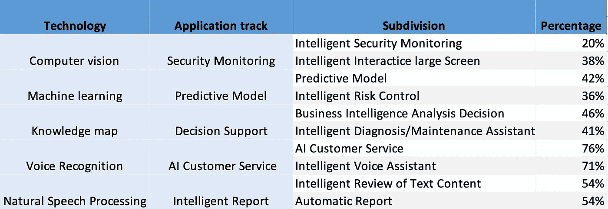

# 2021 年中国人工智能应用市场发展趋势

> 原文：<https://medium.com/nerd-for-tech/development-trend-of-chinas-artificial-intelligence-application-market-in-2021-c1de2f58f07f?source=collection_archive---------4----------------------->

# **中国人工智能技术转化和应用将推动企业收入增长**

## **1。公司专注于人工智能自研究能力以推动收入增长**

从已经应用 AI 项目的企业来看，61%的企业选择了独立的 R&D 路径。40%的企业选择使用 AIPD/SDK 来适配第三方 AI 平台，进行产学研合作。

31.7%的企业使用开源技术。26.8%的企业委托第三方公司提供解决方案。而 17.1%的企业委托外部专业 AI 公司研发的为 17.1%。

基于 AI 项目的实施，97.6%的企业 AI 转型带动了企业营收增长。34.1%的公司认为 AI 技术应用可以增加 5%的收入。4.9%的企业营收增长可以达到 20%到 50 %。人工智能项目的实施可以在收入增长中发挥至关重要的作用。

## **2。计算机视觉是目前领先的应用技术**

目前企业最常用的 AI 项目技术是计算机视觉，占比 63.4%，其次是机器学习，占比 58.5%，然后是知识图谱，占比 56.1%。

不同 AI 技术的企业应用典型适用场景逐渐显现。计算机视觉的应用场景主要是安防监控和大屏幕交互式语音识别。其中 AI 客服系统和智能语音助手的购买率超过 70%。自然语言处理主要用于智能审核和报表生成。

知识图主要用于决策辅助和智能诊断场景。机器学习的应用场景比较分散。且预测模型和智能风控的选择率相对较高。

计算机视觉和机器学习仍将是未来三年的重点应用技术之一，但将分别以 48.8%和 46.3%的比例回落至第二和第三位。深度学习以 53.7%的百分比排名第一。

## **3。出国计划**

近年来，由于区域经济的巨大潜力和消费互联网产业的蓬勃发展，东南亚成为许多中国企业走向海外的第一站。小语种的优势将为海外 AI 应用的小语种场景提供数据基础。

## 4.定制数据集

随着 AI 商业化进程的加快，以及辅助驾驶、客服聊天机器人等 AI 技术在各行各业的应用，人们对特殊场景下的数据质量的期望越来越高。高质量的标签数据将是人工智能公司的核心竞争力之一。

如果说之前的算法模型使用的一般数据集是粗粮，那么算法模型目前需要的是定制的营养餐。如果公司想要进一步提高某些模型的商业化，他们必须逐步从通用数据集向前发展，以创建独特的数据集。

# NLP 服务

我们在电子商务、零售、搜索引擎、社交媒体等领域提供不同类型的自然语言处理。我们的服务包括语音分类、情感分析、文本识别和文本分类(聊天机器人相关性)。

ByteBridge 与全球 30 多个不同的语言社区合作，现在提供[数据收集和文本注释服务](https://tinyurl.com/4636f6yc)，涵盖**英语、中文、西班牙语、韩语、孟加拉语、越南语、印度尼西亚语、土耳其语、阿拉伯语、俄语等语言**。

# 结束

将你的数据标注任务外包给 [ByteBridge](https://tinyurl.com/4636f6yc) ，你可以更便宜更快的获得高质量的 ML 训练数据集！

*   无需信用卡的免费试用:您可以快速获得样品结果，检查输出，并直接向我们的项目经理反馈。
*   100%人工验证
*   透明和标准定价:[有明确的定价](https://www.bytebridge.io/#/?module=price)(包括人工成本)

为什么不试一试？

来源:http://www . myza ker . com/article/613 f1 fcb 8 e9f 0932 c 351 e 601