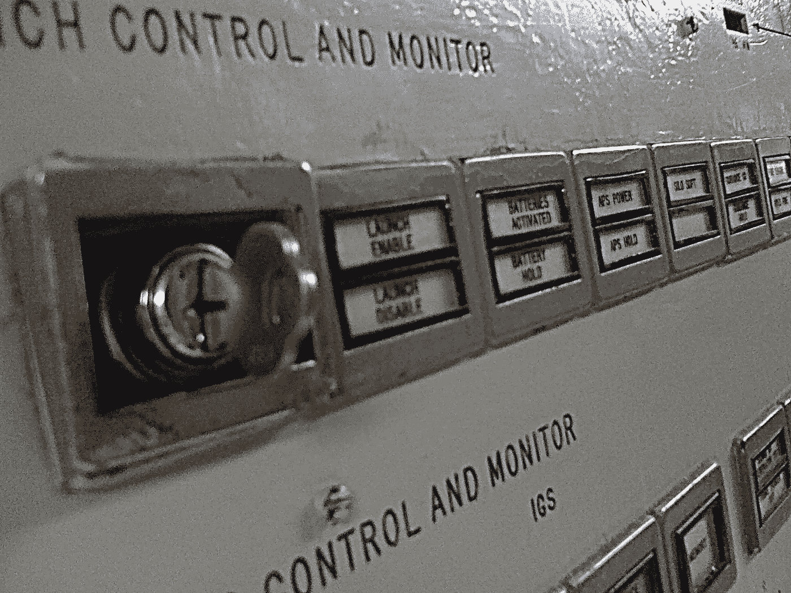

# 职责分工和职责分离

> 原文：<https://medium.com/nerd-for-tech/devops-and-segregation-of-duties-8383f8cf7c7d?source=collection_archive---------14----------------------->

## 这取决于你对“职责”的定义

照片由 [Flickr](https://www.flickr.com/photos/jkbrooks85/4308409747/sizes/l/) 上的[James Brooks](https://www.flickr.com/photos/jkbrooks85/)([CC BY 2.0](https://creativecommons.org/licenses/by/2.0/legalcode))

当我向客户介绍 DevOps 的文化时，这个问题几乎总是会出现。在我谈到负责设计、开发、构建、部署和运行他们自己的应用程序的跨职能 DevOps 团队之后，他们总是会问:“当开发人员有权使用产品时，您如何实现职责分离？”一想到给开发者那么大的权力，顾客们就闭上了嘴。我不责怪他们，你不应该让你团队中的任何人在没有适当的检查和平衡的情况下将代码推向生产，就像你将未经测试的代码推向生产一样。(…你不会那样做的，是吗？)

这就是拥有一个自动化的持续集成和持续交付(CI/CD)管道提供了运行测试和扫描漏洞的机会，并添加了在任何东西进入生产之前必须通过的其他关卡，而不管是谁请求的。问题是，这些自动门没有一个能检测出邪恶的代码。这需要更聪明的东西，直到我们有人工智能可以检测到这一点——我们最终会的——我们需要让人类参与进来。

## 职责分离的真正含义是什么？

职责分离与不让开发人员接触产品无关。职责分离是指对生产中的一切进行第二次监督，这样就没有人能破坏系统。这就是为什么发射核导弹有两个物理钥匙，为什么钥匙孔之间的距离比人体可能达到的距离更远。它确保至少有两个人同意发射洲际弹道导弹并冒着热核战争的风险是一个好主意。(…让这种想法持续一段时间)

## 传统解决方案局限性太大

许多公司做的第一件事是假设“职责”等于“工作角色”，所以他们限制开发人员对产品的访问，只允许操作人员访问。但这只会减慢速度。有些可能只允许开发人员使用 CI/CD 管道部署到生产环境，然后他们进一步限制开发人员修改任何管道定义，作为额外的预防措施。

这种方法一直有效，直到两名操作人员决定破坏这个系统。然后呢？也许我们只给操作人员一半的密码，就像核钥匙一样，这样就需要两个人才能改变一些东西。当然，我是在开玩笑，但你会认为工作角色与限制坏演员的风险无关。

## 这不是开发人员对运营人员…这是请求者对批准者

职责分离中的“职责”不一定是职位。它只是必须是一个不同的演员。请求做某事的人不能是批准该行动的人。真的就这么简单。

做到这一点的方法之一是遵循以下三个简单的规则，采用类似“GitOps”的实践:

1.  除非签入 GitHub，否则生产中不会发生任何变化
2.  没有 Pull 请求，GitHub 中的主干分支不会被合并
3.  拉式请求不能被创建者批准

这才是你真正需要的。您可以拥有真正跨职能的 DevOps 团队，他们设计、编码、构建、部署和运行所有他们自己的工作，并且仍然具有职责分离，其中每个拉取请求都是由请求者之外的人进行代码审查和批准的机会。

## 结论

使用这种工作流程，无论变更是来自跨职能的 DevOps 团队、专门的开发团队还是专门的运营团队，每个变更在获得批准之前都会被其他人看到。瞧……与 DevOps 的职责分离！