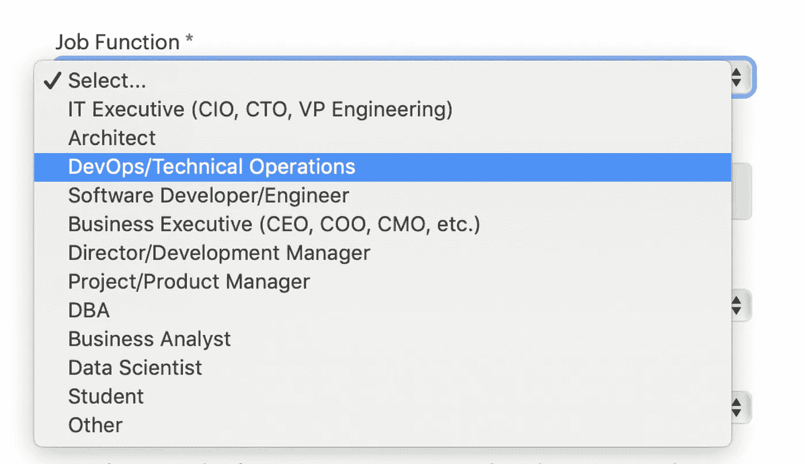

# DevOps 工程师是新的系统管理员

> 原文：<https://medium.com/nerd-for-tech/devops-engineer-is-the-new-sysadmin-5bc46b86d413?source=collection_archive---------0----------------------->

## 如果你不做开发…你只是做运营

来自一家公司的实际工作选择下拉列表，该公司认为 DevOps 是运营部门的工作

DevOps 工程师似乎是一个引起相当多困惑的职位名称。也许这是因为它是一种反模式。显然，很多公司认为他们可以雇佣某人，然后突然变成 DevOps。他们想“改变”却没有真正改变任何东西！(除了把“SysAdmin”的头衔改为“DevOps 工程师”)。；-)

现实是 DevOps 不是一个职称。这不是一个人或一个团队的事情。这是一种组织规模的文化变革。它是开发和操作工程师在整个软件生命周期中一起工作的实践，希望在同一个团队中，遵循精益和敏捷原则，允许他们稳定和连续地交付高质量的软件。它始于学习如何以不同的方式工作，并拥抱以开放、透明和信任为支柱的跨职能团队。如果这听起来不像你的公司，那么你可能没有实践 DevOps。

# 这是怎么发生的？

对于许多公司来说，这是一个令人悲哀的现实。我看到 DevOps 工程师的招聘信息，其中描述了基本上是系统管理员的工作，外加运行 CI/CD 管道或自动化基础架构部署的责任。给你一个提示:如果你申请了 DevOps 的工作，而你的团队不做开发，那就不是 DevOps，因为 DevOps 是**Dev**elopment+**Op**operation**s**。即“*你构建它，你运行它*”。如果别人建立了它，而你在运行它，那么你只是在做 Ops(或者站点可靠性工程)。在一家真正实施 DevOps 的公司中，不应该有独立的开发和运营团队，只有一个跨职能团队，由一组专注于为客户提供价值的指标驱动。

> 开发运维是要打破孤岛，而不是增加新的孤岛。

混乱的部分原因是因为很多实践在 2009 年的时候一起形成了 DevOps 运动。文化变革是这场运动的核心。你受到了精益制造、敏捷开发和规划、持续集成和持续交付、测试驱动开发、行为驱动开发、云原生微服务架构、基础设施即代码、不可变运行时等的影响。所有这些新的实践和方法都带来了新的工具和技术来支持它们。

# **工具不会修复你破碎的文化**

当公司为 DevOps 工程师创建职位招聘时，他们最想要的是理解这些新工具的运营人员。公司不明白工具不能修复他们破碎的文化。他们实际上满足于有人为开发人员管理管道，而开发人员学习如何建立自己的管道并管理它们会更有效率。因此，开发人员不再把他们的破代码扔给运营部门，而是扔给可怜的 DevOps 工程师，他试图用这些代码制作工作管道，然后把工作交给运营部门。对开发人员有利…对运营人员有利…对开发人员工程师不利。

如果一个公司想要采用 DevOps，并且他们认为开发人员会继续他们多年来的工作方式，那么这个公司将永远不会成为 DevOps。因为 DevOps 要求 dev 改变工作方式，Ops 改变工作方式。it 最不需要的是一个新团队来保护开发人员不受运营人员的影响，同时他们继续在各自的孤岛中工作。

# **打破筒仓**

采用 DevOps 文化的主要原因之一是打破孤岛。因此，如果你工作的公司仍然有一些与移交相关的孤岛，(或者更糟糕的是，他们在开发和运营之间创建了第三个孤岛，称为“DevOps 团队”)，他们就没有实践 DevOps。DevOps 团队对他们提交、构建、测试、部署、维护、操作的一切都负有端到端的责任！当然，有不同的方法来实现这一点，但是“你构建它，你运行它”的口号是 DevOps 的*核心*。

# 结论

DevOps 工程师的职称与 DevOps 运动几乎没有共同之处。我想你会发现，如果你把任何一个 DevOps 工程师的工作头衔改成系统管理员，并阅读描述，它可能仍然完全符合。也许他们应该找一个自动化工程师。但是不要把自动化和开发混淆了。自动化是 DevOps 理念的一部分，但它只是其中的一部分。采用自动化而不将您的文化转变为信任、透明和快速反馈循环的 DevOps 心态，这仍然只是实现自动化。我发现 DevOps 工程师职位几乎总是一个没有开发人员的纯运营职位。

我这么说是出于对那些拥有“开发工程师”头衔的人的尊重。你所做的工作至关重要，你所拥有的技能是无限有价值和受欢迎的，但是如果你工作的公司把你放在 DevOps 团队中，他们就没有实践 DevOps。请记住，DevOps 是要打破孤岛，而不是创建新的孤岛。