# DevOps 项目

> 原文：<https://medium.com/nerd-for-tech/devops-project-b0e6fa278b3a?source=collection_archive---------14----------------------->

# 创建多级管道并使用构建管道插件进行查看

项目链接= >【https://github.com/AbhishekYuvi/SampleWebApp 

第一步

在你的系统上安装 Git，Jenkins，Tomcat，Ant。

第二步

*   在 c 盘创建“gitworkspace”文件夹

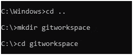

*   在 gitworkspace 中，从 github 克隆存储库

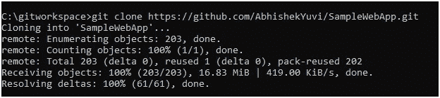

*   使用“dir”进行检查

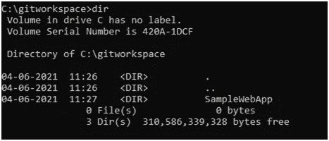

第三步

创建一个提取代码的作业

*   管理 Jenkins->管理插件-> github->无需重启安装。

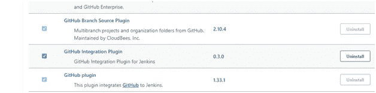

*   新工作-> github 拉->自由式项目->确定

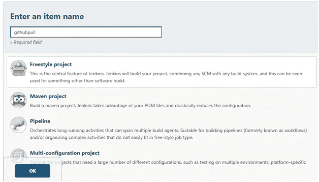

*   Github pull->配置->常规->高级->使用自定义工作区

`${JENKINS_HOME}/workspace/samplewebapp`

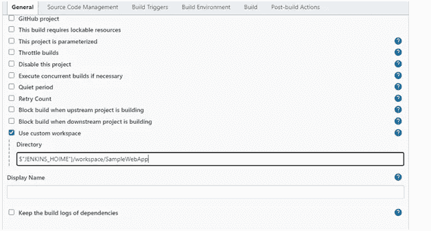

*   SCM-> git->复制 github repo url 并粘贴

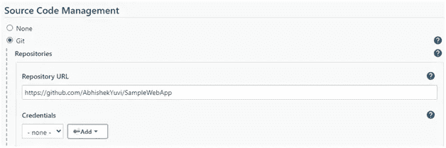

第四步

持续构建->构建、代码评审和发布结果

*   管理 Jenkins->管理插件-> Ant 和警告下一代插件。

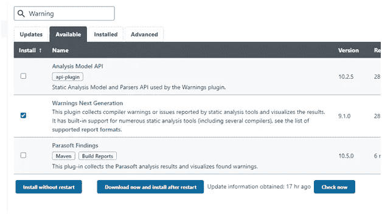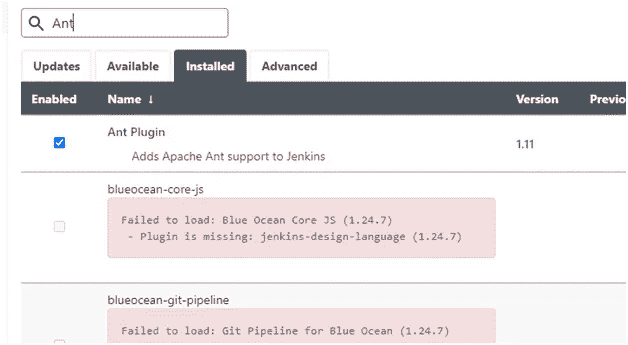

*   新项目->构建和代码审查->自由格式项目->确定

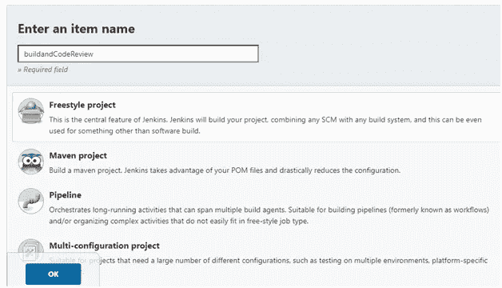

*   常规->高级->使用自定义工作空间

`${JENKINS_HOME}/workspace/samplewebapp`

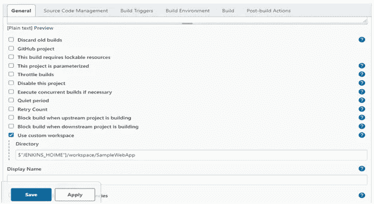

*   SCM-> git->从 github 粘贴 Samplewebapp 的 URL

*   构建->调用 ant

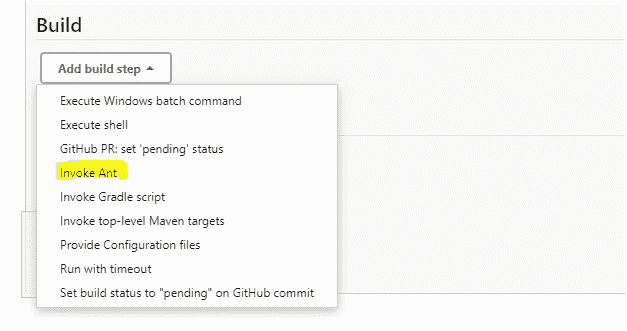

*   后期生成操作->发布结果分析-> checkstyle_error.xml->保存

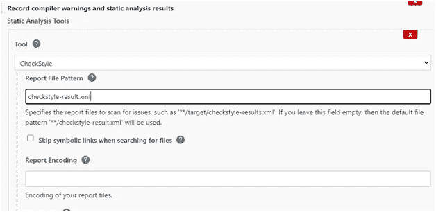

第五步

持续测试——运行测试并发布 JUNIT 测试报告

*   安装 Junit 实时测试报告程序插件

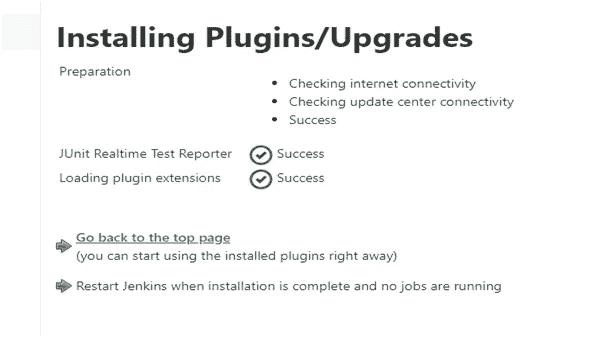

*   新项目->单元测试->自由式项目->确定

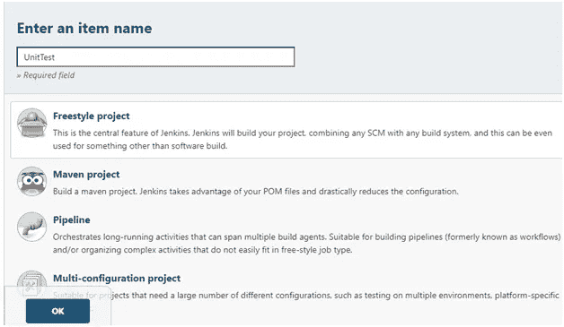

*   常规->高级->使用自定义工作空间

`${JENKINS_HOME}/workspace/samplewebapp`

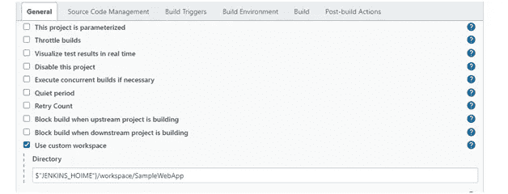

*   SCM-> git->从 github 粘贴 URL

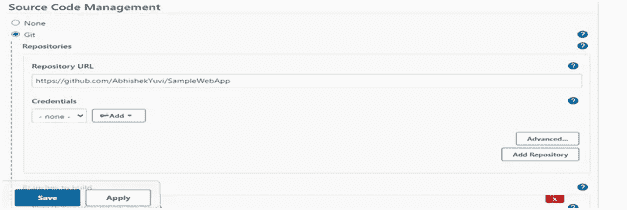

*   构建->调用 Ant

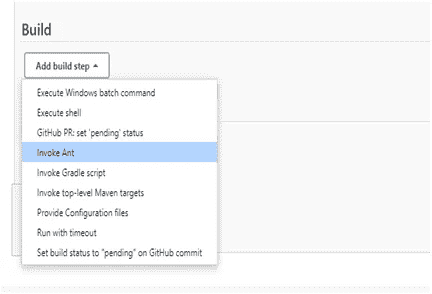

*   后期构建操作->发布 Junit 测试结果->测试计算器->保存

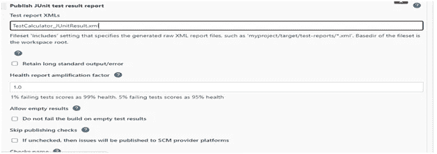

第六步

设置新的部署服务器

转到 Tomcat/conf/server.xml(在您的系统上)

连接器端口“8090”

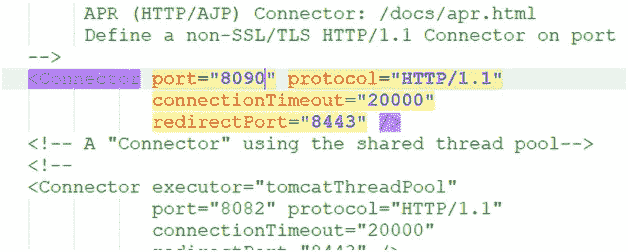

*   转到 Tomcat/conf/tomcat-users.xml

*<user . name = " admin " password = " admin " roles = " manager-GUI，manager-script，admin"/ >*

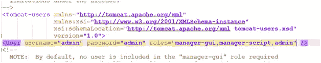

第七步

持续部署将代码部署到生产环境中

*   安装“部署到容器”插件

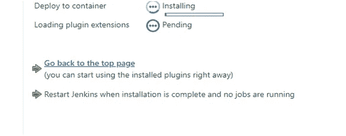

*   新建项目->部署->自由格式项目->确定

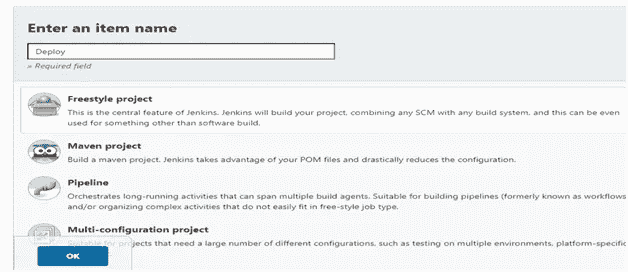

*   常规->高级->使用自定义工作空间

`${JENKINS_HOME}/workspace/samplewebapp`

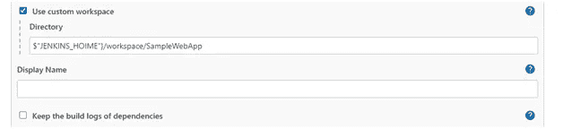

*   SCM-> git->从 github 粘贴 URL

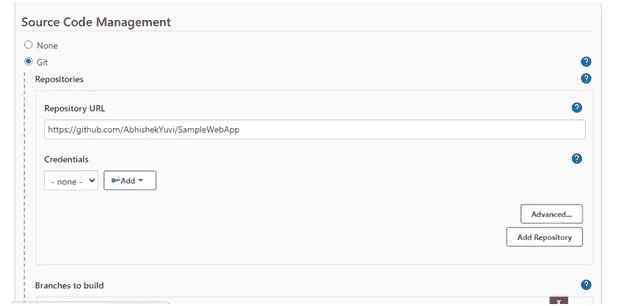

*   构建->调用 Ant，目标- WAR

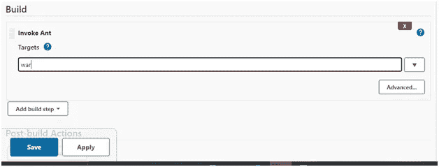

*   后期生成操作->将 war/ear 部署到容器(war/ear 文件)

添加容器-> Tomcat 9.0

网址:-[https://localhost:8090](https://localhost:8090)->保存

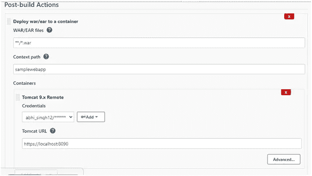

停止并启动 Tomcat 9。exe 文件

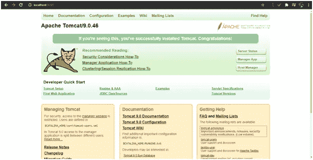

第八步

*   安装“构建管道”插件

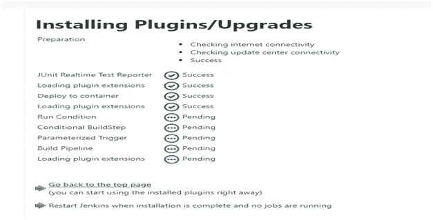

*   转到 Githubpull->配置->后期生成操作-生成其他项目-> BuildandCodeReview->保存

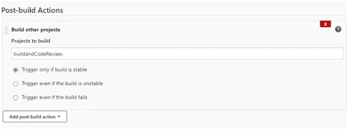

*   转到 buildanddereview->配置->后期生成操作->生成其他项目->单元测试->保存

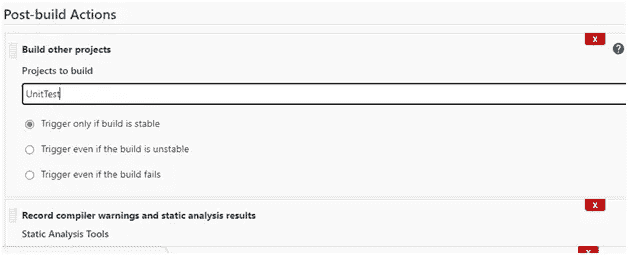

*   转到单元测试->配置->后期生成操作-生成其他项目->部署->保存

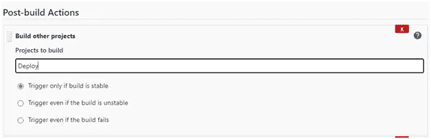

*   点击“+”->完成管道->构建管道视图->确定

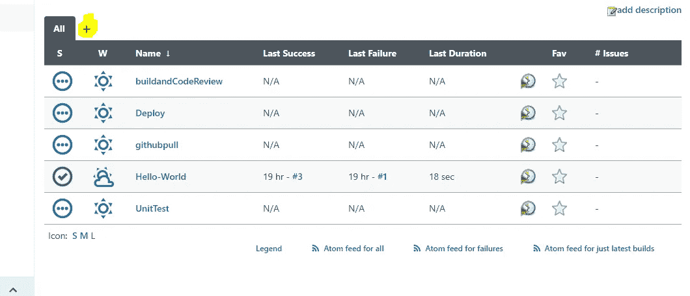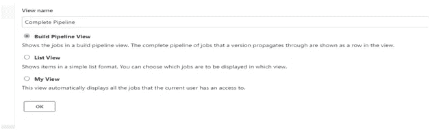

*   选择初始作业-> Githubpull->确定

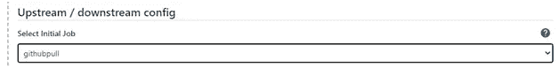

*   转到 Githubpull->配置->轮询 SCM-> * * * * *

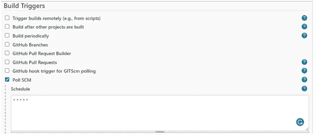

*   您将被重定向到您的管道视图。

绿色:执行完毕，蓝色:尚未开始，黄色:正在执行，红色:失败

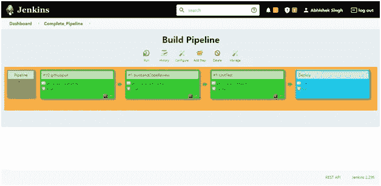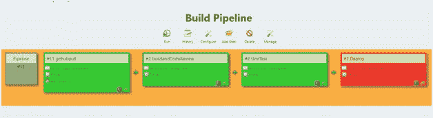