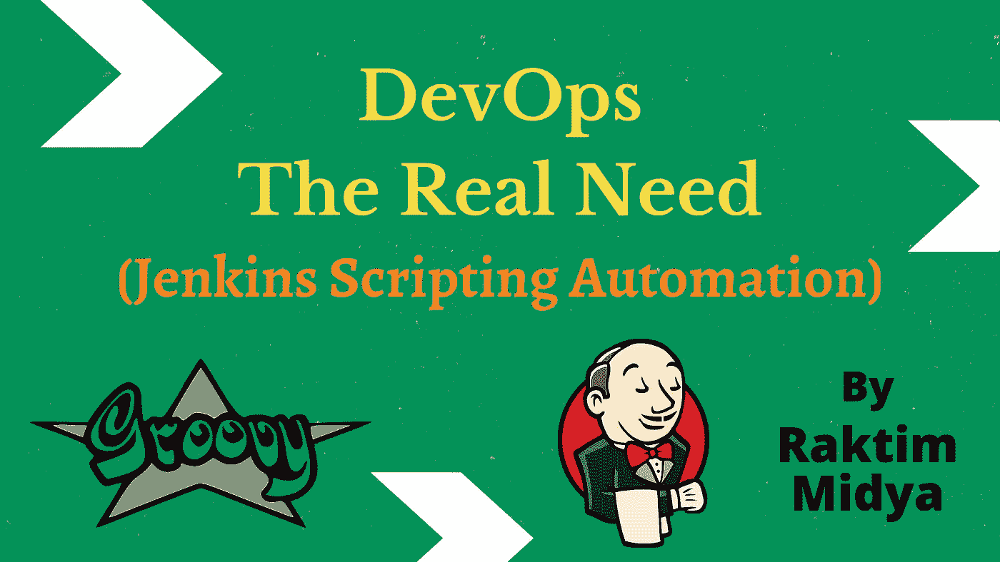
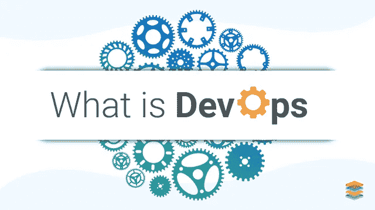
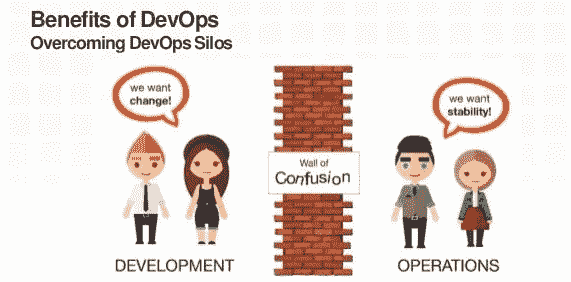
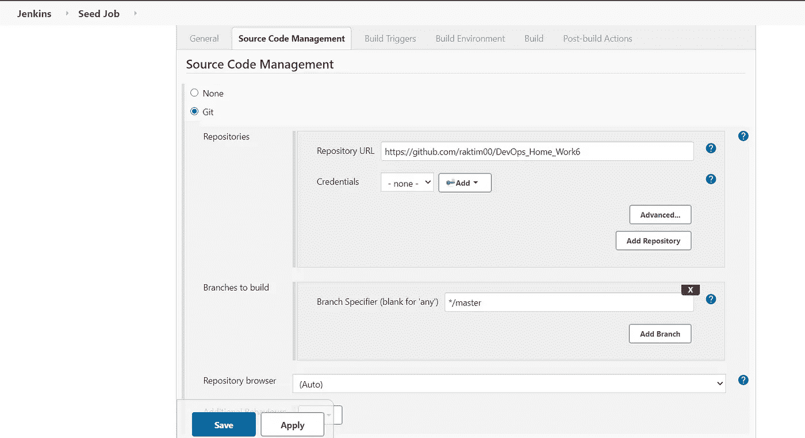
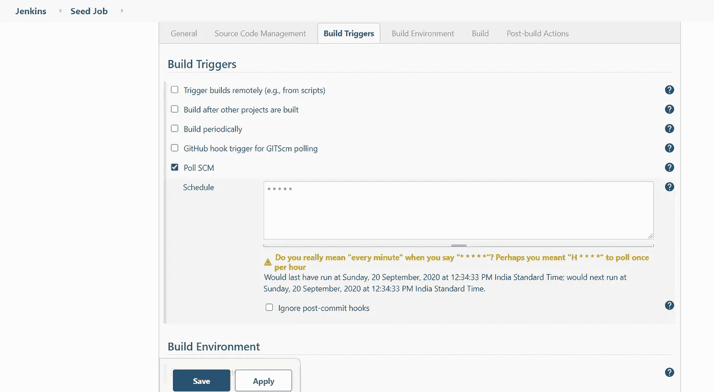
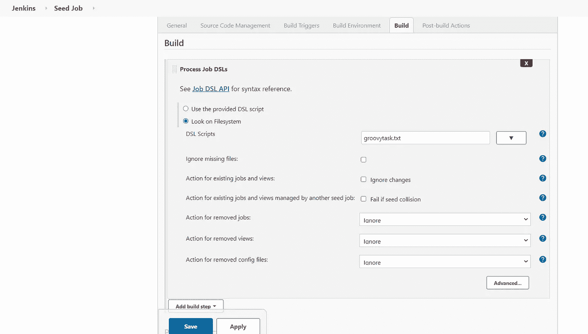
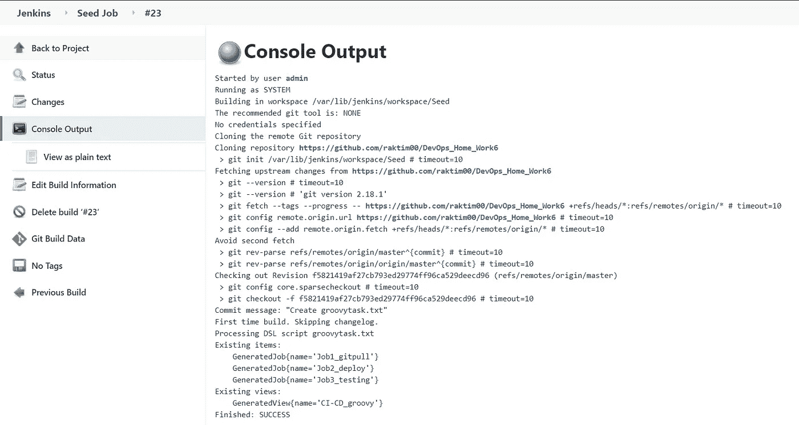
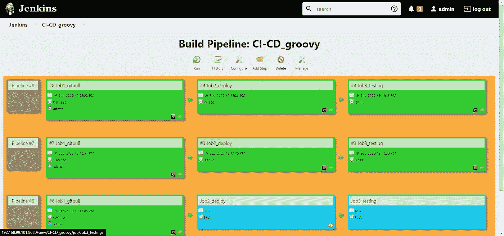

# DevOps -真正的需求(Jenkins 脚本自动化)

> 原文：<https://medium.com/nerd-for-tech/devops-the-real-need-jenkins-scripting-automation-78a7892c8a81?source=collection_archive---------1----------------------->

由 Raktim 创建

这篇文章会告诉你什么是“DevOps 的真正含义”。同样作为一个例子，我将演示如何使用 Groovy 脚本以及 Kubernetes 和 Git 在 Jenkins 中实现 **CI/CD 管道，**这将帮助您理解 DevOps 的实际含义。

# DevOps 到底是什么？

资料来源:https://www.xenonstack.com/

**首先，DevOps 不是一种技术，而是一种文化**。现在让我们深入了解一下，为什么我说这是一种文化。

*   在行业中，我们通常有不同的团队在同一个项目上工作，如**开发团队**(管理代码的开发)**运营团队**(管理服务器和代码的部署)**质量保证团队**(在最终产品进入生产之前管理其质量)**安全团队、存储团队、生产团队**等等。这些团队在各自的领域独立工作，并向人类执行最终产品。

## 到现在看起来还不错，那还有什么问题呢？

这实际上不是一个问题，而是一种挑战。

*   就像开发团队知道他们为什么创建代码以及他们如何设计代码一样。因此，**开发团队的人是最好的人来告诉他们的代码应该如何部署，以及在部署之前是否进行任何类型的编译或任何类型的安全检查等。是否需要。**
*   **现在运营团队对代码不感兴趣，因为他们接受的是服务器相关的培训，所以当他们部署代码时，他们并不知道开发团队设计的这些小事情。**这种情况叫做**老死不相往来。**

来源:谷歌

## 挑战是孤岛，解决方案是开发…

DevOps 的角色和需求来了。通常 DevOps 意味着开发团队为运营团队做一些工作，反之亦然。

每当开发团队编写一个代码时，**他们也会编写一个额外的代码，运营团队可以用它来设计代码的部署**。反之亦然，运营人员也可以通过理解开发人员的代码来编写部署代码。

来源:谷歌

> 今天的自动化技术如此先进，以至于现在我们不再担心部署问题。云计算也给了我们许多先进的自动化技术。这就是为什么**当前的行业需求是 DevOps 专业人员**，他们知道如何开发代码，也知道如何创建部署自动化脚本。接下来，作为 DevOps 专业人员**，你的职责只是在 SCM 系统上上传代码，然后服务器自动获取代码，构建部署管道并部署它们。**

# 现在让我们来看看 DevOps 的一个很好的例子(使用 Groovy 脚本的 Jenkins CI/CD 管道)…

## 首先让我们看看任务:

使用 Jenkins 中的 build pipeline 插件创建 job1、job2、job3 和 job4 的作业链。
2。种子工作:当一些开发者将 repo 推送到包含 Groovy 脚本的 GitHub 时，自动拉取 GitHub repo。

3.进一步的工作应该是管道使用开发人员使用 Groovy 语言编写的代码。
4。Job1:从 GitHub 获取代码并存储在工作区。

5.工作 2:

*   通过查看代码或程序文件，Jenkins 应该自动启动相应的安装了语言解释器的图像容器，以便在 Kubernetes 上部署代码(例如，如果代码是 PHP 的，那么 Jenkins 应该启动已经安装了 PHP 的容器)。
*   暴露您的 pod，以便测试团队可以在 pod 上执行测试。
*   使用 PVC 使数据保持持久(如果服务器收集一些数据，如日志、其他用户信息)

6.工作 3:测试你的应用程序是否工作正常。

7.Job4:如果应用程序不工作，然后发送电子邮件给开发人员，并在代码被开发人员编辑后重新部署应用程序。

> ***注意:因为我已经在没有 Groovy 脚本(手动方法)的情况下执行了这个任务，并且非常详细地解释了如何执行这个任务，这就是为什么我不再讨论这些事情。我提供我以前博客的链接。你可以认为下面提到的博客是理解使用 Jenkins Groovy 脚本的 CI/CD 管道的先决条件。***

 [## 使用 Git、Jenkins & Kubernetes 的 CI/CD 管道

### 在本文中，我将使用 Jenkins、Git 和 Kubernetes 演示持续集成和持续部署…

medium.com](/faun/ci-cd-pipeline-using-git-jenkins-kubernetes-ee06da43c5b0) 

开始之前，让我们来看一些术语。在上面提到的博客中，我解释了什么是 Jenkins、Git 和 Kubernetes，以及如何在你的个人电脑上设置这些东西。我盯着那之后…

# Groovy:

詹金斯+ Groovy 标志

Apache Groovy 是一种面向对象的编程语言，用于 Java 平台。这种动态语言有很多类似 Python，Ruby 的特性。它可以用作 Java 平台的脚本语言。

它几乎就像是 Java 的超级版本，提供了 Java 的企业功能。它还提供了许多生产力特性，如 DSL 支持、闭包和动态类型。与其他一些语言不同，它被设计成 Java 的伴侣，而不是替代者。

Groovy 源代码用 Java 字节码编译，所以如果 JRE 安装在那个操作系统上，它可以在任何平台上运行。Groovy 还在幕后执行许多任务，这使它更加敏捷和动态。

**Jenkins 有一个 Groovy 脚本控制台，允许用户在 Jenkins 主运行时或代理运行时运行任意 Groovy 脚本。**

*   ***了解更多 Groovy:***[***https://github.com/jenkinsci/job-dsl-plugin***](https://github.com/jenkinsci/job-dsl-plugin)

# 先决条件:

*   要执行这项任务，您需要准备好您的个人实验室。在我以前的博客中，我已经解释了所有的先决条件，如 Minikube，Kubectl，Jenkins 和一些 Jenkins 插件，RHEL8 服务器等。
*   现在，如果您的实验室准备好了，我们需要在 Jenkins 中安装一些额外的插件来执行这项任务。我在下面提到了那些 Jenkins 插件的名字和官方链接。

1.  **作业 DSL:**[**https://plugins.jenkins.io/job-dsl/**](https://plugins.jenkins.io/job-dsl/)
2.  **邮件扩展:【https://plugins.jenkins.io/email-ext/】**

# **Jenkins 种子作业:**

****这是我们需要手动创建的第一个也是最后一个作业，一旦我们运行该作业，它将自动创建更多的作业。**现在，您可以注意到 DevOps 的强大之处，它意味着为应用程序创建代码的同一位开发人员会为部署创建额外的代码。这项工作被称为**种子工作**。现在我们必须创建一个 GitHub 存储库来上传我们的 Groovy 脚本。我已经创建了一个资源库并上传了完整的 Groovy 脚本，链接在下面…**

** [## raktim00/DevOps_Home_Work6

### 在 GitHub 上创建一个帐户，为 raktim00/DevOps_Home_Work6 开发做贡献。

github.com](https://github.com/raktim00/DevOps_Home_Work6) 

## 让我们建立种子作业…

> ***转到 jenkins 并单击“新项目”= >给出名称“Seed Job”=>单击自由风格项目= >然后确定。***

接下来，按照下面提到的截图，把需要的信息。首先，我们正在建立 GitHub 库，Jenkins 将从这里提取代码。

种子工作截图

> 接下来，我使用了 poll SCM，因为在我配置它之后，Jenkins 会在每分钟检查代码的主分支，只要开发人员提交，Jenkins 就会自动获取代码。

种子工作截图

> ***最后我使用了“查看文件系统”=>“DSL 脚本”选项并输入了脚本文件名。在我的例子中文件名是“groovytask.txt”，你可以给任何名称。仅此而已，只需保存并单击“立即构建”，您将看到 3 个新任务将自动配置。***

种子工作截图

**让我们看看种子作业构建的输出，然后我将解释我在 Groovy 脚本上写了什么……**

种子作业输出

我们可以在输出屏幕上看到，它生成了几个作业，还生成了一个视图。现在让我们观察如何编写 Groovy 脚本来构建 Jenkins Jobs。

*   作为参考，Jenkins 网站有一个详细的文档，在那里你可以找到很多关键词来定制你的工作。
*   ***跟随此链接:***[***https://jenkinsci.github.io/job-dsl-plugin/***](https://jenkinsci.github.io/job-dsl-plugin/)

# 作业 1 的 Groovy 脚本:

正如你所注意到的，我使用了一个名为“ **job** 的关键字来创建“Job1_gitpull”，并使用了“ **description** ”关键字来给出工作的描述。接下来我使用了“ **scm** ”和“ **github** ”关键字来配置作业中的 github 库。对于轮询 scm 触发器，我使用了" **triggers** "关键字，最后为了在执行 shell 上运行某些东西，我使用了" **steps** "和" **shell** "关键字。仅此而已，这个简单的脚本正在帮助 Jenkins 创建 Job 1。

> **注意:要构建这个任务，你需要在 Jenkins 中安装一个名为“github”的插件。**

# 作业 2 的 Groovy 脚本:

这看起来有点大，但它实际上不是一个大的脚本。在我的 before 任务中，我解释了为什么我们需要这些命令在 shell 上运行。这里的一切都与我们对作业 1 所做的一样，唯一的不同是这里没有使用“scm”触发器，我使用了“ **upstream** ”关键字，这有助于我将第一个作业设置为第二个作业的上游，这意味着一旦第一个作业完成，它将触发第二个作业并开始构建。

# 作业 3 的 Groovy 脚本:

在第三份工作中，唯一的新东西是**电子邮件通知**。此外，以前我已经告诉你需要安装“电子邮件扩展”插件来发送开发人员的电子邮件，如果工作失败意味着如果测试不成功。这些是定制电子邮件通知的简单关键字，如“**扩展邮件**”有助于选择电子邮件的主题和正文以及收件人，而“**触发器**”有助于选择构建失败时发送构建日志等。

# 用于构建管道视图的 Groovy 脚本:

**这是在 jenkins 中创建一个构建管道视图的最后一项工作，**这里我们也使用了一些关键字来选择构建管道的初始工作以及刷新频率等。

> **因此，最后，您或团队中负责操作操作任务的人员进入“构建管道”视图，单击“立即构建”,它将开始构建流程。以下是构建管道视图…** 供参考

构建管道视图

原来如此，终于成功实现了…

# 最后的话:

*   有很多未来的可能性，如做更多的定制脚本来添加更多的选项，我们也可以根据需要添加更多的工作。
*   我试图让它尽可能简单。希望你从这里学到了一些东西。请随意查看我的 LinkedIn 个人资料，当然也可以随意发表评论。
*   我写 DevOps，云计算，机器学习等等。博客，所以请随时关注我的媒体。最后但同样重要的是，如果您有任何疑问，请通过 LinkedIn 联系我。

 [## 微软学习学生大使(Alpha) -微软学习学生大使 CEE |…

### ★我是一名技术爱好者，致力于更好地理解不同热门技术领域背后的核心概念…

www.linkedin.com](https://www.linkedin.com/in/raktim00/) 

**就这样…结束了…😊**

**