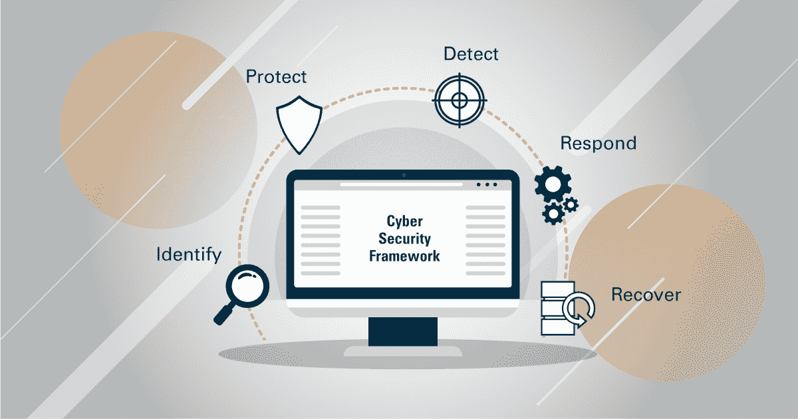
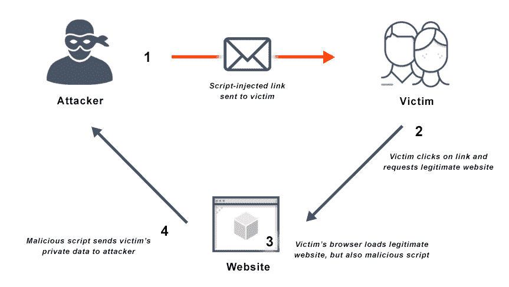

# Web 应用程序安全基础 101:从哪里开始

> 原文：<https://medium.com/nerd-for-tech/devsecops-basics-where-to-start-aa7babee4ac4?source=collection_archive---------1----------------------->

当我们谈论 web 安全性时，我们会想到 web 应用程序和网络基础设施的安全性。但是当涉及到实际的实现时，现实是这经常被忽略。

任何向接入网络公开其计算服务的组织都必须付出巨大努力来确保信息和资源得到保护。互联网是通信的主要因素，也是获取和滥用现有服务和信息的明显潜在风险。

在 web 应用程序中，我们将安全性分为:

*   **可用性**:这确保了授权实体或流程在需要时可以访问应用程序。
*   **真实性**:这确保了一个实体就是他们所声称的那个人，并且保证了数据的来源。
*   **完整性**:这确保信息资产没有被以未经授权的方式更改。
*   **机密性**:这确保了敏感信息不会被未授权的个人、实体或流程获得或披露。
*   **可追溯性**:这确保了一个实体的行为可以被唯一地归因于那个实体。

# 常见的 Web 应用程序漏洞

OWASP 前 10 名是所有软件中需要立即解决的漏洞的综合列表。因此，您应该从哪里开始增强您的 web 应用程序。应该立即检查现有代码中的这些漏洞，因为攻击者正在积极地瞄准这些缺陷。

开发项目应该在其设计文档中检查这些漏洞，并在开发阶段测试代码。测试确保没有引入漏洞，并且已存在的漏洞已被消除。

主管应该在预算和时间表中为安全活动留出空间，如培训软件制作者、制定安全开发策略、安全设计和开发机制、渗透测试以及源代码的安全审查。

# 如何保护网站

[来源](https://www.netsparker.com/blog/web-security/cybersecurity-framework-web-application-security/)

作为一家公司，你的网站就是你的在线总部。网站的安全漏洞就像有人闯入你的办公室，窃取你的业务记录和客户信息。这是有风险的，因为窃贼可以利用这些数据做任何事来牵连您和您的客户。这不是你想在你的网站上发生的事情。以下是最常见的网络安全漏洞以及应对方法:

*   **SQL 注入**

SQL 注入是一种涉及恶意 SQL 语句的 web 攻击。通过成功的 SQL 攻击，黑客可以访问您网站的 SQL 数据库，复制、添加、编辑或删除其中包含的数据。SQL 注入是最常见的网络安全漏洞，因为大多数网站都使用 SQL 数据库。

你可以通过小心用户输入来处理 SQL 注入。最好不要依赖任何用户输入。在允许用户输入到你的网站之前，确保所有的用户输入都是有效的。

*   **破解认证**

被破坏的身份验证与各种 web 漏洞有关。然而，它们都涉及绕过网站上呈现的认证方法。大多数被破坏的身份验证攻击涉及凭据填充、不适当的会话超时以及未加盐和散列的密码。它允许攻击者绕过身份验证并冒充合法用户。

多因素身份认证是应对身份认证破坏攻击的最佳方式之一。因此，知道用户的凭据(用户名和密码)不足以访问他们的帐户。此外，存储在数据库中的用户密码不仅应该加密，还应该加密和散列。

*   **跨站脚本**

也被称为 XSS 攻击，这是一个与客户端代码注入有关的 web 漏洞。通常，攻击会将恶意代码插入到网页中，一旦网页被访问，恶意代码就会被执行。这是一个输入漏洞，主要发生在允许用户反馈的网站上。

[来源](https://avinetworks.com/glossary/cross-site-scripting/)

像 SQL 注入一样， [XSS 可以通过监控用户输入来解决](https://cheatsheetseries.owasp.org/cheatsheets/Cross_Site_Scripting_Prevention_Cheat_Sheet.html)。必须过滤每个用户输入，并且只允许安全有效的输入。此外，您可以对输出数据进行编码，并利用内容安全策略(CSP)。这项政策有助于减少 XSS 袭击可能造成的损失。

*   **不正确的安全配置**

作为一个网站所有者，如果你没有为你的网络服务器建立所有必要的协议和安全控制，你就使它容易受到网络攻击。这是一个安全错误配置。此外，您可以实现这些安全控制，这样做时仍然会有一两个使您易受攻击的 bug。

安全错误配置相对容易修复。首先，您需要了解您的站点是如何工作的，为您的站点选择最佳的安全措施，并确保一切都正确实施。使用强管理员密码，阻止对服务器的未授权访问。偶尔运行扫描来检测和修复任何安全漏洞。

*   **不安全的直接对象引用(IDOR)**

攻击者将很难在您的站点上找到[不安全的直接对象引用(IDOR)](https://portswigger.net/web-security/access-control/idor) 。但是，如果他们这样做，他们可以很容易地利用它，后果可能是严重的。此漏洞涉及使用未经验证的用户输入进行未经授权的访问。黑客可以直接引用你的 web 服务器上的对象。

您可以做的第一件事是检测 IDOR，并使用安全散列或间接对象引用替换对象引用。然后确保正确的会话管理，并始终检查对象级用户访问控制。

*   **跨站请求伪造**

当用户访问网站时，浏览器会自动为每个请求发送身份验证令牌。攻击者可以使用恶意网页来改变用户浏览器和正在访问的网站之间的交互。例如，它允许他们访问用户以前访问过的网站的身份验证 cookies。

会话身份验证可以帮助您处理跨站点请求欺骗。这可以通过为每个活动的用户会话颁发令牌来验证向站点发送请求的是真实的用户来实现。这被称为基于令牌的缓解，您可以使用有状态或无状态令牌模式。

# 结论

有必要定期进行渗透测试，以确保您网站的安全性。这些测试从几个角度评估安全性:外部的、内部的、隐蔽的和有针对性的。此外，这些测试允许我们检查可能真实发生的情况，而不像传统的安全审计那样更侧重于技术评估。

为了自动化良好的安全实践，我们还可以将安全性集成到 [DevSecOps](https://www.ibm.com/cloud/learn/devsecops) 中。在这样的设置中，负责开发和运营的人员也负责安全。例如，它包括在持续集成过程中使用安全诊断工具。