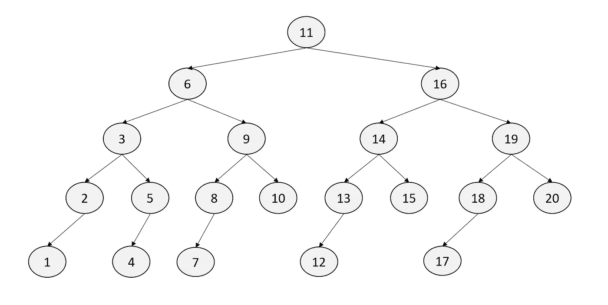
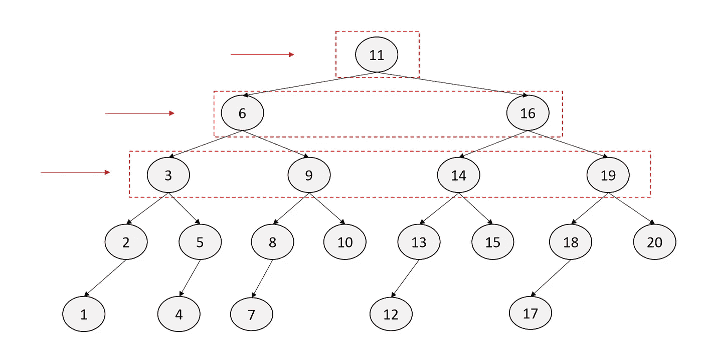
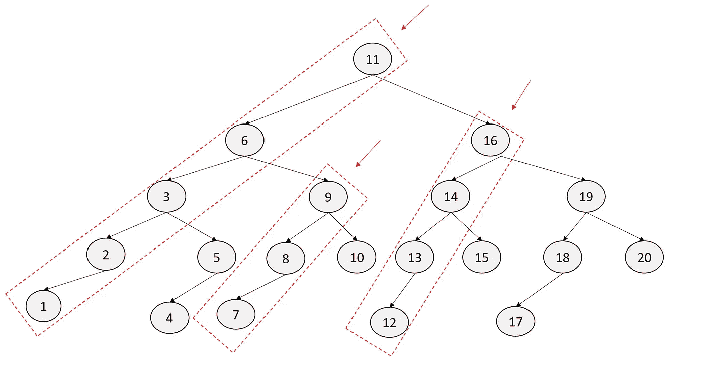

# DFS 和 BFS —简介

> 原文：<https://medium.com/nerd-for-tech/dfs-bfs-introduction-26a65fca2344?source=collection_archive---------10----------------------->


[简·侯伯](https://unsplash.com/@jan_huber?utm_source=unsplash&utm_medium=referral&utm_content=creditCopyText)在 [Unsplash](https://unsplash.com/s/photos/breadth-vs-depth?utm_source=unsplash&utm_medium=referral&utm_content=creditCopyText) 上拍照

深度优先搜索和广度优先搜索是两种非常常见的树/图遍历/搜索算法。在这篇博客中，我们将介绍这两种算法的实现。为简单起见，我们将为二分搜索法树实现它们。使用邻接矩阵可以将逻辑扩展到其他图。

[号**岛:索尔与 BFS&DFS**](https://asrathore08.medium.com/number-of-island-bfs-dfs-e4888886dbb0)

下图是我们将要遍历的树。



# BFS

在 BFS，我们首先遍历所有连接的节点。在下图中，值为 11 的节点连接到 6 和 16。所以顺序就变成了 11->6->16。



> BFS 是一种谨慎的方法，它一层一层地检查每条路径，除非它找到了当前级别的内容，否则它将深入图表。

为了实现这个逻辑，我们利用了队列**的帮助。这有助于我们跟踪已经看到的节点。我们从树根开始。对于队列中的每个节点，我们从左侧移除节点，并继续从右侧添加其连接的节点。在上面的例子中，我们从 11 开始。我们将其连接的节点添加到队列中，即我们添加 6 & 11。这一直持续到我们用完了队列中的所有元素。**

```
def bfs(root):
    bfs_q = deque([root])
    path = [] while bfs_q:
        for i in range(len(bfs_q)):
            out = bfs_q.popleft()
            path.append(out.val)
            if out.left:
                bfs_q.append(out.left)
            if out.right:
                bfs_q.append(out.right)
    return path
```

while 循环的不同迭代的队列值如下。

```
11           #start
6, 16        #removed 11 and added its connected.
3, 9, 14, 19 #removed 6 and 16 added their connected nodes
2, 5, 8, 10, 13, 15, 18, 20
```

结果:

```
11 -> 6 -> 16 -> 3 -> 9 -> 14 -> 19 -> 2 -> 5 -> 8 -> 10 -> 13 -> 15 -> 18 -> 20 -> 1 -> 4 -> 7 -> 12 -> 17
```

# 深度优先搜索

在 DFS 中，我们通过连接的节点继续向下遍历，除非我们到达终点，然后折回我们的步骤，看到没有访问的连接节点，并重复这个过程。在下面的例子中，我们从 11 开始，然后下降到 6，下降到 3，下降到 2，再进一步下降到 1。在 1 我们没有任何向下的节点。我们回溯到 3 点。这里，它下面有一个未访问的节点。所以我们在这里再次开始 DFS。到达 4 之后，我们折回 6，然后从 9 开始，继续下去。



> DFS 是一种积极的算法，深入到图形中，当它到达底部时进行回溯，直到它再次到达底部

为了实现 DFS，我们使用**栈**数据结构来跟踪被访问的节点。我们从根开始，作为栈中唯一的元素。我们从堆栈中弹出，并将弹出节点的连接节点添加到堆栈中。我们重复这个过程，直到堆栈变空。

```
def dfs(root):
    stack = [root]
    path = []
    while stack:
        out = stack.pop()
        path.append(out.val)
        if out.right:
            stack.append(out.right)
        if out.left:
            stack.append(out.left)
    return path
```

while 内部的 diff 迭代中堆栈的值如下:

```
|  | |  | |  | |  | |  |
|  | |  | |  | | 2| | 1|
|  | |  | | 3| | 5| | 5|
|  | | 6| | 9| | 9| | 9|
|11| |16| |16| |16| |16|
```

结果:

```
11 -> 6 -> 3 -> 2 -> 1 -> 5 -> 4 -> 9 -> 8 -> 7 -> 10 -> 16 -> 14 -> 13 -> 12 -> 15 -> 19 -> 18 -> 17 -> 20
```

什么时候用哪个？

如果 b 是分枝因子，d 是解所在的深度，h 是树的高度(d≤h ),那么 DFS 需要 O(b^h)时间和 O(h)空间。BFS 占用 O(b^d 的时间和 O(b^d 的空间。

使用的一般指南:

*   寻找最短路径— BFS
*   测试图二分性— BFS
*   查找所有连接的组件-BFS
*   寻找连接点— DFS
*   决策树— DFS
*   搜索空间全图— DFS
*   有限的孩子和无限的深度——BFS
*   有限深度和无限子代— DFS
*   密集图— DFS
*   稀疏图— BFS

**进一步阅读图搜索算法—** [**迪杰斯特拉&贝尔曼-福特**](https://asrathore08.medium.com/shortest-path-algorithms-dijkstra-bellman-ford-3b640bdb0449)

寻找快乐！！