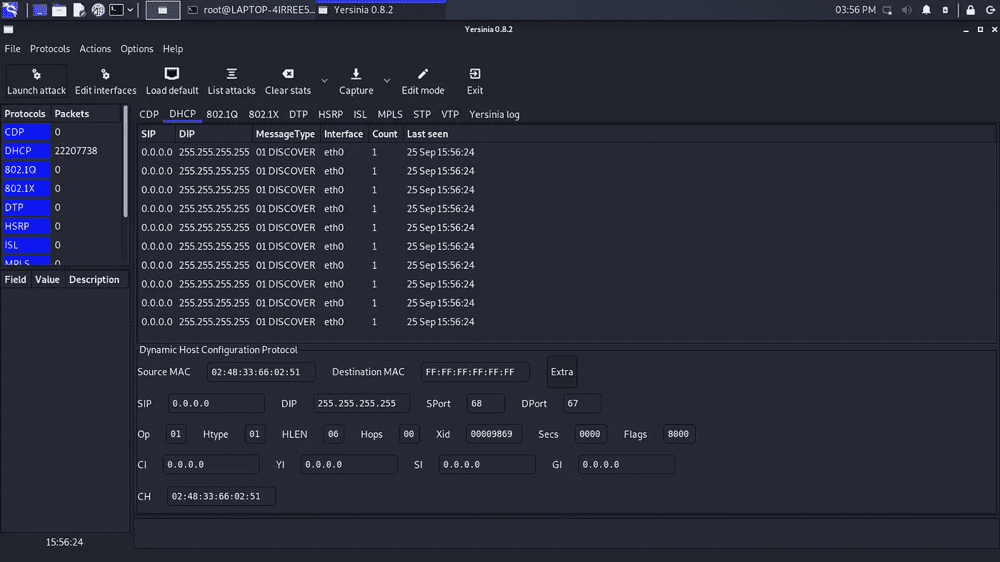

# DHCP 饥饿

> 原文：<https://medium.com/nerd-for-tech/dhcp-starvation-4aebca98b884?source=collection_archive---------2----------------------->

当 PC 或任何类型的设备在网络上启动时，它就是 DHCP 客户端。它将发出一个 DHCP Discover 数据包，这意味着它正在寻找一个可以给它分配 IP 地址的 DHCP 服务器。

听到请求的服务器会发送一个提议——允许客户机使用的 IP 地址。

DHCP 服务器在/24 网络上有一个地址池，地址池中的最大地址数可以是 254，其中 1 或 2 个地址保留给静态路由器地址。

在这之后，客户端发送回消息，说我想请求您刚才提供的 IP 地址。最后服务器发送 ACK 包。

## 涉及 4 个基本包—

1.  发现
2.  提供
3.  请求
4.  命令正确应答

## 攻击

当攻击者发送 100 个 DHCP 时，发现恶意数据包使用伪造的 mac 地址作为每个请求的源 mac 地址，并且当服务器向所有这些请求提供 IP 地址时。一旦这个服务器没有更多的 IP 地址提供，那么攻击者将带来他自己的 DHCP 服务器，称为流氓 DHCP 服务器。被提供 IP 地址的客户端将使用攻击者的默认网关，因此客户端的信息将通过攻击者的机器路由，从而成为中间人攻击。

> 我们可以使用**耶尔森氏菌**工具发起 DHCP 饥饿攻击

步伐

1.  启动耶尔森菌 gui

```
yersinia -G
```

2.发起进攻

3.选择 DHCP，然后发送发现数据包

4.按下 ok 键，攻击就开始了



## 预防

港口安全