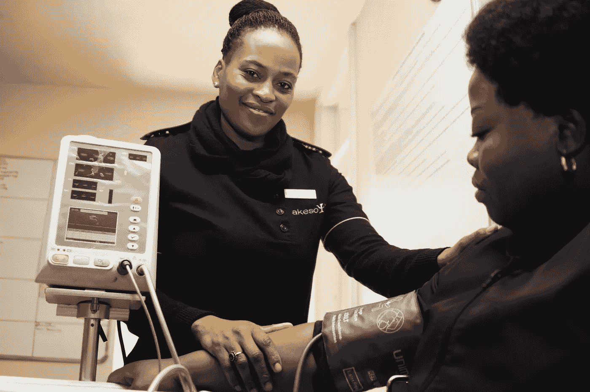
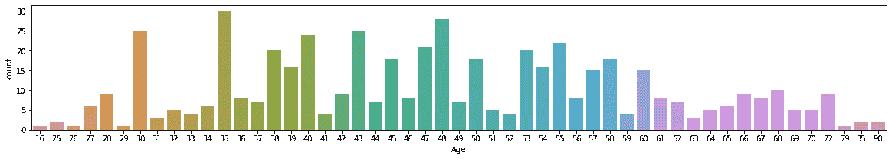
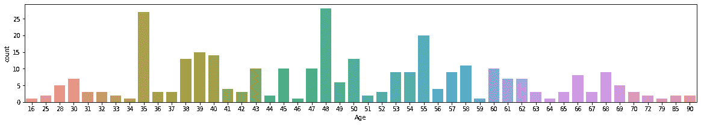
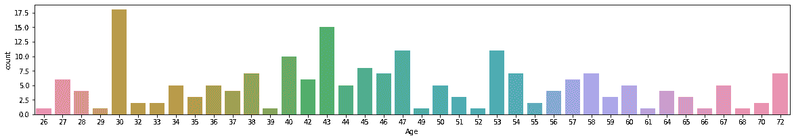
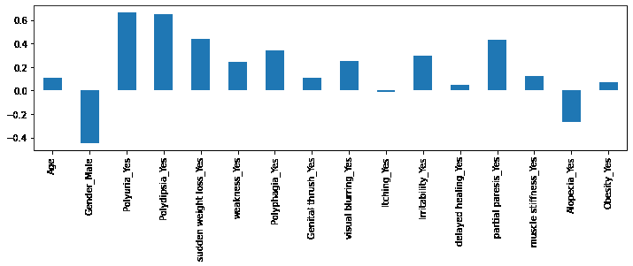

# 糖尿病预测器 ML 应用程序

> 原文：<https://medium.com/nerd-for-tech/diabetes-predictor-ml-app-27967d306bb0?source=collection_archive---------7----------------------->



照片由 Hush Naidoo 在 Unsplash 上拍摄

大家好。看看糖尿病预测器的实际应用就知道了。

如您所见，只需点击一个按钮，它就能帮助您发现是否患有糖尿病[ *这只是一个指示，请向您的医生确认*。从 1980 年到 2014 年，全球糖尿病患者人数从 1.08 亿增加到 4.22 亿，到 2019 年，这一数字接近 4.63 亿。**最有趣的是，有一半(50.1%)的糖尿病患者不知道自己患有糖尿病**。这就是这个应用程序可以帮助你发现是否有机会受到糖尿病的影响。

**APP 的链接:**[https://share . streamlit . io/soumyabrataroy/diabetes _ predictor _ ml _ APP/main/diabetes _ predictor _ v2 . py](https://share.streamlit.io/soumyabrataroy/diabetes_predictor_ml_app/main/diabetes_predictor_V2.py)

当我看到 UCI ML 知识库中现成的数据集— [早期糖尿病风险预测数据集时，我第一次萌生了创建这款应用的想法。数据集](https://archive.ics.uci.edu/ml/datasets/Early+stage+diabetes+risk+prediction+dataset.)

**向团队大声疾呼，让数据集开源，为人民所用。数据从 Sylhet 糖尿病医院患者的直接问答中收集，并经医生批准。**

为了制作和发布应用程序，我使用了 Streamlit python 包、stremlit cloud share，对于底层预测算法，我使用了随机森林算法(因为它给出了最佳结果)。对于那些想深入了解制作过程的人来说，这里有一些细节:

该过程分为两部分:1 .数据探索和算法选择，2。应用程序的部署

**数据探索和算法选择:**

首先，下载数据集并上传到 Google colab。下面是为您提供方便的 colab 笔记本:[https://colab . research . Google . com/drive/1 pqek 0 knb kw75 xht 7 hkm 41 JMPR 4 tgqt 7s？usp =共享](https://colab.research.google.com/drive/1pqeK0knBKW75xht7HKM41JmPR4TgqT7s?usp=sharing)

```
# importing necessary libraries
import pandas as pd
import numpy as np
import matplotlib.pyplot as plt
import seaborn as snsactual_patient_data = pd.read_csv("diabetes_data_upload.csv")
actual_patient_data.head(3)
```

在数据集中，有相当多的属性可用。

**年龄**1.20–65，**性别** 1。男，2。女，**多尿** 1。有，2 .没有，**烦渴** 1。有，2 .没有，**突然体重下降** 1。有，2 .没有，**弱点** 1。是，2 .否，**多食** 1。有，2 .没有，**生殖器鹅口疮** 1。是，2 .否，**视觉模糊** 1。有，2 .没有，**痒** 1。是的，2 . no .**易怒** 1 .是，2 .否，**延迟愈合** 1。有，2 .没有，**局部轻瘫** 1。有，2 .没有，**肌肉僵硬** 1。有，2 .没有，**脱发** 1。有，2 .没有，**肥胖** 1。是，2 .号，**级** 1。阳性，2 .阴性。

基本上，这些是问题，如果你有这些症状或没有。基于此，最后一栏告诉你是否有糖尿病(阳性)或没有糖尿病(阴性)

这些是你能想到的最常见的症状，但如果你不知道症状，你可以在应用程序中点击症状的名称，它会引导你到相应的页面了解更多信息。

```
actual_patient_data.info() <class 'pandas.core.frame.DataFrame'>
RangeIndex: 520 entries, 0 to 519
Data columns (total 17 columns):
 #   Column              Non-Null Count  Dtype 
---  ------              --------------  ----- 
 0   Age                 520 non-null    int64 
 1   Gender              520 non-null    object
 2   Polyuria            520 non-null    object
 3   Polydipsia          520 non-null    object
 4   sudden weight loss  520 non-null    object
 5   weakness            520 non-null    object
 6   Polyphagia          520 non-null    object
 7   Genital thrush      520 non-null    object
 8   visual blurring     520 non-null    object
 9   Itching             520 non-null    object
 10  Irritability        520 non-null    object
 11  delayed healing     520 non-null    object
 12  partial paresis     520 non-null    object
 13  muscle stiffness    520 non-null    object
 14  Alopecia            520 non-null    object
 15  Obesity             520 non-null    object
 16  class               520 non-null    object
dtypes: int64(1), object(16)
memory usage: 69.2+ KB
```

数据集中似乎没有任何空值。让我们根据年龄来探究病人的数量

```
plt.figure(figsize=(20,3))
sns.countplot(x=actual_patient_data['Age']);
```



从上图中，我们可以发现大多数人的年龄在 30-60 岁之间。现在我们将快速测试阳性和阴性患者的数量。

```
len(actual_patient_data[actual_patient_data["class"]=="Positive"])
320len(actual_patient_data[actual_patient_data["class"]=="Negative"])
200
```

所以你可以看到数据集有点不平衡。大多数人都持积极的态度。

现在让我们探讨一下积极的人和消极的人的年龄分布。

```
plt.figure(figsize=(20,3))
sns.countplot(x=actual_patient_data[actual_patient_data["class"]=="Positive"]['Age']);
```



```
plt.figure(figsize=(20,3))
sns.countplot(x=actual_patient_data[actual_patient_data["class"]=="Negative"]['Age']);
```



虽然这是不平衡的数据，但他们的年龄分布几乎相似。所以我相信我们可以利用这个数据集来发现一个人是否患有糖尿病。

在数据中，只有 class 列是数字形式，而其他属性是分类格式。我们需要把它们转换成数字，以便机器能更好地理解它们。

```
# convering the data
converted_data=pd.get_dummies(actual_patient_data, prefix=['Gender', 'Polyuria', 'Polydipsia', 'sudden weight loss',
       'weakness', 'Polyphagia', 'Genital thrush', 'visual blurring',
       'Itching', 'Irritability', 'delayed healing', 'partial paresis',
       'muscle stiffness', 'Alopecia', 'Obesity', 'class'], drop_first=True)
```

转换之后，您可以看到列名发生了一些变化。现在 class 列是 class_positive。我们现在将检查 class_positive (dependent)与 others (independent)之间的相关性。

```
converted_data.corr()['class_Positive'][:-1].plot(kind='bar')
```



从上图可以看出，多尿、多饮与糖尿病共线性最大。我们将采用所有的属性进行查找，因为这是医生批准的数据集来创建算法。

现在，我们将数据集分割成 70:30 的比例用于训练、测试分割，并使用标准标量缩放数据集。

```
# train test split
from sklearn.model_selection import train_test_split
X_train, X_test, y_train, y_test = train_test_split(converted_data.drop('class_Positive', axis=1),converted_data['class_Positive'], test_size=0.3, random_state=0)#standard scaling the data
from sklearn.preprocessing import StandardScaler
sc=StandardScaler()
X_train = sc.fit_transform(X_train)
X_test = sc.transform(X_test)
```

我用同一个数据集尝试过不同的算法像 **Logistic 回归，KNearest Neabour，支持向量线性分类器，支持向量核 SVF，朴素贝叶斯，决策树，随机森林，XGBoost，CatBoost** 。我用随机森林算法得到了最准确的百分比，T2 的准确率为 97%，标准偏差为 2.5%。下面我只给出了随机森林代码，其他的 algo 代码你可以参考 Google collab 笔记本或者 Github 库:【https://github.com/soumyabrataroy/Diabetes_Predictor_ML_App 

```
#getting Randome forest classifier
from sklearn.ensemble import RandomForestClassifier
RF_classifier = RandomForestClassifier(n_estimators = 10, criterion = 'entropy', random_state = 0)
RF_classifier.fit(X_train, y_train)#predicting the output
y_pred = RF_classifier.predict(X_test)#model accuracy check
cm = confusion_matrix(y_test, y_pred)
print(cm)
accuracy_score(y_test, y_pred)[[61  1]
 [ 2 92]]
0.9807692307692307#accuracy check using cross val scoreaccuracies = cross_val_score(estimator = RF_classifier, X = X_train, y = y_train, cv = 10)
print("Accuracy: {:.2f} %".format(accuracies.mean()*100))
print("Standard Deviation: {:.2f} %".format(accuracies.std()*100))Accuracy: 97.55 %
Standard Deviation: 2.55 %
```

**应用程序的部署**

在部署阶段，我使用了培训数据。你可以利用全部数据进行预测。您可以在这里看到部署 python 文件:[https://github . com/soumyabrataroy/Diabetes _ Predictor _ ML _ App/blob/main/Diabetes _ Predictor _ v2 . py](https://github.com/soumyabrataroy/Diabetes_Predictor_ML_App/blob/main/diabetes_predictor_V2.py)

在代码中，你会看到我使用了上面相同的代码，除了这里我创建了一个函数**predict _ note _ authentic ation()**并使用了 **streamlit 单选按钮**让应用程序运行。单选按钮捕获用户输入并将其转换为 0 或 1，使用这些输入，**预测票据认证功能**预测输出。

```
# defining the functiondef predict_note_authentication(age,gender,polyuria,polydipsia,weight,weakness,polyphagia,genital_thrush,visual_blurring,itching,irritability, delayed_healing,partial_paresis,muscle_stiffness,alopecia,obesity):  prediction=RF_classifier.predict(sc.transform(np.array([[int(age),int(gender),int(polyuria),int(polydipsia),int(weight),int(weakness),int(polyphagia),int(genital_thrush),int(visual_blurring),int(itching),int(irritability), int(delayed_healing),int(partial_paresis),int(muscle_stiffness),int(alopecia),int(obesity)]])))
print(prediction)

return prediction
```

顺便说一下，要测试这个应用程序，可以在本地机器上安装 streamlit。这是创建 web 应用程序最简单的 Python 库之一。它的工作方式与普通 python 的工作方式相同。就从细流开始吧。简直太棒了-[https://docs.streamlit.io/en/stable/getting_started.html](https://docs.streamlit.io/en/stable/getting_started.html)

```
# gender radio button to capture user input
gender = st.radio("What is your Gender?",("Male","Female"))
	    if gender == 'Male':
	        gender = 1
	    else:
	        gender = 0
```

其他 streamlit 特性我只用于设计目的。我还使用了 streamlit 共享选项来共享 ML 应用程序。为此，您需要创建一个细流 id 并登录门户[https://streamlit.io/sharing](https://streamlit.io/sharing)。到目前为止，streamlit 共享只接受邀请。创建 streamlit id 后，您将通过 streamlit 团队的官方电子邮件获得访问门户的权限。也许你需要等一会儿才能收到邀请。

一旦收到 streamlit 共享邀请，您只需创建一个 Github 存储库，并将最终的 python 文件和数据集一起上传到那里。前往[https://share.streamlit.io/](https://share.streamlit.io/)，点击**新应用**按钮。在这里，您需要给出 GitHub 存储库的 URL 和需要调用的 python 文件名。然后点击部署。就是这样。您的应用程序现已上线，可与全世界分享。

**糖尿病预测师 ML APP—**[https://share . streamlit . io/soumyabrataroy/Diabetes _ Predictor _ ML _ APP/main/Diabetes _ Predictor _ v2 . py](https://share.streamlit.io/soumyabrataroy/diabetes_predictor_ml_app/main/diabetes_predictor_V2.py)

我希望你喜欢这个应用程序。我相信它可以帮助社区防止糖尿病传播到社会。如果你认为这个应用程序可以帮助某人，请随时与他们分享。

请[👏](https://emojipedia.org/clapping-hands/)。如果你有任何问题、想法、建议，请在下面的**评论**中告诉我。

在 Twitter 上关注我:@ sam1ceagain

最初发布于 LinkedIn:[https://www.linkedin.com/post/edit/6780346699379433472/](https://www.linkedin.com/post/edit/6780346699379433472/)