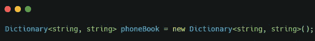
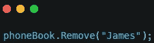
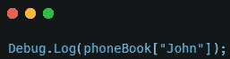
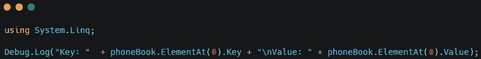
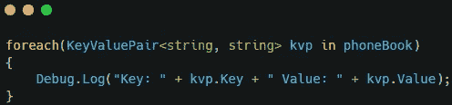
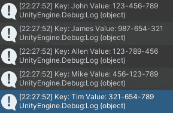

# 统一字典

> 原文：<https://medium.com/nerd-for-tech/dictionaries-in-unity-1ec967a94a47?source=collection_archive---------4----------------------->

字典是用于存储键值对的一般集合。它们类似于数组，但存储两个组件。第一个是键，第二个是值。如果你把它想象成一本英语词典，关键字就是单词，值就是定义。

使用**系统包含字典。Collections.Generic** 名称空间。要定义一个，你把它写成 Dictionary < keytype，objectType >。

要将值添加到字典中，您将使用 **Add()** 方法。

要删除值，您将使用 **Remove()** 方法。

词典的独特之处在于，当你搜索它们时，你会使用关键字。当找到密钥时，将返回该值。

打印键和值的一个简单方法是使用 **LINQ** 库。这将允许您使用 **ElementAt()** 方法来打印键和值。

要打印整个列表，您可以使用一个 **foreach 循环**。

