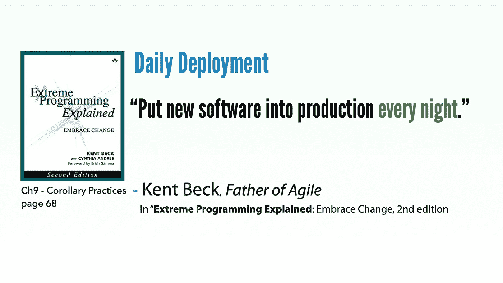

# 昨天您是否将软件更新投入生产？

> 原文：<https://medium.com/nerd-for-tech/did-you-push-software-updates-into-production-yesterday-96bf5898d854?source=collection_archive---------0----------------------->

《极限编程讲解》(敏捷之父肯特·贝克著)是我第一本也是最喜欢的敏捷书籍。我仍然记得 21 年前在 UQ 图书馆读过它的第一版。然后我很天真的向项目建议了这种新的软件开发方式。项目经理不喜欢这个想法，尤其是极限编程(XP)这个名字。不过，关于名字的部分，他可能是对的…