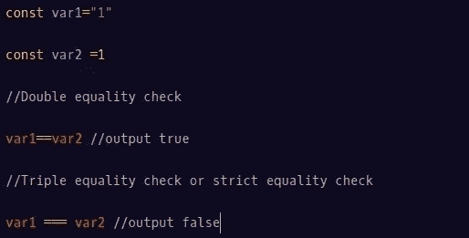
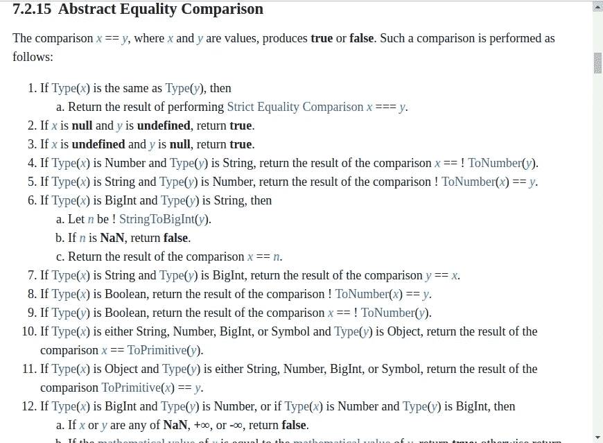

# JavaScript 中两倍等于和三倍等于运算符的区别。

> 原文：<https://medium.com/nerd-for-tech/difference-between-and-equality-operators-in-javascript-e70df02825bc?source=collection_archive---------0----------------------->

因此==(宽松等式)和===(严格等式检查)运算符之间的区别一直是互联网上讨论的话题。让我们来看看这两者有什么不同。

**宽松的相等检查或双等于(==):** 双等于运算符允许在比较过程中进行强制转换(即从一种数据类型转换成另一种数据类型)。在比较两个值时，Double equals 遵循一种算法。算法在这里定义[https://www . ECMA-international . org/ECMA-262/# sec-abstract-equality-comparison](https://www.ecma-international.org/ecma-262/#sec-abstract-equality-comparison)。

来源:[https://www . ECMA-international . org/ECMA-262/# sec-abstract-equality-comparison](https://www.ecma-international.org/ecma-262/#sec-abstract-equality-comparison)

我们将讨论这个算法的几个要点。

**第 1 点:**这一点表明，如果两个变量的类型相同，则进行严格的等式比较，并返回结果。所以如果两个操作数的类型相同，那么两个等于和三个等于就没有区别了。

**点 2 & 3:** 这些点陈述了这样一个事实:在宽松等式比较中， **null** 和 **undefined** 彼此相等。在转换过程中，这两者可以相互转换。

如果你不关心一个值是空的还是未定义的，你所关心的是这个值是一个空值，那么这里的 double equals 证明是有益的。

**点 4 & 5 :** 这些点定义了如果两个操作数(变量)中的任何一个是字符串。使用 to number()方法将字符串转换为数字，然后进行比较。双等号有利于数字比较。

**第 8 点&第 9 点:**这些点处理如果两个操作数中的任何一个是 boolean，那么将使用 ToNumber()方法将 boolean 转换成数字。布尔值 true 将被转换为 1，而 false 将被转换为 0。

**Points 10 & 11 :** 如果任何一个变量是一个对象，那么这个对象将首先通过 ToPrimitive()方法传递，然后进行比较。

如果两个操作数(变量)都是对象，那么如果两个对象是相同的对象(引用相同的对象),将返回 true，否则将返回 false。

# **重要观点:**

1.  null 和 undefined 彼此相等。
2.  -0 和+0 相等。
3.  -无穷大和+无穷大不相等。
4.  NaN 值彼此不相等。

**严格的相等检查或三重相等(===):** 三重相等不允许强制发生。它检查操作数的类型，如果两个类型相等，则算法检查操作数的值，否则返回 false。

null 和 undefined 被视为两个独立的值。

# **TL；博士**

1.  如果涉及的值的数据类型相同，将使用严格的等式。
2.  如果有的话，非基元被强制为基元。