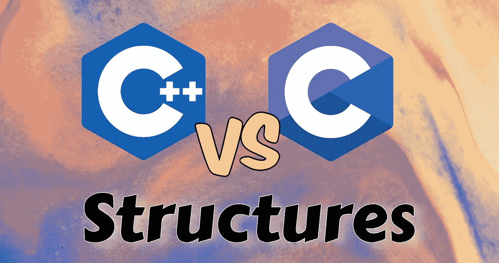

# C 结构和 C++结构的区别(包括例子)

> 原文：<https://medium.com/nerd-for-tech/difference-between-c-structures-and-c-structures-examples-included-90ec56499981?source=collection_archive---------3----------------------->

作为一名嵌入式软件开发人员，我每天都在重新调整我的方法，以解决基于我必须使用的编程语言的问题。

幸运的是，我们的选择仅限于两种主要语言，这两种语言有很多相似之处，差异很小。也就是说，我想出了突出这几个…