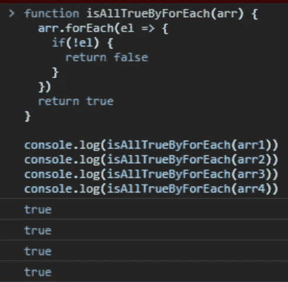

# JavaScript 中 for 循环和 forEach 的区别:何时需要停止

> 原文：<https://medium.com/nerd-for-tech/difference-between-for-loops-and-foreach-in-javascript-when-needed-to-stop-695f833a3b30?source=collection_archive---------12----------------------->

什么时候停止？

重复做某事是编程中最重要的技能之一。所有的编程语言都有自己的方式。在这篇文章中，我想具体讨论一下在 JavaScript 中当我们需要时**停止这个重复的过程**。我们将看到 ***for loops*** 和 ***forEach*** 的区别。

为了比较这两组，我们将有 4 个数组有值，一些为真，另一些为假。我们的目标是找出一个数组是否包含所有真值元素。他们来了！

你能说出哪些是假 values~^^吗？

# 对于循环

JavaScript 中有 3 种 for 循环。虽然`for...in`可以用于数组(让我们记住*数组*在 JavaScript 中是*对象*)，但这里不会处理，因为它通常是用于对象的。

所以，第一站是`**for**` 语句:

使用 for 语句

你大概知道如何使用`**for**` 语句。如果没有，请参见[本文档](https://developer.mozilla.org/en-US/docs/Web/JavaScript/Guide/Loops_and_iteration#for_statement)或[本示例](https://www.w3schools.com/js/js_loop_for.asp)。我的观点是，如果你想停止你的循环，你使用`return`关键字。它会打破循环，你就出局了！

在上面的例子中，当参数数组(`arr`)的一个元素是 falsy 时，`if`语句将被触发，`return`关键字将带您从`for`循环中退出`false`。而且，因为有了那行`return`，整个`isAlltrueByForStatement`函数将以返回值`false`结束，这是当你有一个 falsy 值时，一个数组是否有所有 true 元素的正确答案。如果没有 falsy 值，那么第 7 行的`return`值将交给您`true`。

用于…的

正如你在上面看到的，`**for...of**`会产生同样的结果(如果你不熟悉`**for...of**`请参考这个链接)。总之，对于`for`循环，你可以用一些关键字来停止它，比如`return`(当你的循环在一个函数中)或者`break`(参见[文档](https://developer.mozilla.org/en-US/docs/Web/JavaScript/Guide/Loops_and_iteration#break_statement)和[示例](https://www.w3schools.com/js/js_break.asp)。)

# 为每一个

`forEach`怎么样？了解这个功能的人通常认为这和`for...of`差不多。是吗？

它们是一样的吗？

代码示例似乎表明它们是相同的。但是这个呢？

forEach 只适用于数组！！！

`forEach`在这种情况下抛出一个错误，而`for...of`如预期的那样正常工作。为什么？因为`forEach`只适用于数组，而不适用于字符串，而`for...of` 处理两者都没有问题。

`forEach`是一个真正进入数组的函数。就停止迭代而言，我的意思是，当对一个数组调用`***forEach***`****时，它将永远不会停止迭代，直到它对每个元素*** 执行完一次。所以，猜猜当下面的代码被执行时会发生什么！*

*真相时刻~*

*如果你猜第 10 行是`true`，第 11 行是`false`，第 12 行是`false`，第 13 行是`false`，很抱歉你猜错了……为什么？正如我上面提到的，那是因为`forEach`在为一个数组工作时从不停止！！！即使它在第 4 行遇到关键字`return`和`false`，它也不会停止！它迭代到最后，在第 7 行返回最终返回值，一直是`true`。*

**

*不开心…*

*当我们从一个数组中找到一个假值时，我们停止并返回`false`的任务失败了，用`forEach` …但是不要浪费我们的失败，记住`forEach`不会在一个数组中停止！*

*总之，*如果你想停止 JavaScript 中的迭代，* ***不要使用*** `***forEach***`，因为它不会在你需要的时候如你所愿的停止！这里引用一段来自 [MDN Web Docs](https://developer.mozilla.org/en-US/docs/Web/JavaScript/Reference/Global_Objects/Array/forEach) 的话:*

> *除了抛出异常之外，没有其他方法可以停止或中断`forEach()`循环。如果您需要这样的行为，那么`forEach()`方法是错误的工具。*