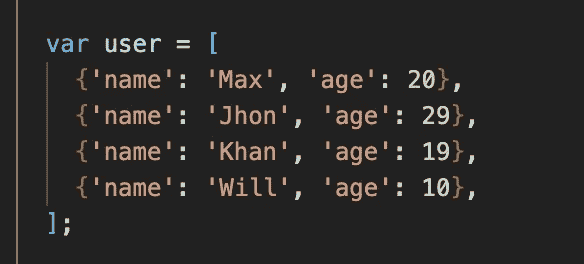
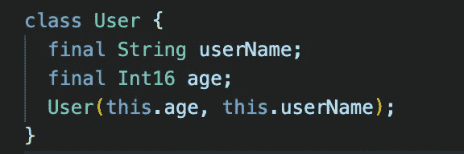
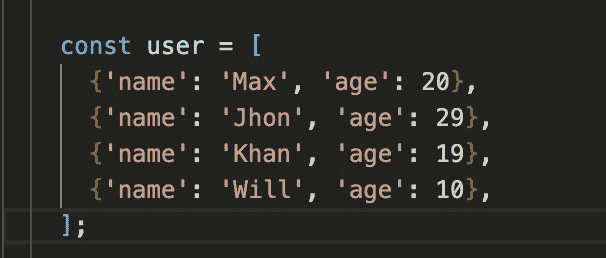

# Dart 中 const 和 final 关键字之间的差异

> 原文：<https://medium.com/nerd-for-tech/difference-between-the-const-and-final-keywords-in-dart-9702dbeccab?source=collection_archive---------3----------------------->

在大多数语言中，我们处理的是最终值和常量值。现在 final 和 const 听起来都像是我们在创造不能改变的值，对吗？

常量值可能与变量相反，它是一个不变的变量，因此它存储的值是相当恒定的，但最终值也是一个不变的值。

所以让我们检查一下区别？

我们可以在这里用 final 代替 var，实际上，这比用 var 要好，因为现在我们很清楚，一旦程序运行，我们永远不会改变这些值。

这才是重要的！！！。

如果一个值从程序运行时起就没有改变，就使用 final。它可以用一个值来初始化，例如在我们的 dart 程序中，这里的属性是最终的，因为当我们在这里赋值的时候，它们会被改变，但是之后就不会改变了。

最终到底是什么意思，

它是一个运行时常数值。在这段代码执行的时候，我们记录了最终值，但是在编写这段代码的时候，我们不知道最终值是多少。

那么坚持什么？

我们实际上应该使用 const 来明确这是编译时常数，而不是像 final 那样的运行时常数，而是编译时常数。现在编译时常量也隐含着运行时常量的意思。

如果你在编写代码的时候知道最终值是什么，并且知道这个值永远不会改变，那么，当然，它在运行时也永远不会改变。但是这个值，最终值不是在代码执行的时候记录的，而是在你写完代码之后，因为这个值永远不会改变。这是一个重要的概念，希望它能让你明白，为什么你会看到 final 和 const，以及它们有什么不同。

希望你喜欢这篇文章！
如果你喜欢，你可以 [**请我喝杯咖啡！**](https://www.buymeacoffee.com/rajitha.perera)

