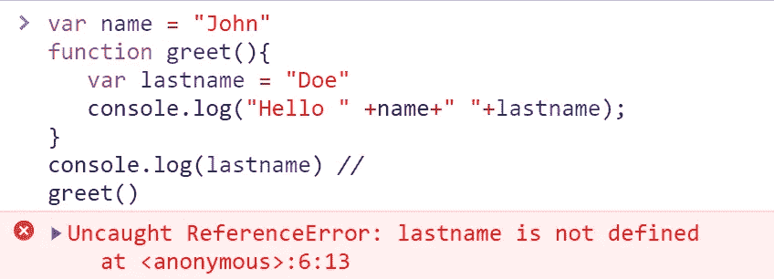
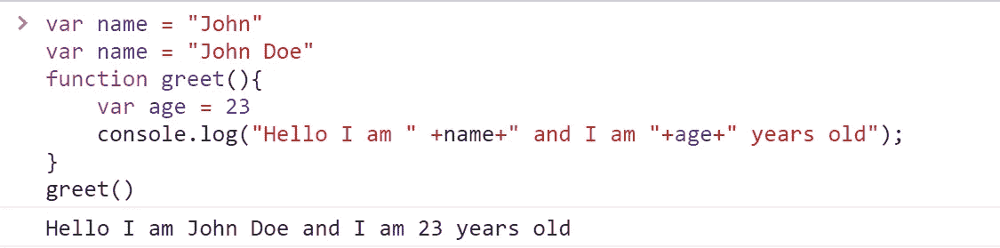
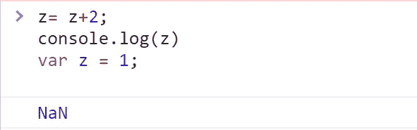
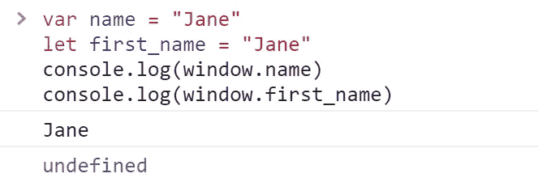
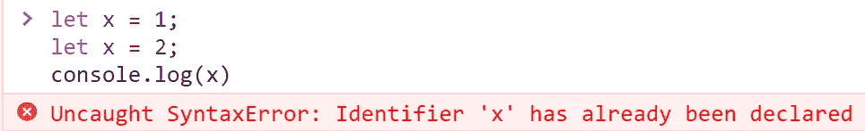
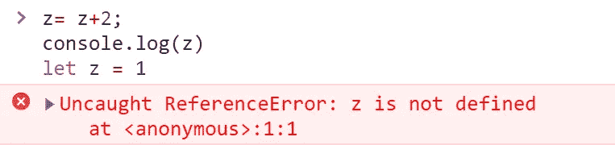
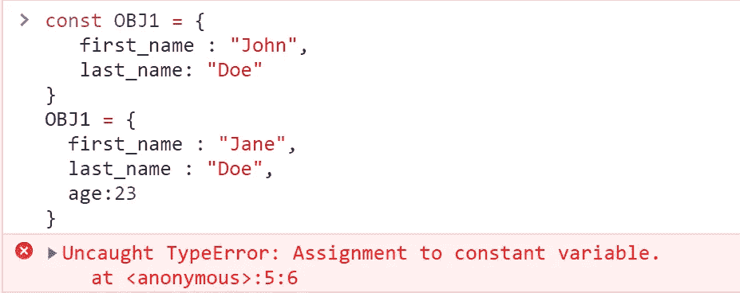
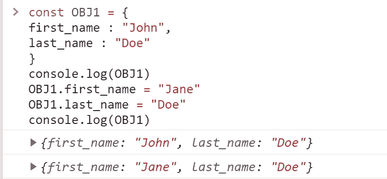

# var、let 和 const 之间的差异

> 原文：<https://medium.com/nerd-for-tech/difference-between-var-let-and-const-7aec1b81da2?source=collection_archive---------9----------------------->


由 [Unsplash](https://unsplash.com?utm_source=medium&utm_medium=referral) 上 [Greg Rakozy](https://unsplash.com/@grakozy?utm_source=medium&utm_medium=referral) 拍摄的照片

**注意:**这篇文章只写给 JavaScript 初学者，他们不明白为什么做同样的工作(声明变量)有三个关键字，以及何时何地使用哪一个。

随着 ES6 (ES 2015)的出现，JavaScript 的一些缺点随着许多新功能的实现而得到了解决，其中之一是 let 和 const 关键字。以前版本的 JavaScript 只有一种声明变量的方法，即使用“var”关键字。ES6 随后引入了“let”和“const”关键字，它们也用于声明和初始化变量，但应用程序不同。在本文中，我们将看到这三者是如何变化的。

# **1。var**

在早期的 JavaScript 代码中，你只会看到用这个关键字声明的变量。Var 是一个全局作用域或函数作用域的关键字，具体取决于它的声明位置。在函数外部声明的变量具有全局作用域，而在函数内部声明的变量具有函数作用域。可以通过浏览器窗口访问全局范围的变量。尽管不使用全局变量是明智的，但是在一些应用中需要使用全局变量。

使用 var 的示例

```
var name;           //declared globally
name = ”John” //Initialization
function greet(){
     var lastname = “Doe”    // Declared and initialized locally
     console.log("Hello " +name+" "+lastname);
}
greet()
```

如果我们试图在函数之外访问 lastname，它会抛出一个错误

```
var name = "John"
function greet(){
   var lastname = “Doe”             
   console.log("Hello " +name+" "+lastname);  
}
console.log(lastname)   //Error: lastname is not defined
greet()
```

输出:



**注意:**在 JS 中声明全局变量的另一种方式是直接在窗口对象上声明，比如

window.name = "John "

尽管默认情况下，所有用 var 关键字声明的全局变量也可以用 window 对象访问。在上面的例子中，尝试使用 window 对象访问“name ”,如下所示，并查看输出。

```
console.log(window.name)
```

上面应该印着“约翰”。

值得注意的一点是，使用 var 关键字，变量**可以被重新声明和重新分配**来存储一个新值，而不会有任何错误。

例如:

```
var name = ”John”
var name = “John Doe”
function greet(){
    var age = 23   
    console.log(“Hello I am “ +name+" and I am"+age+" years old");
}
greet()
```

输出:



这可能会有问题，因为如果在代码的其他地方声明了同名的变量，而我们在不知情的情况下重新定义了它，这可能会破坏代码。这个缺点已经在“let”关键字中解决了。

## **带 var 的吊装**

简而言之，提升是 JS“提升”的一个概念，即它在执行之前将变量声明移动到脚本的顶部。

用 var 关键字声明的变量被提升，这意味着变量声明被移动到脚本的顶部，尽管**值没有被初始化**。当一个变量被提升时，它会自动初始化为**未定义。因此，即使我们使用变量，然后声明它，它也不会给我们一个错误！**

**举例:**

```
z= z+2; 
console.log(z)
var z = 1;
```

输出:



上面的代码执行如下:

```
var z; //initialised to undefined
z = z+2;
console.log(z)
z = 1;
```

# **2。让**

let 是对 var 关键字的重大改进。用 let 关键字声明的变量是块范围的。块是写在花括号{ }之间的任何代码。块范围的变量只能在该块中访问。

示例:

```
let x = 1;
if(x == 1){
  let y = 2;
  console.log(y) //2
}
console.log(x) //1
```

如果我们在一个块中声明一个变量，并试图在外部访问它，它会给我们一个错误。

例如:

```
let x = 1;
if(x == 1){
  let y = x+x;
  console.log(y) // 2
}
console.log(y) // Uncaught ReferenceError: y is not defined
```

正如我们已经看到的，var 关键字会自动更新到全局对象，这与 let 不一样。

示例:

```
var name = “Jane”
let first_name = “Jane”
console.log(window.name)
console.log(window.first_name)
```

输出:



在上一节中，我们还看到了如何重新声明带有 var 关键字的变量。对于用 let 声明的变量，情况就不一样了。如果我们试图在同一个作用域中重新声明**变量，它将抛出一个错误。**

示例:

```
//While this will work
let x = 1;
if(x == 1){
  let x = 2;
  console.log(x)  //2 
}
console.log(x)   // 1//This redeclaration in the same scope will throw an error
let x = 1;
let x = 2;
console.log(x) 
```

输出:



带 let 的变量不能**重新声明，只能重新赋值。**

```
let x = 1;
x = 2;
```

## **用滑轮提升**

与 var 类似，let 变量声明也是悬挂的。然而，var 和 let 之间的主要区别在于 **let 不是用值‘undefined’**初始化的。只有当解析器对它求值时，才会给它赋值。

示例:

```
z = z + 2; 
console.log(z)
let z = 1
```

输出:



因此，最佳实践是始终在变量使用范围的顶部声明变量，以避免错误。

# 3.常数

顾名思义，const 用于具有常量值的变量。在程序的整个生命周期中，const 变量的值永远不会改变。就像 let 一样，const 也是块范围的，也就是说，它被限制在声明它的块中。当用 const 声明变量时，有必要用一个值来初始化它。这样做会导致错误:

```
const PI; //By convention, constants are written in all caps.
PI = 3.14;
```

使用 const，您**不能重新声明或重新分配**变量的值。

```
const PI = 3.14;
PI = 22/7;    //TypeErrorconst PI = 3.14159; //SyntaxError
```

用 var 或 let 重新声明 PI 也会导致错误:

```
const PI = 3.14;
var PI = 3.14; //SyntaxError
let PI = 3.14; //SyntaxError
```

const 也可以处理对象和数组。对象文字有键值对。键也称为对象的属性。对象的编写方式如下:

```
OBJ1 = {
first_name: ’John’,
last_name: ‘Doe’
}
```

用 const 声明的对象不能更新或重新声明对象本身，但它只能更新对象的属性。

现在，让我们尝试通过添加新属性来更新对象:

```
const OBJ1 = {
   first_name : “John”,
   last_name: "Doe”
}
OBJ1 = {
  first_name : “Jane”,
  last_name : “Doe”,
  age:23
}
```

输出:



这导致了如上所示的错误。

但是我们可以这样做:

```
const OBJ1 = {
first_name : “John”,
last_name : "Doe"
}
console.log(OBJ1)
OBJ1.first_name = “Jane”
OBJ1.last_name = “Doe”
console.log(OBJ1)
```

输出:



我们可以看到对象中的属性值已经更新。

数组也是一样，我们可以把值放入变量中，也可以更新数组中的值，但是我们不能给数组重新赋值。

```
const ARR1 = [];
ARR1.push(1);
ARR1.push(2)
ARR1[0] = 2;
console.log(ARR1) //2,2
ARR1 =[3] //Error: Assignment to constant variable.
```

## **用常量吊装**

像 let 一样，const 声明被提升但不初始化。

# **结论**

let 和 const 是声明变量的 var 的新替代方法，现在可以安全使用。虽然三个都可以。大多数 JS 专家都强烈反对使用 var，因为它容易出错，大型应用程序很难维护。我个人已经用 let 和 const 代替了 var，这是一个很好的实践。

## 参考

[https://developer . Mozilla . org/en-US/docs/Web/JavaScript/Reference/Statements/const](https://developer.mozilla.org/en-US/docs/Web/JavaScript/Reference/Statements/const)

[https://developer . Mozilla . org/en-US/docs/Web/JavaScript/Reference/Statements/let](https://developer.mozilla.org/en-US/docs/Web/JavaScript/Reference/Statements/let)

[https://developer . Mozilla . org/en-US/docs/Web/JavaScript/Reference/Statements/var](https://developer.mozilla.org/en-US/docs/Web/JavaScript/Reference/Statements/var)

[https://developer . Mozilla . org/en-US/docs/Learn/JavaScript/First _ steps/Variables](https://developer.mozilla.org/en-US/docs/Learn/JavaScript/First_steps/Variables)