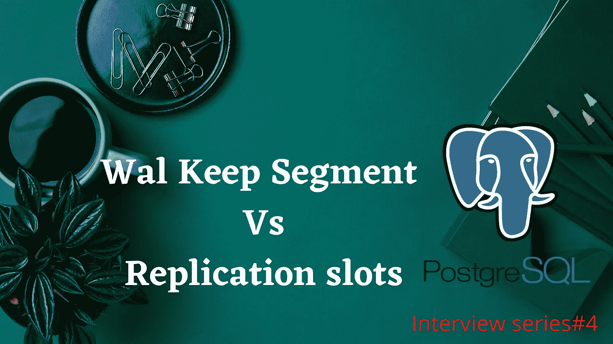

# PostgreSQL |访谈问答中的 Wal Keep 段和复制槽之间的区别

> 原文：<https://medium.com/nerd-for-tech/difference-between-wal-keep-segment-and-replication-slots-in-postgresql-99dda36aecd2?source=collection_archive---------4----------------------->

了解 wal keep 段和复制槽之间的区别。



WAL 保留段与复制插槽

**什么是 WAL？**

*   WAL 代表预写日志
*   它是一个日志文件，包含对数据库集群所做的更改，主要用于数据库一致性。
*   通过使用 WAL 文件，我们可以在数据库未正确关闭时作为数据库恢复过程的一部分进行重放，或者我们还可以使用 WAL 日志重放复制到备用数据库的更改。

**什么是沃尔玛细分市场？**

*   指定数量的过去 WAL 日志保存在 PG_WAL 子目录下。
*   在流式复制中，备用服务器将从这里获取日志。
*   WAL 日志的每个段的大小是 16 MB
*   要在 postgresql.conf 中启用此参数“Wal _ Keep _ Segement”
*   默认情况下，wal_keep_segment 为 0。
*   例如，如果我们指定 100，日志将保存在 pg_wal 下。当批量事务保存在主服务器上时。与此同时，我们的奴隶在维修几个小时。然后生成下一个 wal 日志，第一个 WAL 日志将被自动弃用。
*   一旦备用服务器从维护中恢复，主服务器和从服务器之间可能会有延迟，或者如果您验证了日志文件，备用服务器有时会不同步

```
" LOG: started streaming WAL from primary at 0/53000000 on timeline 1FATAL: could not receive data from WAL stream: ERROR: requested WAL segment 000000010000000000000053 has already been removed
```

*   再次从头开始重新创建备用数据库
*   另一种方法是保持 wal_keep_segments 的高值，但是我们实际上不知道为维护 wal 日志而设置的更高的值是什么，并且设置的值越高，主服务器在 pg_wal 中耗尽空间的风险就越大。
*   此问题已在 9.4 版中通过“复制插槽”得到解决。

**什么是复制槽？**

*   复制插槽确保备用服务器通过复制插槽连接到主服务器，以检索所需的 WAL 日志。
*   要启用复制插槽，请在 Postgresql 中启用此参数“max_replication_slots”。会议
*   它有两种类型

*物理复制插槽

*逻辑复制插槽

*   通过使用复制槽，这些 wal 文件需要手动管理，并且它们的保留已经通过使用 wal_keep_segments 参数估计了在主端上维护的 wal 文件的数量。
*   即使备用服务器失去同步或断开连接，备用服务器仍然可以恢复，这是因为 WAL 文件将保留在主服务器上，直到恢复槽被删除。