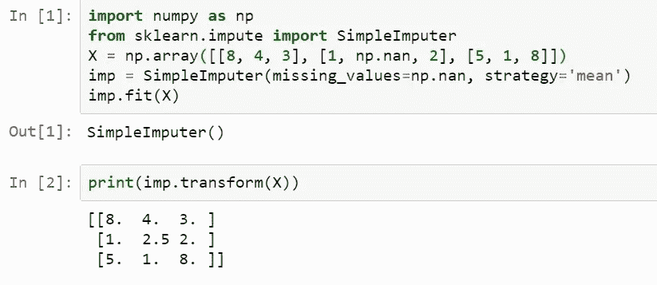
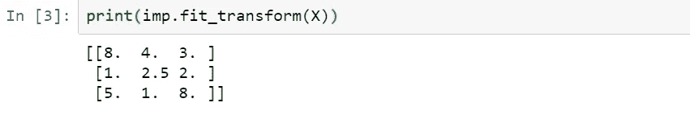

# Scikit-learn 中 fit()、transform()和 fit_transform()方法的区别。

> 原文：<https://medium.com/nerd-for-tech/difference-fit-transform-and-fit-transform-method-in-scikit-learn-b0a4efcab804?source=collection_archive---------5----------------------->

机器学习

Scikit-learn (Sklearn)是 Python 中最有用、最健壮的机器学习库。它的特点是一个干净、统一和流线型的 API。这种一致性的一个好处是，一旦您理解了一种模型的 Scikit-Learn 的基本用法和语法，切换到新的模型或算法就很简单了。

在为模型使用数据集时，我们通过数据转换技术来高效、轻松地检索战略信息。Scikit-learn 提供了一个变形器库，可以清理、减少(维度减少)、扩展或生成特征表示。

这些由具有 fit()、transform()和 fit_transform()方法的类表示。这些方法根据您希望使用的对象类型来使用。不管你是想用在“变形金刚”还是“模特”身上。

阅读完这篇文章后，你会对 fit()、transform()和 fit_transform()方法以及何时何地使用它们有更好的理解。

# 如果是变压器

变压器用于在建模前预处理数据。

*   **()**—此方法遍历训练数据，计算参数(如 StandardScaler 类中的均值(μ)和标准差(σ))，并将其保存为内部对象。
*   **transform()** —使用 fit()方法生成的参数现在被使用并应用于训练数据以更新它们。
*   **fit _Transform()** —这种方法对于同时建模和转换训练数据可能更方便和有效。

# 类比

如果你仍然有一点困惑，让我们看看这里。

让我们想象一下，你打算去参加一个聚会，你有一个着装要求要遵守。首先，你会检查你的衣柜，根据着装规范，你会计划你的装备。最后，就在你的派对之前，你会穿上那套衣服去。

在这里，您可以将基于服装代码的服装计划看作 fit()方法，将穿着服装去参加聚会看作 transform()方法。希望你明白这个比喻。🤞

注意:—

*   我们只对训练数据使用 **fit()** 方法。为什么？因为我们不知道我们的测试数据(看不见的数据)是什么，因此对测试数据使用 **fit()** 方法不会给我们一个关于我们的模型表现如何的好的估计。
*   我们对训练数据和测试数据使用 **transform()** 方法，因为我们需要在两种情况下执行转换。

# 我们用一个例子来理解。

为了处理训练数据中的缺失值，我们使用简单的估算器类。首先，我们对训练数据使用 fit()方法来计算训练数据的平均值，然后对相同的数据使用 transform()方法。这将把空值转换成平均值(使用 fit()方法计算)。

拟合()和变换()

我们还可以使用 fit_transform()方法同时完成这两个步骤。

拟合转换()

# 在模型的情况下

像线性回归模型、决策树模型、随机森林模型等模型。是用来做预测的。在将数据放入模型之前，您通常会对其进行预处理(使用转换器)。

*   **fit()** 方法在处理模型时用于计算训练数据的参数/权重，而 predict()方法使用测试数据的这些参数/权重来预测输出。
*   **transform()** 方法和 fit_transform()方法没有在模型中使用。

所以对于训练数据集，我们既要计算，又要做转换。但是对于测试数据集，机器学习基于在训练集中学习的内容来应用预测，因此它不需要计算，它只是执行转换。

**感谢阅读！😊**

嘿，这是我的第一篇文章。请鼓掌👏如果你喜欢的话。欢迎在评论中删除任何建议。