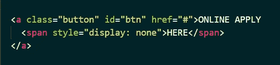
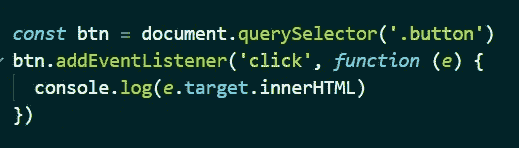
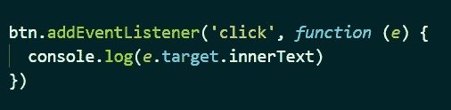
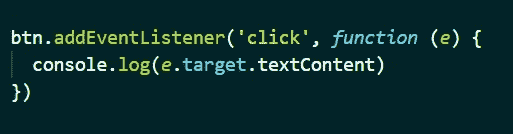

# Javascript 属性的差异(innerHTML、innerText、textContent)。

> 原文：<https://medium.com/nerd-for-tech/difference-in-javascript-properties-innerhtml-innertext-textcontent-444708838935?source=collection_archive---------3----------------------->

你听说过 DOM 操纵吗？让我们看看什么是 DOM？文档对象模型(DOM)是 HTML 的编程接口。简单地说，你的 HTML 文档的结构。DOM 是网页内容的树状表示，使用节点而不是元素。这些节点代表 HTML 元素，它们可以被操作和重新呈现。DOM 是分层的，遵循一个逻辑的
树状结构，子节点包含在父节点中。

文档对象模型(DOM)

在 DOM 上工作时，你会看到三个属性，即 innerText，innerHTML，textContent。你需要知道如何改变出现在页面上的文本或 HTML，使你的网站更具交互性。所有 innerText、innerHTML 和 textContent 属性都允许您访问和更改标记的内容。这就是 innerText 和 innerHTML、textContent HTML 属性的由来。人们有时会混淆这三个属性。是时候清除所有的困惑，了解在哪里使用这些属性了。

我们将用于示例的 HTML

**innerHTML**
JavaScript innerHTML 属性设置网页上元素的 HTML 内容。InnerHTML 是 HTML DOM 的一个属性，通常用于设置和修改< p >元素的内容。innerHTML 返回元素的内容以及任何间距和后代。innerHTML 返回元素包含的所有文本，包括 HTML 标记。

innerHTML 的 Javascript 代码

innerHTML 的 Javascript 代码(输出)

JavaScript innerText 属性设置被访问的网页上可见元素的文本内容。无法检索隐藏的内容。它还设置其子代的内容。innerText 返回不带任何后代或间距的文本。如果想以纯文本的形式查看元素的内容，可以使用 innerText。innerText 返回元素及其所有子元素包含的所有文本和标签。

innerText 的 Javascript 代码

innerText 的 Javascript 代码(输出)

**textContent**
在 textContent 中，可以访问包括隐藏内容在内的所有文本。textContents 是元素及其所有子元素包含的所有文本，仅用于格式化。

textContent 的 Javascript 代码

textContent 的 Javascript 代码(输出)