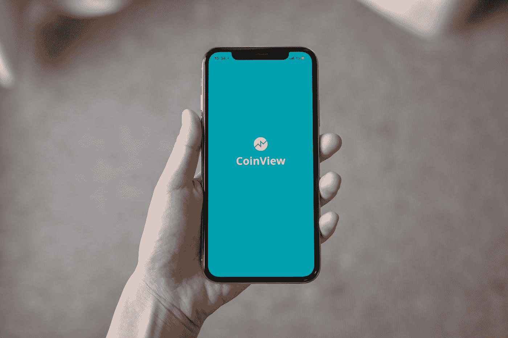

# 不同类型的开发人员

> 原文：<https://medium.com/nerd-for-tech/different-breeds-of-developers-in-it-6964f3d5c86a?source=collection_archive---------0----------------------->

## 我是其中一些人的后代。

照片由[詹姆斯·庞德](https://unsplash.com/@jamesponddotco?utm_source=medium&utm_medium=referral)在 [Unsplash](https://unsplash.com?utm_source=medium&utm_medium=referral) 拍摄

开发者必不可少。

软件开发场景每天都在变化。专门类型的开发人员已经出现在招聘广告和公司名称中。理解每种类型的开发人员需要具备的技能对于新手来说是令人困惑的，对于非技术人员来说可能是令人畏惧的。

在这里，我解释了 13 种类型的开发人员以及他们的技能和工具。请注意，这些描述来自我的脑海，但它们可能会因公司、地区或行业的不同而有所波动。

# 1.前端开发人员

前端开发人员(也称为客户端开发人员)负责设计和构建视觉上吸引人的网站，并考虑到他们的目标用户。这是一个专门从事视觉用户界面(UI)编程的人，你在网站上看到的任何东西，包括它的美学和布局。基本上，他们为使用浏览器的人编写代码，这些浏览器可以在多种设备上运行。

没有人比前端开发者更接近用户。

这是非常高级的工作，通常远离硬件。它比计算机科学理论更需要对人机交互和设计原理的理解。事实是，开发与设计和编程都有很大关系。它们并不相互排斥。

前端开发人员的大部分时间都花在处理跨浏览器兼容性问题和调整 UI 的视觉呈现细节上。

前端开发技能包括使用 HTML、CSS、JavaScript 和不断增长的 UI 框架集合的 UI /UX 的设计。工具和技术总是在变化，所以前端开发人员总是需要跟上最新的东西。

# 2.后端开发人员

后端开发人员也称为服务器端开发人员，他们专注于软件系统的逻辑，也就是说，是什么让系统工作以及如何提高其性能。这个人专门研究在远程机器上运行的软件或系统的设计、实现、核心逻辑、性能和可伸缩性，比如在服务器上。

后端是系统的幕后部分。例如，Google 搜索引擎的前端部分是一个简单的 UI，有一个标题、一个文本框和 2 到 3 个按钮。后端是一个庞大复杂的系统，能够抓取网页，索引，并通过一系列复杂的机制找到你想要的东西。

后端开发人员使客户端能够确认前端接口。

后端技术通常由 PHP、Ruby、Java、C++和 Python 等语言组成。这可能会影响后端开发人员的平均工资等级:精通一门像 Go 或 Rust 这样的语言往往会带来更高的工资。事实上，后端开发人员的平均收入比前端开发人员要高，即使他们的经验水平相同。

这里有一张图片，虽然不相关，但展示了后端和前端的区别。

# 3.全栈开发者

这个家伙是一个“前端+后端”的鸡尾酒，毫不费力地完成工作。他可以有效地替换这两种类型，因此可以处理程序的底层逻辑和 UI。

由于显而易见的原因，他们能够更好地同步后端和前端系统设计，并减少两者之间的冲突风险，这对于创建功能完整的 web 应用程序至关重要。

然而，因为他们的关注领域更大，他们有时更“万事通”，而不是在其中任何一个方面都非常专业。尽管如此，FullStack 开发人员倾向于获得比前端或后端开发人员更高的年薪。

> Web 开发者要么是前端开发者，要么是后端开发者，要么是中间层开发者，要么是全栈开发者。在 90 年代末和 21 世纪初，Web 开发成为进入软件工程世界的一种非常常见的方式。它的起点很低，只需要基本的 HTML 和 CSS 知识。只需几个月的经验，一个入门级的 web 开发人员就可以开始编写可以交付给生产系统的代码。对于没有 CS 基础，想投身编程界的人来说，是一个特别有吸引力的选择。

# 4.桌面开发者

桌面开发人员开发在个人笔记本电脑或台式电脑上运行的软件。这些软件应用程序被设计为在操作系统(如 Windows、Apple MacOSX 或 Linux)上本地运行。一些桌面开发者倾向于使用多种操作系统，而其他人则更喜欢一种特定的操作系统。

早在 80 年代，这是最常见的工程师类型之一，因 Turbo Pascal、Turbo C、Visual Basic、Quick C、Visual Studio 和 Delphi 等廉价开发环境而流行。

潘卡杰·帕特尔在 [Unsplash](https://unsplash.com?utm_source=medium&utm_medium=referral) 上的照片

桌面开发人员拥有一些与后端开发人员相同的技能，但通常熟悉使用 SDK 和 GUI 工具包，如 MFC、XAML、Cocoa 等。NET、XAML、WinForms、Gtk 等。

# 5.移动应用开发者

移动应用程序开发人员编写的代码可以在智能手机、平板电脑甚至可穿戴设备等便携式设备上运行。

照片由 [Unsplash](https://unsplash.com?utm_source=medium&utm_medium=referral) 上的 [CoinView App](https://unsplash.com/@coinviewapp?utm_source=medium&utm_medium=referral) 拍摄

这些人了解 iOS 和 Android 等移动操作系统的复杂性，以及用于在这些系统上编写软件的开发环境和框架。

有一些专门的前端开发人员使用基于 web 的平台和技术开发移动应用程序，如 React-native(JavaScript)和 Flutter(Dart)。其他人倾向于主要使用特定于 iOS 设备的语言(Objective-C/Swift)和 Android 设备的语言(Java/Kotlin)。

# 6.图形开发人员/设计师

图形开发人员编写用于渲染、着色和其他视觉效果的代码，这些代码在特效、视频游戏、电影、电视节目和其他视觉手段中创建复杂的图像。

照片由[卢卡斯·本杰明](https://unsplash.com/@aznbokchoy?utm_source=medium&utm_medium=referral)在 [Unsplash](https://unsplash.com?utm_source=medium&utm_medium=referral) 拍摄

他们往往拥有广泛的数学和算法背景知识，以及艺术技能和才华。，但随着开源结构的声名远扬，它变得越来越简单。

框架包括 DirectX，OpenGL，Unity 3D，WebGL。对于更高级的图形开发人员，低级开发需要 C、C++和汇编。

# 7.游戏开发商

游戏开发者是一个统称，用来标识专门编写游戏的开发者。由于当今视频游戏的复杂性，大多数程序员专注于游戏编程的特定领域，如声音、视觉、测试、可访问性等。没有大规模开发者或发行商背景的个人和小团队被称为*独立开发者。*他们中的一些人为现有游戏创建 mod。

照片由[JESHOOTS.COM](https://unsplash.com/@jeshoots?utm_source=medium&utm_medium=referral)在 [Unsplash](https://unsplash.com?utm_source=medium&utm_medium=referral) 上拍摄

游戏开发人员可以归入其他类别的开发人员，但他们通常在设计和实现引人入胜的交互式游戏体验方面拥有特定的知识和技能。

游戏开发者使用的框架包括 DirectX、OpenGL、Unity 3D、WebGL 以及 C、C++、Java 等语言。在移动设备上，Swift 和 Java 现在是 iOS 和 Android 游戏的首选技术。现在对于移动来说，像 GameMaker Studio，Unity，Unreal Engine 这样的游戏开发工具都在用。

# **8。数据库管理员**

数据库管理员(DBA)根据公司的需求建立数据库，并确保它们高效运行。关注细节和数据安全是这一职业的重要组成部分。

数据库管理员是该领域最有经验的开发人员，平均工作时间超过 9 年。

DBA 通常通过了特定数据库平台的认证，比如基于 SQL 的实现(比如 MySQL 和 PostgreSQL)，还可能包括更具体、更先进的 NoSQL 数据库(比如 MongoDB 和 Cassandra)。

# 9.DevOps

通常称为现场可靠性工程师(SRE)负责照顾生产过程。他们的主要关注点是在生产过程中确保应用程序的安全性，并保持对用户和开发人员的功能性。这要求熟悉系统开发所需的技术，以构建、部署、集成和管理后端软件和分布式系统。

他们通常使用 AWS 和 Azure 等云提供商以及 Splunk 等日志管理系统。他们往往更有经验，这就是他们高薪的原因。他们高薪的另一个原因是他们选择了 Ruby 和 Go 这样的前沿编程语言。

DevOps 工程师使用的技术包括 Kubernetes、Docker、Apache Mesos、HashiCorp stack (Terraform、vagger、Packer、Vault、Consul、Nomad)、Jenkins 等。

# 10.CRM 开发人员

CRM 代表客户关系管理，它只不过是一个在计算机工程和销售之间波动的角色。他们专门创建和维护收集和存储用户、消费者和商业信息的大型企业软件。

CRM 开发人员通过编写和实现特定种类的业务和客户管理代码，在提高销售和客户满意度方面发挥着关键作用。

企业级软件分为三类:

*   CRM 系统(如 SalesForce)
*   企业资源规划系统(如 SAP)
*   协作文档存储(CDS)系统(如 Sharepoint)

# 11.软件测试人员

这种类型的开发人员属于质量保证开发人员(QAs)。QAs 确保其他开发人员编写的代码不会破坏应用程序。

他们验证软件系统的质量，并在传统意义上通过手动使用软件来测试代码，以查看是否有多米诺骨牌倒下。他们中的一些人还通过模拟使用和检查错误来编写自动化测试的代码。这对于单独的特性(单元测试)和应用程序特性(集成测试)来说都是很方便的。

由于他们从事的是其他开发人员编写的代码，他们往往掌握许多编程语言的知识，其中流行的是 Java、Python 和 Ruby。他们属于经验最少的开发人员，他们的工资与前端和移动开发人员相当或更高。

QAs 使用的技术包括 Python、Ruby、Katalon Studio 和 Selenium。

# 12.网络安全开发者

这种产品致力于使基于软件的产品和服务更加安全。他们创建系统、方法和程序来测试软件系统的安全性并修复安全缺陷。白帽道德黑客就是这样一个例子，他试图渗透系统来发现漏洞(当然不是出于恶意)。

安全开发人员详细了解用于攻击软件系统的许多模式。更高级的安全开发人员需要阅读和理解用 C 和 C++编写的操作系统源代码。他们还可能对库和商业软件系统进行逆向工程，以发现和利用漏洞。

他们了解 Python、Java、C++等语言，以及类似的 RDBMS 语言，如 SQL。此外，还需要 QA、渗透测试和云计算方面的经验。

# 结论

我没有提到一些不常见的人，如中间层、WordPress 或大数据开发人员，因为他们或多或少都属于上述类别。嵌入式开发人员的角色主要围绕硬件基础设施。

有无限的可能性，无论你是从正规的 CS 教育开始，还是偶然进入个人项目的网络开发，或者试图创造一个 iPhone 游戏来赚钱。

一旦你走上正轨，你可以改变你的技能和提高知识。一个人可以学的东西没有止境。

# 如果你喜欢我的作品！

*   成为我的[职业网络](https://www.linkedin.com/in/prateek-aher/)的一部分
*   关注我的[推文](https://twitter.com/prateek_aher)
*   最后，继续关注我的帖子[这里](/@shadow_recruit)