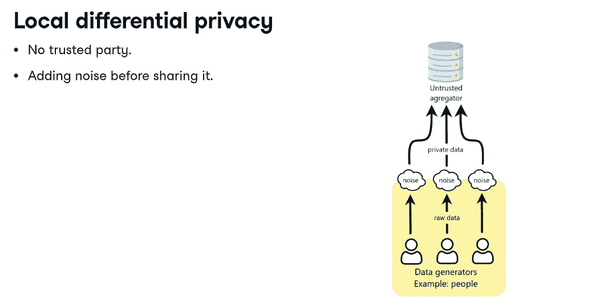
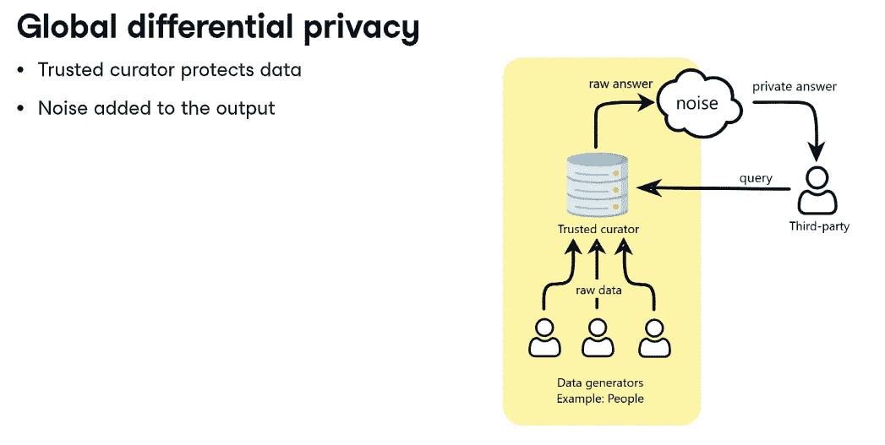
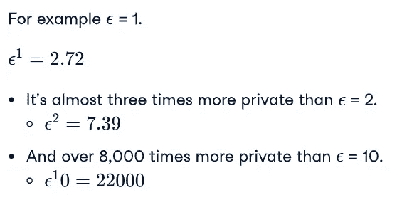
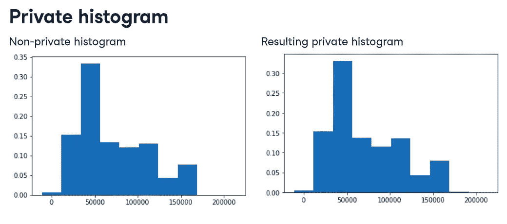
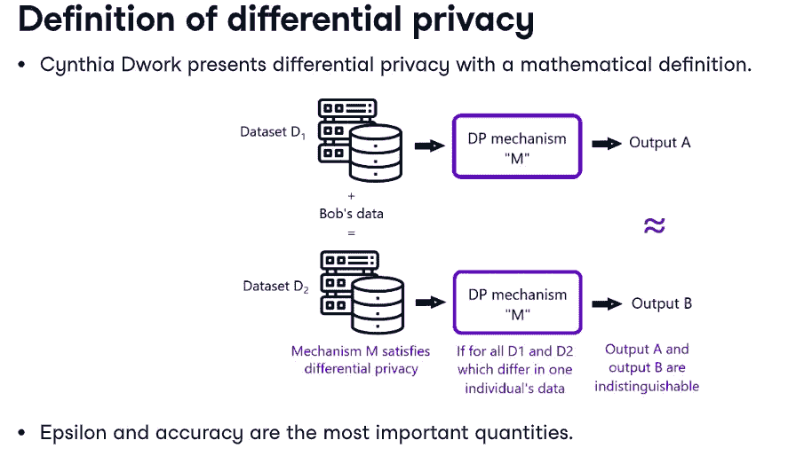
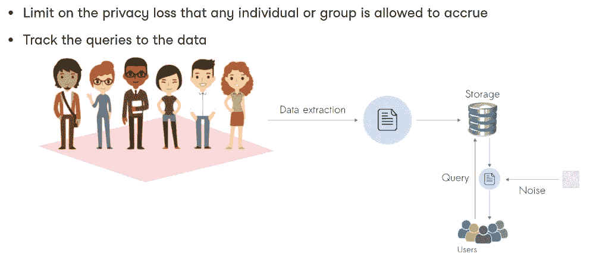
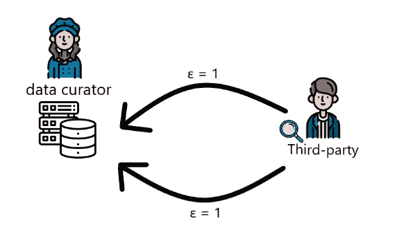
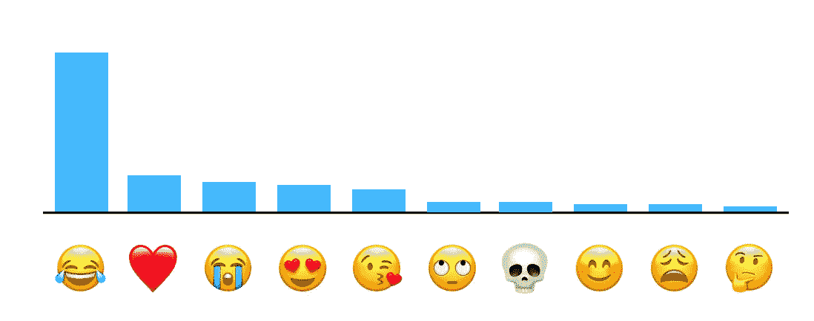

# 共享敏感数据时的差分隐私(I)。

> 原文：<https://medium.com/nerd-for-tech/differential-privacy-while-sharing-sensitive-data-ii-5eed98e48732?source=collection_archive---------7----------------------->

当数据在不同公司之间公开共享时，可能会涉及大量私人用户数据。为了共享数据，同时保持数据属性的私密性，我们使用了差异私密性。差分隐私是隐私的数学定义。

> **差分隐私** ( **DP** )是一种通过描述数据集中群体的模式，同时隐瞒数据集中个体的信息，公开共享数据集信息的系统。(来源维基百科)

有两种类型的差异隐私:

*   本地差分隐私
*   全局差异

来源:python 中的 Datacamp 数据隐私和匿名化

来源:python 中的 DataCamp 数据隐私和匿名化

## Epsilon 差分隐私

ε是衡量隐私的标准

源数据营

我们可以通过使用 **epsilon 差分隐私**来管理差分隐私。其中ε是隐私度量。ε越低，私密性越高。随着ε值的增加，隐私差异呈指数增长。0 到 1 之间的ε值被认为是高度隐私的。ε的值在 2 到 10 之间被认为比没有好。而 10 以上的数值几乎是共享暴露用户隐私的确切数据。

ε= 1 的系统比ε= 10 的系统私密性高 8000 倍

## k 匿名

源数据营

## 让我们看看不同的隐私有什么不同？

假设我们必须将数据从一个组织共享到另一个组织，但同时，我们希望保持用户数据的私密性。让我们假设我们在不同的组织间共享一些可变的浮动值。
非私有和私有直方图的结果直方图如下所示。

源数据营

这里你会注意到直方图看起来几乎相似(X 轴值)，但同时，我们将 y 轴参数私有化了。

## 为什么像苹果这样的组织使用差别隐私？

它使苹果能够了解用户群体，而无需了解群体中的个人。差分隐私会在信息离开用户设备之前转换与 Apple 共享的信息，这样 Apple 就永远无法复制真实数据。

## 组织的隐私预算:

不同的组织制定了不同的隐私预算。你可以认为隐私预算是衡量组织从用户那里收集数据的标准。在收集数据时，组织使用此隐私预算。

源数据营

如果第三方从数据管理器查询数据 2 次，ε为 1，则第三方实际收集ε值为 4 的数据。其中从每个查询收集的数据可以被聚集以减少用户的隐私。

来源:数据营

## 那什么才算够私密？

*   苹果在 2017 年使用了每天 14 英镑的 epsilon 预算
*   对于表情符号建议，今天苹果使用 4 的 epsilon 隐私预算，每天提交一个贡献。(来源:[https://www . apple . com/Privacy/docs/Differential _ Privacy _ overview . pdf](https://www.apple.com/privacy/docs/Differential_Privacy_Overview.pdf))

苹果收集的英国用户常用表情符号:

## 来源:

1.  DataCamp 在 Python 中的数据隐私和匿名化:

 [## 什么是隐私，我们为什么要关心？| Python

### 这是一个关于什么是隐私的例子，我们为什么要在乎？: .

campus.datacamp.com](https://campus.datacamp.com/courses/data-privacy-and-anonymization-in-python/) 

2.维基百科关于不同隐私的文章:

 [## 差异隐私—维基百科

### 差分隐私(DP)是一种公开共享数据集信息的系统，它通过描述数据集的模式来实现

en.wikipedia.org](https://en.wikipedia.org/wiki/Differential_privacy) 

3 苹果差分隐私概述:
[https://www . Apple . com/Privacy/docs/Differential _ Privacy _ overview . pdf](https://www.apple.com/privacy/docs/Differential_Privacy_Overview.pdf)

> 敬请关注下一篇关于计算隐私预算和差别化私有化机器学习模型的博客。如果你喜欢这个博客，请不要忘记投票并留下评论，它鼓励我写更多😃