# 基于最大似然算法的数字识别

> 原文：<https://medium.com/nerd-for-tech/digit-recognition-using-ml-algorithm-b8171caff87f?source=collection_archive---------8----------------------->

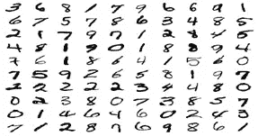

在这里，我将使用最大似然算法预测数字。我将使用三种流行的算法。

# **随机森林算法**

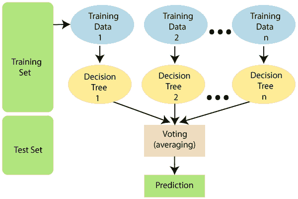

随机森林是一种流行的机器学习算法，属于监督学习技术。它可用于 ML 中的分类和回归问题。它基于**集成学习的概念，**集成学习是*组合多个分类器来解决复杂问题并提高模型性能的过程。*

顾名思义， ***“随机森林是一种分类器，它包含给定数据集的各个子集上的许多决策树，并取平均值以提高该数据集的预测准确性。”*** 随机森林不是依赖一棵决策树，而是从每棵树中提取预测，并基于预测的多数票，预测最终输出。

**森林中的树木数量越多，精确度越高，并可防止过度拟合的问题。**

随机森林分两个阶段工作，首先是通过组合 N 棵决策树来创建随机森林，其次是对第一阶段创建的每棵树进行预测。

工作过程可在以下步骤和图表中解释:

**步骤 1:** 从训练集中随机选择 K 个数据点。

**步骤 2:** 构建与所选数据点(子集)相关的决策树。

**步骤 3:** 为您想要构建的决策树选择数量 N。

**步骤 4:** 重复步骤 1 & 2。

**第五步:**对于新的数据点，找到每个决策树的预测，将新的数据点分配到赢得多数票的类别。

# **让我们编码**

我正在使用 jupyter 笔记本，它有助于我将预测可视化。

## 导入数据集和所需的库

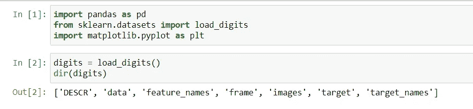

## 让我们看看数据

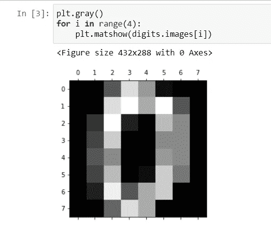

现在我已经删除了“目标”列，因为它有真值并保存在其他变量中。

## 现在我们将训练模型

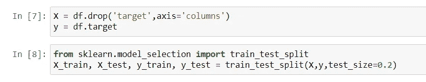

现在导入随机森林分类器并传递训练好的数据

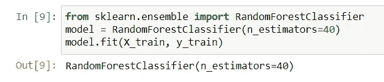

这里，当你保持 n 估计值为 10 或 20 时，你会得到较低的精度分数，这是因为我们之前已经看到更多数量的树更高的精度，但即使你保持 n 估计值大于 40，你也会得到相同的精度分数。让我们看看如何检查分数。

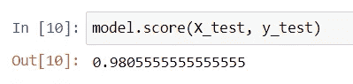

这里我们得到了 98%的准确率，这是很好的。

我们将会看到热图，在那里我们能够得到预测出错的地方。

为此我们需要得到混淆矩阵。

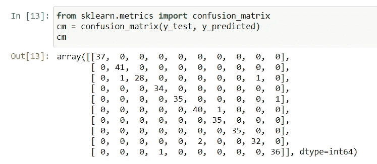

现在，在这个矩阵上，我们将构建热图。

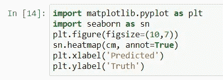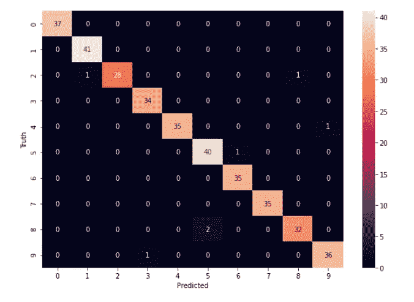

所以现在你可以看到预测是错误的。

# **K-最近邻算法**

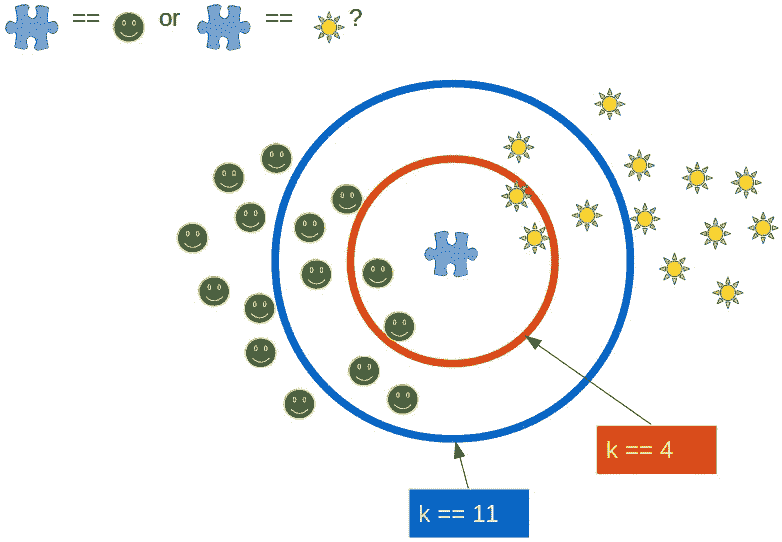

k 近邻算法是基于监督学习技术的最简单的机器学习算法之一。K-NN 算法假设新案例/数据与可用案例之间的相似性，并将新案例放入与可用类别最相似的类别中。

K-NN 算法存储所有可用的数据，并基于相似性对新的数据点进行分类。这意味着当新数据出现时，可以通过使用 K- NN 算法很容易地将其分类到一个很适合的类别中。K-NN 算法既可用于回归，也可用于分类，但主要用于分类问题。K-NN 是一种**非参数算法**，也就是说它不对底层数据做任何假设。

它也被称为**懒惰学习算法**，因为它不会立即从训练集中学习，而是存储数据集，并在分类时对数据集执行操作。训练阶段的 KNN 算法只是存储数据集，当它获得新数据时，它会将该数据分类到与新数据非常相似的类别中。

K-NN 的工作可以基于下面的算法来解释:

*   **第一步:**选择邻居的数量 K
*   **步骤 2:** 计算 **K 个邻居**的欧氏距离
*   **第三步:**根据计算出的欧氏距离取 K 个最近邻。
*   **步骤-4:** 在这 k 个邻域中，统计每个类别中的数据点的个数。
*   **步骤-5:** 将新数据点分配到邻居数量最大的类别。
*   **第六步:**我们的模型做好了。

# **现在让我们编码**

导入数据集和库

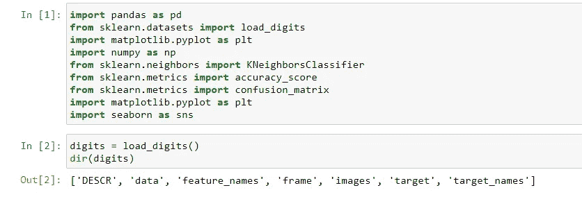

## 现在我们将训练模型

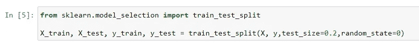

现在将使用 knn 分类器和使用欧几里德距离。

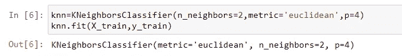

现在让我们检查分数

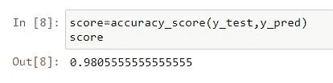

这里我们得到了 98%的准确率。

我们将会看到热图，在那里我们能够得到预测出错的地方。

为此我们需要得到混淆矩阵。

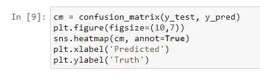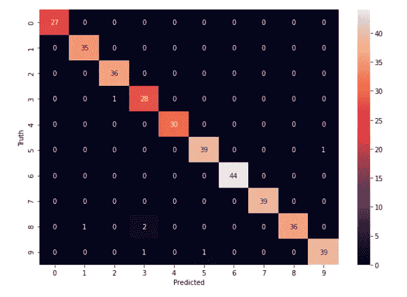

所以现在你可以看到预测是错误的。

# **支持向量机**

支持向量机或 SVM 是最流行的监督学习算法之一，用于分类和回归问题。然而，它主要用于机器学习中的分类问题。

SVM 算法的目标是创建可以将 n 维空间分成类的最佳线或决策边界，以便我们将来可以轻松地将新数据点放入正确的类别中。这个最佳决策边界称为超平面。

SVM 选择极值点/向量来帮助创建超平面。这些极端情况被称为支持向量，因此算法被称为支持向量机。考虑下图，其中有两个不同的类别，使用决策边界或超平面进行分类:

这个算法很难解释，但是当你使用它的时候，你只需要导入算法并使用它。您可以进一步搜索其后端统计数据。

## 让我们编码

导入数据集和所需的库

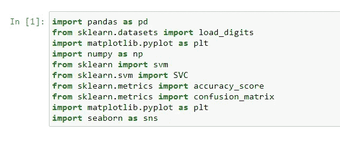

现在我们将训练数据

现在我们将使用 svm 分类器

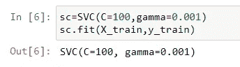

现在让我们检查分数

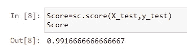

这里我们得到了 99%的准确率。

我们将会看到热图，在那里我们能够得到预测出错的地方。

为此我们需要得到混淆矩阵。

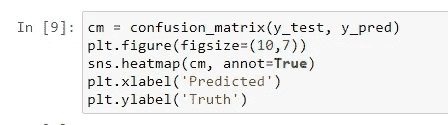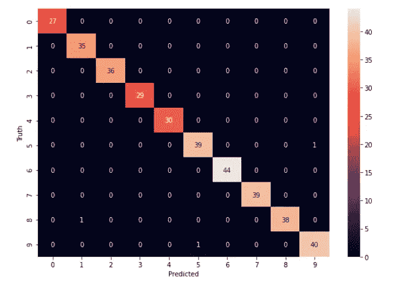

从这里你可以看到错误的预测值。

# **结论**

正如我们所看到的，在随机森林算法和 K 最近邻算法中准确率得分是 98%。您还可以看到，在热图中，错误的预测值并不相同。在 SVM，我们获得了最高的 98%的准确率。

关于代码，你可以访问我的 github 库

 [## megha 067/使用 ML 算法的数字识别

### 通过在 GitHub 上创建一个帐户，为 Meg ha 067/数字识别-使用-ML-算法的开发做出贡献。

github.com](https://github.com/Megha067/Digit-Recognition-using-ML-algorithms)