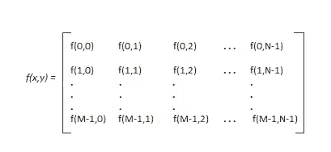
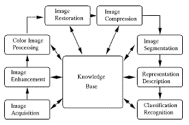
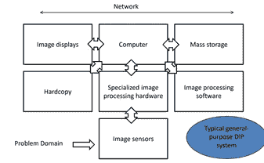

# 数字图像处理第一部分

> 原文：<https://medium.com/nerd-for-tech/digital-image-processing-part-1-1c14efa00509?source=collection_archive---------9----------------------->

> 注:这是《数字图像处理》一书的摘要，第 4 版，Rafael C. Gonzalez，田纳西大学 Richard E. Woods，MedData Interactive

**数字图像处理**是利用数字计算机通过某种算法对数字图像进行处理。

数字图像处理关注两个主要任务:

1.  用于人类解释的图像信息的改进
2.  用于自主机器感知的存储、传输和表示的图像数据的处理

图像被定义为二维函数 f(x，y ),其中 x 和 y 是空间(平面)坐标，f 在任一对坐标(x，y)处的幅度被称为图像在该点的强度或灰度级，参见图 1。

图一。矩阵形式的图像

当 x，y 和 f 的强度值是有限和离散的量时，我们称该图像为**数字图像**。像素用来表示数字图像的一个元素。

人类的视觉受限于电磁波谱的可视波段。但是成像机器几乎覆盖了从伽马射线到无线电波的整个电磁波谱。

DIP 的第一次应用是在报纸行业，当时照片首次通过海底电缆从伦敦发送到纽约。

用于图像的主要能量源是电磁能谱、超声波电子学。电磁波可以理解为波长变化的传播正弦波，也可以认为是以光速运动的波状无质量粒子。每个无质量粒子都包含一定的能量。每种能量被捆绑起来，称为光子。如果根据每个光子的能量把光谱带组合在一起，我们就可以得到从伽马射线到无线电波的光谱。

在核医学中，当患者被注射放射性同位素时，DIP 方法被用于扫描身体，放射性同位素在衰变时发出伽马射线。x 射线成像用于 CAT 扫描和工业成像。微带成像应用是雷达。它有能力在任何时间任何地区收集数据，不受天气影响。无线电波用于磁共振成像(MRI)。紫外成像的应用是在显微镜、激光、生物成像、天文观测等行业。可见和红外成像用于药物、材料表征等。

## **DIP 中的基本步骤(见图 2):**

图 DIP 的基本原理

**步骤 1-图像采集**:图像由传感器(如摄像机)采集，如果摄像机或传感器的输出不是数字形式，则使用模数转换器进行数字化

**步骤 2-图像增强:**处理图像的过程，使结果比原始图像更适合特定应用。

**步骤 3-图像恢复:**改善图像的外观。

**第四步——彩色图像处理:**利用图像的颜色提取图像中感兴趣的特征

**第五步——小波:**用于图像数据压缩。

**步骤 6-压缩:**减少保存图像所需存储空间或传输图像所需带宽的技术。

**步骤 7-形态学处理工具:**用于提取在形状的表示和描述中有用的图像成分。

**步骤 8:图像分割:**分割过程将图像分割成其组成部分或对象。

**第九步:表示和描述** —表示:决定数据应该表示为边界还是完整的区域。

**步骤 10:知识库**:将问题领域的知识以知识库的形式编码到图像处理系统中。

图 3-图像处理系统的组件

图 3 显示了图像处理所需的必要组件。

这是 Rafael C. Gonzalez 所著的《数字图像处理》一书第一章的摘要。想进一步了解这本书的内容，请阅读我的博客。谢谢大家，并喜欢，分享和评论你的建议…