# 数字图像处理第三部分

> 原文：<https://medium.com/nerd-for-tech/digital-image-processing-part-3-3256515a09e?source=collection_archive---------2----------------------->

*注:这是《数字图像处理》一书的摘要，第四版，拉斐尔·冈萨雷斯，田纳西大学理查德·伍兹，医学数据互动*

本文的主要目的是向读者介绍数学和图像增强技术…..

## **图像处理的数学工具**

**数组与矩阵运算:**

图像被视为矩阵。但是在这一系列的 DIP 中，我们使用的是数组操作。矩阵和数组运算是有区别的。在数组中，操作是在图像中逐像素进行的。

让我们来看这两幅图像:

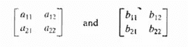

图 1:两张图片

那么矩阵运算就是:

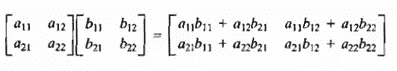

图 2:矩阵运算

而数组操作是:

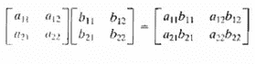

图 3:数组操作

**线性与非线性操作**

线性运算是对图像的加、减、乘、除。非线性运算是图像的最大值、最小值、中值、众数、平均值，用于图像增强。

**图像增强**

增强算法是一种为某些特定应用产生更好质量图像的算法，这可以通过抑制噪声或增加图像对比度来实现。

**图像增强/变换方法**

1.  **空间域方法:**技术基于图像中像素的直接操作
2.  **频域方法:**技术基于修改图像的傅立叶变换。
3.  **组合方法:**有一些基于前两类方法的各种组合的增强技术

**算术运算:**

1.  ***加法运算:***

假设 s(x，y)是新的受损图像，因为我们将噪声 g(x，y)添加到原始图像 f(x，y)以隐藏原始图像中的噪声***【x，y)=f(x，y)+g(x，y)*** 。向图像添加常数会使图像更亮，即 ***s(x，y)=f(x，y)+常数。***

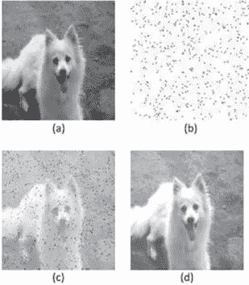

图 4: a)图像 1 b)图像 2 c)图像 1+图像 2 d)图像 1+常数

***2。减法运算:***

两幅图像之间的相减是 ***s(x，y)=f(x，y)-y(x，y)*** 。其中 f(x，y)是图像 1，g(x，y)是图像 2。图像减影的实际应用是在医学成像中，称为掩模模式射线照相术。从原始图像中减去常数会使图像变暗。

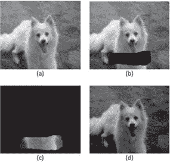

图 5: (a)图像 1 (b)图像 2 ( c)图像 1-图像 2 (d)图像 1-常数

***3。乘法运算:***

在这个方程中 ***h(x，y)=f(x，y)*g(x，y)*** ，h(x，y)是新形成的图像 f(x，y)是 image1，g(x，y)是 image2。我们也可以对一幅图像乘以常数，就像 ***h(x，y)=f(x，y)*常数一样。*** 乘法运算用于阴影校正。

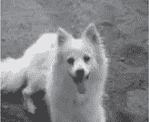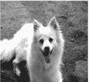

图 6: (a)图像 1，即原始图像(b)将图像 1 乘以 1.25，增加图像的对比度

***4。除法运算***

在除法运算 ***中 h(x，y)=f(x，y)/g(x，y)*** 其中 f(x，y)和 g(x，y)是两个图像，h(x，y)是形成的新图像。我们也可以把它除以常数即 ***h(x，y)=f(x，y)/常数。***

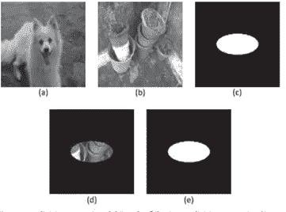

图 7: (a)图像 1/1.25 (b)图像 2 ( c)图像 3 (d)图像 4=图像 2 *图像 3 (e)图像 5 =图像 4/图像 2

**逻辑运算:**

逻辑运算是与、或、非、异或。

OR 的真值表是:

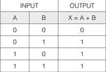

图 8:OR 的真值表

和的真值表是:

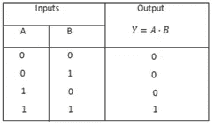

这里 0 表示黑色，1 表示白色。

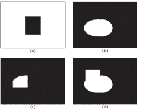

图 8: (a)图像 1 (b)图像 2 ( c)图像 1 和图像 2 (d)图像 1 或图像 2

**几何空间变换**

几何空间变换修改图像中像素之间的空间关系。

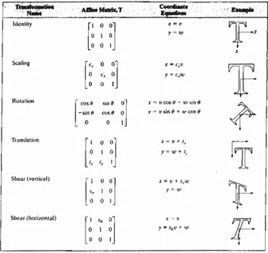

图 9:仿射变换

这是 Rafael C. Gonzalez 所著的《数字图像处理》一书第二章的摘要。想进一步了解这本书的内容，请阅读我的博客。谢谢大家，并喜欢，分享和评论你的建议…