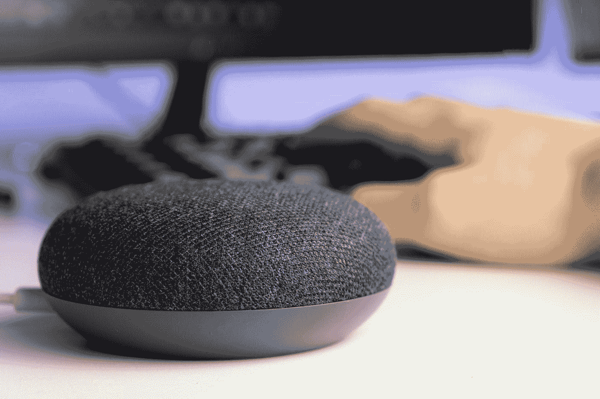

# 带智能扬声器的数字极简主义？？

> 原文：<https://medium.com/nerd-for-tech/digital-minimalism-with-smart-speakers-654aa0cdfb3d?source=collection_archive---------5----------------------->

莫里茨·金德勒在 [Unsplash](https://unsplash.com?utm_source=medium&utm_medium=referral) 上拍摄的照片

*注意:这篇文章既不赞助也不隶属于任何公司*

在过去的几年里，数字极简主义已经起飞，成为许多人看待技术的方式的一种彻底转变。随之而来的是大量的“专家”鼓吹各种东西，从获得一部基本的翻盖手机，使用 post，删除所有应用程序，或者干脆不使用手机。我……