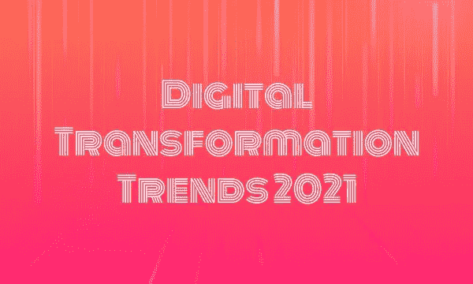

# 2021 年及以后的数字组织

> 原文：<https://medium.com/nerd-for-tech/digital-organization-in-2021-beyond-e883a0288bf9?source=collection_archive---------10----------------------->

*在数字化时代，所有公司，制造业&非制造业，都需要像软件公司一样思考&运营。不将包括人工智能&机器学习、大数据分析、算法在内的软件技术整合到他们的 DNA、组织结构&组织文化中的公司将不会在未来 5-10 年内开展业务。*

***(微软 CEO 塞特亚·纳德拉)***

# 介绍

接受数字技术，通过用数字流程取代非数字或手动流程来转变服务或业务，这被称为数字转型。数字解决方案可以通过自动化进一步提高效率。它还允许新类型的创新和创造，而不仅仅是加强和支持传统方法。

[“无纸化”或“数字化商业成熟”的概念是数字化转型的一个特征](https://www.technologiesinindustry4.com/)。这让个体企业和整个社会都感到不安，例如政府、大众传播、艺术、医疗保健和科学。

全球范围内，数字化转型的步伐并不一致。根据麦肯锡全球研究所(McKinsey Global Institute)2016 年发布的行业数字化指数，欧洲目前的数字化潜力为 12%，而美国为 18%。德国在欧洲运营了其 10%的数字潜力，尽管英国与美国接近，为 17%。

云计算的使用是数字化转型的一个例子。这降低了对用户自有硬件的依赖。它增加了对基于订阅的云服务的信任。这些数字解决方案中的一些提高了传统软件产品的能力。这种贡献模式同样减少了软件盗版，这是供应商的主要好处。

# 组织的数字化

数字化是工业、市场、组织和分支机构内部由工业引发的变化的业务流程。制造业的数字化辅助了新的生产流程。它们还实现了大量今天称为物联网、工业互联网和工业 4.0、机器对机器通信、人工智能和机器可视化的现象。

组织的数字化鼓励了新的商业模式、新的政府服务、电子支付、办公自动化和无纸化办公流程。智能手机、网络应用、云服务、电子身份识别、区块链、智能合约和加密货币等技术正在使用它们。他们还利用大数据促进商业智能。教育数字化带来了电子学习和 MOOC 课程。

数字化已经成为未来最重要的经济主题之一。它们不仅影响着经济，也影响着整个社会。由于不断变化的经济环境和不断变化的数字化进程，这些组织可能会面临主要挑战。

数字化可以定义为将信号和媒体对象(如文档、图像或声音)转换为数字形式。由于数字技术的采用和基于数字技术的系统的使用，这些信息通过数字设备和网络被处理、存储和传送。

数字化有不同程度的强度。它们是简单的展示和信息、销售渠道功能，以及通过虚拟产品或服务将业务流程集成到新的业务模型中。

围绕数字化的学术讨论被认为是有问题的。这是因为这种现象以前没有明确的定义。一个共同的错觉是数字化实际上意味着更多信息技术的使用。这是为了允许和利用数字技术和数据。然而，这一早期定义主要被上述定义所取代。

更多详情请访问:[https://www . technologiesinindustry 4 . com/2021/05/digital-organization-in-2021-beyond . html](https://www.technologiesinindustry4.com/2021/05/digital-organization-in-2021-beyond.html)