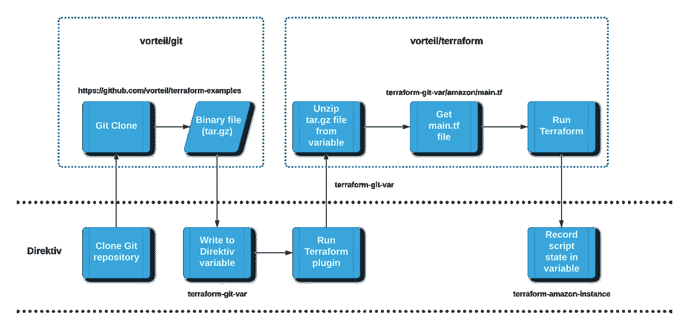

# Direktiv:在没有 Terraform 环境的情况下使用 Terraform 在 AWS 上构建机器？(第一部分)

> 原文：<https://medium.com/nerd-for-tech/direktiv-building-a-machine-on-aws-using-terraform-without-a-terraform-environment-def24fe3221d?source=collection_archive---------6----------------------->


Terraform 和 Direktiv 携手合作

> 第一个问题是怎么做？

Direktiv 是一个无服务器的工作流引擎，***技术上*** 意味着它按需旋转容器(使用 Kubernetes 和 Knative)并按照您定义的顺序关闭它们(工作流)。所以在 Terraform(或 Ansible，在另一篇文章中展示)的情况下，我们只是将提供者软件的最新版本作为一个容器！

> 第二个问题是为什么？

1.  Terraform 和 Ansible 是基础设施供应和管理的优秀解决方案，拥有大量插件和扩展。为什么我们要尝试重新发明轮子——尤其是如果你考虑到两者都被广泛采用的话。Direktiv 使用已经为这两种产品构建的插件、扩展和剧本，并将其扩展到我们提供的更广泛的微服务工作流架构中
2.  您可以获得这两种环境，而无需安装或维护它们(或持续运行它们的资源成本)。如果你不想使用我们提供的版本的[，就用最新的(或者你觉得合适的版本)更新](https://github.com/vorteil/direktiv-apps/tree/master/terraform) [Docker build](https://github.com/vorteil/direktiv-apps/blob/master/terraform/Dockerfile) 文件。这就是 Direktiv 工作流的短暂本质！

> 顺便说一下，这同样适用于 [Ansible 插件](https://github.com/vorteil/direktiv-apps/tree/master/ansible)和 [Docker 构建文件](https://github.com/vorteil/direktiv-apps/blob/master/ansible/Dockerfile)。
> 
> 你自己也可以这么做！安装[多功能一体机](https://docs.direktiv.io/docs/development.html)并配合使用！！

# Terraform 脚本

在这篇文章中，我们将看到一个地形脚本的实现。首先，我们将使用下面的 Terraform 脚本为 Amazon Web Services 提供一个虚拟机(Linux ):

用于将 Linux 机器部署到 AWS 的 Terraform 脚本

**注:此处** 为 GCP 和天蓝色 [**的例子**](https://github.com/vorteil/terraform-examples)

上面的 Terraform 脚本将把一台 Ubuntu 机器部署到一个 AWS 区域。我们将通过 Direktiv 工作流传递几个配置参数(region、secret 和 key)。

# Direktiv 工作流程

现在让我们来看看 YAML 的工作流程。我们将逐个州地分解这个工作流程。



各州的细目分类

## 获取地形脚本(Git)

让我们使用 [Git 插件](https://github.com/vorteil/direktiv-apps/tree/master/git)从 GitHub 获取 Terraform 脚本。让我们看看下面的工作流程摘录:

这是正在发生的事情的明细。Git 插件正在克隆我们的 Terraform 范例库。`git`命令的以下参数非常重要:

```
$out/instance/terraform-git-var
```

*   该插件将 git 克隆的输出(一个 tar.gz 文件)写入一个名为`terraform-git-var`的内部 Direktiv 变量。
*   参数的`/instance/`部分指示 Direktiv 在运行时只为工作流实例创建这个变量(这意味着这个值只对这个特定的工作流可用，并且只在它运行时创建——更多关于变量的信息[在这里](https://docs.direktiv.io/docs/walkthrough/persistent-data.html))。

实际上，我们现在有了一个完整的 Git 存储库，作为一个二进制 tar.gz 文件！

## 运行 Terraform 脚本

好的…我们开始吧！下面是调用 Terraform 的代码片段:

运行脚本的 Terraform 片段

好了，我们有了完整的二进制存储库，其中包含了我们要在一个名为`terraform-git-var`的变量中使用的 Terraform 脚本(位于`/amazon`目录中)。

因此，为了运行 Terraform 脚本，我们定义了名为`tfrun`的函数。`tfrun`接受几个输入:

*   `execution-folder: terraform-git-var/amazon`:这是一个指向 Git 存储库的位置(变量+Git 目录结构，其中有`main.tf`文件)
*   `action: jq(.action)`:动作 Terraform 需要应用于脚本，作为 JSON 输入传递，格式如下:

```
{
   "action": "apply"
}
```

*   `args-on-init: ["-backend-config=address=http://localhost:8001/terraform-amazon-instance`:我们要求 Terraform 将脚本的状态输出传递回容器(“插件”)，并将其存储在一个名为`terraform-amazon-instance`的变量中，以便在以后的阶段或不同的工作流中使用(稍后将详细介绍)
*   `variables`:这些是 Terraform `main.tf`脚本使用的变量。最重要的部分是`state-name`需要匹配到`args-on-init`值的前一个值。

现在让我们看看`tfrun`的`function`定义:

*   `image`:指示 Direktiv 使用`vorteil/terraform:v1`容器作为插件或扩展
*   `files`:这个申报在[这里](https://docs.direktiv.io/docs/specification.html#functionfiledefinition)记载。Direktiv 的这个特性指示函数获取被定义为`instance`作用域变量(`scope: instance`)的`terraform-git-var`变量(`key: terraform-git-var`，并将其解压缩为`tar.gz`文件类型！

理解上述内容的重要性非常重要——这意味着变量中的文件可以作为容器的挂载和共享驱动器使用！它还允许容器的`execution-folder`参数从目录中读取`main.tf`文件。

## 清理并通知

最后两个状态检查发送到 Terraform 脚本的`action`(或者`apply`或者`destroy`)。如果是`apply`，则发送一条与机器详细信息不一致的消息。

# 最终工作流程

以下是工作流程的视频:

这是最终的工作流程:

一如既往，欢迎反馈和提问！

PS:有人要求看工作流的输出。以下是“应用”操作输出:

```
[38;5;248m[10:31:48.257][0m Preparing workflow triggered by API. 
[38;5;248m[10:31:48.356][0m Running state logic -- clone-terraform-examples:1 (action) 
[38;5;248m[10:31:48.431][0m Sleeping until function 'git-command' returns. 
[38;5;248m[10:31:49.991][0m running command 0 'clone [https://github.com/vorteil/terraform-examples.git](https://github.com/vorteil/terraform-examples.git) /mnt/shared/1uxr6qlijtrPRTCPEE9nwRJ9LyO/out/instance/terraform-git-var' 
[38;5;248m[10:31:50.754][0m Function 'git-command' returned. 
[38;5;248m[10:31:50.762][0m Transitioning to next state: deploy-aws (2). 
[38;5;248m[10:31:50.769][0m Running state logic -- deploy-aws:2 (action) 
[38;5;248m[10:31:50.769][0m {
  "action": "apply",
  "return": {
    "cmd0": {
      "cmd": "clone [https://github.com/vorteil/terraform-examples.git](https://github.com/vorteil/terraform-examples.git) /mnt/shared/1uxr6qlijtrPRTCPEE9nwRJ9LyO/out/instance/terraform-git-var",
      "output": "/mnt/shared/1uxr6qlijtrPRTCPEE9nwRJ9LyO/out/instance/terraform-git-var"
    }
  }
} 
[38;5;248m[10:31:50.769][0m Decrypting secrets. 
[38;5;248m[10:31:50.782][0m Sleeping until function 'tfrun' returns. 
[38;5;248m[10:31:53.533][0m adding to the global map to control action ids 
[38;5;248m[10:31:53.628][0m Checking if tfstate service http backend is alive... 
[38;5;248m[10:31:53.706][0m Wait till backend service is functional 
[38;5;248m[10:31:53.776][0m Initializing terraform.... 
[38;5;248m[10:31:53.840][0m Reading in TFVars.json... 
[38;5;248m[10:31:53.180][0m 
[0m[1mInitializing the backend...[0m

[38;5;248m[10:31:53.186][0m Fetching tfstate variable... 
[38;5;248m[10:31:53.190][0m [0m[32m
Successfully configured the backend "http"! Terraform will automatically
use this backend unless the backend configuration changes.[0m
2021/07/07 00:31:53 [DEBUG] GET [http://localhost:8001/terraform-amazon-instance](http://localhost:8001/terraform-amazon-instance)

[38;5;248m[10:31:53.214][0m 
[0m[1mInitializing provider plugins...[0m
- Finding latest version of hashicorp/aws...

[38;5;248m[10:31:54.625][0m - Installing hashicorp/aws v3.48.0...

[38;5;248m[10:32:01.466][0m - Installed hashicorp/aws v3.48.0 (signed by HashiCorp)Terraform has created a lock file [1m.terraform.lock.hcl[0m to record the provider
selections it made above. Include this file in your version control repository
so that Terraform can guarantee to make the same selections by default when
you run "terraform init" in the future.[0m

[38;5;248m[10:32:01.474][0m 
[0m[1m[32mTerraform has been successfully initialized![0m[32m[0m
[0m[32m
You may now begin working with Terraform. Try running "terraform plan" to see
any changes that are required for your infrastructure. All Terraform commands
should now work.If you ever set or change modules or backend configuration for Terraform,
rerun this command to reinitialize your working directory. If you forget, other
commands will detect it and remind you to do so if necessary.[0m

[38;5;248m[10:32:01.479][0m Executing 'apply' for terraform 
[38;5;248m[10:32:02.152][0m 2021/07/07 00:32:02 [DEBUG] GET [http://localhost:8001/terraform-amazon-instance](http://localhost:8001/terraform-amazon-instance)

[38;5;248m[10:32:02.157][0m Fetching tfstate variable... 
[38;5;248m[10:32:09.194][0m [0m[1maws_instance.web: Creating...[0m[0m

[38;5;248m[10:32:19.161][0m [0m[1maws_instance.web: Still creating... [10s elapsed][0m[0m

[38;5;248m[10:32:21.572][0m [0m[1maws_instance.web: Creation complete after 13s [id=i-0382710118e5f441d][0m

[38;5;248m[10:32:21.588][0m 2021/07/07 00:32:21 [DEBUG] POST [http://localhost:8001/terraform-amazon-instance](http://localhost:8001/terraform-amazon-instance)

[38;5;248m[10:32:21.592][0m Saving new tfstate variable... 
[38;5;248m[10:32:21.617][0m [33m╷[0m[0m
[33m│[0m [0m[1m[33mWarning: [0m[0m[1mValue for undeclared variable[0m
[33m│[0m [0m
[33m│[0m [0m[0mThe root module does not declare a variable named "state-name" but a value
[33m│[0m [0mwas found in file "terraform.tfvars.json". If you meant to use this value,
[33m│[0m [0madd a "variable" block to the configuration.
[33m│[0m [0m
[33m│[0m [0mTo silence these warnings, use TF_VAR_... environment variables to provide
[33m│[0m [0mcertain "global" settings to all configurations in your organization. To
[33m│[0m [0mreduce the verbosity of these warnings, use the -compact-warnings option.
[33m╵[0m[0m
[0m[1m[32m
Apply complete! Resources: 1 added, 0 changed, 0 destroyed.
[0m[0m[1m[32m
Outputs:[0mip-address = "3.26.57.150"

[38;5;248m[10:32:21.632][0m Sending output back to direktiv... 
[38;5;248m[10:32:22.320][0m Fetching tfstate variable... 
[38;5;248m[10:32:22.359][0m Fetching tfstate variable... 
[38;5;248m[10:32:22.385][0m Function 'tfrun' returned. 
[38;5;248m[10:32:22.386][0m Transforming state data. 
[38;5;248m[10:32:22.393][0m Transitioning to next state: check_apply_or_destroy (3). 
[38;5;248m[10:32:22.399][0m Running state logic -- check_apply_or_destroy:3 (switch) 
[38;5;248m[10:32:22.399][0m {
  "action": "apply",
  "amazon_ip": "3.26.57.150"
} 
[38;5;248m[10:32:22.399][0m Switch condition 0 succeeded 
[38;5;248m[10:32:22.403][0m Transitioning to next state: send_message (4). 
[38;5;248m[10:32:22.410][0m Running state logic -- send_message:4 (action) 
[38;5;248m[10:32:22.410][0m Decrypting secrets. 
[38;5;248m[10:32:22.421][0m Sleeping until function 'discordmsg' returns. 
[38;5;248m[10:32:24.578][0m Function 'discordmsg' returned. 
[38;5;248m[10:32:24.585][0m Workflow completed.
```