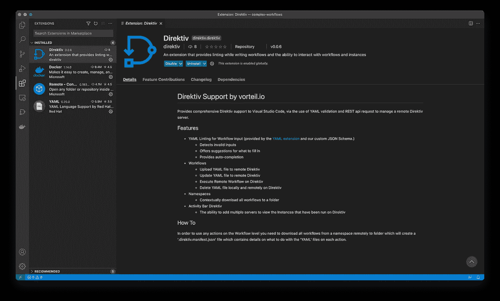
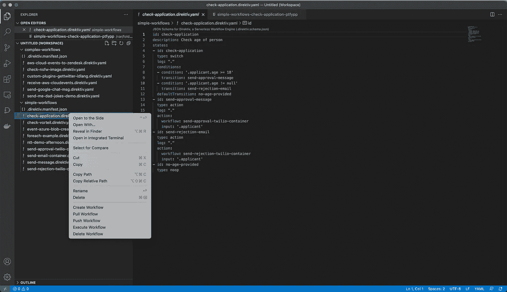
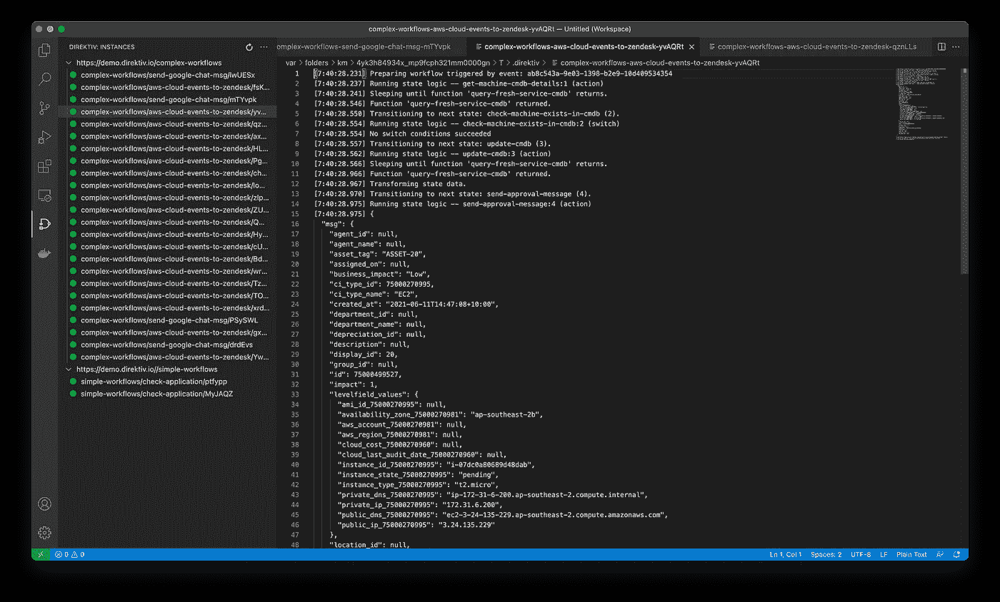
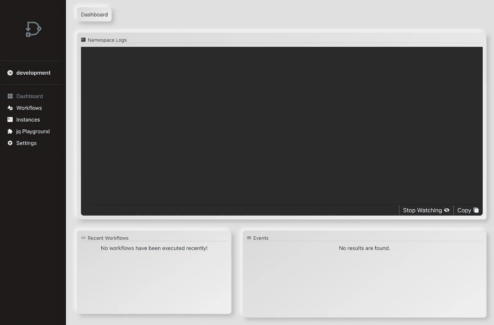
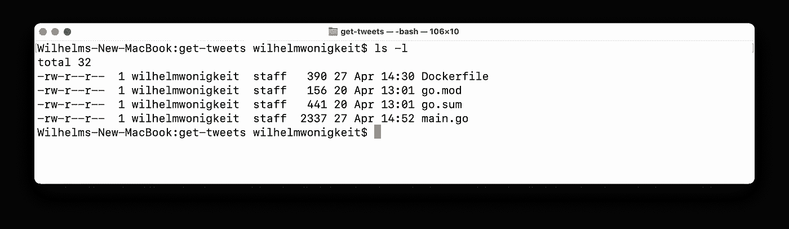
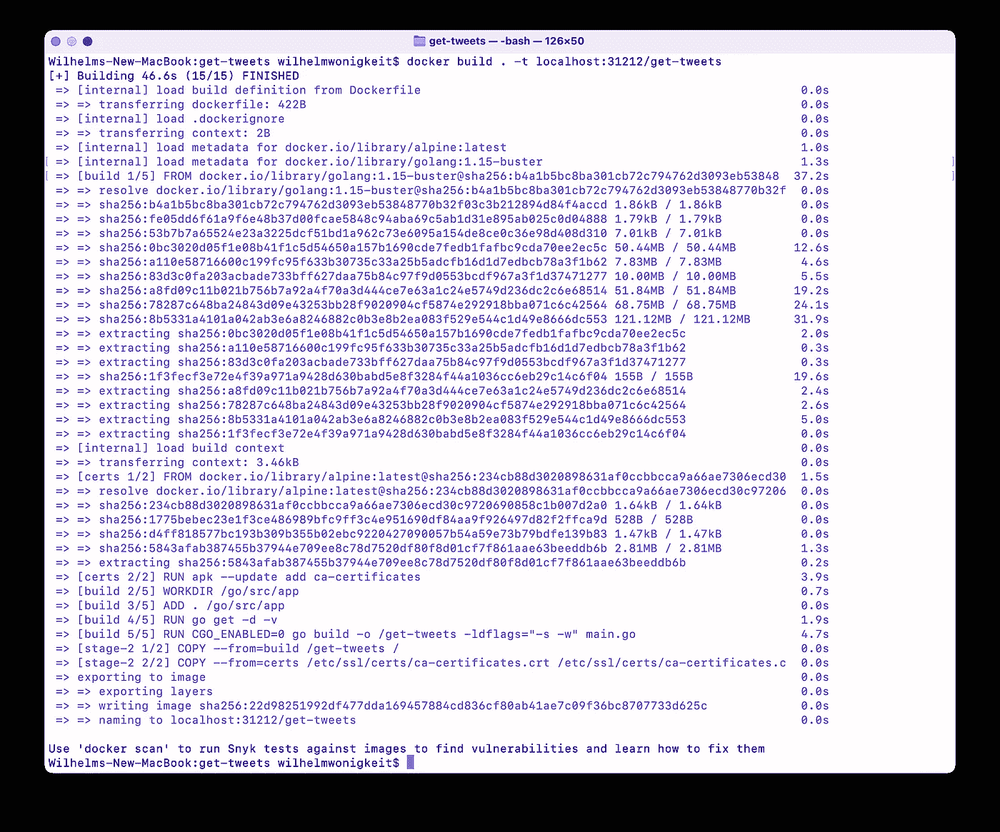
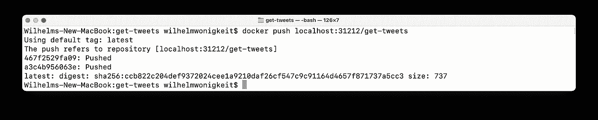

# Direktiv:新的开发环境& VSCode 插件！

> 原文：<https://medium.com/nerd-for-tech/direktiv-new-dev-environment-vscode-plugin-ab047b7a8266?source=collection_archive---------12----------------------->

保持我们推出新功能的传统(同时修复一些错误，提高性能和安全性……我向您展示另一个更新！

v0.3.1 带来了:

*   改进的重试机制
*   修复了超时问题
*   添加了 kubernetes 网络策略

但是，我将讨论两个没有出现在发行说明中的更新:

1.  VSCode 集成
2.  您的笔记本电脑(或台式机)上的 Direktiv 实例！

# VScode …很好看

大多数编排、自动化和工作流引擎都有一个恼人的问题，那就是它们的 ide(或者说缺乏 ide)。在构建 Direktiv 时，我们有意识地决定希望永远不要落入这个陷阱。我们希望将该解决方案集成到现有的 ide 中，以确保用户可以利用 ide 提供的所有其他功能和集成。

VSCode Direktiv 集成可从 [VSCode marketplace](https://marketplace.visualstudio.com/items?itemName=direktiv.Direktiv) 获得(或者在 VSCode:



VSCode 的 Direktiv 插件

对于构建工作流的开发人员来说，该插件支持几个基本特性。

## 林挺

用于工作流输入的 AML 林挺(由 [YAML 扩展](https://marketplace.visualstudio.com/items?itemName=redhat.vscode-yaml)和我们的定制 JSON 模式提供)。)

*   检测无效输入
*   为填写内容提供建议
*   提供自动完成功能

## 工作流修订

因此，您已经编写了工作流，对它进行了标记，现在您已经准备好运行它了。使用内置插件功能，开发人员能够:

*   创建新的工作流定义
*   从 Direktiv 服务器获取更新的工作流；或者将工作流的最新版本推送到 Direktiv 服务器
*   从 VSCode 远程执行工作流
*   从 Direktiv 服务器中删除工作流程

Direktiv 和 VSCode 还会跟踪工作流的版本，因此如果您试图覆盖同一工作流文件的较新版本，将会发出警告！



修订控制和工作流配置管理

## 工作流程管理

什么比直接从 VSCode 运行工作流更好？当然是获取输出和调试信息！



运行工作流实例输出和调试信息

这就是 VSCode 集成的全部内容…现在来看看新的开发环境！

# 盒子里的 Direktiv！

嗯，至少…为了开发的目的！Direktiv 需要一个容器注册中心(通常是 Docker Hub，但是您也可以添加自己的注册中心)来将容器作为 Direktiv 插件拉过来。这可能并不总是可用或必要的。

为了支持“轻量级”开发环境和独立运行 Direktiv，我们发布了 Direktiv 开发版本。使用起来极其简单:

1.  在你的笔记本电脑或台式机上安装 Docker
2.  运行以下命令:

```
docker run --privileged -p 8080:80 -p 31212:31212 --env PERSIST=true  -ti -v /tmp/pg:/tmp/pg vorteil/direktiv-kube
```

3.等待几分钟，让 k3s、Knative 和 Direktiv 组件启动！一旦一切就绪并开始运行，您应该能够通过以下网址访问 Direktiv 引擎:

```
http://localhost:8080
```



开发环境启动并运行

作为参考，这是我的 Docker 配置:


我的开发环境的 Docker 资源设置

这与之前的版本有什么不同？

*   **持久存储**:Direktiv 容器将数据库数据存储在 */tmp/pg* 中。这个目录可以映射到一个本地目录，这在使用`-v /tmp/pg:/tmp/pg`命令的命令中进行了演示。通过将`PERSIST`环境变量的值设置为`true`来启用持久存储。
*   **内置容器注册表**:为了便于开发，direktiv docker 容器附带了一个注册表。在`localhost`港口`31212.`可以到达

现在你可以开发和测试你自己的 Direktiv 插件了——舒服地坐在沙发上，不需要连接到 hub.docker.com 或任何其他注册表！

我们试试吧！我之前使用下面的[库构建了一个 Twitter](https://github.com/wwonigkeit/medium-build-custom-plugins)“scraper”工作流(完整文章[在这里](https://blog.direktiv.io/direktiv-serverless-custom-plugins-in-go-java-node-python-or-rust-or-anything-1b41a257af91))。该 repo 的内容如下所示，但主要包含 Golang 代码和 Docker 构建文件:



GitHub 存储库的内容

按照 Direktiv 文档库中的[指令](https://docs.direktiv.io/docs/development.html)，让我们将应用程序构建到本地存储库中。我将从包含 docker 文件的目录中运行 docker build 命令:

```
docker build . -t localhost:31212/get-tweets
```



Direktiv get-tweets 插件/容器已构建

接下来，让我们将新构建的容器推送到运行 Direktiv 的本地存储库:

```
docker push localhost:31212/get-tweets
```



新构建的 get-tweet 现在在本地存储库中可用

我们现在需要做的就是使用我们之前创建的工作流的修改版本(如下所示):

让我们运行上面的工作流程！创建一个运行它的命名空间:

```
wilhelmwonigkeit$ curl -X POST http://localhost:8080/api/namespaces/get-tweets{"name":"get-tweets","createdAt":{"seconds":1624878692,"nanos":972232610}}
```

下一次上传来自上面的要点:

```
wilhelmwonigkeit$ curl -X POST -H "Content-Type: text/yaml" --data-binary @get-tweets.yaml http://localhost:8080/api/namespaces/get-tweets/workflows{"id":"custom-gettwitter","revision":0,"active":true,"createdAt":{"seconds":1624878902,"nanos":784384253}}
```

运行它！

```
wilhelmwonigkeit$ curl -X POST http://localhost:8080//api/namespaces/get-tweets/workflows/custom-gettwitter/execute?wait=true --data '{"username":"Twitter"}'{
  "return": [
    {
      "Error": null,
      "HTML": "pls stop posting screenshots of Tweets on IG Stories. you can now share Tweets directly on iOS. <br><br>-management <br><a href=\"[https://t.co/wpjnElsRTK\](https://t.co/wpjnElsRTK\)"></a>",
      "Hashtags": null,
      "ID": "1407421738305077253",
      "IsPin": false,
      "IsQuoted": false,
      "IsReply": false,
      "IsRetweet": false,
      "Likes": 17357,
      "PermanentURL": "[https://twitter.com/Twitter/status/1407421738305077253](https://twitter.com/Twitter/status/1407421738305077253)",
      "Photos": [
        "[https://pbs.twimg.com/media/E4gqnIlWUAgQ3yw.jpg](https://pbs.twimg.com/media/E4gqnIlWUAgQ3yw.jpg)",
        "[https://pbs.twimg.com/media/E4gqnO0WYAUja5s.jpg](https://pbs.twimg.com/media/E4gqnO0WYAUja5s.jpg)"
      ],
      "Replies": 1714,
      "Retweet": {
        "ID": "",
        "TimeParsed": "0001-01-01T00:00:00Z",
        "Timestamp": 0,
        "UserID": "",
        "Username": ""
      },
      "Retweets": 3713,
      "Text": "pls stop posting screenshots of Tweets on IG Stories. you can now share Tweets directly on iOS. \n\n-management [https://t.co/wpjnElsRTK](https://t.co/wpjnElsRTK)",
      "TimeParsed": "2021-06-22T19:34:25Z",
      "Timestamp": 1624390465,
      "URLs": null,
      "UserID": "783214",
      "Username": "Twitter",
      "Videos": null
    },
    {
      "Error": null,
      "HTML": "RT <a href=\"[https://twitter.com/barrybongss2\](https://twitter.com/barrybongss2\)">[@barrybongss2](http://twitter.com/barrybongss2)</a>: You're someone's favorite twitter account",
      "Hashtags": null,
      "ID": "1406998466002358280",
      "IsPin": false,
      "IsQuoted": false,
      "IsReply": false,
      "IsRetweet": true,
      "Likes": 0,
      "PermanentURL": "[https://twitter.com/Twitter/status/1406998466002358280](https://twitter.com/Twitter/status/1406998466002358280)",
      "Photos": null,
      "Replies": 0,
      "Retweet": {
        "ID": "1406063666970173441",
        "TimeParsed": "2021-06-19T01:37:56Z",
        "Timestamp": 1624066676,
        "UserID": "965731654387077122",
        "Username": "barrybongss2"
      },
      "Retweets": 4236,
      "Text": "RT [@barrybongss2](http://twitter.com/barrybongss2): You're someone's favorite twitter account",
      "TimeParsed": "2021-06-21T15:32:29Z",
      "Timestamp": 1624289549,
      "URLs": null,
      "UserID": "783214",
      "Username": "Twitter",
      "Videos": null
    },
    {
      "Error": null,
      "HTML": "zero likes is a vibe",
      "Hashtags": null,
      "ID": "1404867971349159945",
      "IsPin": false,
      "IsQuoted": false,
      "IsReply": false,
      "IsRetweet": false,
      "Likes": 88259,
      "PermanentURL": "[https://twitter.com/Twitter/status/1404867971349159945](https://twitter.com/Twitter/status/1404867971349159945)",
      "Photos": null,
      "Replies": 5483,
      "Retweet": {
        "ID": "",
        "TimeParsed": "0001-01-01T00:00:00Z",
        "Timestamp": 0,
        "UserID": "",
        "Username": ""
      },
      "Retweets": 11096,
      "Text": "zero likes is a vibe",
      "TimeParsed": "2021-06-15T18:26:40Z",
      "Timestamp": 1623781600,
      "URLs": null,
      "UserID": "783214",
      "Username": "Twitter",
      "Videos": null
    },
    {
      "Error": null,
      "HTML": "how are you, lies only",
      "Hashtags": null,
      "ID": "1403022553145352203",
      "IsPin": false,
      "IsQuoted": false,
      "IsReply": false,
      "IsRetweet": false,
      "Likes": 80594,
      "PermanentURL": "[https://twitter.com/Twitter/status/1403022553145352203](https://twitter.com/Twitter/status/1403022553145352203)",
      "Photos": null,
      "Replies": 22972,
      "Retweet": {
        "ID": "",
        "TimeParsed": "0001-01-01T00:00:00Z",
        "Timestamp": 0,
        "UserID": "",
        "Username": ""
      },
      "Retweets": 7606,
      "Text": "how are you, lies only",
      "TimeParsed": "2021-06-10T16:13:38Z",
      "Timestamp": 1623341618,
      "URLs": null,
      "UserID": "783214",
      "Username": "Twitter",
      "Videos": null
    },
    {
      "Error": null,
      "HTML": "RT <a href=\"[https://twitter.com/pixyIuvr\](https://twitter.com/pixyIuvr\)">[@pixyIuvr](http://twitter.com/pixyIuvr)</a>: my parents didn't listen to me as a child so now i overshare on twitter",
      "Hashtags": null,
      "ID": "1400572428837863425",
      "IsPin": false,
      "IsQuoted": false,
      "IsReply": false,
      "IsRetweet": true,
      "Likes": 0,
      "PermanentURL": "[https://twitter.com/Twitter/status/1400572428837863425](https://twitter.com/Twitter/status/1400572428837863425)",
      "Photos": null,
      "Replies": 0,
      "Retweet": {
        "ID": "1400206792802521091",
        "TimeParsed": "2021-06-02T21:44:48Z",
        "Timestamp": 1622670288,
        "UserID": "1231957240204218370",
        "Username": "pixyIuvr"
      },
      "Retweets": 28709,
      "Text": "RT [@pixyIuvr](http://twitter.com/pixyIuvr): my parents didn't listen to me as a child so now i overshare on twitter",
      "TimeParsed": "2021-06-03T21:57:43Z",
      "Timestamp": 1622757463,
      "URLs": null,
      "UserID": "783214",
      "Username": "Twitter",
      "Videos": null
    }
  ],
  "username": "Twitter"
}
```

就是这样！现在您正在运行自己的容器，它保留在 Direktiv 工作流的本地存储库中！

有关上述内容的大量信息，请点击此处:

[](https://docs.direktiv.io/docs/development.html) [## 发展环境

### 为了改进隔离和工作流开发，建议设置一个本地开发环境。本节…

docs.direktiv.io](https://docs.direktiv.io/docs/development.html) 

一如既往，欢迎反馈！