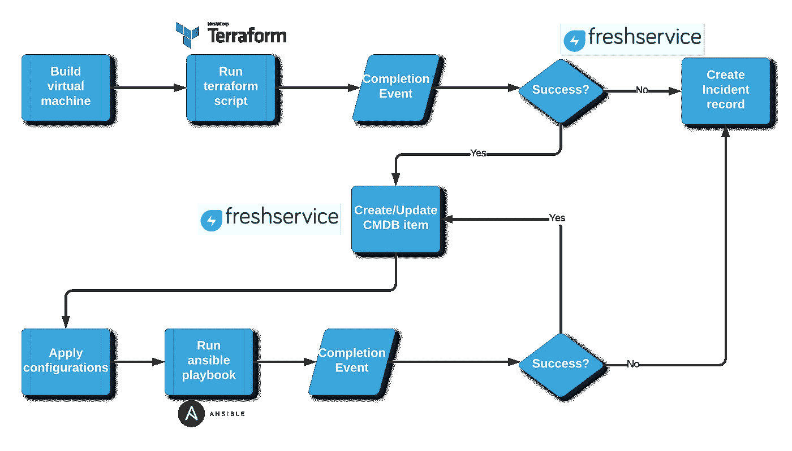
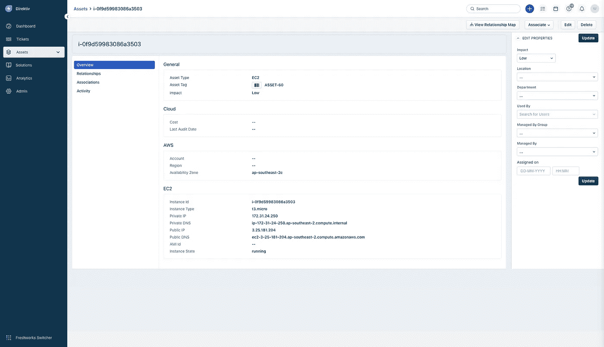
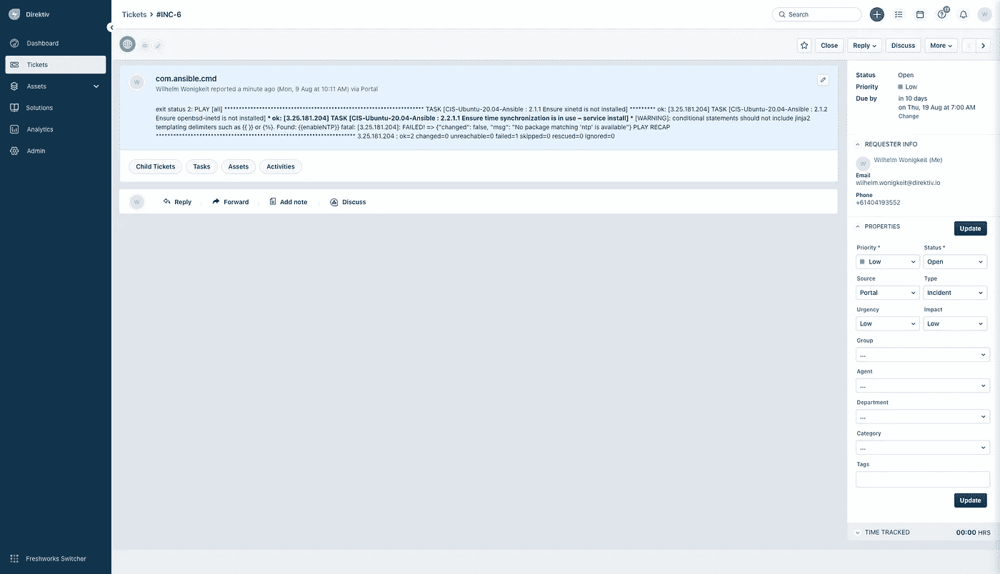
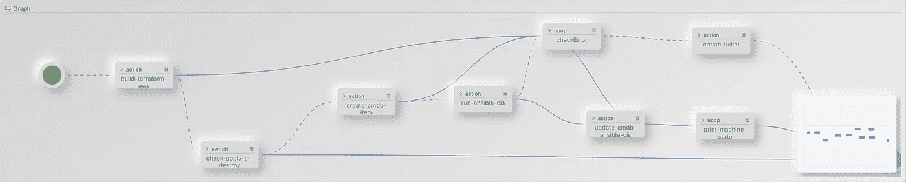

# Direktiv:使用 Terraform 提供，使用 Ansible 强化(第 3 部分)

> 原文：<https://medium.com/nerd-for-tech/direktiv-provision-using-terraform-harden-using-ansible-part-3-73f655fb66f8?source=collection_archive---------8----------------------->

这是 3 系列博客文章中的第 3 篇，也是最后一篇。在这里，我们将最终的工作流缝合在一起，使用 Terraform 来供应 AWS 或 GCP Ubuntu 实例，然后使用 Ansible 将 CIS 强化应用到 2 台机器。为了好玩，我们将集成到 [Freshservice](https://freshservice.com/) 中，并为成功的供应创建 CMDB 记录，或者在失败时创建事件记录。

最终的工作流程如下所示:



端到端工作流

# 地形部署

首先，Terraform 将用于创建 AWS 或 GCP 实例。如果你想知道这是如何发生的，更多细节可以在[这里](/nerd-for-tech/direktiv-building-a-machine-on-aws-using-terraform-without-a-terraform-environment-def24fe3221d)找到。

Terraform 工作流在 AWS 或 GCP 中创建计算机，并存储 Terraform 脚本的状态。Terraform 工作流的输出如下所示:

```
{
  "terraform": {
    "action": "apply",
    "amazon_ip": "3.25.222.101",
    "return": "",
    "var": {
      "awsinstance": {
        "lineage": "",
        "outputs": {
          "ip-address": {
            "type": "string",
            "value": "3.25.222.101"
          }
        },
        "resources": [
          {
            "instances": [
              {
                "attributes": {
                  "architecture": "x86_64",
                  "arn": "arn:aws:ec2:ap-southeast-2::image/ami-04b1878ebf78f7370",
                  "block_device_mappings": [
                    {
                      "device_name": "/dev/sda1",
                      "ebs": {
                        "delete_on_termination": "true",
                        "encrypted": "false",
                        "iops": "0",
                        "snapshot_id": "snap-071b73fa329b8fb2f",
                        "throughput": "0",
                        "volume_size": "8",
                        "volume_type": "gp2"
                      },
                      "no_device": "",
                      "virtual_name": ""
                    },
                    {
                      "device_name": "/dev/sdb",
                      "ebs": {},
                      "no_device": "",
                      "virtual_name": "ephemeral0"
                    },
                    {
                      "device_name": "/dev/sdc",
                      "ebs": {},
                      "no_device": "",
                      "virtual_name": "ephemeral1"
                    }
                  ],
                  "creation_date": "2021-07-21T13:27:16.000Z",
                  "description": "Canonical, Ubuntu, 20.04 LTS, amd64 focal image build on 2021-07-20",
                  "ena_support": true,
                  "executable_users": null,
                  "filter": [
                    {
                      "name": "name",
                      "values": [
                        "ubuntu/images/hvm-ssd/ubuntu-focal-20.04-amd64-server-*"
                      ]
                    },
                    {
                      "name": "virtualization-type",
                      "values": [
                        "hvm"
                      ]
                    }
                  ],
                  "hypervisor": "xen",
                  "id": "ami-04b1878ebf78f7370",
                  "image_id": "ami-04b1878ebf78f7370",
                  "image_location": "099720109477/ubuntu/images/hvm-ssd/ubuntu-focal-20.04-amd64-server-20210720",
                  "image_owner_alias": null,
                  "image_type": "machine",
                  "kernel_id": null,
                  "most_recent": true,
                  "name": "ubuntu/images/hvm-ssd/ubuntu-focal-20.04-amd64-server-20210720",
                  "name_regex": null,
                  "owner_id": "099720109477",
                  "owners": [
                    "099720109477"
                  ],
                  "platform": null,
                  "platform_details": "Linux/UNIX",
                  "product_codes": [],
                  "public": true,
                  "ramdisk_id": null,
                  "root_device_name": "/dev/sda1",
                  "root_device_type": "ebs",
                  "root_snapshot_id": "snap-071b73fa329b8fb2f",
                  "sriov_net_support": "simple",
                  "state": "available",
                  "state_reason": {
                    "code": "UNSET",
                    "message": "UNSET"
                  },
                  "tags": {},
                  "usage_operation": "RunInstances",
                  "virtualization_type": "hvm"
                },
                "schema_version": 0,
                "sensitive_attributes": []
              }
            ],
            "mode": "data",
            "name": "ubuntu",
            "provider": "provider[\"registry.terraform.io/hashicorp/aws\"]",
            "type": "aws_ami"
          },
          {
            "instances": [
              {
                "attributes": {
                  "ami": "ami-04b1878ebf78f7370",
                  "arn": "arn:aws:ec2:ap-southeast-2:338328518639:instance/i-0cc5eecf4e741c528",
                  "associate_public_ip_address": true,
                  "availability_zone": "ap-southeast-2c",
                  "capacity_reservation_specification": [
                    {
                      "capacity_reservation_preference": "open",
                      "capacity_reservation_target": []
                    }
                  ],
                  "cpu_core_count": 1,
                  "cpu_threads_per_core": 2,
                  "credit_specification": [
                    {
                      "cpu_credits": "unlimited"
                    }
                  ],
                  "disable_api_termination": false,
                  "ebs_block_device": [],
                  "ebs_optimized": false,
                  "enclave_options": [
                    {
                      "enabled": false
                    }
                  ],
                  "ephemeral_block_device": [],
                  "get_password_data": false,
                  "hibernation": false,
                  "host_id": null,
                  "iam_instance_profile": "",
                  "id": "i-0cc5eecf4e741c528",
                  "instance_initiated_shutdown_behavior": "stop",
                  "instance_state": "running",
                  "instance_type": "t3.micro",
                  "ipv6_address_count": 0,
                  "ipv6_addresses": [],
                  "key_name": "KEY_NAME",
                  "launch_template": [],
                  "metadata_options": [
                    {
                      "http_endpoint": "enabled",
                      "http_put_response_hop_limit": 1,
                      "http_tokens": "optional"
                    }
                  ],
                  "monitoring": false,
                  "network_interface": [],
                  "outpost_arn": "",
                  "password_data": "",
                  "placement_group": "",
                  "primary_network_interface_id": "eni-0626d7355c4448815",
                  "private_dns": "ip-172-31-29-221.ap-southeast-2.compute.internal",
                  "private_ip": "172.31.29.221",
                  "public_dns": "ec2-3-25-222-101.ap-southeast-2.compute.amazonaws.com",
                  "public_ip": "3.25.222.101",
                  "root_block_device": [
                    {
                      "delete_on_termination": true,
                      "device_name": "/dev/sda1",
                      "encrypted": false,
                      "iops": 100,
                      "kms_key_id": "",
                      "tags": {},
                      "throughput": 0,
                      "volume_id": "vol-08459839a0cea998e",
                      "volume_size": 8,
                      "volume_type": "gp2"
                    }
                  ],
                  "secondary_private_ips": [],
                  "security_groups": [
                    "default"
                  ],
                  "source_dest_check": true,
                  "subnet_id": "subnet-ecd6bfb4",
                  "tags": null,
                  "tags_all": {},
                  "tenancy": "default",
                  "timeouts": null,
                  "user_data": null,
                  "user_data_base64": null,
                  "volume_tags": null,
                  "vpc_security_group_ids": [
                    "sg-33d72045"
                  ]
                },
                "dependencies": [
                  "data.aws_ami.ubuntu"
                ],
                "private": "PRIVATE_KEY",
                "schema_version": 1,
                "sensitive_attributes": []
              }
            ],
            "mode": "managed",
            "name": "web",
            "provider": "provider[\"registry.terraform.io/hashicorp/aws\"]",
            "type": "aws_instance"
          }
        ],
        "serial": 24,
        "terraform_version": "0.15.3",
        "version": 4
      }
    }
  }
}
```

上面的输出用于评估资源调配是成功还是失败。如果成功，需要创建 CMDB 项目，否则我们需要创建一个事件记录。接下来让我们看看 CMDB 创建工作流。

# CMDB 工作流程

CMDB 工作流是对 [Freshservice API](https://api.freshservice.com/v1/#asset) 的简单`request`调用。Direktiv 中的配置非常简单:

创建的 CMDB 项目非常标准:



在 Freshservice 中创建的 CMDB 项目

# 可行的部署

如果通过 Terraform 的供应成功，Ansible 将用于运行 Ubuntu 20.04 的 CIS 强化行动手册。如果你想知道这是如何发生的，更多细节可以在这里找到。

我们的 Ansible 行动手册的输出如下所示(注意，在这种情况下，我们在行动手册上强加了一个错误条件，以便能够测试事件创建过程):

```
[9:47:46.387] Preparing workflow triggered by API. 
[9:47:46.400] Running state logic -- clone-ansible-cis-hardening:1 (action) 
[9:47:46.413] Sleeping until function 'git-command' returns. 
[9:47:48.905] running command 0 'clone https://github.com/wwonigkeit/Direktiv-CIS-Ubuntu-20.04-Ansible.git /mnt/shared/1wSypRvilu7iK6X3VaW07D2cjU4/out/workflow/ansible-cis-var' 
[9:47:50.375] Function 'git-command' returned. 
[9:47:50.405] Transitioning to next state: run-ansible (2). 
[9:47:50.436] Running state logic -- run-ansible:2 (action) 
[9:47:50.497] Sleeping until function 'ansible' returns. 
[9:47:57.595] Function 'ansible' returned. 
[9:47:57.595] Action raised catchable error 'com.ansible.cmd': exit status 2:  PLAY [all] *********************************************************************  TASK [CIS-Ubuntu-20.04-Ansible : 2.1.1 Ensure xinetd is not installed] ********* ok: [52.64.29.123]  TASK [CIS-Ubuntu-20.04-Ansible : 2.1.2 Ensure openbsd-inetd is not installed] *** ok: [52.64.29.123]  TASK [CIS-Ubuntu-20.04-Ansible : 2.2.1.1 Ensure time synchronization is in use - service install] *** [WARNING]: conditional statements should not include jinja2 templating delimiters such as {{ }} or . Found: {{enableNTP}} fatal: [52.64.29.123]: FAILED! => {"changed": false, "msg": "No package matching 'ntp' is available"}  PLAY RECAP ********************************************************************* 52.64.29.123               : ok=2    changed=0    unreachable=0    failed=1    skipped=0    rescued=0    ignored=0\. 
[9:47:57.632] Workflow failed with uncaught error 'com.ansible.cmd': exit status 2:  PLAY [all] *********************************************************************  TASK [CIS-Ubuntu-20.04-Ansible : 2.1.1 Ensure xinetd is not installed] ********* ok: [52.64.29.123]  TASK [CIS-Ubuntu-20.04-Ansible : 2.1.2 Ensure openbsd-inetd is not installed] *** ok: [52.64.29.123]  TASK [CIS-Ubuntu-20.04-Ansible : 2.2.1.1 Ensure time synchronization is in use - service install] *** [WARNING]: conditional statements should not include jinja2 templating delimiters such as {{ }} or {%}. Found: {{enableNTP}} fatal: [52.64.29.123]: FAILED! => {"changed": false, "msg": "No package matching 'ntp' is available"}  PLAY RECAP ********************************************************************* 52.64.29.123               : ok=2    changed=0    unreachable=0    failed=1    skipped=0    rescued=0    ignored=0
```

下一步—让我们用票证更新服务台！

# 新鲜服务票证创建

票证创建工作流是对 [Freshservice API](https://api.freshservice.com/v1/#create_ticket) 的一个简单的`request`调用(再次)…这里出现了一个模式！Direktiv 中的配置非常简单:

我们在 Freshservice 的机票:



新鲜服务票证创建

# 最终工作流程

最终的工作流程如下所示:



端到端工作流执行

和 YAML 配置文件: