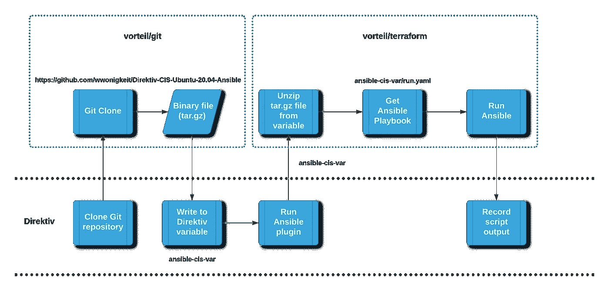
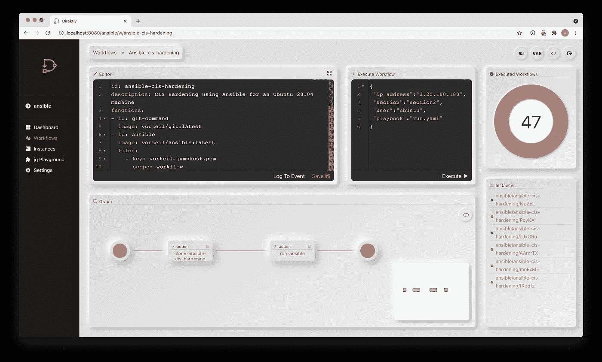

# Direktiv:在工作流中运行 Ansible CIS 强化行动手册(第 2 部分)

> 原文：<https://medium.com/nerd-for-tech/direktiv-running-ansible-cis-hardening-playbooks-in-workflows-6e10258b833c?source=collection_archive---------6----------------------->


Ansible 和 Direktiv 携手合作

> 这是 3 部分系列文章的第二部分。如果你想了解我们如何使用 Terraform 供应机器…请看一下[这个](/nerd-for-tech/direktiv-building-a-machine-on-aws-using-terraform-without-a-terraform-environment-def24fe3221d)

最终，我们希望能够做到的是:

*   使用 Terraform ( [第 1 部分](/nerd-for-tech/direktiv-building-a-machine-on-aws-using-terraform-without-a-terraform-environment-def24fe3221d))向 AWS、GCP 或任何云平台供应机器
*   根据 CIS 强化指南(第 2 部分——本文)强化实例(在本例中为 Ubuntu)
*   用 CMDB 信息更新 IT 服务台，通过 Slack、Discord 或 Teams 向系统管理员发送消息，并跟踪机器的状态(第 3 部分—下一篇文章)

# 视频时间！

想跳过来看看…下面视频！

https://www.youtube.com/watch?v=0eNMwMff84U&t = 30 秒

# 快速概述

Direktiv 是一个无服务器的工作流引擎，从技术上来说,*** 意味着它按需旋转容器(使用 Kubernetes 和 Knative)并按照你定义的顺序关闭它们(工作流)。所以在 Terraform 或 Ansible 的例子中——我们只是将提供者软件的最新版本作为一个容器。**

> 第二个问题是为什么？

1.  Terraform 和 Ansible 是基础设施供应和管理的优秀解决方案，拥有大量插件和扩展。为什么我们要尝试重新发明轮子——尤其是如果你考虑到两者都被广泛采用的话。Direktiv 使用已经为这两种产品构建的插件、扩展和剧本，并将其扩展到我们提供的更广泛的微服务工作流架构中
2.  您可以获得这两种环境，而无需安装或维护它们(或持续运行它们的资源成本)。如果你不想使用我们的 [Ansible 插件](https://github.com/vorteil/direktiv-apps/tree/master/ansible)，只要用最新的(或者你觉得合适的版本)更新 [Docker 构建文件](https://github.com/vorteil/direktiv-apps/blob/master/ansible/Dockerfile)即可。这就是 Direktiv 工作流的短暂本质！

# 使用 CIS 强化行动手册

至少这部分很简单——只需看看下面的 GitHub 库:

[https://github.com/alivx/CIS-Ubuntu-20.04-Ansible](https://github.com/alivx/CIS-Ubuntu-20.04-Ansible)

我将这个存储库克隆到我自己的私有存储库的子目录中，并创建了一个用于运行 Ansible 剧本的`run.yaml`文件。

最终的存储库结构如下所示:

```
---> Direktiv-CIS-Ubuntu-20.04-Ansible
|
 -----> run.yaml (created this file)
|
 -----> README.md (create this file)
|
 -----> CIS-Ubuntu-20.04-Ansible (cloned from [alivx](https://github.com/alivx/CIS-Ubuntu-20.04-Ansible) repository)
```

公共存储库在此处可用&ansi ble playbook(`run.yaml`)如下所示:

# 配置 Direktiv 工作流

对于 Direktiv 工作流配置，我们决定创建 4 个输入作为工作流的一部分。这是因为我们(在下一篇文章中)希望将 Terraform 和其他解决方案集成到一个端到端的工作流中。输入的 JSON 对象如下所示:

```
{
   "ip_address":"3.25.180.180",
   "section":"section2",
   "user":"ubuntu",
   "playbook":"run.yaml"
}
```

工作流接受所供应的机器的 IP 地址、要应用的 CIS 强化指南的部分([在此处了解更多信息](https://github.com/wwonigkeit/Direktiv-CIS-Ubuntu-20.04-Ansible/blob/main/CIS-Ubuntu-20.04-Ansible/README.md#table-of-roles))、用于连接到机器的用户以及要运行的剧本(在本例中为`run.yaml`)。

工作流程步骤如下图所示:



GitHub 存储库中的可转换工作流

Direktiv 工作流 YAML 如下所示:

与 Terraform 工作流一样，此工作流分两步执行流程:

1.  首先，我们将 GitHub 存储库作为一个`tar.gz`文件克隆到 Direktiv 工作流变量中。变量名叫做`ansible-cis-var`
2.  其次，我们将`cis-ansible-var`内容作为输入传递给 ansible workflow 容器(它将自动提取二进制文件的二进制压缩内容，并将其放在一个共享目录挂载点上)。`ansible`函数定义中`files`的定义(第 11–13 行)确保 GitHub 库在 Ansible 运行时可用！

如您所见，我们还在运行时向 Ansible 传递了几个参数，特别是我们作为工作流输入传递的 IP 地址，我们希望为 CIS 强化和 SSH 设置运行的部分。

> 另请注意:我们将 SSH 连接的 PEM 密钥保存为变量，以便在工作流中使用！

# 运行时！

现在，我们总是可以从 UI 运行工作流，如下所示:



手动运行可行的工作流

但是，让我们使用 API 来运行它:

```
$ curl -X POST http://localhost:8080/api/namespaces/ansible/workflows/ansible-cis-hardening/execute?wait=true --data '{ "ip_address":"3.25.180.180", "section":"section2", "user":"ubuntu", "playbook":"run.yaml" }' --header "Content-Type: application/json"{"output":" PLAY [all] *********************************************************************TASK [CIS-Ubuntu-20.04-Ansible : 2.1.1 Ensure xinetd is not installed] *********
ok: [3.25.180.180]TASK [CIS-Ubuntu-20.04-Ansible : 2.1.2 Ensure openbsd-inetd is not installed] ***
ok: [3.25.180.180]TASK [CIS-Ubuntu-20.04-Ansible : 2.2.1.1 Ensure time synchronization is in use - service install] ***
[WARNING]: conditional statements should not include jinja2 templating
delimiters such as {{ }} or . Found: {{enableNTP}}
ok: [3.25.180.180]:
: <information in here just playbook output>
:TASK [CIS-Ubuntu-20.04-Ansible : 2.3.6 Ensure RPC is not installed] ************
ok: [3.25.180.180]TASK [CIS-Ubuntu-20.04-Ansible : 2.4 Ensure nonessential services are removed or masked] ***
ok: [3.25.180.180] =\u003e {\n    \"msg\": \"Run the following command: $ lsof -i -P -n | grep -v \\\"(ESTABLISHED)\\\"\\n  Review the output to ensure that all services listed are required on the system. If a listed\\n  service is not required, remove the package containing the service. If the package\\n  containing a non-essential service is required, stop and mask the non-essential service.\\n  Code Meaning \\n  S File size differs. \\n  M File mode differs (includes permissions and file type). \\n  5 The MD5 checksum differs. \\n  D The major and minor version numbers differ on a device file. \\n  L A mismatch occurs in a link. \\n  U The file ownership differs. \\n  G The file group owner differs. \\n  T The file time (mtime) differs.\\n\"\n}PLAY RECAP *********************************************************************
3.25.180.180               : ok=29   changed=0    unreachable=0    failed=0    skipped=9    rescued=0    ignored=0"}
$
```

Ansible 剧本的输出是一个 JSON 对象:

`{ "output" : "<ansible output here>"}`

这个工作流产生的对象是一个简单的 JSON 对象，我们可以将它传递给一个字符串或文本解析引擎(或者使用内部 JQ 来创建 JSON 子对象，这显然是首选)。

这使得使用 Ansible 输出、集成和公开可用的行动手册将 Direktiv 扩展到基础架构配置成为可能，同时仍然提供运行应用程序、容器和微服务集成的有状态工作流的能力。

一如既往，欢迎反馈和提问！