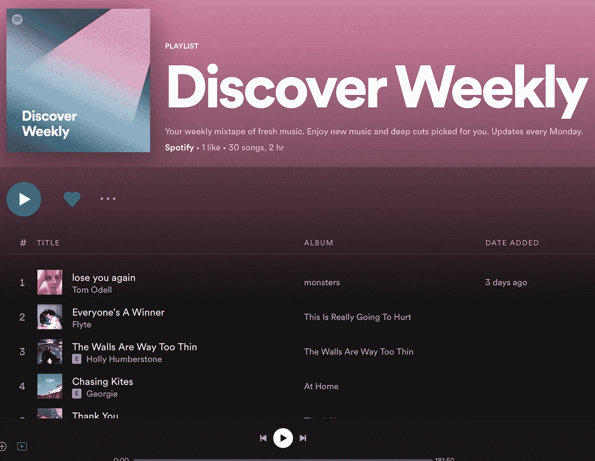
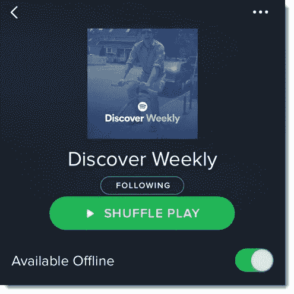

# 探索周刊:Spotify 的意外全垒打

> 原文：<https://medium.com/nerd-for-tech/discover-weekly-spotifys-accidental-home-run-359367f87646?source=collection_archive---------13----------------------->

我们写了一份关于音乐及其背后的商业和技术的每日时事通讯。如果您想直接在您的收件箱中获得它，请立即订阅 [***！***](https://incentify.substack.com)

大家好，

昨天，我设法读完了这本书的最后一章- **泰山经济学**名为“**大数据，大错误”。**

作为 Spotify 的首席经济学家，威尔·佩奇的书一直是关于音乐产业如何运作的时事通讯的有趣轶事和故事的来源。

今天的时事通讯讲述了一个有趣的轶事，Spotify 如何意外地在应用程序上创建了可以说是他们最常用的功能——“发现周刊”播放列表。

这是什么特点？

自 2015 年 7 月推出以来，Discover Weekly 已经在 Spotify 应用上活跃了 6 年多，根据 Spotify 去年的报告，用户已经花了超过**23 亿小时来播放它。**

背景:那是 267，000 多年前的事了，大概是人类存在的时间🤯

如果你不像我一样使用 Spotify(为了美观，我还是更喜欢 Apple Music)，Discover Weekly 是一个功能，每周一为 Spotify 上的每个订户策划一个独特的 30 首歌曲的个性化播放列表📆

那么这个功能是怎么产生的呢？

佩奇在他的书中写道👇🏻

> “发现每周播放列表”功能代表了 Spotify 和一般媒体的范式转变。
> 
> 很长一段时间以来，Spotify 一直吹嘘自己有能力大规模管理音乐，但并没有做太多工作来证明这是否可行以及如何可行。2015 年初夏，Spotify 接近 1 亿月活跃用户，每个人都有自己独特的品味——如何为他们中的每一个人策划播放列表？
> 
> 2015 年 7 月 20 日(那个月的第三个星期一)是全世界找到这个问题答案的日子。

随着 Apple Music 在 2015 年 6 月 30 日正式发布，也就是《发现周刊》发布前几周，媒体公司开始押注音乐流媒体之战。

**苹果 vs Spotify** 被宣传为经典的**大卫 vs 歌利亚**之战，特别是考虑到苹果即将成为世界上第一家价值 1 万亿美元的公司，现在进入音乐流媒体领域，雄心勃勃地计划给 Spotify 的派对泼冷水。

然而,《发现周刊》立即获得了意想不到的成功，在推出的第一年内就获得了**4000 万的下载量和超过 50 亿首歌曲的播放量🚀**

尽管媒体大肆宣传 Spotify 在音乐流媒体之战中被淘汰，但它还是成功地在自己周围建立了一条相当强大的护城河。

然而，只有一个问题。

Spotify 不明白为什么《发现周刊》一夜成名🤷‍♂️

为了寻找 Spotify 需要的答案，以保护它在自己周围建立的护城河，佩奇前往芝加哥大学会见了诺贝尔奖得主、美国经济学家理查德·塞勒。

泰勒长期以来一直支持将心理学与微观经济学结合起来，最著名的是他对行为经济学的贡献，据说他给这个领域带来了“常识”。

理查德·塞勒被授予 2017 年诺贝尔经济学奖

*如果你已经做到了这一步，看起来你正在阅读这篇时事通讯！为什么不与人分享并帮助支持我们呢？*

会议的结果？

泰勒打开了硬币的一面，这一面迄今为止在很大程度上被 Spotify 的数据分析团队忽略了。

佩奇在他的书中进一步解释道👇🏻

> **因为 Spotify 的所有人都沉浸在该平台产生的数据中，我们认为用户理解他们的体验是多么独特和个性化。**
> 
> 用他的话来说，知识的诅咒让我们看到了我们想要相信的，用户推荐《发现周刊》是因为他们欣赏个性化算法的聪明之处。
> 
> 消费者对复杂的算法没有兴趣；他们简单地按下一块玻璃，把它放在口袋里，发现了新的音乐。

事实上，用户认为 Discover Weekly 播放列表对每个人来说都不是唯一的，这使得他们像其他播放列表一样与他人分享它。

泰勒指出，早期版本的《发现周刊》有随机播放按钮，比播放按钮大。

然而，这仍然不能完全解释为什么播放列表会流行起来。毕竟，过了一段时间，每个人都明白播放列表是独一无二的。

泰勒试图分析为什么像**回归周四**和**感受美好星期五**这样的尝试失败了，他给出了最终成为《发现周刊》成功的决定性原因。

# 它是在一个星期一发布的！

泰勒引用了美国经济学家、沃顿大学教授凯瑟琳·米尔克曼(Katherine Milkman)的话，以及她对 [**“新开始效应**](https://www.katymilkman.com/journal-articles/the-fresh-start-effect-temporal-landmarks-motivate-aspirational-behavior)**的研究，解释了像一周、一月或一学期开始这样的**心算期是如何让人们更容易从事有抱负的行为的****

**有道理对吗？**

**你承诺过自己多少次从周一、下个月的第一天或一年的第一天开始去健身房？**

**佩奇现在找到了他的答案，为什么同样类型的个性化播放列表在周四和周五推出时失败了，但在周一却一炮而红。**

**大数据到此为止，对吗？😅**

***如果你喜欢这篇来自*[**Incentify**](https://incentify.substack.com)*的简讯，为什么不与你喜欢的人分享呢？***

***P.S-关注我们的*[***insta gram***](https://www.instagram.com/clubincentify/)*和*[***Twitter***](https://twitter.com/clubincentify)*了解更多关于音乐和文化的内容，现在！***

***原载于*[*https://incentify.substack.com*](https://incentify.substack.com/p/discover-weekly-spotifys-accidental)*。***