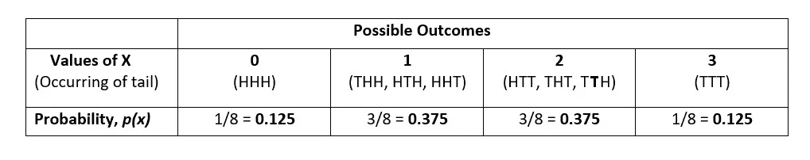
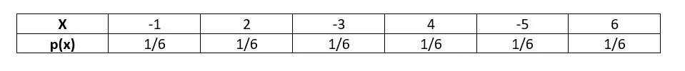
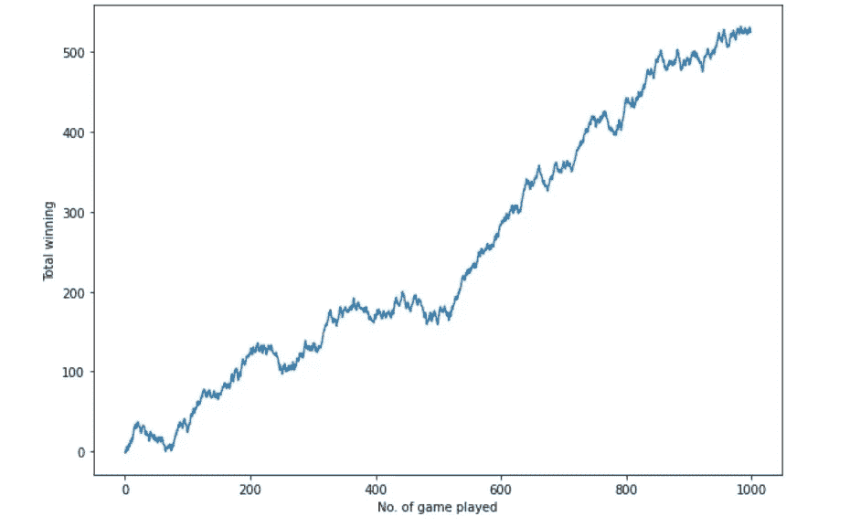
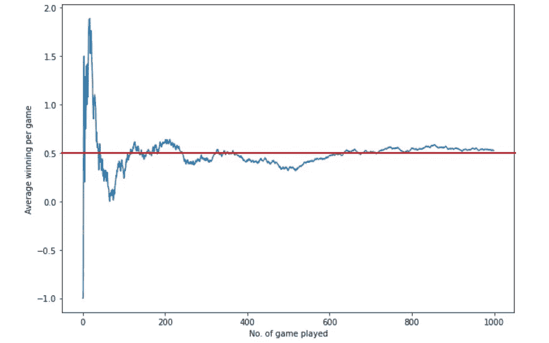

# 离散概率分布:第一部分

> 原文：<https://medium.com/nerd-for-tech/discrete-probability-distribution-part-1-d8ee0fee2f57?source=collection_archive---------3----------------------->

在 [Unsplash](https://unsplash.com?utm_source=medium&utm_medium=referral) 上由 [Denes Kozma](https://unsplash.com/@deneskozma?utm_source=medium&utm_medium=referral) 拍摄的照片

## **什么是离散随机变量和离散概率分布？**

在概率统计中，随机变量是一个数量变量，其值取决于随机现象的结果。例如，让我们投掷一枚硬币三次，让 X 代表在这三次投掷中出现的反面的数量。那么 X 可以取以下任意一个值:0，1，2，3。这里 X 是随机变量，因为它代表了抛硬币的机会或结果。我们不知道结果，直到投掷硬币并计算出反面的数量。这里变量 X 将是*离散的*。这意味着它只能取精确值。

> D 具体的随机变量可以取有限或可计数数量的可能值，而在连续随机变量的情况下，它们可以取任意或无限数量的区间值。

我们也可以列出掷三次硬币的所有可能结果的发生概率。可能的结果是:HHH、THH、泰国、HHT、HTT、THT、泰国和 TTT。这里 H 代表头部，T 代表尾部。

作者图片

上图表示的是随机变量 X 的概率分布，它是 X 的所有可能值及其出现概率 p(x)的列表。如果我们多次重复一个随机实验，并画出每个可能结果的概率，那么我们将得到概率分布。

离散概率分布必须满足以下两个条件:

1.  对于所有 x 值，0≤ p(x) ≤ 1。

2.∑ p(x) = 1

在我们的示例中，∑p(x)= 0.125+0.375+0.375+0.125 = 1

# **离散概率分布的期望值、方差和标准差:**

随机变量的期望值或期望是随机变量的*长期理论均值*。我们可以计算期望值 E(X ),方法是将 X 的每个值乘以它们各自发生的概率，然后将所有这些值相加。

# E(X=x) = ∑ x. p(x)

例如，假设你的一个朋友邀请你玩一个游戏。掷骰子，游戏规则如下:

1.  如果出现 1，你得给他 1 卢比。
2.  如果出现 2，他会给你 Rs。2.
3.  如果出现 3，你必须给他 3 卢比。
4.  如果出现 4，他会给你 Rs。4.
5.  如果是 5 元，你得给他 5 元。
6.  如果出现 6，他会给你 Rs。6.

你会玩这个游戏吗？只有在有利可图的情况下，你才会玩这个游戏。要知道这一点，我们必须计算游戏的预期输赢。游戏的概率分布如下:

作者图片

e(X)=(-1 X 1/6)+(2 X 1/6)+(-3 X 1/6)+(4 X 1/6)+(-5 X 1/6)+(6 X 1/6)

= 3/6

= Rs。0.5

因为期望值是 Rs。0.5，这将是一个有利可图的游戏。换句话说，你可以期待赢得 Rs。每场 0.5。如果你玩这个游戏 1000 次，那么你应该期望赢的金额将是(0.5 x1000) = Rs。500.相同的游戏被模拟 1000 次，下面两张图片是模拟的结果，显示了玩游戏 1000 次后的总赢款和平均赢款。

作者图片

作者图片

上面的图片清楚地表明，在玩游戏 1000 次后，总胜率几乎等于 500 卢比，平均每场胜率接近 0.5 卢比。这是我们所期望的。奖金的长期平均值与预期值相匹配，总奖金也接近预期 Rs。500.最初，总胜率和平均每场胜率波动很大。但从长期来看，这些倾向于偏离预期更少。

期望值给了我们一个变量的典型值或平均值。但是它没有告诉我们这些值是如何分布的。方差来了，它会告诉我们数据的分布。

# Var (X) = E(x- ) = ∑(x-)。p(x)

让我们再次以上面的游戏为例。这里，E(X) or 是 0.5。

因此，**Var(X)**=(-1-0.5)X 1/6+(2-0.5)X 1/6+(-3-0.5)X 1/6+(4-0.5)X 1/6+(-5-0.5)X 1/6+(6-0.5)X 1/6 =**14.92**

同样，我们也可以根据以下公式计算标准偏差:

# Std。dev =√方差

[可变性和扩散的测量| Dhrubjun |技术呆子| 2021 年 9 月| Medium](/nerd-for-tech/measures-of-variability-and-spread-3a2c11cb647d)

因此，对于上面的例子，标准差将是√14.92 = 3.86。这意味着平均来说，我们每场比赛的胜率将是 3.86，离预期的 0.5 相差甚远。

今天到此为止。在下一部分，我们将学习不同的离散概率分布。在那之前保持微笑。😀