# 离散概率分布:第二部分

> 原文：<https://medium.com/nerd-for-tech/discrete-probability-distribution-part-2-ef007cb9cd29?source=collection_archive---------3----------------------->

爱德华多·苏亚雷斯在 [Unsplash](https://unsplash.com?utm_source=medium&utm_medium=referral) 上拍摄的照片

在上一章离散概率分布中，我们已经学习了离散随机变量，离散概率分布，以及它的期望值和方差。

> [离散概率分布:第一部分|作者 Dhrubjun |技术呆子| 2021 年 9 月|媒体](/nerd-for-tech/discrete-probability-distribution-part-1-d8ee0fee2f57)

在本章中，我们将讨论不同的离散概率分布，例如:

1.  二项分布
2.  二项分布
3.  几何分布
4.  泊松分布

# **1。伯努利分布:**

伯努利分布是最简单的离散分布之一。该分布由单次试验组成，随机变量只有两种可能的结果。两种可能的结果可以是“成功或失败”、“是或否”、“正面或反面”等。

如果成功，设 X=1，如果失败，设 X=0。X 具有伯努利分布:

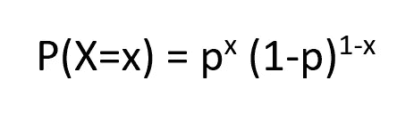

伯努利分布的概率分布函数，其中 p 是成功的概率(图片由作者提供)

如果成功，X=1。然后，

p(x = 1)= p(1–p)⁰= p

如果出现故障，X=0。然后，

P(X=0) = p⁰ (1-p) = 1-p

**伯努利分布的均值和方差:**

伯努利分布的平均值或期望值由下式给出:

E(X) = ∑ x p(x)

= 0.p⁰ (1-p) + 1。p (1-p)⁰

= **p**

同样，伯努利分布的方差由下式给出:

Var(X) = E[(x- ) ] = E(x )- [E(x)]

这里，E(x) = p。

E(x ) = ∑ x p(x)

= 0 .p⁰ (1-p) + 1。p (1-p)⁰

= p

因此，Var(X) = p- p = **p(1-p)**

伯努利分布是二项式分布、几何分布等其他离散分布的基础。这些分布建立在独立伯努利试验的假设上。

# 2.二项式分布:

在二项式分布中，

*   存在固定或有限数量的独立伯努利试验
*   每次试验都有两种可能的结果，标记为成功或失败。
*   每次试验的成功概率都是一样的，而且每个结果都是独立的。
*   我们感兴趣的是成功的次数。

> n 次独立伯努利试验的成功次数呈二项式分布。

如果变量 X 代表 n 次试验中成功结果的数量，那么为了找到有 X 次成功的概率，我们将使用以下二项式分布的概率分布函数:

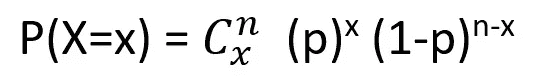

二项分布的概率分布函数(图片 bu 作者)

我们将借助一个例子来了解更多这方面的内容。比方说，在一次考试中，我们有 10 道选择题，每道题有 4 个选择题。如果我们从每个问题中随机选择一个答案，我们需要找出正确回答 6 个问题的概率。

现在，每个问题都有两种可能的结果:正确或错误。猜中正确答案的概率会是 1/4 或者 0.25。因此，猜错答案的概率为 0.75。在这里，10 个问题中，6 个问题应该是正确的(成功)，4 个问题是错误的(失败)。这 6 个问题的正确顺序并不重要。所以总共 10 个问题可以在 10 个里面回答或者点！方法。同样，6 个正确答案可以在 6 中排序！方法，并且 4 个错误答案可以在 4 中排序！方法。所以会有 10 个！/(6!4!)= 210 种正确回答 6 个问题的可能方法。这可以写成:

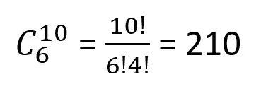

同样，每个问题都像一个独立的伯努利试验。因此，答对 6 道题的概率是:

p(x = 6)= 210 x(0.25)⁶x(0.75)⁴= 0.0162

在上面的例子中，我们已经计算了答对 6 道题的概率。类似地，我们可以计算 X 的不同值的概率，其中 X 可以取 0 到 10 之间的值。

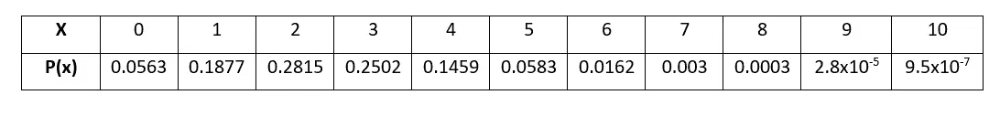

X 的概率分布(图片由作者提供)

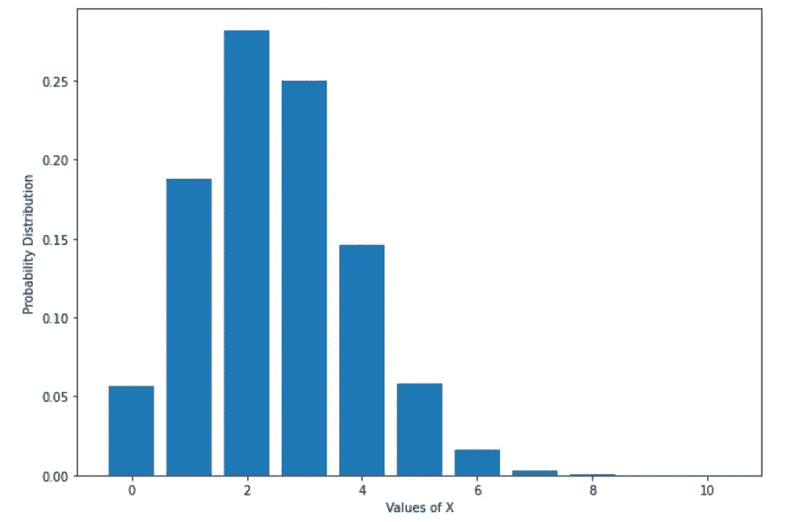

X 的概率分布(图片由作者提供)

**二项分布的均值和方差:**

单次试验伯努利分布的平均值为 **p.** 由于二项式分布由 n 次独立的伯努利试验组成，因此二项式分布的平均值由下式给出:

E(X) = E(X1) + E(X2) + E(X3) +……+ E(Xn)

因为轨迹是独立的，所以 E(X1)=E(X2) = E(X3)=…。=E(Xn)

因此， **E(X) = np**

同理， **Var(X) = np(1-p)**

对于上述示例，E(X) = 10 x 0.25 = 2.5，并且

Var(X) = 10 x 0.25 x 0.75 = 1.875

# 3.几何分布:

几何分布类似于二项式分布，

*   会有一系列独立的伯努利试验。
*   结果将是二元的。
*   每次试验的成功概率都是一样的，而且每个结果都是独立的。
*   我们感兴趣的是需要多少次试验才能获得第一个成功的结果。

设变量 X 代表获得第一个成功结果所需的试验次数。如果第一次成功发生在第 x 次试验，那么第一次(x-1)次试验必须失败，第 x 次试验必须成功。然后，几何分布的概率质量函数由下式给出:

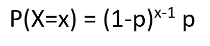

几何分布的概率分布函数(图片由作者提供)

让我们举一个例子。在成年人中，30%拥有工程学位。如果从这个群体中随机选择成年人，那么第 6 个被抽样的人是第一个获得工程学位的人的概率是多少。这里 p=0.3。

P(X=6) = (0.7)⁵ x (0.3) =0.0504

这个例子的概率分布如下:

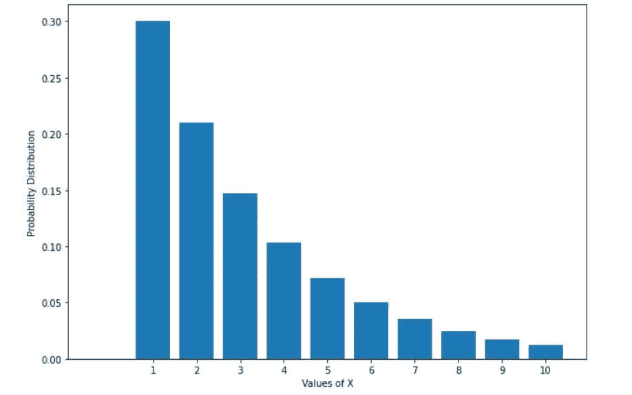

X 的概率分布(图片由作者提供)

这里，X 可以取的最小值是 1，没有最大值。当 x=1 时，P(X=x)最大，随着 X 的增加，p 越来越小。第一次尝试成功的可能性最高。这意味着*任何几何分布的众数总是 1* 。

# **4。泊松分布:**

与上面讨论的其他分布相比，泊松分布有点不同。这次没有一系列的尝试或试验。以下是泊松分布的情况:

*   事件将在给定的时间间隔内随机或独立发生。该间隔可以是时间或空间的间隔，例如，在一个月期间或每千米。
*   在给定的时间间隔内，事件发生的概率不会改变。
*   在给定的时间间隔内，事件发生的平均值或发生率是有限的，由希腊字母**⋋**(λ)给出。

设变量 X 代表给定区间内发生的次数，例如，每小时从你面前经过的汽车数量。如果 x 遵循泊松分布，并且在该间隔期间出现⋋ 次，那么为了找到在特定间隔期间将出现 x 次的概率，我们将使用以下公式:

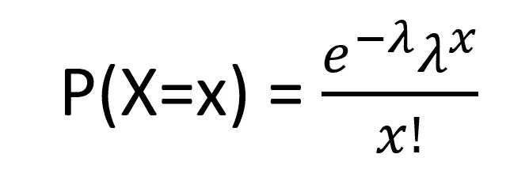

泊松分布的概率分布函数(图片 bu 作者)

让我们举一个例子。在茶州，有一台机器对最终产量非常重要。但是机器过去以每月 4.3 起的速度发生故障。我们需要找到(I)下个月机器不出故障的概率和(ii)下个月机器出故障三次的概率。

如果 x 代表机器在一个月内发生故障的次数，那么 x 具有带⋋=4.3.的泊松分布

(I)如果没有故障，X 必须为 0。

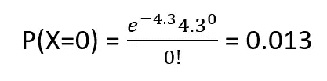

(ii)如果下个月将有三次故障，那么 X 的值将是 3。

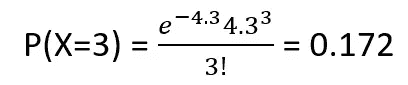

如果我们针对不同的 X 值计算上述示例的概率分布，那么我们将得到以下结果:

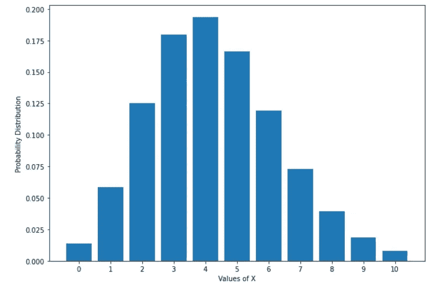

X 的概率分布(图片由作者提供)

上述泊松分布的形状取决于⋋.λ的值如果⋋值很小，那么分布将向右倾斜。随着⋋变大，它变得更加对称。对于上面的例子，如果⋋ =1.3，那么分布将如下:

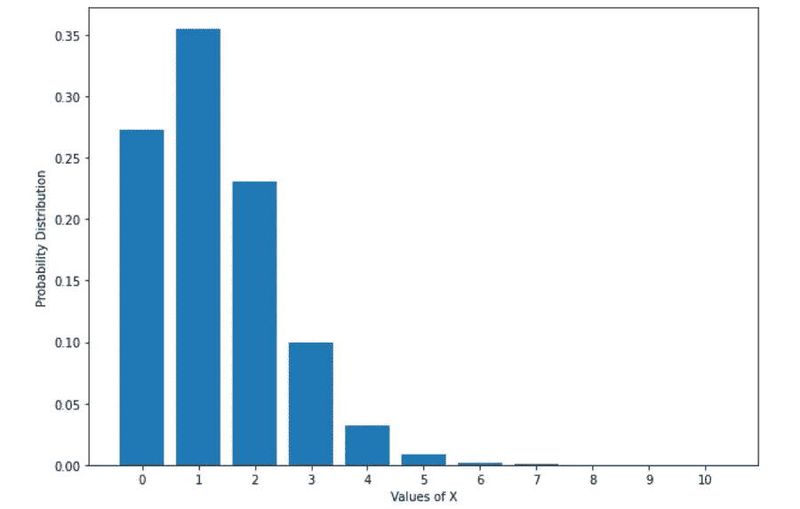

作者对⋋=1.3(image x 的概率分布)

泊松分布的均值和方差是⋋.这意味着，

E(X) = ⋋，Var(X) = ⋋

今天到此为止。我希望你喜欢这篇文章。如果您有任何问题，请随时留下您的评论。