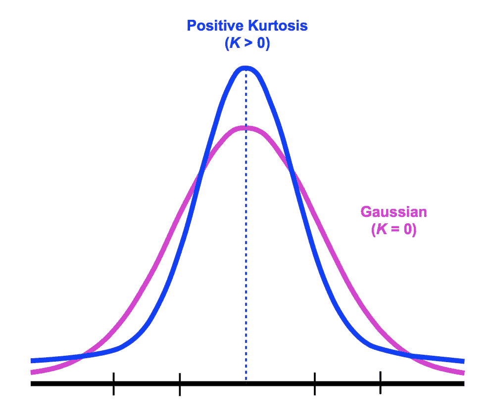
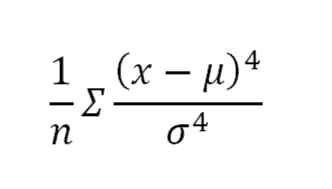
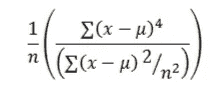
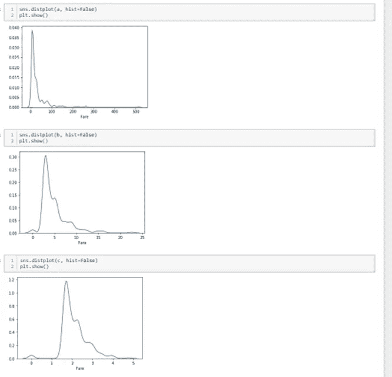
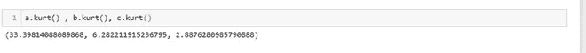
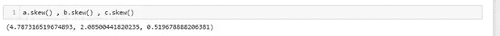
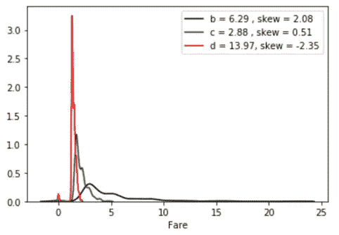
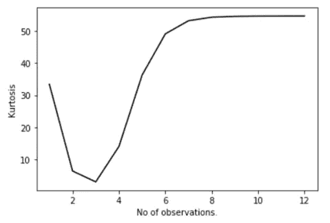

# 关于峰度的讨论:

> 原文：<https://medium.com/nerd-for-tech/discussion-on-kurtosis-1247a8ec27a6?source=collection_archive---------4----------------------->

根据一些研究人员的说法，峰度是分布的“峰值”,或者我们可以说是分布尾部的度量。我们可以说这是历史性的定义。

源自[卡尔·皮尔逊](https://www.bing.com/search?q=Karl%20Pearson%20wikipedia&form=WIKIRE)的分布峰度的标准度量，是分布的第四个[矩](https://www.bing.com/search?q=Moment%20(mathematics)%20wikipedia&form=WIKIRE)的缩放版本。这个数字与分布的尾部有关，而不是它的峰值

在这个等式中，完全博弈是围绕标准差展开的。峰度在尾部变化。尽管分布的峰值并不重要。

现在，从根本上来说，我们可以看到峰度值与上述等式之间的关系，这里我们处理的是方差和标准差。如果观察值极大地增加，那么根据公式，我们观察到峰度的巨大变化。

在这里进入显式公式，我们可以观察完整的场景，异常值是如何影响峰度值的。我们在这里看到平方后方差的变化，展开数据。根据定义，我们假设较高的峰值给出较高的峰度值，但计算显示了不同的场景，可能与此相反。仅仅因为术语被极大地增加，这不是故意的；这实际上是一个离群值的存在。

因此我们渴望说出我们的陈述，即**峰度只不过是分布**尾部厚度的度量。

让我们观察相同数据的方差的不同峰度值:

泰坦尼克号数据集中的票价信息(人口)

标准化的所有密度图

这里是泰坦尼克号数据集中所有的**票价**图表；我们可以观察到，当我们降低图中的斜率**时，峰度值是如何降低的。**

每个方面的峰度值

随着图形，我们观察到，图形有一个倾斜的斜率有较小的峰度值。这意味着标题为的图具有较小的分布，换句话说，我们说，最小方差也给出峰度值的最小值。**随着图形变得正常，峰度值降低，如果峰变得更重，峰度值增加。**

所有分布的偏斜度

我们甚至可以建立分布的峰度和偏斜度之间的关系。**随着峰度下降，给出显示数据正态性信息的信号**。

看看峰度和偏斜度的同步图:

每个分布的 Skew()和 Kurt()值

现在我们看到了偏度和峰度值的差异，这样，一旦偏度向左，峰度值再次继续下降。在图形正常的地方，峰度看起来很低，在图形改变它的表面之后，它再次显示了传播数据的相同场景。

如果我们连续改变我们的轴会怎么样？

每个归一化和偏度值的峰度值

我们可以看到，随着图形向左移动，峰度值继续增加，过一会儿又保持下降，但不会更多。

我们可以观察到，峰度值的图形是如何增加的！

因此，我们得出结论，**峰度值取决于数据尾部的权重和方差，以及图边的斜率**。