# 在 Unity 中显示你游戏的伤害 VFX

> 原文：<https://medium.com/nerd-for-tech/displaying-damage-vfx-for-your-game-in-unity-4ef2c0c69cd3?source=collection_archive---------14----------------------->

## 统一指南

## 关于如何在 Unity 中使用动画精灵显示受损 VFX 的快速指南

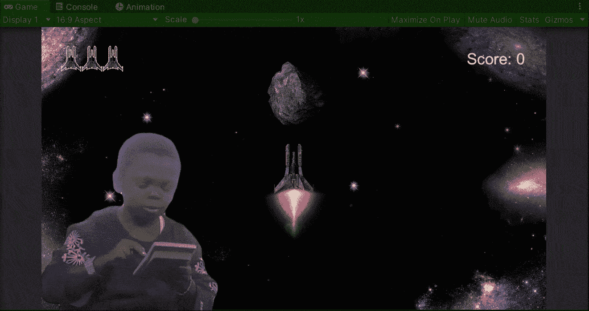

**目标**:在 Unity 中实现一个太空射击游戏的视觉伤害效果。

在上一篇文章中，我介绍了[如何在 Unity](/nerd-for-tech/creating-explosions-for-your-game-in-unity-889e9c373d14) 中为我的太空射击游戏中的敌人制造爆炸效果。现在是时候创建一个视觉伤害效果来可视化玩家的伤害了。

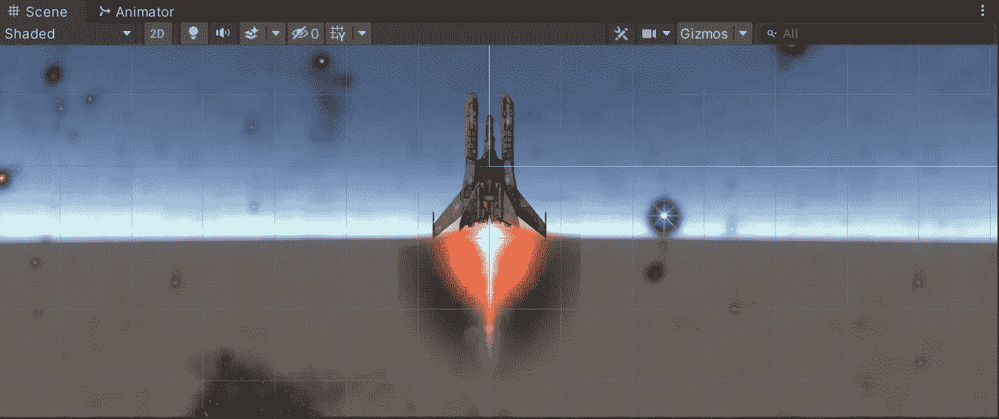

自从上一篇帖子以来，我给播放器添加了一个推进器，它看起来像这样。

# 添加伤害精灵

首先:

*   将各自的伤害精灵添加到场景中
*   确定它们的展示位置
*   将它们附加到玩家游戏对象上

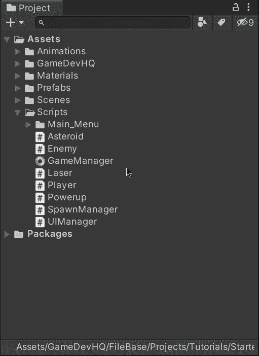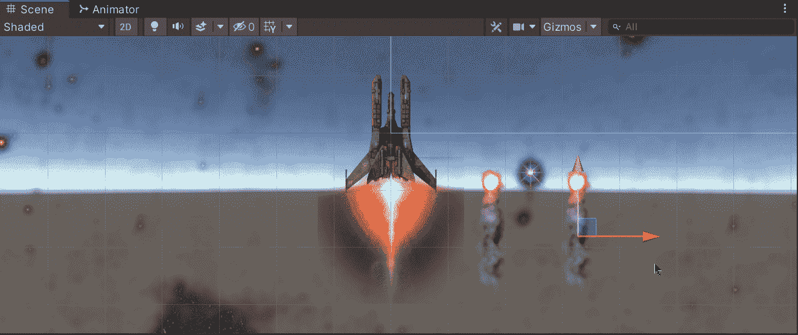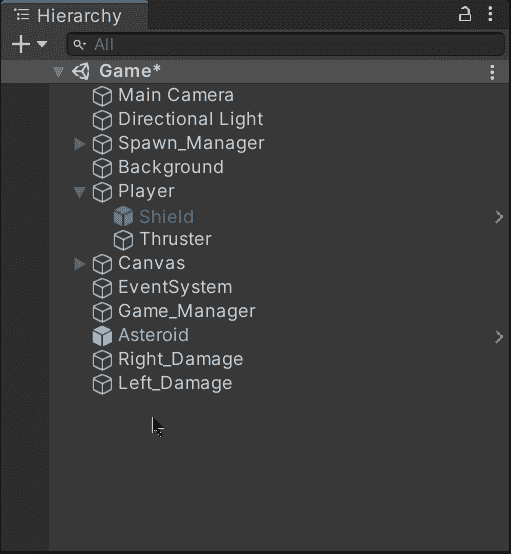

然后，如果有动画序列，使用动画视图为损坏精灵创建一个新的动画。如果你不知道如何在 Unity 中制作精灵动画，我已经在[的一篇旧帖子](/nerd-for-tech/animating-sprites-in-unity-9d02762bde96)中提到了。

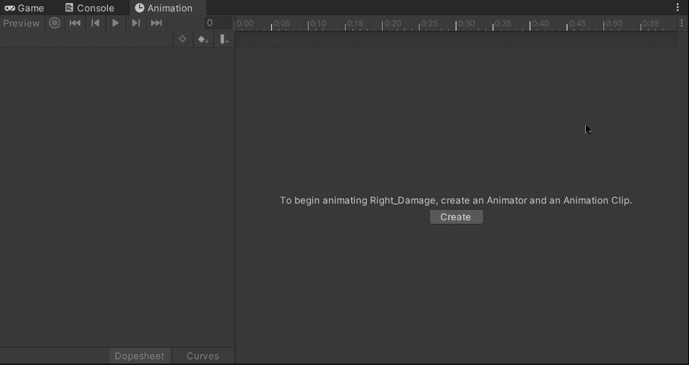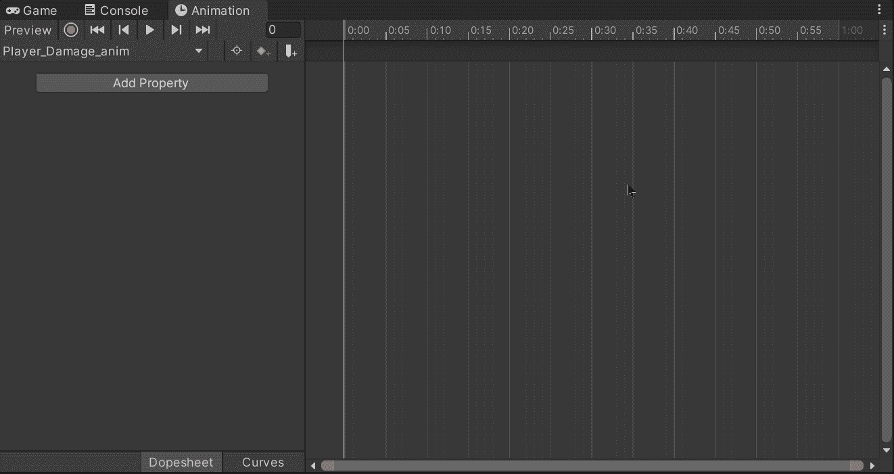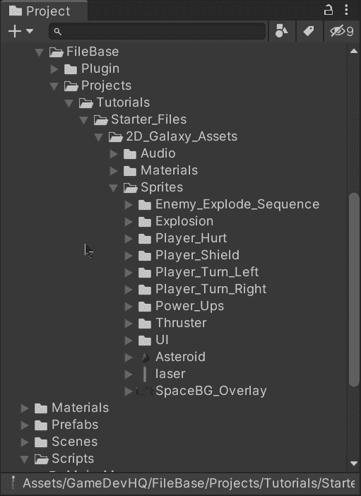

单击动画视图中的播放按钮，验证动画是否正常工作:

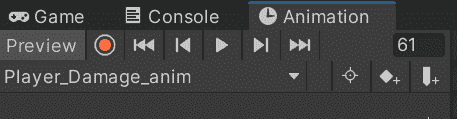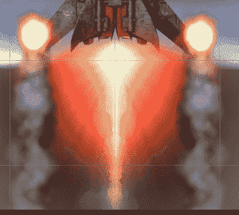

由于在这种情况下左右伤害的精灵是相同的，我们可以在两个精灵的 animator 组件中重用伤害动画:

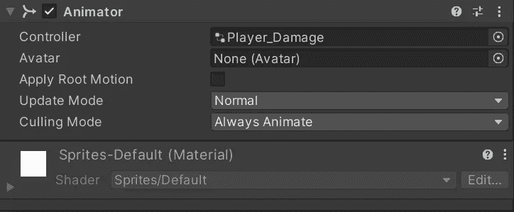

不要忘记关闭伤害精灵，当玩家受到伤害时，我们会通过代码激活它们:

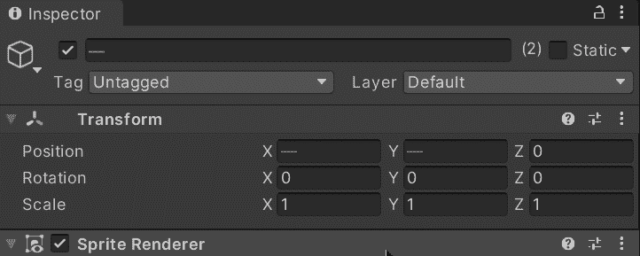

# 实施损害 VFX

为了实现代码中的伤害 VFX，让我们打开玩家脚本，创建一个新的数组来存储伤害精灵的引用:

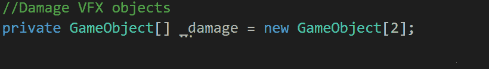

不要忘记使用**【serialize field】**将游戏对象拖入检查器。

然后，让我们将停用的伤害精灵拖动到检查器的播放器脚本组件中:

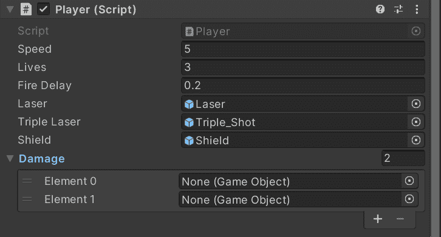

## 确定损坏方向

为了使伤害显示更加真实，我们可以确定伤害方向，以便在玩家受到伤害时激活相应的精灵。让我们创建一个新的公共函数，它将通过象限编号返回损坏方向(就像在坐标平面中一样):

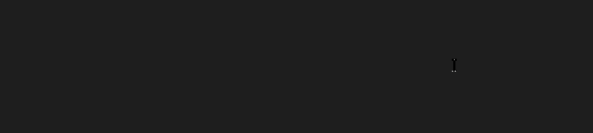

该功能将接收来自与玩家碰撞的敌人或物体的位置( **Vector3** )。

然后为了确定方向向量，我们需要从敌人的位置中减去玩家的位置。得到空间两点间方向向量的运算是:**目的地-源**。

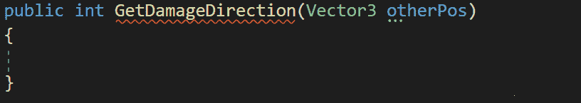

例如，如果敌人在 **(1，3)** 处，而玩家在 **(3，2)** 处，则减法将给出(-2，1)作为方向向量，正好在敌人和玩家的位置之间:

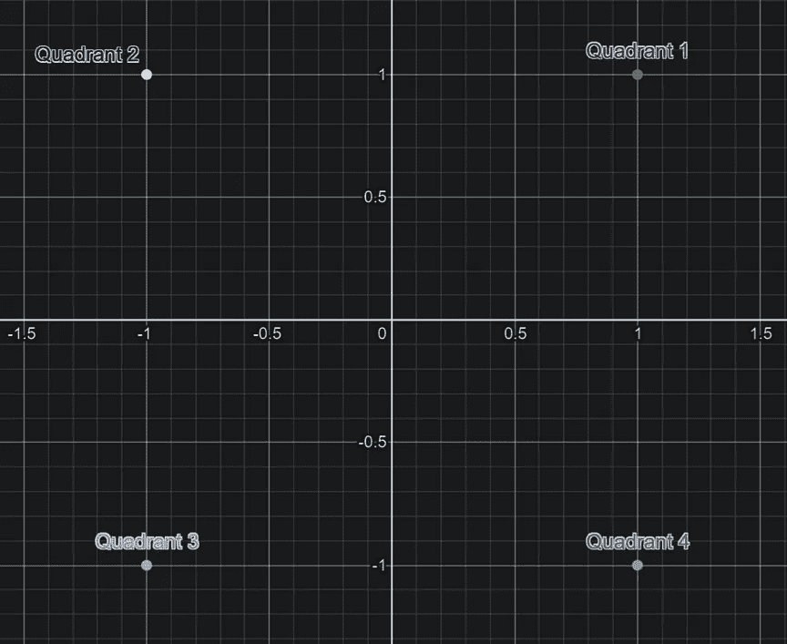

这样，玩家可以确定敌人朝向(-2，1)，也就是在第 2 象限。

现在，为了确定指向敌人的角度，我们需要计算方向向量坐标的反正切。

有两个数学函数允许我们获得反正切值:

*   **阿坦**

如果我们使用这个函数，我们可以计算在一个象限中方向向量和 x 轴之间的最小角度。它的值以弧度表示，从-(π/2)到(π/2)。

*   **阿坦 2**

如果我们使用这个函数，我们可以计算 4 个象限中方向向量和正 x 轴之间的角度。它的值以弧度表示，从-π到π。

在这种情况下，我们需要知道敌人或物体在哪个象限。因此，让我们使用来自 **Mathf** 集合的 **Atan2** 函数的方向向量坐标来计算角度。由于给定的结果是弧度，我们可以将其乘以 **Rad2Deg** 常数，将其转换为度数:

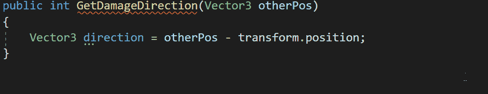

**Rad2Deg** 值为 360/(π*2)。

为了理解 atan2 可能返回的值，我们可以查看下图:

*   π弧度代表 180 度
*   π/2 弧度代表 90 度。

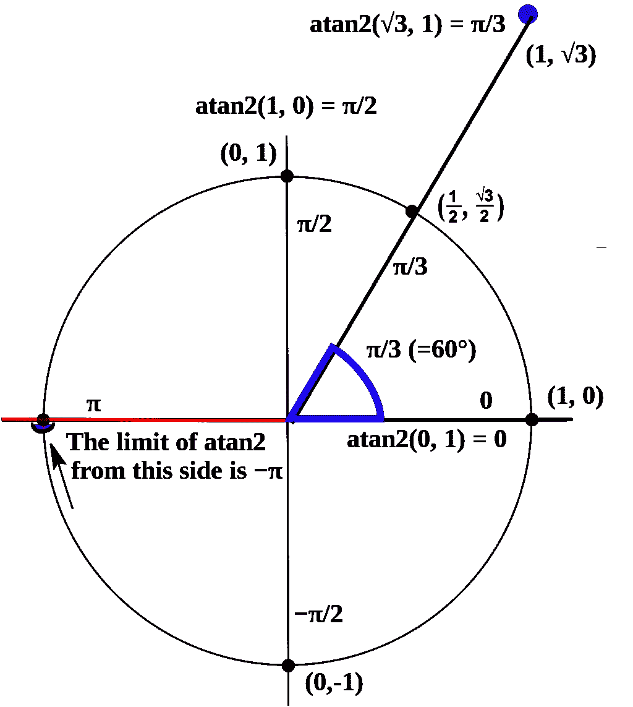

由 Dmcq —自己工作，CC BY-SA 3.0，[https://commons.wikimedia.org/w/index.php?curid=9381369](https://commons.wikimedia.org/w/index.php?curid=9381369)

如果您想了解更多关于 **Atan2** 功能的信息，您可以访问 Unity 文档:

 [## Mathf。Atan2

### 建议更改感谢您帮助我们提高 Unity 文档的质量。虽然我们不能接受所有的…

docs.unity3d.com](https://docs.unity3d.com/ScriptReference/Mathf.Atan2.html) 

然后，为了返回特定的象限，让我们使用一个 switch 语句来涵盖每个象限的不同值:

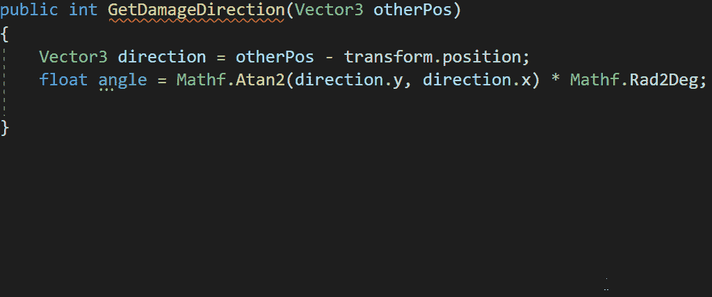

switch 语句将覆盖 4 个象限，返回的缺省值将为 0，表示没有找到象限，并符合函数的返回值:

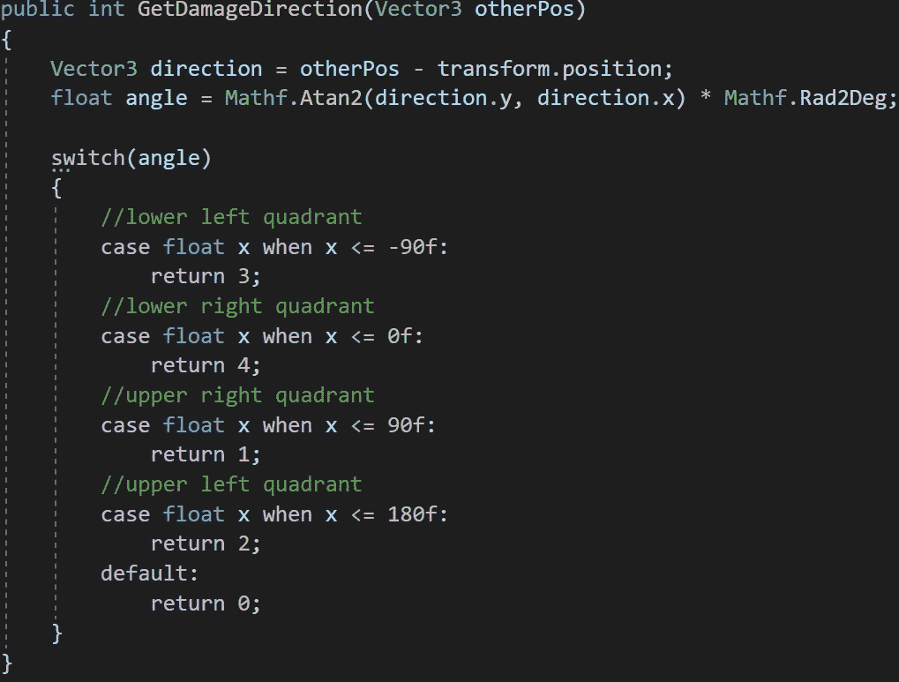

为了处理象限边界上的值，我决定使用≤条件来覆盖它们。在 C#中， **Atan2** 函数根据给定的参数返回某些值，你可以在这里检查它们[。](https://docs.microsoft.com/en-us/dotnet/api/system.math.atan2?view=net-5.0#returns)

## 显示损坏的 VFX

现在，为了显示各自的伤害精灵，我们需要给 **GetDamage** 函数添加一个新的参数来指示受影响的象限。然后，我们可以使用一个新的 switch 语句来覆盖左右象限(因为我们只有一个左右伤害精灵)，并使用 gameobjects 的 **SetActive** 方法激活各自的精灵。

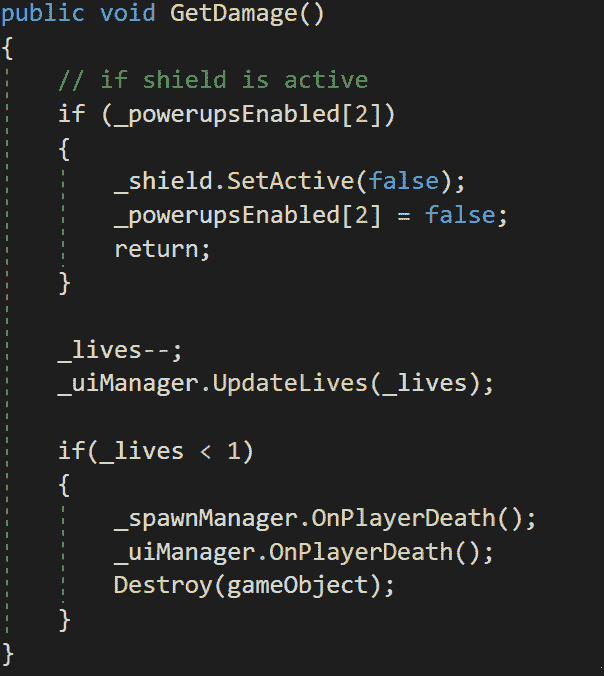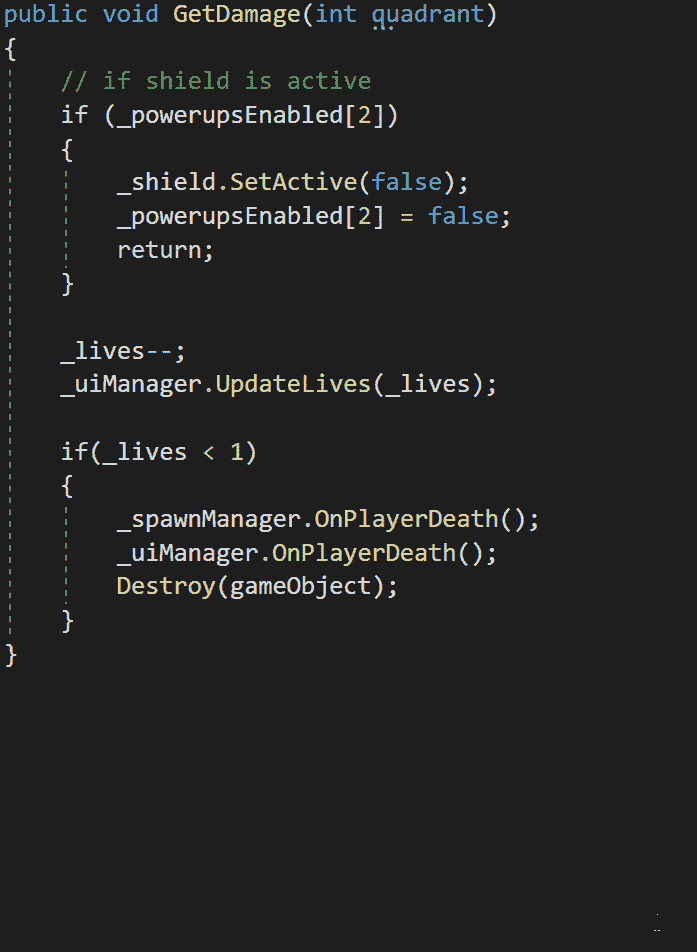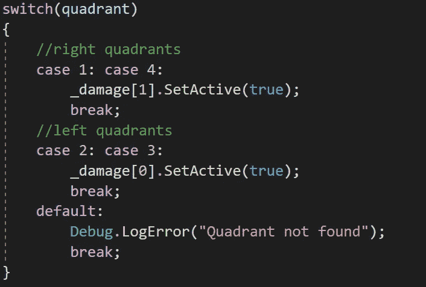

添加默认情况只是为了表明象限与预期值不匹配。

最后，打开敌方脚本，修改 **GetDamage** 函数调用，使其与玩家发生碰撞时满足象限要求:

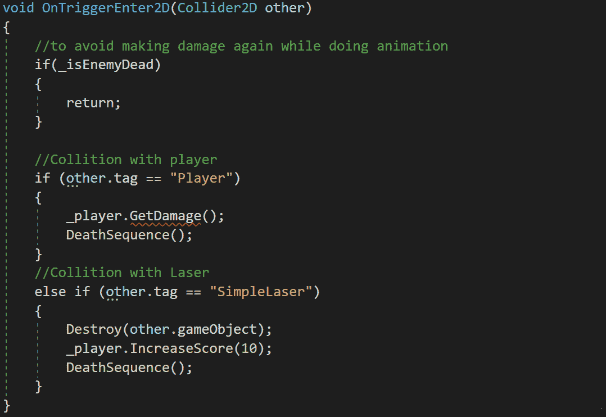

如果我们在 Unity 中运行游戏，我们会看到 VFX 的伤害取决于预期的敌人攻击方:

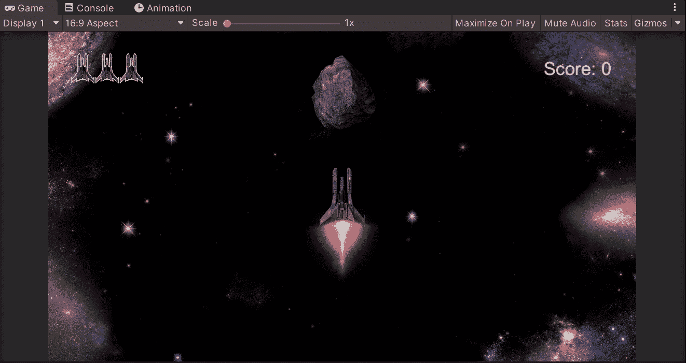

就是这样，你可以用 Unity 在游戏中显示伤害 VFX！:d .下一篇文章再见，我将展示如何在 Unity 中开始使用后处理。

> *如果你想了解我更多，欢迎登陆*[***LinkedIn***](https://www.linkedin.com/in/fas444/)**或访问我的* [***网站***](http://fernandoalcasan.com/) *:D**