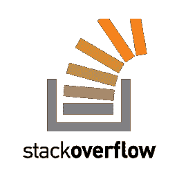
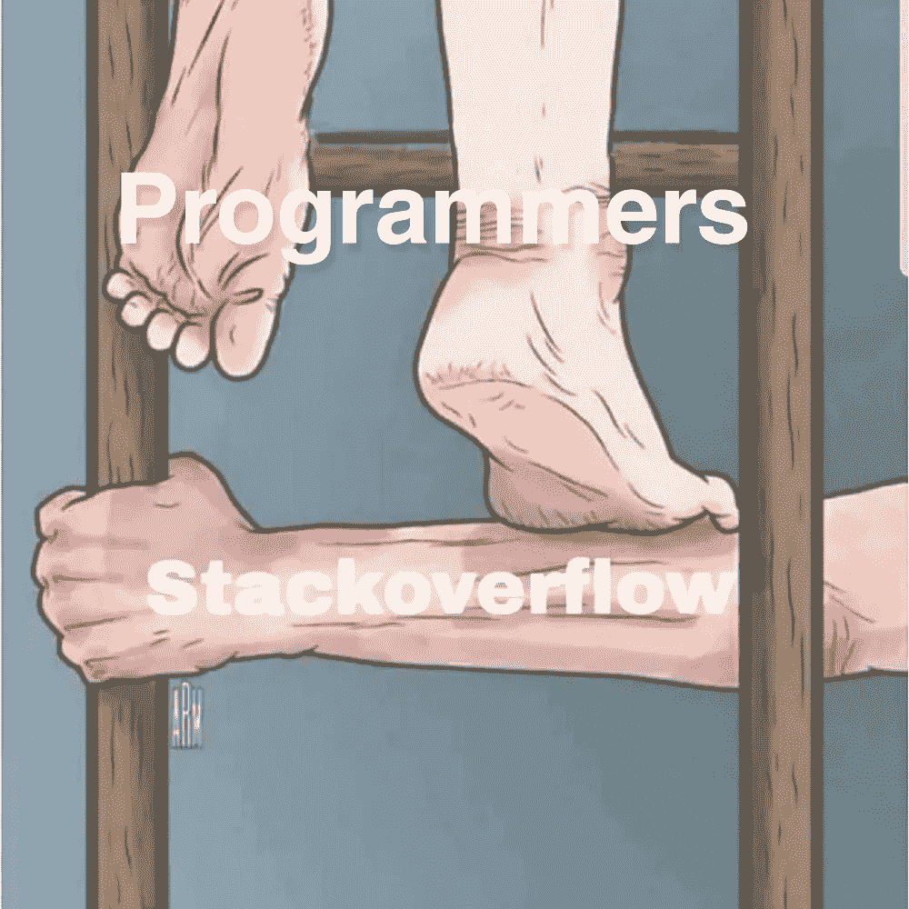
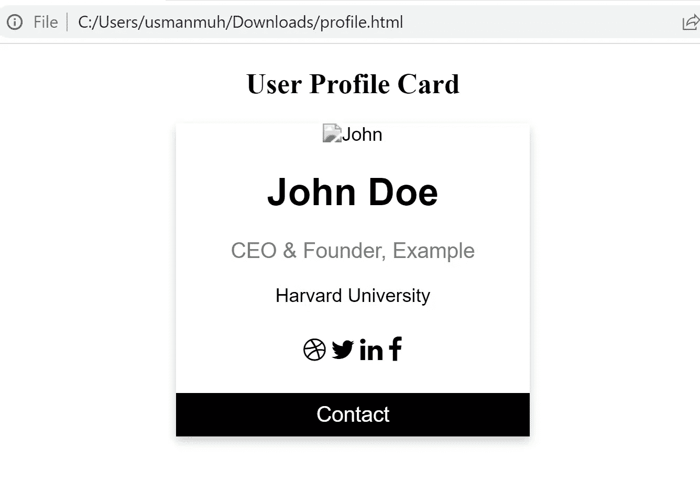
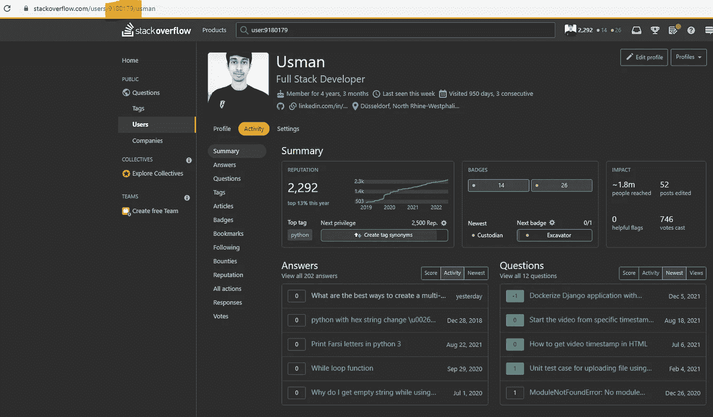
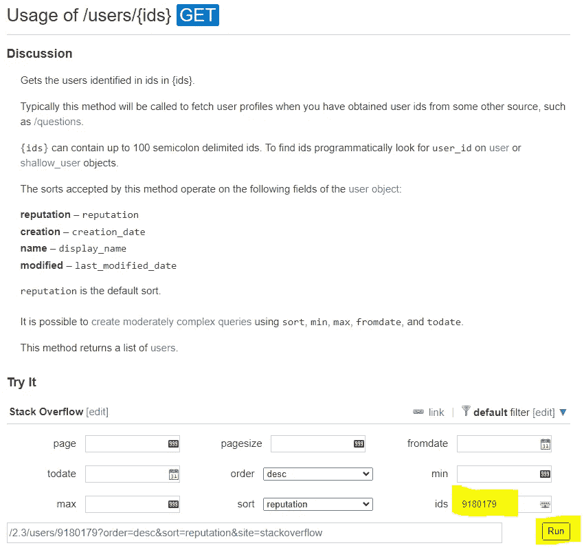
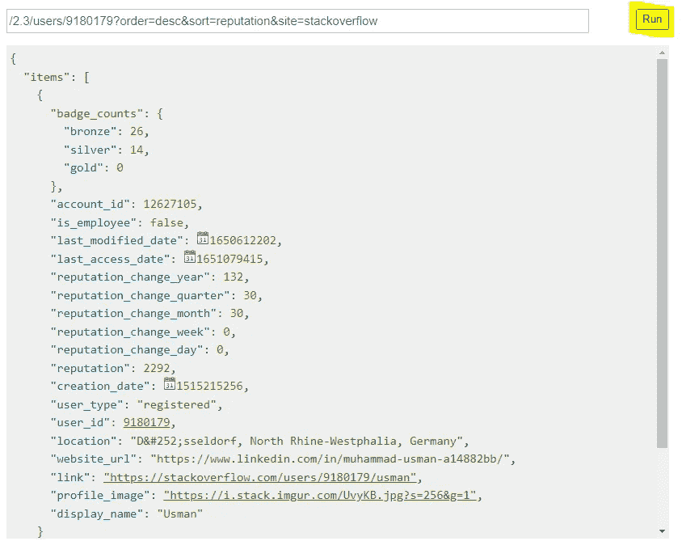
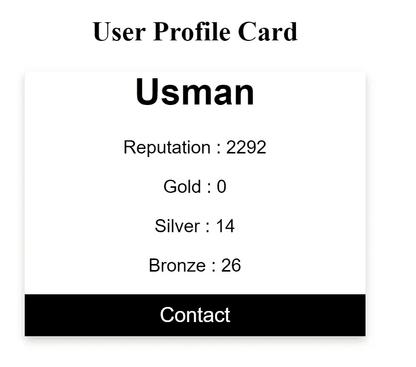

# 在您的投资组合中展示 Stackoverflow 声誉和徽章

> 原文：<https://medium.com/nerd-for-tech/displaying-stackoverflow-reputation-badges-on-your-portfolio-38df702d4c41?source=collection_archive---------3----------------------->

您是否希望将堆栈溢出与您的个人投资组合集成在一起？换句话说，您是否希望在您的个人站点上显示堆栈溢出配置文件？

是的，可以显示 stackoverflow 配置文件的数据(声誉、徽章、问题、答案等)。)在你的私人网站上。栈溢出提供了栈交换 API，通过它你可以访问你所有的元信息。



图片来自谷歌

 [## 堆栈交换 API

### 应用程序应该在堆栈应用程序上注册，以获得请求密钥。请求键每天允许更多的请求，并且…

api.stackexchange.com](https://api.stackexchange.com/docs) 

```
**What is Stack Overflow?**Stack Overflow is a question and answer website for professional and enthusiast programmers. It’s built and run by you as part of the Stack Exchange network of Q&A sites. With your help, we’re working together to build a library of detailed, high-quality answers to every question about programming.Reference: [https://stackoverflow.com/](https://stackoverflow.com/)
```

> Stack overflow 不仅仅是一个网站，它是软件工程师的一种感觉。
> 
> 无法想象没有栈溢出的生活。



图片取自 Pinterest

## 文章的结果

在这篇文章中，我的目标是连接任何组合/个人网站与堆栈溢出。所以在这里，我使用 W3Schools 的简单 HTML/CSS 概要卡代码。

[](https://www.w3schools.com/howto/tryit.asp?filename=tryhow_css_profile_card) [## W3Schools 在线 HTML 编辑器

### W3Schools 在线代码编辑器允许您编辑代码并在浏览器中查看结果

www.w3schools.com](https://www.w3schools.com/howto/tryit.asp?filename=tryhow_css_profile_card) 

## 入门指南

1.  从 W3schools 复制 HTML 和 CSS 代码。
2.  打开 Visual Studio 代码。
3.  创建新文件并粘贴代码。
4.  将文件保存为 HTML 格式，文件名为“*profile.html*”。

5.在浏览器中打开“profile.html”文件，如图 1 所示:



图 1:页面的框架

## 设置 Stackoverflow 帐户

访问您的堆栈溢出配置文件，并从 URL 中复制您的用户 ID，如下图 2 所示。这是堆栈溢出中您的帐户的唯一 ID。我们将使用这个 ID 通过堆栈交换 API 获取您的元数据。



图 2: Stackoverflow 配置文件

## 堆栈交换 API

现在打开栈交换 API 文档。向下滚动光标，查看“*用户*部分。我想显示用户的姓名、徽章(金、银&铜)和用户的声誉。点击“*用户/{id}* ”选项，如下图-3 所示。

 [## 堆栈交换 API

### 应用程序应该在堆栈应用程序上注册，以获得请求密钥。请求键每天允许更多的请求，并且…

api.stackexchange.com](https://api.stackexchange.com/docs) 

图 3:“用户”的堆栈交换 API 文档

它将打开如下图 4 所示的新界面。您需要将从您的配置文件 URL 复制的 stackoverflow ID 放入' *ids* '字段，然后单击' *Run* '按钮，如图所示。



图 4:“用户”的 API 接口

点击'*运行*按钮后，将返回元数据信息，如下面的图-5 所示。这意味着，API 可以很好地与您的帐户配合使用。



图 5:用户 API 的 JSON 响应

## 通过 StackOverflow 集成扩展应用程序

现在，是时候调用“profile.html”文件中的 API 了。

1.  添加名称、徽章和声誉的 HTML 标签。

```
<h1 id=”name”></h1>
<p id=”reputation”></p>
<p id=”gold”></p>
<p id=”silver”></p>
<p id=”bronze”></p>
```

2.添加 *<脚本>* 标签写 JavaScript 代码调用栈交换 API。fetch 函数用于调用 API。在 URL 中，将您的用户 ID 替换为“*用户 ID* 关键字。

```
 https://api.stackexchange.com/2.3/users/{USER_ID}?order=desc&sort=reputation&site=stackoverflow
```

在浏览器中重新加载“*profile.html*”页面，你就会得到你的用户名、声誉和徽章(金、银、铜)。

您可以在您的投资组合/个人网站中使用上述 JS 代码，并显示您的堆栈溢出信息。



图 6:最终输出

**注意:**与 Stack Exchange API 中的用户标签类似，您可以轻松获得所有答案、问题和其他信息，所有详细信息/解释都在 Stack Exchange API 文档中。

## 最终代码