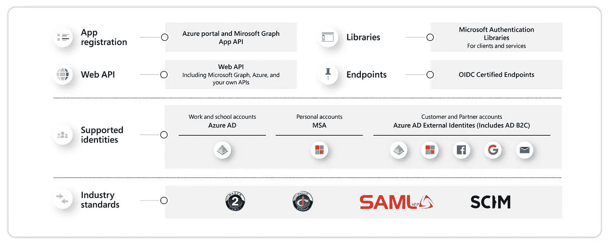

# 剖析从 Microsoft Identity Platform 收到的身份验证令牌响应

> 原文：<https://medium.com/nerd-for-tech/dissecting-authentication-token-response-received-from-microsoft-identity-platform-9b8363bbd8d?source=collection_archive---------11----------------------->

## 微软 AZURE 云

## 使用 Python MSAL 库获取身份验证令牌

[https://www . Microsoft . com/en-ww/security/business/identity-access-management/Microsoft-identity-management-platform](https://www.microsoft.com/en-ww/security/business/identity-access-management/microsoft-identity-management-platform)

在本帖中，我们将探索微软的统一身份管理解决方案。Microsoft Identity platform 可帮助您管理身份，并简化身份验证和授权…