# 剖析优化算法

> 原文：<https://medium.com/nerd-for-tech/dissecting-optimization-algorithms-96c137f824a0?source=collection_archive---------25----------------------->

## 学习算法幕后的一瞥。

> 你有没有想过“过去十年发生了什么，让深度学习如此成功？”以及“为什么现在有如此多的炒作？”。

如果你看看深度学习的时间线，[通用逼近定理](https://en.wikipedia.org/wiki/Universal_approximation_theorem)和[反向传播](https://en.wikipedia.org/wiki/Backpropagation)的想法已经在 1989-1991 年左右的神经网络背景下讨论过，如果你看看它，反向传播只不过是应用链式法则的[梯度下降](https://en.wikipedia.org/wiki/Gradient_descent)和[梯度下降](https://en.wikipedia.org/wiki/Gradient_descent)本身可以追溯到 1847 年。鉴于所有这些都不是真正的新东西，它们都至少有 30 年的历史了。那么，“为什么在过去的十年里，突然有这么多关于深度学习的炒作和谈论？”

嗯，这种增长趋势背后的答案之一是提出更好的学习算法，这基本上是优化我们深度学习模型的训练。这里，有两个问题需要解决:

> 你如何计算梯度？
> 
> 你如何使用渐变？

前者的答案是，

*   一批
*   随机的
*   小批量

而后者是通过，

*   香草梯度下降
*   基于动量的梯度下降
*   内斯特罗夫加速梯度下降
*   阿达格拉德
*   RMSProp
*   圣经》和《古兰经》传统中）亚当（人类第一人的名字

*现在，让我们更深入地了解这些学习算法。这里，我们正在考虑具有两个隐藏层的前馈神经网络的矢量化实现。*

1.  香草梯度下降:

```
if algo == 'GD':self.grad(X, Y)for i in range(1, self.num_layers+1):self.params["W"+str(i)] -= eta * (self.gradients["dW"+str(i)]/m)self.params["B"+str(i)] -= eta * (self.gradients["dB"+str(i)]/m```%%timemodel = FFSN_Vectorised(W1, W2)model.fit(X_train, y_OH_train, epochs=100, eta=1, algo="GD", display_loss=True)print_accuracy()
```

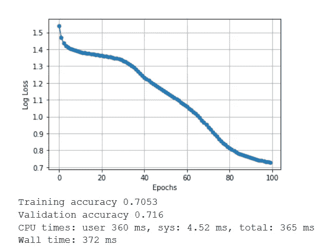

普通梯度下降算法给我们的精度是 0.716，这不是最佳的。

2.小批量梯度下降:

```
elif algo == "MiniBatch":for k in range(0, m, mini_batch_size):self.grad(X[k:k+mini_batch_size], Y[k:k+mini_batch_size])for i in range(1, self.num_layers+1):self.params["W"+str(i)] -= eta * (self.gradients["dW"+str(i)]/mini_batch_size)self.params["B"+str(i)] -= eta * (self.gradients["dB"+str(i)]/mini_batch_size)```%%timemodel = FFSN_Vectorised(W1, W2)model.fit(X_train, y_OH_train, epochs=100, eta=1, algo="MiniBatch", mini_batch_size=128, display_loss=True)print_accuracy()
```

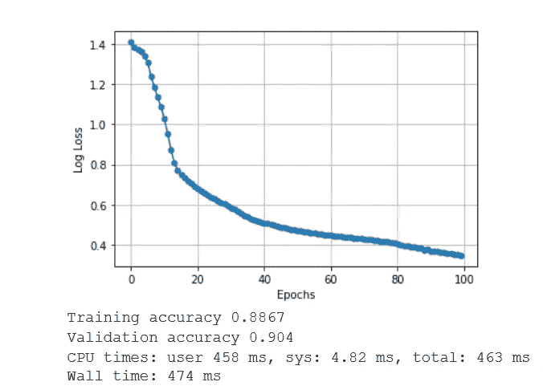

正如你可以观察到的一样，对于相同数量的时期和学习率，Mini Batch 给了我们 0.90 的准确率。获得的两个精度之间的巨大差异是因为普通梯度下降遍历所有数据值，然后进行一次更新，但在 Mini Batch 中，它查看 128 个值，然后进行更新。因此，实际上，如果我们有 100 个时期，模型将遍历数据 100 次，但会进行几次更新。此外，这些点彼此相距较远，因为在每个小批量之后进行的更新(即梯度更新)非常大，导致损耗下降较大。然而，在普通梯度下降中，当你查看整个数据时，数据值被平均化，从而进行较小的更新。

那么，当我们进一步减少小批量时会发生什么呢？

```
%%timemodel = FFSN_Vectorised(W1, W2)model.fit(X_train, y_OH_train, epochs=100, eta=1, algo="MiniBatch", mini_batch_size=8, display_loss=True)print_accuracy()
```

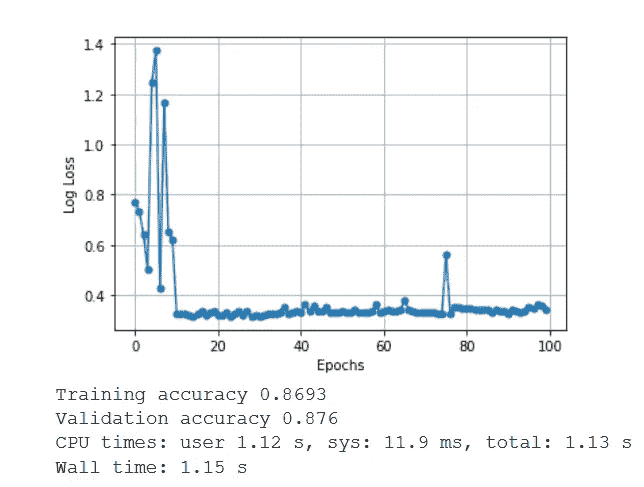

这里，有更多的振荡。这是批量较小的危险之一。获得的梯度下降将是非常嘈杂的样本。

3.基于动量的梯度下降；

```
elif algo == "Momentum":self.grad(X, Y)for i in range(1, self.num_layers+1):self.update_params["v_w"+str(i)] = gamma *self.update_params["v_w"+str(i)] + eta * (self.gradients["dW"+str(i)]/m)self.update_params["v_b"+str(i)] = gamma *self.update_params["v_b"+str(i)] + eta * (self.gradients["dB"+str(i)]/m)self.params["W"+str(i)] -= self.update_params["v_w"+str(i)]self.params["B"+str(i)] -= self.update_params["v_b"+str(i)]```%%timemodel = FFSN_Vectorised(W1, W2)model.fit(X_train, y_OH_train, epochs=100, eta=1, algo="Momentum", gamma=0.5, display_loss=True)print_accuracy()
```

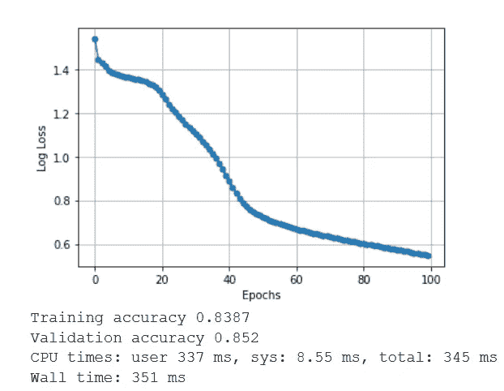

> 在基于动量的算法中，术语“伽马”控制算法的加速。

正如你所观察到的，算法进行得很顺利，但是做得还不够。那么，如果我们把动量项“γ”增加到 0.99 呢？

```
%%timemodel = FFSN_Vectorised(W1, W2)model.fit(X_train, y_OH_train, epochs=100, eta=1, algo="Momentum", gamma=0.99, display_loss=True)print_accuracy()
```

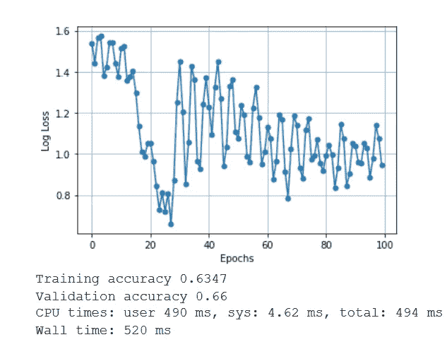

在这里，算法只是滑向错误的方向，而且太吵了。为了解决这个问题，我们使用了内斯特罗夫加速梯度下降法，它可以承受非常大的动量项。

4.内斯特罗夫加速梯度下降；

```
elif algo == "NAG":temp_params = {}for i in range(1, self.num_layers+1):self.update_params["v_w"+str(i)] = gamma * self.prev_update_params["v_w"+str(i)]self.update_params["v_b"+str(i)] = gamma * self.prev_update_params["v_b"+str(i)]temp_params["W"+str(i)] = self.params["W"+str(i)] - self.update_params["v_w"+str(i)]temp_params["B"+str(i)] = self.params["B"+str(i)] - self.update_params["v_b"+str(i)]self.grad(X, Y, temp_params)for i in range(1, self.num_layers+1):self.update_params["v_w"+str(i)] = gamma * self.update_params["v_w"+str(i)] + eta * (self.gradients["dW"+str(i)]/m)self.update_params["v_b"+str(i)] = gamma * self.update_params["v_b"+str(i)] + eta * (self.gradients["dB"+str(i)]/m)self.params["W"+str(i)] -= eta * (self.update_params["v_w"+str(i)])self.params["B"+str(i)] -= eta * (self.update_params["v_b"+str(i)])self.prev_update_params = self.update_params```%%timemodel = FFSN_Vectorised(W1, W2)model.fit(X_train, y_OH_train, epochs=100, eta=1, algo="NAG", gamma=0.9, display_loss=True)print_accuracy()
```

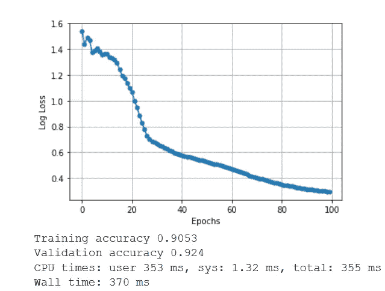

NAG 给我们的准确率是 0.92！这是迄今为止我们观察到的最好结果。不过，当势头良好时，唠叨也没什么好处。

5.阿达格拉德:

在 AdaGrad(自适应梯度)中，我们按照参数更新历史的比例衰减参数的学习速率(eta)。

```
elif algo == "AdaGrad":self.grad(X, Y)for i in range(1, self.num_layers+1):self.update_params["v_w"+str(i)] += (self.gradients["dW"+str(i)]/m)**2self.update_params["v_b"+str(i)] += (self.gradients["dB"+str(i)]/m)**2self.params["W"+str(i)] -= (eta/(np.sqrt(self.update_params["v_w"+str(i)])+eps)) * (self.gradients["dW"+str(i)]/m)self.params["B"+str(i)] -= (eta/(np.sqrt(self.update_params["v_b"+str(i)])+eps)) * (self.gradients["dB"+str(i)]/m)```%%timemodel = FFSN_Vectorised(W1, W2)model.fit(X_train, y_OH_train, epochs=100, eta=.1, algo="AdaGrad", display_loss=True)print_accuracy()
```

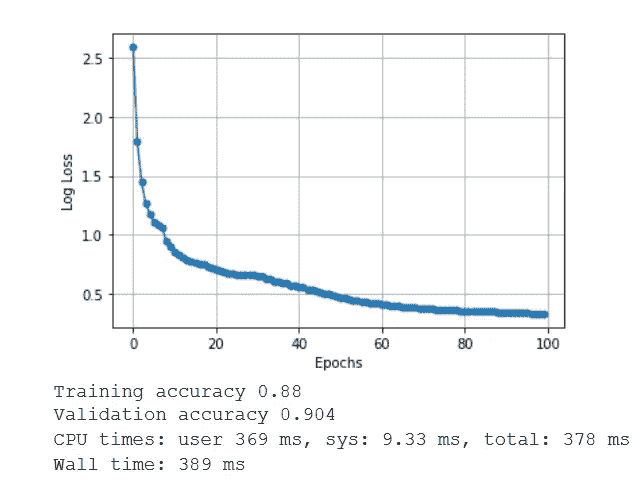

正如你所观察到的，最初算法开始时选择了一个不好的初始点，但它在 20 次迭代内很快就自我修正了。

使用 AdaGrad 的优点是对应于稀疏特征的参数得到更好的更新，但缺点是随着有效学习率分母的增长，学习率急剧下降。

```
%%timemodel = FFSN_Vectorised(W1, W2)model.fit(X_train, y_OH_train, epochs=100, eta=.1, algo="AdaGrad", display_loss=True)print_accuracy()
```

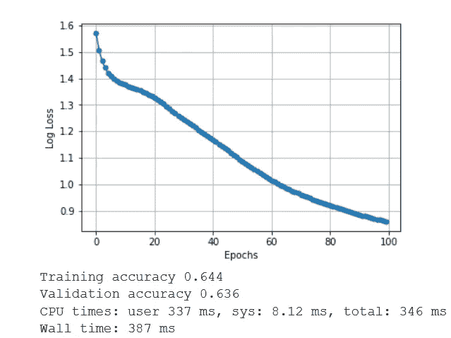

正如你所观察到的，AdaGrad 在学习率很低的情况下无法工作，因为它给出了 0.63 的准确度分数。为了解决这个问题，使用了 RMSProp。

6.RMSProp:

```
elif algo == "RMSProp":self.grad(X, Y)for i in range(1, self.num_layers+1):self.update_params["v_w"+str(i)] = beta*self.update_params["v_w"+str(i)] +(1 - beta)*((self.gradients["dW"+str(i)]/m)**2)self.update_params["v_b"+str(i)] = beta*self.update_params["v_b"+str(i)] +(1 - beta)*((self.gradients["dB"+str(i)]/m)**2)self.params["W"+str(i)] -= (eta/(np.sqrt(self.update_params["v_w"+str(i)]+eps)))*(self.gradients["dW"+str(i)]/m)self.params["B"+str(i)] -= (eta/(np.sqrt(self.update_params["v_b"+str(i)]+eps)))*(self.gradients["dB"+str(i)]/m)```%%timemodel = FFSN_Vectorised(W1, W2)model.fit(X_train, y_OH_train, epochs=100, eta=.1, algo="RMSProp", beta=0.9, display_loss=True)print_accuracy()
```

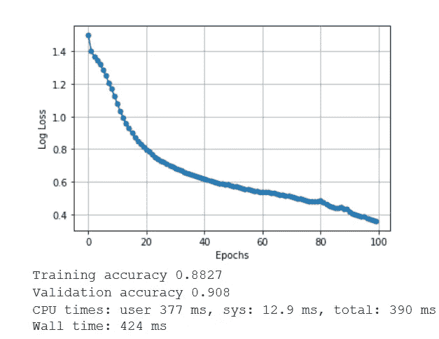

这里，具有较小学习速率的问题被反驳，但是如果我们增加 eta 的值，它将开始振荡，因为没有一阶项或动量项来抵消振荡。

```
%%timemodel = FFSN_Vectorised(W1, W2)model.fit(X_train, y_OH_train, epochs=100, eta=.9, algo="RMSProp", beta=0.9, display_loss=True)print_accuracy()
```

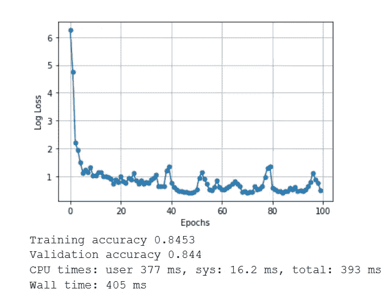

7.亚当:

```
elif algo == "Adam":self.grad(X, Y)num_updates=0for i in range(1, self.num_layers+1):num_updates += 1self.update_params["m_w"+str(i)] = beta1*self.update_params["m_w"+str(i)] + (1-beta1) * (self.gradients["dW"+str(i)]/m)self.update_params["v_w"+str(i)] = beta2*self.update_params["v_w"+str(i)] + (1-beta2) * ((self.gradients["dW"+str(i)]/m)**2)m_w_hat = self.update_params["m_w"+str(i)]/(1-np.power(beta1, num_updates))v_w_hat = self.update_params["v_w"+str(i)]/(1-np.power(beta2, num_updates))self.params["W"+str(i)] -= (eta/np.sqrt(v_w_hat+eps))*m_w_hatself.update_params["m_b"+str(i)] = beta1*self.update_params["m_b"+str(i)] + (1-beta1) * (self.gradients["dB"+str(i)]/m)self.update_params["v_b"+str(i)] = beta2*self.update_params["v_b"+str(i)] + (1-beta2) * ((self.gradients["dB"+str(i)]/m)**2)m_b_hat = self.update_params["m_b"+str(i)]/(1-np.power(beta1, num_updates))v_b_hat = self.update_params["v_b"+str(i)]/(1-np.power(beta2, num_updates))self.params["B"+str(i)] -= (eta/np.sqrt(v_b_hat+eps))*m_b_hat```%%timemodel = FFSN_Vectorised(W1, W2)model.fit(X_train, y_OH_train, epochs=100, eta=.9, algo="Adam", beta=0.9, display_loss=True)print_accuracy()
```

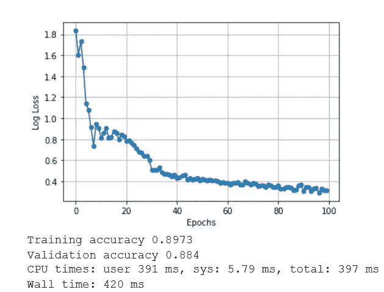

AdaGrad 和 RMSProp 的所有局限性都被 Adam 反制了。Adam 是深度学习中应用最广泛的学习算法。唯一的缺点是它比较慢，因为涉及到更多的计算。原因是它确实进行了计算量很大的偏差校正。

```
%%timemodel = FFSN_Vectorised(W1, W2)model.fit(X_train, y_OH_train, epochs=100, eta=.1, algo="Adam", beta=0.9, display_loss=True)print_accuracy()
```

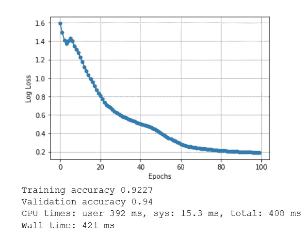

*鳍*