# 用硬币分散人工智能的注意力| Unity

> 原文：<https://medium.com/nerd-for-tech/distracting-the-ai-with-a-coin-unity-1cfb4e83f0fa?source=collection_archive---------7----------------------->

## 统一指南

## 关于如何在 Unity 中用硬币愚弄人工智能的快速指南

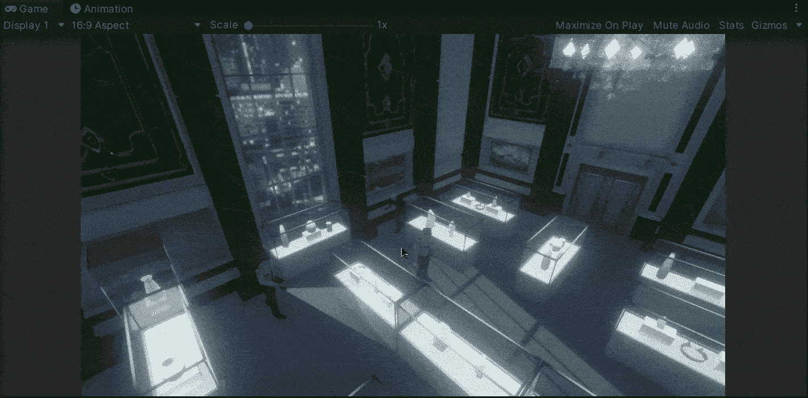

**目标**:在 Unity 中实现一个用硬币分散 NPC 注意力的系统。

在上一篇文章中，我介绍了[如何给人工智能](/nerd-for-tech/giving-eyes-to-the-ai-unity-27acb7f48b12)赋予眼睛。现在，是时候实现一个系统来分散 Unity 中 NPC(不可玩的角色)的注意力，让玩家在潜行游戏中不被注意地移动。

# 分散注意力

如果你看过[我最近的帖子](https://fas444.medium.com/)，你会记得我们游戏中的当前场景:

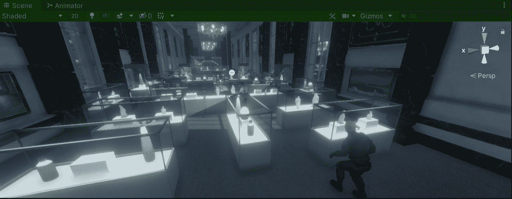

我们是达伦，一个潜入比阿特丽斯拍卖行大厅试图盗取数百万美元的小偷。问题是路上有几个障碍，他需要神不知鬼不觉地通过才能到达大楼的主拱顶。

所以，为了在不被发现的情况下通过第一批守卫，我们会给达伦扔硬币的能力来分散守卫的注意力。首先，我们需要创建一个硬币的预制品:

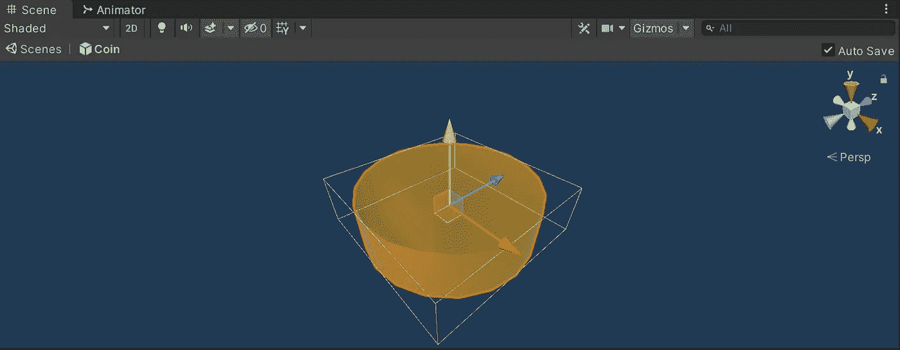

现在，让我们打开**播放器**脚本。

我们将使用一个动作委托来实现转移注意力。让我们首先将各自的名称空间包含到脚本中:

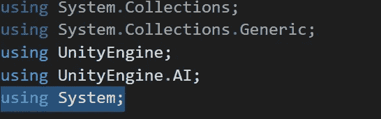

如果你想知道动作委托在 C#中是如何工作的，你可以访问微软文档:

 [## 动作委托(系统)

### 封装具有单个参数且不返回值的方法。通用公共委托无效操作(T…

docs.microsoft.com](https://docs.microsoft.com/en-us/dotnet/api/system.action-1?view=net-5.0) 

然后，让我们创建:

*   公共静态动作委托

当硬币被用来分散 NPC 的注意力时，这个动作代表将负责将要发生的动作。

*   游戏对象变量

这个变量将存储一个硬币预置的参考，我们将使用它来分散注意力。

*   AudioClip 变量

这个变量将存储一个引用，指向投掷硬币时我们将播放的音频。

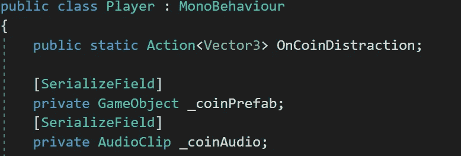

现在，让我们创建一个新的方法，它接收所需的位置来实例化硬币预置并播放相应的音频:

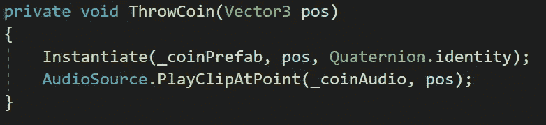

接下来，让我们在 **Awake** 或 **Start** 方法中添加对动作委托的方法调用:

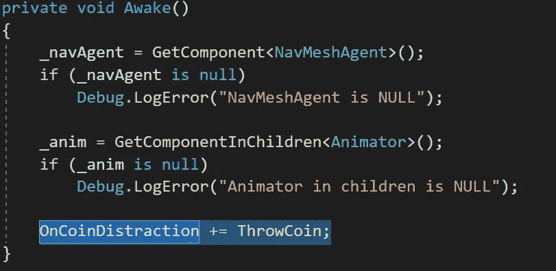

最后，为了触发注意力分散，让我们检查一下 **Update** 方法中的右击输入。如果玩家单击右键，我们将使用相机的光标位置创建一个光线投射，该光线投射将返回场景中的一个点(***hitinfo . point***)以执行动作委托，并将其作为参数(如果不为空):

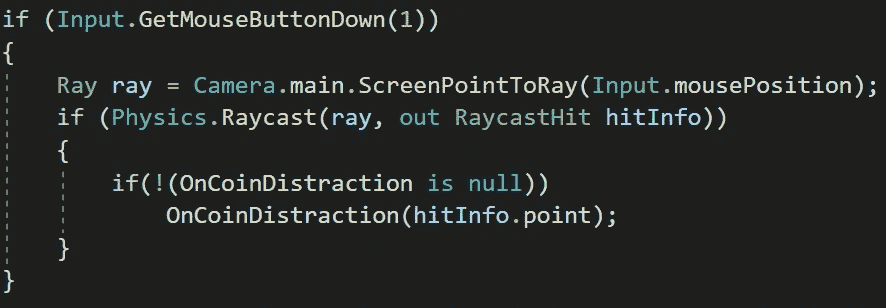

作为一个好的实践，让我们使用 **OnDestroy** 方法从静态动作委托中移除 **ThrowCoin** 方法:

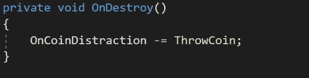

# 实施转移注意力

现在，为了在 NPC 中实现分散注意力，让我们打开控制他们运动的脚本。首先，让我们创建一个新的 bool 来表示警卫是否分心:

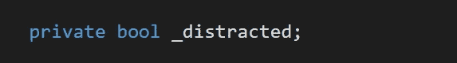

在我的例子中，我将使用它来禁止 **OnTriggerEnter** 方法运行:

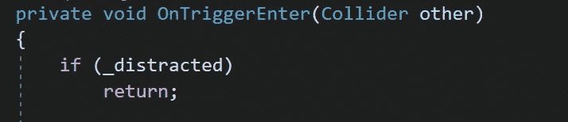

现在，让我们创建一个新方法来接收实例化硬币的位置。该方法将:

*   如果与硬币的距离小于 15，分散 NPC 的注意力。
*   使用 **StopAllCoroutines** 方法停止 NPC 当前的协同程序。
*   设置新的分心布尔为真。
*   设置 NPC 的新目的地 ***导航网代理*** 。
*   触发 NPC 的行走动画。
*   启动一个新的协程，检查 NPC 是否在硬币附近，以停止行走动画。

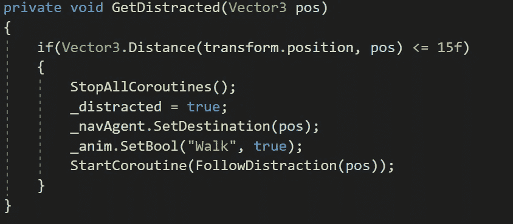

新的协同程序将接收硬币位置并检查每帧的距离，直到 NPC 接近硬币，停止其动画和移动以避免覆盖硬币:

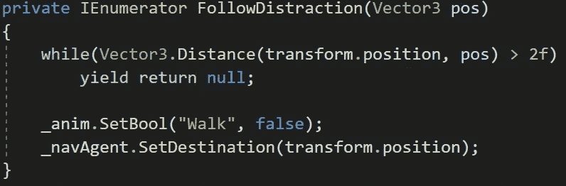

最后，在 **Awake** 或 **Start** 方法中，让我们将**get distant**方法添加到来自玩家的静态动作委托中。为了保持良好的习惯，让我们使用 **OnDestroy** 方法删除它:

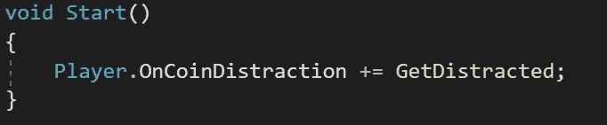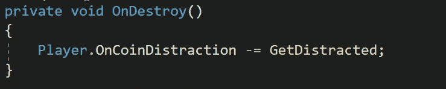

如果我们用 Unity 运行游戏，我们会看到硬币如预期的那样转移 NPC 的注意力:

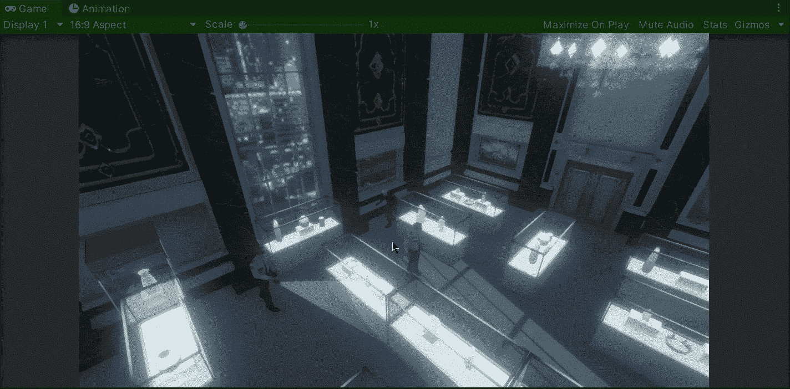

就这样，我们用 Unity 实现了对 AI 的干扰！:d .我会在下一篇文章中看到你，在那里我将展示如何用 Unity 为我们的游戏实现安全摄像头。

> *如果你想了解我更多，欢迎登陆*[***LinkedIn***](https://www.linkedin.com/in/fas444/)**或访问我的* [***网站***](http://fernandoalcasan.com/) *:D**