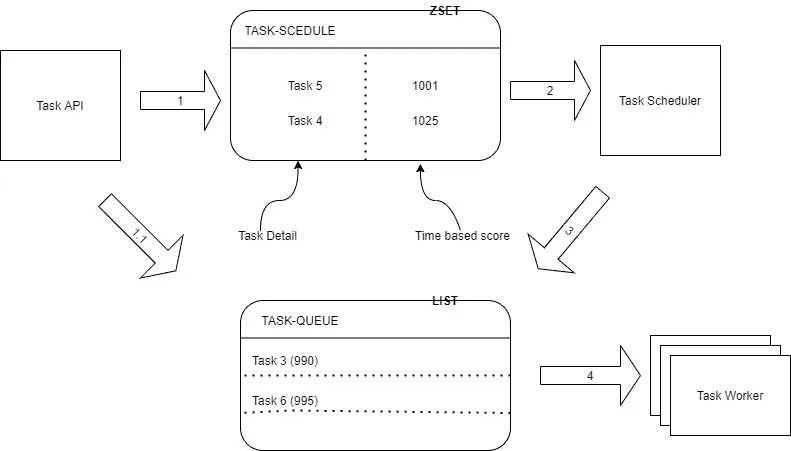
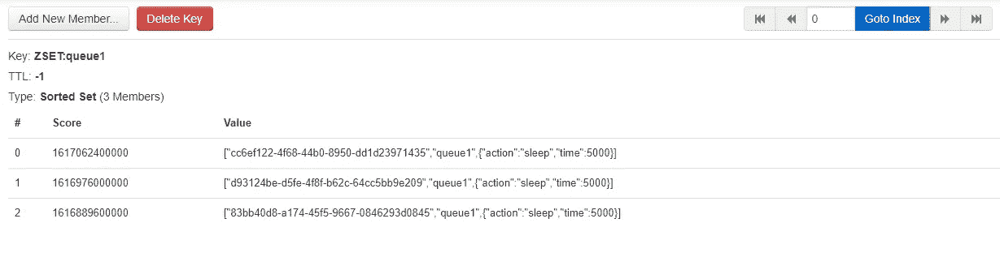

# 分布式任务调度程序

> 原文：<https://medium.com/nerd-for-tech/distributed-task-scheduler-redis-329475df9dcf?source=collection_archive---------1----------------------->


Redis 已经成为分布式微服务应用领域中的一个重要组件，这是由于它的简单性、性能和清晰的特性集。这篇文章是关于使用 Redis 的一些特性构建一个任务调度系统。为了定义界限和解释方式，要求选择如下。

# 要求:

*   该系统必须是可扩展的和分布式的
*   多个工作进程
*   任务可以是实时的或延迟的
*   空闲时资源消耗应该最小

# 设计



任务调度系统—框图

该系统由四个**部件**组成

*   任务 API:任务生成者
*   REDIS:一种分布式数据结构，支持有序集合和 FIFO 列表
*   任务调度器:读取任务并在精确的时间内将它们推到列表中
*   任务工作者:任务消费者

## 步骤:

1.  任务 API 计算分数，并将任务项和分数一起添加到 ZSET 中
2.  任务计划程序不断检查集合的第一项。
3.  如果分数与当前时间匹配，该项目将被推入工作队列
4.  任务工作线程停留在阻塞队列中，一旦有项目添加到队列中，就立即执行

## 任务 API

任务 API 是一个 [restify](http://restify.com/) POST 处理程序，它接受任务并根据“when”属性将其推送到 Redis。每个推送到 [ZSET](https://redis.io/commands/ZADD) 的条目将是一个 JSON 编码的数组，包含三个条目(标识符、工作队列名和任务细节)。在 ZSET 中，每个成员都与一个分数相关联，该分数按照升序对集合进行排序。“when”属性经过纪元转换并被指定为分数。

```
async SaveTask(req, res, next) {
        let queue = req.params.queue;
        let id = uuidV4();
        let time = req.body.when;
        let item = [id, queue, req.body.task];
        let score = 0;
        let status = 'PENDING';
        if (time) {
            score = new Date(time).getTime()
            console.log(`Push task ${id} to process later on ${time} `);
            await redisHandler.AddToSortedSet(JSON.stringify(item), score);
            status = 'SCHEDULED';} else {
            console.log(`Push task ${id} to execute in relatime`);
            await redisHandler.AddItemToQueue(queue, JSON.stringify(item));
            status = 'QUEUED';
        }res.send({ item: item, score: score, status: status });}
```

[ioredis](https://github.com/luin/ioredis) 代码段

```
async AddToSortedSet(item, value) {
        return new Promise((resolve, reject) => {
            this.redisClient.zadd(`ZSET:SCHEDULED:ITEMS`, value, item, (err, result) => {
                if (err) {
                    reject(err);
                } else {
                    resolve(result);
                }
            })
        })
    }
```



ZSET 值

## 任务调度程序

任务调度程序获得锁，然后处理临界区。它从 ZSET 中读取第一项，并将“when”与当前时间进行比较。选定的任务从 ZSET 中删除，并推送到相关的队列进行处理。

```
async ProcessEvents() {
  while (true) {
    try {
      await lock.acquire(`LOCK:ZSET:ITEMS`);
      try {
        let value = await redisHandler.GetTopFromSortedSet();
        if (value && value.length > 0) {
          let item = JSON.parse(value[0]);
          let time = value[1];
          if (parseFloat(time) <= Date.now()) {
            console.log(`Scheduled item ${item[0]} ready to process`);
            await redisHandler.DeleteItemFromSet(value[0]);
            await redisHandler.AddItemToQueue(item[1], value[0]);
          }
        }else {
          //No items to work process wait 1s before check again
          await lock.release();
          await new Promise(r => setTimeout(r, 1000));
          continue;
        }
      } catch (ex) {
        console.log(`Error on event processing ${ex.message}`);
      }
      await lock.release();
    } catch (ex) {
      // error in acquiring or releasing the lock
    }
    await new Promise(r => setTimeout(r, 100));
  }
}
```

[ioredis](https://github.com/luin/ioredis) 代码段

```
async GetTopFromSortedSet() {
        return new Promise((resolve, reject) => {this.redisClient.zrange(`ZSET:SCHEDULED:ITEMS`, 0, 0, "WITHSCORES", (err, result) => {
                if (err) {
                    reject(err);
                } else {
                    resolve(result);
                }
            })
        })
    }async DeleteItemFromSet(item) {
        return new Promise((resolve, reject) => {this.redisClient.zrem(`ZSET:SCHEDULED:ITEMS`, item, (err, result) => {
                if (err) {
                    reject(err);
                } else {
                    resolve(result);
                }
            })
        })
    }async AddItemToQueue(key, item) {
        return new Promise((resolve, reject) => {this.redisClient.rpush(`QUEUE:${key}`, item, (err, result) => {
                if (err) {
                    reject(err);
                } else {
                    resolve(result);
                }
            })
        })
    }
```

## 任务处理器

任务处理器使用阻塞左 pop ( ***blpop*** )方法模仿 FIFO 行为。只要列表中有一项可用，方法就会释放该进程。它**需要一个专用的 Redis 客户端来阻塞操作**，因为它也阻塞其他 Redis 操作。

```
async ProcessTasks(queue) {while (true) {let taskArray = await redisHandler.GetItemFromQueueBlocking(queue);
            if (taskArray && taskArray.length > 1) {
                let task = JSON.parse(taskArray[1]);
                if (task && Array.isArray(task) && task.length > 2) {
                    let item = task[2];
                    console.log(`Task ${task[0]} ready to process - action: ${item.action} params: ${item.time}`);
                    await new Promise(r => setTimeout(r, item.time));
                }
            }
        }}
```

[ioredis](https://github.com/luin/ioredis) 代码段

```
async GetItemFromQueueBlocking(key) {
        return new Promise((resolve, reject) => {this.redisClient.blpop(`QUEUE:${key}`, 5000, (err, result) => {
                if (err) {
                    reject(err);
                } else {
                    resolve(result);
                }
            })
        })
    }
```

# 讨论

Redis 是在微服务领域实现各种分布式模式的优秀工具。有许多数据结构可以用来实现这些模式。其中一些是分布式锁、发布和订阅、仪表板的原子计数器、使用搜索的自动完成系统。可以在 [git](https://github.com/sukitha/distributed-task-scheduler) 上找到源代码。