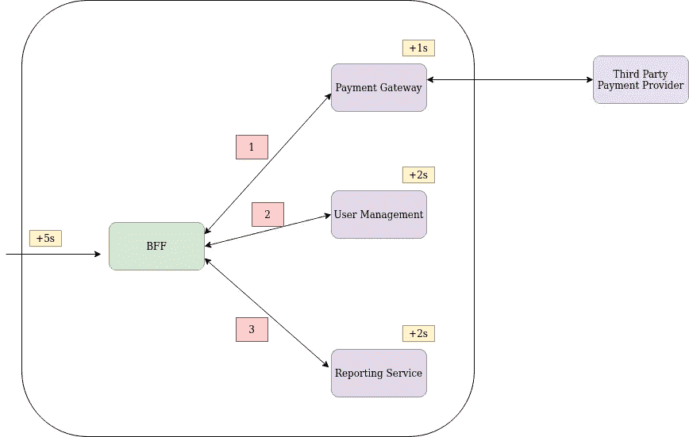
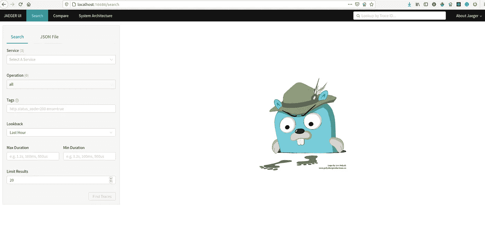
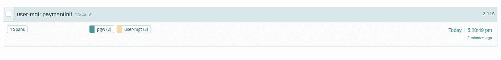
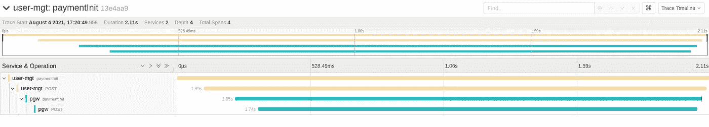

# 用 Jaeger 实现微服务的分布式跟踪

> 原文：<https://medium.com/nerd-for-tech/distributed-tracing-in-micro-services-with-jaeger-1e595eb9f906?source=collection_archive---------9----------------------->

Jaeger 是由 uber 创建的开源工具，用于微服务之间的分布式跟踪。

# 为什么我们在微服务中需要分布式跟踪？

说到微服务架构，最具挑战性任务是内部延续。现在，当处理微服务时，我们必须考虑每个服务的执行时间。这就是为什么需要跨微服务使用分布式跟踪机制的原因。

假设当客户向 BFF 服务发送请求时，我们需要跟踪请求。这里我们使用 spring boot 来编写微服务。

# 步骤 1:添加依赖关系和配置

在本教程中，我将使用 spring boot 来编写微服务，因此这些是您必须添加到 maven 项目中的依赖项。

并将这些配置添加到 yml 文件中。

这是连接到 jaeger 服务器实例的配置。最后创建单独的配置文件&添加以下 beans 来识别 jaeger 服务器中的模块细节。

像这样所有的微服务都需要更新。

# 步骤 2:启动 JAEGER 服务器和用户界面进行测试

我们可以用 docker 来启动 jaeger sever & UI。

一旦 jaeger 用户界面启动，你就可以进入[这里](http://localhost:16686/search)。

然后我们可以在 UI 中跟踪 API 请求。

jaeger ui

例如，这是 jaeger UI 中显示的一个请求。API 执行时间为 2.11 秒。有两个模块在请求中有记录。

当我们单击请求时，它会显示每个模块 API 的执行时间。在我的例子中，支付网关花费了更多的执行时间。这是 1.85 秒，但实际上第三方连接花了 1.74 秒。这样才能找出微服务的瓶颈。

