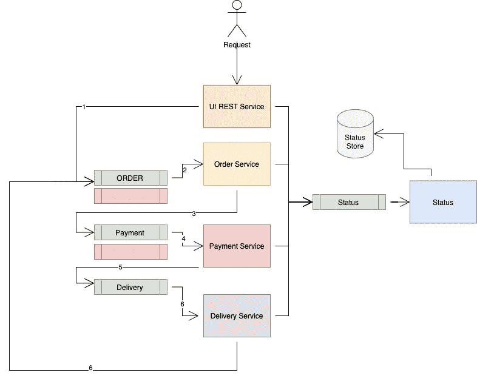
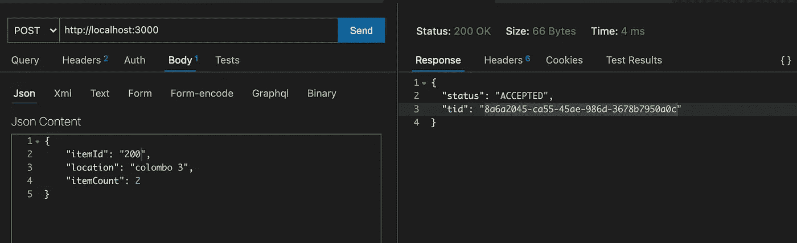
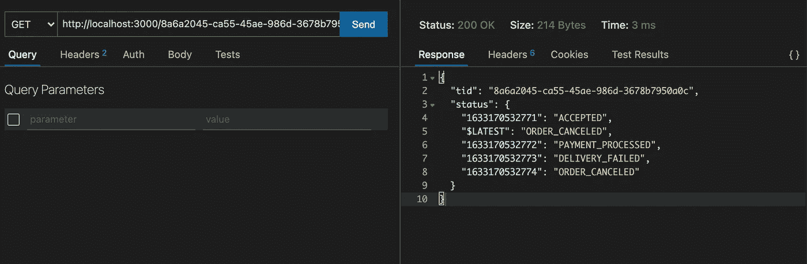
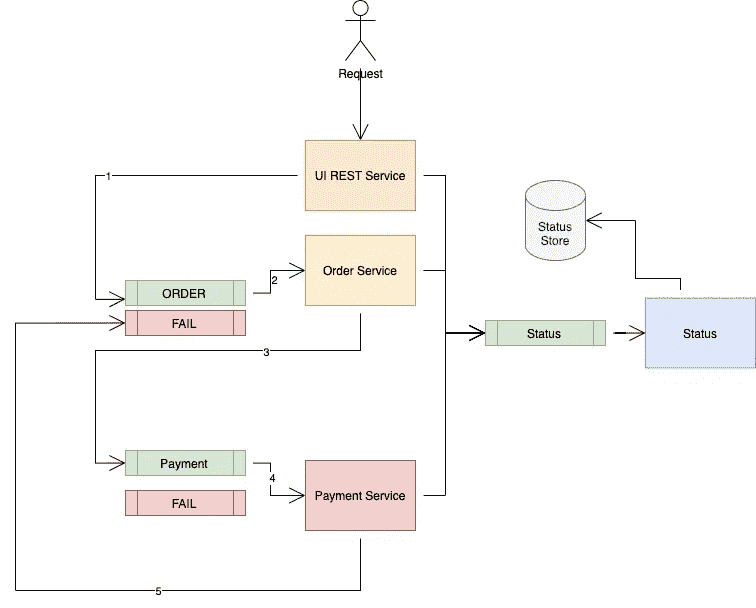

# 分布式事务—使用 REDIS 和 NodeJS 实现

> 原文：<https://medium.com/nerd-for-tech/distributed-transaction-implementation-using-redis-and-nodejs-c27c00328e4a?source=collection_archive---------0----------------------->

由于其分布式特性，分布式事务实现已经成为微服务开发中最大的挑战之一。有一些众所周知的模式可以解决这个问题。在本文中，我将解释一个使用`Redis`和`Nodejs`完成的示例实现。首先，让我们讨论一下我们要解决的问题的背景。

在设计上，`RDBMS`系统支持`ACID`交易。如果任何语句失败，事务会自行恢复。微服务模型不支持这一点，因为专用数据存储可用于服务。大多数数据存储根据`BASE`属性运行。你可以从这篇文章中了解更多关于`ACID` vs `BASE`的内容([链接](https://phoenixnap.com/kb/acid-vs-base))。

重要的是要明白，在微服务模型中，完全的`ACID transaction`是不可能的。因此，您的分布式事务实现对于系统的问题域和期望来说是高度主观的。在实现这个示例时，我做了一些假设。

先来看看解决方案的组件设计。

成功交易

## 成分

*   休息服务
*   订单服务
*   支付服务
*   送货服务
*   状态服务

## 休息服务

REST 服务是切入点。它在为事务生成 id 之前接受并验证请求。生成的 id 在 http 响应中返回给客户端。经验证的请求转发到`*ORDER: QUEUE*` 进行进一步处理。

## REST 服务请求和响应

数据以最终一致的方式存储，因此我们可以随时重放交易，并在失败时进行手动或批量对账。

发布创建订单的请求

获取轮询事务状态的请求

## 订单服务/支付/交付服务

每个服务读取请求，进一步处理它，并嵌入额外的细节，如成本。然后将事件转发到下一个队列。协调过程也在同一服务中实现。因此，撤销事务的责任就交给了相关的服务。

## 恢复

我们来看看对账流程。

该图显示了当支付操作失败时如何执行恢复过程。我通过将项目 id 200 设置为失败案例来模拟这种情况。在这种情况下，支付服务通知订单服务恢复交易。订单服务将软状态更改为失败。前端可以看到交易失败。设计冲销事务时有一些最佳实践。相反的过程应该很简单，不应该轻易失败。发送短信等步骤应在交易结束时执行。

## 结论

本文中的实现非常简单。实际的问题域要复杂得多，可能涉及几十个服务和数百个事件。但是基本概念保持不变。有很多技术和概念可以帮助解决类似的问题([链接](https://developers.redhat.com/blog/2018/10/01/patterns-for-distributed-transactions-within-a-microservices-architecture))。

在这个示例中，我使用了`Redis`作为队列。但是，`Kafka`可能是更好的生产队列选择，因为我们可以使用`*Kafka ack*`实现应用级容错，使用`Debezium`的`*Kafka Connect*`作为 CDC 解决方案，`Kafka`本身作为事件源数据库。