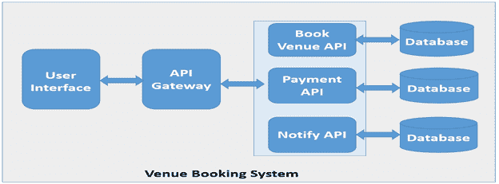

# 微服务世界中的分布式事务管理

> 原文：<https://medium.com/nerd-for-tech/distributed-transaction-management-in-microservices-world-22f34718a643?source=collection_archive---------1----------------------->

现代化是当今任何大型组织的关键举措之一。整体架构到微服务架构的转变是这种现代化的支柱。

整体式应用程序是作为单个单元构建的，这有其自身的缺点，例如，应用程序太大太复杂，无法完全理解并快速正确地进行更改，在每次更新、持续集成和持续部署时重新部署整个应用程序很困难，整体式应用程序在采用新技术方面有障碍，但它也有优势，例如启动新项目和开发它使用整体式架构更简单，可以轻松应用框架、模板或脚本等组件，其中最有影响力的功能之一是事务管理。

微服务架构具有各种优势，但分布式事务管理是一个挑战，建议避免跨微服务的分布式事务管理，但如果我们处理大型系统，那么为了保持数据一致性和 ACID 属性，事务管理是关键。

# 微服务架构与整体架构

在我们跳到微服务领域的分布式事务管理之前，让我们了解一下微服务和单片架构之间的主要区别，以及事务管理需求是如何产生的。

Web 应用程序开发是一个古老的(20 世纪 70 年代)概念，它从数字化开始，使用软件应用程序来解决各种行业问题。以前，我们使用基于桌面的应用程序，然后趋势开始是使用客户机-服务器技术将它们迁移为基于 web 的应用程序。随着技术的进步和更多的过程自动化的需要，大多数公司继续增强现有的应用程序，这导致了“胖”单片企业应用程序。这在很大程度上要归功于微服务架构，它启动了批判性思维处理，将应用程序分解为 API 和易于管理的组件。

企业应用程序由三部分组成:数据库(通常由关系数据库管理系统中的许多表组成)、客户端用户界面(由浏览器中运行的 HTML 页面和/或 JavaScript 组成)以及服务器端应用程序。这个服务器端应用程序将处理 HTTP 请求，执行一些特定于域的逻辑，从数据库中检索和更新数据，并填充要发送到浏览器的 HTML 视图。它是一个整体——一个单一的逻辑可执行文件。

事务处理系统使三层应用程序在创建可伸缩和健壮的应用程序方面的优势变得可行。事务服务器处理的另一个优点是能够在不同的服务器之间分发组成应用程序的组件，而不必为该体系结构进行开发。这减轻了开发人员必须明确支持这些特性的负担。

当事务处理系统创建一个事务时，它将确保该事务具有某些特征。组成事务的组件的开发人员确信这些特征已经存在。他们不需要自己管理这些特征。这些特性被称为酸性。酸是原子性、一致性、隔离性和持久性的缩写。

现在，让我们来看看微服务架构，这是一种架构风格，它将单块应用程序构建或分解为松散耦合的服务集合，以实现业务功能。微服务架构还加快了大型复杂应用程序的持续交付/部署。简单地说，开始考虑将您的应用程序分解成独立的组件，以便在细粒度级别上提供业务功能。

微服务架构具有各种优势，但分布式事务管理是一个挑战，建议避免跨微服务的事务，但如果我们处理大型系统，那么为了保持数据一致性，高效的事务管理是一个至关重要的过程。

# 如果在微服务架构中没有高效处理事务管理会怎样？

为了理解事务管理的影响，让我们来看一个简单的场景，其中我们有 3 个不同的微服务，它们有自己独立的业务能力，连接到不同的数据库。我们的业务要求是，我们需要确保完成所有 3 个步骤，如果所需步骤中的任何一个失败，我们将回滚所有 3 个步骤。在这 3 个步骤中，第 3 步并不重要，但为了最终的一致性，我们需要确保它已经完成。

为了理解挑战，让我们以使用微服务的场馆预订系统为例，可能有多个故障点会影响场馆预订系统的 ACID 属性。

1.  如果所需的任何步骤没有完成，应该如何在微服务中完成？
2.  如果一个人在同一天同一个时间被预订了两次呢？
3.  如果，没有预订场地就扣了款怎么办？
4.  预订完成但没有通知用户怎么办？
5.  可能还有其他类似的系统问题…

所有这些问题都可以在单片应用程序中轻松处理(如果我们使用 3 层架构模型)，但是为了在微服务架构中处理这种情况，我们需要设计一个能够有效管理分布式事务管理的解决方案。

# 分布式事务管理的解决方案:

分布式事务管理是行业中的一个常见问题，有一些模式可以解决这个问题，此外，还可能有一些自定义模式。以下是处理微服务之间事务管理的方法:

# 方法 1

避免跨微服务的分布式事务——这是一种理想的情况，但也可能不是理想的情况，尤其是当您从单一架构转型时，因此可以考虑以下方法。

# 方法 2

管理流程 API 中的事务——这是一个混合解决方案，主要适用于组织正在脱离单一流程的情况，同时，如果组织拥有非常相互依赖的复杂流程，这也是一个很好的解决方案。在这些情况下，开发人员可以构建流程 API，并在 API 中编排逻辑业务功能。所有复杂的事务都在 API 中进行管理，可以消除对分布式事务管理的需求，从性能角度来看，这可能是一种更好的方法，因为我们可以避免 API 之间的多次跳跃，但这不是真正的微服务架构。

# 方法 3

2/3 阶段提交方法—这是使用协调器的分布式事务管理中最重要的模式之一，它将由以下阶段组成:

1.  准备阶段:在这个阶段，事务的所有参与者都准备提交，并通知协调器他们已经准备好完成事务
2.  提交阶段:在这个阶段，事务协调器向所有参与者发出提交或回滚命令
3.  补偿事务(回滚):在这个阶段，回滚作为补偿事务和最终一致性的一部分来执行。

2/3 阶段提交是一个非常强的一致性协议。首先，准备和提交阶段保证了事务是原子的。该事务将以所有微服务成功返回或者所有微服务无任何改变而结束。其次，它允许读写隔离。这意味着在协调员提交更改之前，字段中的更改是不可见的。

这种方法面临以下挑战:

*   太多的失败点，整个解决方案依赖于协调器，如果协调器失败了，那么一切都坏了。
*   如果后端服务没有响应，那么这种方法可能是低效的。
*   虽然 2/3 阶段提交解决了这个问题，但对于许多基于微服务的系统来说，并不真正推荐使用它，因为它是同步的(阻塞)。该协议将需要在事务完成之前锁定将被改变的对象。
*   锁定可能会成为系统性能的瓶颈。此外，两个事务相互锁定(死锁)也是可能的。

# 方法 4

最终一致性和补偿/ SAGA 设计模式—在这种模式中，分布式事务可以使用异步模式实现，这是最可靠和可伸缩的解决方案，也解决了由 2/3 阶段提交方法引起的一些变化。在 Saga 模式中，分布式事务由所有相关微服务上的异步本地事务来完成。微服务通过事件总线相互通信。

这个模式有两种方法编排和编排。

1.  基于事件的编排，在这种模式中，每个服务产生并监听其他服务事件，并决定是否应该采取某个动作。所有的通信都是由编排器发起的，响应是由回复通道接收的。

事件/编排是实现 Saga 模式的正常方式。它不需要更多的努力。简单易懂。在这种情况下，所有参与者都是松散耦合的，因为他们彼此没有直接的了解。

然而，如果在事务中添加更多的步骤，这可能会变得令人困惑，因为跟踪哪个服务使用哪个事件会变得困难。此外，它可能会在服务之间创建一个循环依赖关系，因为它们必须订阅彼此的事件。

1.  编排:在编排方法中，我们定义了一个新的服务，唯一的责任是告诉每个参与者在什么时候做什么。saga 模式编排器以命令/回复方式与每个服务通信，告诉它们应该执行什么操作。

# 方法 5

将异步模式用于故障转移逻辑的阶段提交方法—这是一种自定义模式，使用微服务进行事务管理，在发生任何故障事件时，可以根据需要执行事务补偿，并且可以利用异步故障转移逻辑实现最终一致性。由于故障转移逻辑的可用性，这似乎是最优选的方法，但是它具有与两阶段提交方法相似的缺点。

# 结论:

最近，组织正在向云转移，为了支持快速上市，松耦合架构是首选。因此，所有新的解决方案都是使用微服务架构设计和开发的，与此同时，许多组织正在从整体架构向微服务架构转型。分布式事务管理是微服务架构的重要组成部分。尽管建议避免分销交易管理，但实际上这几乎是不可能的。

分布式事务管理是一个管理事务和实现 ACID 属性的复杂过程，因为存在诸如锁定、补偿事务和最终一致性等挑战。可以使用 2/3 阶段提交、SAGA、客户和混合设计模式来实现事务管理，但是正确设计模式的选择取决于用例。

#微服务