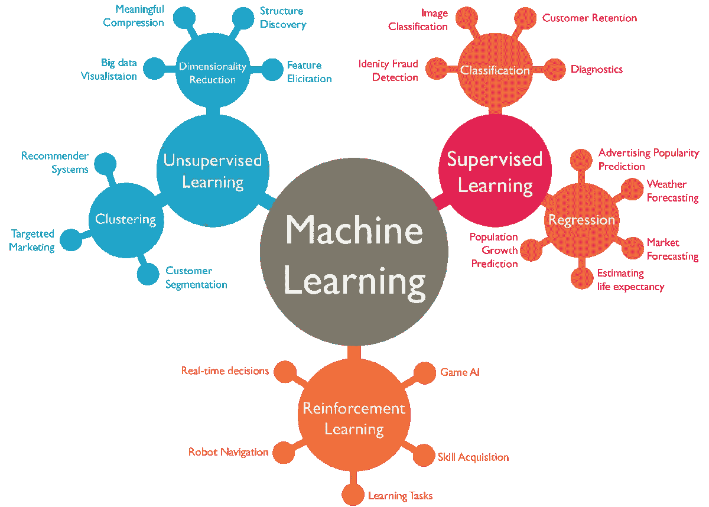
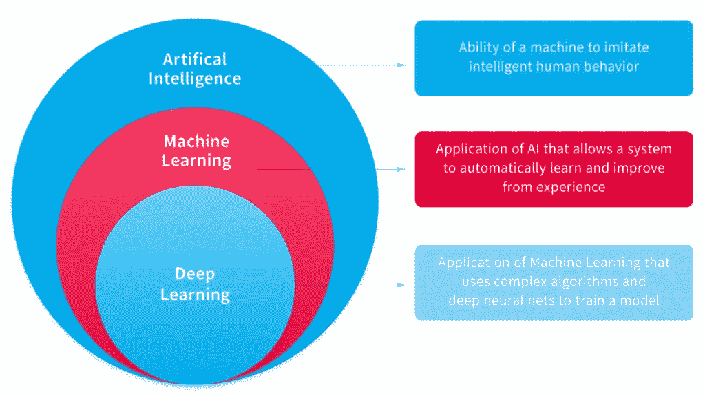

# 深入研究机器学习

> 原文：<https://medium.com/nerd-for-tech/dive-deep-into-machine-learning-66a39ce053b9?source=collection_archive---------4----------------------->

目前，机器学习是迈向人工智能时代的革命中要求最高的职业道路之一。你也是一个渴望在机器学习中追逐职业梦想的学生吗？那么，让我们适当地计划自己，以实现我们渴望的梦想。在此之前，让我们深入了解什么是机器学习以及该领域的一些主要就业机会。

我们大多数人都对机器学习、人工智能、深度学习和数据科学这些术语感到困惑。因此，我们无法区分这些术语，所以让我们得到关于这些术语的定义的适当澄清。

## 什么是人工智能？

人工智能(AI)是指在机器中模拟人类智能，这些机器被编程为像人类一样思考并模仿他们的行为。(像人一样行动的机器)。这个术语也可以指能够像人类一样学习和解决问题的机器。深度学习&机器学习是人工智能的一个子集，人工智能可以进一步分为弱人工智能和强人工智能。

> 设计用来执行特定任务的系统是弱人工智能。复杂的、被设计用来执行被认为是类似人类的任务的系统是强人工智能。

## 什么是机器学习？

机器学习(ML)是一种现代软件开发技术，也是一种人工智能(AI)，它使计算机能够通过使用真实世界的数据来解决问题。它允许计算机自动地从经验中学习和改进，而不需要显式地编程来这样做。机器学习进一步分为监督学习、非监督学习和强化学习。

监督学习是指使用带标签的数据集来训练算法，以准确地分类或预测数据。

无监督学习是指一种不需要监督模型和处理未标记数据的技术。这个模型允许用户自己去发现模式和以前没有发现的信息。

强化学习是指训练模型在特定情况下以最大化回报的方式做出一系列决策。

机器学习分类

## 什么是深度学习？

深度学习是机器学习的一个子集，它受人工神经网络的启发，模仿人类获取某些类型知识的方式。深度学习减少了数据科学家的工作量，因为它使收集、分析和解释数据的过程更快，因此它更关注统计和预测学习。

学习率衰减、迁移学习、从头训练和辍学是用于训练有效模型的一些深度学习方法。

## 什么是数据科学？

数据科学是一个跨学科领域，它使用科学方法、流程、算法和系统从嘈杂、结构化和非结构化的数据中提取知识和见解，并在广泛的应用领域中应用来自数据的知识和可操作的见解。

数据科学家必须精通从数据工程、数学、统计学、高级计算和可视化等各个领域，以便能够有效地从给定的数据中提取更有效的内容。

数据科学家也非常依赖人工智能，特别是它的机器学习和深度学习子领域，使用算法和其他技术来创建模型和进行预测。总之，数据科学不是人工智能的子集，但它是人工智能和统计学的混合物。

## 摘要

